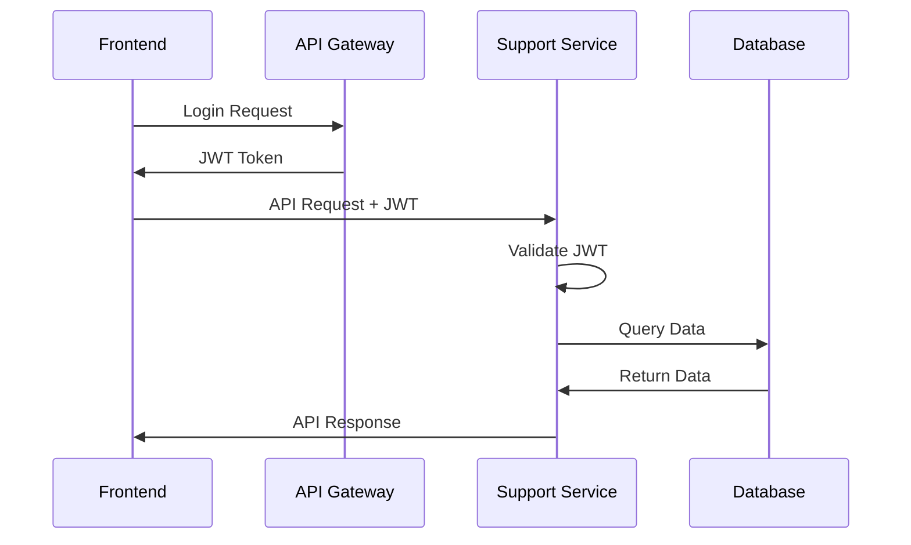

# Customer Support System Integration

This document describes the complete integration between the frontend and backend components of the Customer Support System for the Alphintra trading platform.

## 🏗️ Architecture Overview

The Customer Support System follows a microservices architecture with real-time communication capabilities:

```
┌─────────────────┐    ┌──────────────────┐    ┌─────────────────┐
│   Frontend      │    │   API Gateway    │    │   PostgreSQL    │
│   (Next.js)     │◄──►│  (Spring Cloud)  │◄──►│   Database      │
│   Port: 3001    │    │   Port: 8080     │    │   Port: 5432    │
└─────────────────┘    └──────────────────┘    └─────────────────┘
         │                        │                       │
         │              ┌──────────────────┐              │
         │              │  Support Service │              │
         └──────────────►│  (Spring Boot)   │◄─────────────┘
                        │  Port: 8010      │
                        │  WebSocket: 8085 │
                        └──────────────────┘
                                 │
                        ┌──────────────────┐
                        │      Redis       │
                        │   (Caching)      │
                        │   Port: 6379     │
                        └──────────────────┘
```

## 🚀 Quick Start

### Prerequisites
- Docker & Docker Compose
- Node.js 18+ (for local development)
- Java 17+ (for local development)
- curl (for testing)

### Start the Complete Stack

1. **Start Infrastructure Services:**
   ```bash
   docker-compose up -d postgres redis
   ```

2. **Build and Start Customer Support Service:**
   ```bash
   cd src/backend/customer-support-service
   ./mvnw clean package -DskipTests
   cd ../../..
   docker-compose up -d customer-support-service
   ```

3. **Start Frontend:**
   ```bash
   docker-compose up -d frontend
   ```

4. **Run Integration Test:**
   ```bash
   ./test-integration.sh
   ```

### Access Points

- **Frontend Application:** http://localhost:3001
- **User Support Interface:** http://localhost:3001/support
- **Agent Dashboard:** http://localhost:3001/support/dashboard
- **API Documentation:** http://localhost:8010/api/customer-support/swagger-ui.html
- **Health Check:** http://localhost:8010/api/customer-support/actuator/health

## 🔧 Configuration

### Environment Variables

Copy and configure the environment file:
```bash
cp src/frontend/.env.local.example src/frontend/.env.local
```

Key configuration options:
```env
# API Integration
NEXT_PUBLIC_API_BASE_URL=http://localhost:8080
NEXT_PUBLIC_SUPPORT_API_URL=http://localhost:8010/api/customer-support

# WebSocket Configuration
NEXT_PUBLIC_WS_BASE_URL=ws://localhost:8085/ws
NEXT_PUBLIC_WS_SUPPORT_URL=ws://localhost:8085/ws/support

# Feature Flags
NEXT_PUBLIC_ENABLE_WEBSOCKET=true
NEXT_PUBLIC_ENABLE_AI_ASSISTANT=true
NEXT_PUBLIC_ENABLE_ANALYTICS=true
NEXT_PUBLIC_ENABLE_REAL_TIME_CHAT=true
```

### Database Configuration

The system automatically creates the required database schema using Flyway migrations:
- **Database:** `alphintra_support`
- **Tables:** `tickets`, `communications`, `support_agents`, `knowledge_base_articles`
- **Indexes:** Optimized for query performance

## 🌐 API Integration

### REST Endpoints

The backend exposes comprehensive REST APIs:

```
GET    /api/customer-support/tickets                 # List tickets
POST   /api/customer-support/tickets                 # Create ticket
GET    /api/customer-support/tickets/{id}            # Get ticket details
PUT    /api/customer-support/tickets/{id}            # Update ticket
DELETE /api/customer-support/tickets/{id}            # Delete ticket

GET    /api/customer-support/agents                  # List agents
POST   /api/customer-support/agents                  # Create agent
GET    /api/customer-support/agents/{id}             # Get agent details

GET    /api/customer-support/knowledge-base/search   # Search knowledge base
POST   /api/customer-support/knowledge-base/articles # Create article

GET    /api/customer-support/analytics/tickets       # Ticket analytics
GET    /api/customer-support/analytics/agents        # Agent performance
```

### WebSocket Integration

Real-time communication is handled via STOMP over WebSocket:

```javascript
// Frontend WebSocket Client Usage
import { useSupportWebSocket } from '@/components/providers/SupportWebSocketProvider';

const { sendMessage, joinTicketRoom, isConnected } = useSupportWebSocket();

// Join a ticket room for real-time updates
joinTicketRoom('ticket-123');

// Send a chat message
sendMessage('chat_message', {
  ticketId: 'ticket-123',
  message: 'Hello, I need help with...',
  timestamp: new Date().toISOString()
});
```

### Authentication Flow



## 🔄 Real-time Features

### WebSocket Channels

The system uses multiple WebSocket channels for different types of real-time communication:

1. **Ticket Rooms:** `/topic/tickets/{ticketId}/messages`
   - Chat messages between users and agents
   - File attachments and status updates

2. **Typing Indicators:** `/topic/tickets/{ticketId}/typing`
   - Real-time typing indicators
   - Start/stop typing events

3. **Ticket Updates:** `/topic/tickets/{ticketId}/notifications`
   - Status changes and escalations
   - Agent assignments

4. **Support Notifications:** `/topic/support/notifications`
   - System-wide notifications for support team
   - Queue updates and urgent alerts

### Frontend WebSocket Integration

The frontend uses React Context providers for WebSocket management:

```tsx
// Auto-connection and reconnection
<AuthProvider>
  <SupportWebSocketProvider>
    <YourApp />
  </SupportWebSocketProvider>
</AuthProvider>
```

Features:
- ✅ Automatic connection/reconnection
- ✅ Authentication-aware connections
- ✅ Heartbeat and connection monitoring
- ✅ Error handling and user notifications
- ✅ Room-based message routing

## 🧪 Testing

### Integration Testing

Run the comprehensive integration test:
```bash
./test-integration.sh
```

This tests:
- Service startup and health checks
- API endpoint connectivity
- WebSocket endpoint availability
- Frontend route accessibility
- Database connectivity
- Redis caching
- Memory usage and performance

### Manual Testing

1. **User Support Flow:**
   - Visit http://localhost:3001/support
   - Create a new support ticket
   - Test real-time chat functionality

2. **Agent Dashboard Flow:**
   - Visit http://localhost:3001/support/dashboard
   - View ticket queue and analytics
   - Test ticket assignment and responses

3. **WebSocket Testing:**
   - Use browser dev tools to monitor WebSocket connections
   - Test typing indicators and real-time updates

## 📊 Monitoring

### Health Checks

All services expose health check endpoints:
```bash
curl http://localhost:8010/api/customer-support/actuator/health
curl http://localhost:3001/api/health
```

### Logging

View service logs:
```bash
# Backend logs
docker-compose logs -f customer-support-service

# Frontend logs
docker-compose logs -f frontend

# All services
docker-compose logs -f
```

### Metrics

The system exposes Prometheus metrics at:
- Backend: http://localhost:8010/api/customer-support/actuator/prometheus
- Infrastructure: http://localhost:9090 (Prometheus)
- Dashboards: http://localhost:3000 (Grafana)

## 🔒 Security

### Authentication & Authorization

- JWT-based authentication with role-based access control
- Route protection middleware in frontend
- Spring Security integration in backend
- Session management via Redis

### Data Protection

- Sensitive data masking in logs
- GDPR compliance features
- Secure WebSocket connections
- Input validation and sanitization

## 🚢 Deployment

### Development
```bash
docker-compose -f docker-compose.yml up -d
```

### Production
```bash
docker-compose -f docker-compose.prod.yml up -d
```

### Kubernetes
```bash
kubectl apply -f infra/kubernetes/customer-support/
```

## 🛠️ Development

### Local Development Setup

1. **Backend Development:**
   ```bash
   cd src/backend/customer-support-service
   ./mvnw spring-boot:run
   ```

2. **Frontend Development:**
   ```bash
   cd src/frontend
   npm run dev
   ```

3. **Database Setup:**
   ```bash
   docker-compose up -d postgres
   ```

### Code Structure

```
src/
├── backend/customer-support-service/
│   ├── src/main/java/com/alphintra/customersupport/
│   │   ├── controller/         # REST & WebSocket controllers
│   │   ├── service/           # Business logic
│   │   ├── repository/        # Data access
│   │   ├── entity/           # JPA entities
│   │   ├── dto/              # Data transfer objects
│   │   └── config/           # Configuration classes
│   └── src/main/resources/
│       ├── application.yml    # Application configuration
│       └── db/migration/     # Flyway migrations
└── frontend/
    ├── app/                  # Next.js app router
    ├── components/           # React components
    ├── lib/                  # Utilities and API clients
    └── hooks/               # Custom React hooks
```

## 🔧 Troubleshooting

### Common Issues

1. **WebSocket Connection Failed:**
   - Check CORS settings in backend
   - Verify WebSocket port (8085) is accessible
   - Check authentication token validity

2. **Database Connection Error:**
   - Ensure PostgreSQL is running
   - Check database credentials
   - Verify network connectivity

3. **Frontend Build Issues:**
   - Clear Next.js cache: `rm -rf .next`
   - Reinstall dependencies: `npm ci`
   - Check environment variables

### Debug Commands

```bash
# Check running containers
docker-compose ps

# View service logs
docker-compose logs customer-support-service

# Test API connectivity
curl -v http://localhost:8010/api/customer-support/actuator/health

# Check WebSocket connectivity
wscat -c ws://localhost:8085/ws

# Database connectivity
docker exec -it alphintra-postgres psql -U postgres -d alphintra_support
```

## 📈 Performance

### Benchmarks

The system is designed for:
- **API Response Time:** < 200ms for most endpoints
- **WebSocket Latency:** < 50ms for real-time messages
- **Concurrent Users:** 1000+ simultaneous connections
- **Database Queries:** Optimized with proper indexing

### Scaling

- Horizontal scaling via Docker Swarm or Kubernetes
- Database read replicas for improved performance
- Redis clustering for session management
- CDN integration for static assets

## 📋 Next Steps

1. **Enhanced AI Integration:**
   - Advanced chatbot capabilities
   - Automated ticket routing
   - Sentiment analysis

2. **Advanced Analytics:**
   - Real-time dashboards
   - Predictive analytics
   - Performance insights

3. **Mobile Support:**
   - React Native mobile app
   - Progressive Web App features
   - Push notifications

4. **Third-party Integrations:**
   - Slack/Teams notifications
   - External ticketing systems
   - CRM integration

---

For more detailed information, see the individual service documentation:
- [Backend API Documentation](src/backend/customer-support-service/README.md)
- [Frontend Component Guide](src/frontend/README.md)
- [Deployment Guide](docs/deployment.md)