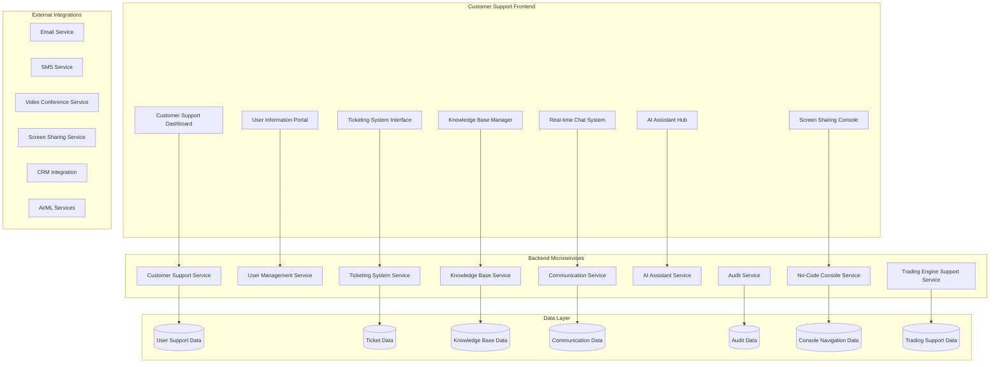

# Comprehensive Customer Support System Development Plan

## 🎯 Executive Summary

This document provides a detailed development plan for implementing a world-class customer support system for the Alphintra algorithmic trading platform. The system is designed to handle the unique challenges of supporting both novice and expert traders, strategy developers, and platform administrators while maintaining the highest standards of security, privacy, and regulatory compliance.

## 📋 Key Requirements Analysis

Based on the functional requirements analysis, the customer support system must address:

### Core User Types
1. **Traders (Novice & Expert)** - Strategy creation, backtesting, live trading support
2. **External Developers** - API usage, SDK integration, custom development
3. **Platform Administrators** - System management, user oversight, compliance

### Critical Support Areas
1. **Strategy Development Support** - No-code visual builder, Python SDK, debugging
2. **Model Training & Testing** - Dataset management, compute resources, backtesting
3. **Live Trading Issues** - Broker connectivity, risk management, execution problems
4. **Platform Technical Issues** - Authentication, KYC/AML, payment processing
5. **Marketplace Support** - Strategy publishing, revenue sharing, community features
6. **Compliance & Security** - Regulatory requirements, data protection, audit trails

## 🏗️ System Architecture Overview

### High-Level Architecture



## 💻 Technology Stack

### Frontend Technologies
- **Framework**: Next.js 15 with React 18 & TypeScript
- **State Management**: Zustand (consistent with no-code console)
- **UI Library**: Tailwind CSS + Headless UI (consistent with platform)
- **Real-time**: WebSocket connections for live chat
- **Charts**: Chart.js for analytics and user activity visualization
- **Forms**: React Hook Form + Zod validation
- **Video**: WebRTC for screen sharing and video calls

### Backend Technologies
- **Framework**: Spring Boot 3.2 with Java 17
- **Database**: PostgreSQL 15 for transactional data
- **Search**: Elasticsearch 8 for knowledge base and ticket search
- **Cache**: Redis 7 for session management and real-time features
- **Message Queue**: Apache Kafka for event streaming
- **Authentication**: Spring Security + JWT (integrated with platform auth)
- **Real-time**: WebSocket/STOMP for live communications

### Infrastructure
- **Containerization**: Docker containers
- **Orchestration**: Kubernetes deployment
- **API Gateway**: Spring Cloud Gateway integration
- **Monitoring**: Prometheus + Grafana
- **Logging**: ELK Stack integration

## 🔐 Security & Privacy Framework

### Access Control Matrix

| Role | User Data Access | Financial Data | Trading Data | System Access |
|------|-----------------|----------------|--------------|---------------|
| Support Agent L1 | Basic Profile | Transaction Summary | Bot Status | Read-Only Console |
| Support Agent L2 | Extended Profile | Transaction Details | Strategy Configs | Limited Console Write |
| Support Specialist | Full Profile | All Financial Data | Full Trading Access | Console Management |
| Support Manager | Admin Access | All Data + Analytics | Full System Access | Full Control |

### Privacy Controls
- **Dynamic Data Masking**: PII automatically masked based on agent level
- **Consent Management**: User consent required for sensitive data access
- **Audit Logging**: Comprehensive access logging with user notification
- **Session Management**: Time-based access with automatic expiry
- **GDPR Compliance**: Full data subject rights implementation

## 📊 Core System Components

## A. User Account Information Portal

### Frontend Components

#### 1. Enhanced User Snapshot Dashboard
```typescript
interface EnhancedUserSnapshot extends UserSnapshot {
  tradingProfile: {
    primaryAssetClasses: string[];
    tradingFrequency: 'HIGH' | 'MEDIUM' | 'LOW';
    riskTolerance: 'CONSERVATIVE' | 'MODERATE' | 'AGGRESSIVE';
    avgDailyVolume: number;
    profitLossMetrics: {
      totalPnL: number;
      monthlyPnL: number;
      maxDrawdown: number;
      sharpeRatio: number;
    };
  };
  technicalProfile: {
    experienceLevel: 'BEGINNER' | 'INTERMEDIATE' | 'EXPERT';
    preferredInterface: 'NO_CODE' | 'CODE' | 'HYBRID';
    sdkUsage: SDKUsageMetrics;
    customIndicators: number;
    publishedStrategies: number;
  };
  supportHistory: {
    totalTickets: number;
    resolvedTickets: number;
    avgResolutionTime: string;
    satisfaction: number;
    recentTickets: TicketSummary[];
  };
}
```

#### 2. Real-time Activity Monitor
```typescript
const RealTimeActivityMonitor: React.FC<{ userId: string }> = ({ userId }) => {
  const [liveActivity, setLiveActivity] = useState<LiveActivity[]>([]);
  
  useEffect(() => {
    const ws = new WebSocket(`/ws/user-activity/${userId}`);
    
    ws.onmessage = (event) => {
      const activity = JSON.parse(event.data);
      setLiveActivity(prev => [activity, ...prev.slice(0, 49)]);
    };
    
    return () => ws.close();
  }, [userId]);
  
  return (
    <Card>
      <CardHeader>
        <Title>Live Activity Feed</Title>
        <Badge variant="outline">
          <Circle className="h-2 w-2 fill-green-500" />
          Online
        </Badge>
      </CardHeader>
      <CardContent>
        <ScrollArea className="h-64">
          {liveActivity.map((activity) => (
            <ActivityItem key={activity.id} activity={activity} />
          ))}
        </ScrollArea>
      </CardContent>
    </Card>
  );
};
```

#### 3. Trading Console Remote Access
```typescript
const TradingConsoleRemoteAccess: React.FC<{ userId: string }> = ({ userId }) => {
  const [hasConsent, setHasConsent] = useState(false);
  const [shareSession, setShareSession] = useState<ShareSession | null>(null);
  
  const requestRemoteAccess = async () => {
    const consent = await requestUserConsent(userId, 'REMOTE_CONSOLE_ACCESS');
    if (consent.granted) {
      const session = await createRemoteSession(userId);
      setShareSession(session);
      setHasConsent(true);
    }
  };
  
  return (
    <Card>
      <CardHeader>
        <Title>Trading Console Access</Title>
        <Description>
          Help user directly in their trading environment
        </Description>
      </CardHeader>
      <CardContent>
        {!hasConsent ? (
          <Button onClick={requestRemoteAccess}>
            Request Console Access
          </Button>
        ) : (
          <RemoteConsoleViewer session={shareSession} />
        )}
      </CardContent>
    </Card>
  );
};
```

### Backend Implementation

#### Enhanced User Snapshot Service
```java
@Service
@Transactional(readOnly = true)
public class EnhancedUserSnapshotService {
    
    @Autowired
    private TradingMetricsService tradingMetricsService;
    
    @Autowired
    private StrategyAnalyticsService strategyAnalyticsService;
    
    @Autowired
    private SupportHistoryService supportHistoryService;
    
    public EnhancedUserSnapshotDto getEnhancedUserSnapshot(UUID userId, AccessLevel accessLevel) {
        User user = userRepository.findById(userId)
            .orElseThrow(() -> new UserNotFoundException("User not found: " + userId));
        
        EnhancedUserSnapshotDto snapshot = EnhancedUserSnapshotDto.builder()
            .userId(userId.toString())
            .basicInfo(buildBasicInfo(user, accessLevel))
            .accountStatus(buildAccountStatus(user))
            .tradingProfile(buildTradingProfile(userId, accessLevel))
            .technicalProfile(buildTechnicalProfile(userId))
            .supportHistory(buildSupportHistory(userId))
            .recentActivity(buildRecentActivity(userId, accessLevel))
            .activeResources(buildActiveResources(userId))
            .build();
        
        return snapshot;
    }
    
    private TradingProfileDto buildTradingProfile(UUID userId, AccessLevel accessLevel) {
        if (accessLevel == AccessLevel.BASIC) {
            return TradingProfileDto.builder()
                .primaryAssetClasses(List.of("***"))
                .tradingFrequency(null)
                .riskTolerance(null)
                .avgDailyVolume(0.0)
                .build();
        }
        
        TradingMetrics metrics = tradingMetricsService.getTradingMetrics(userId);
        
        return TradingProfileDto.builder()
            .primaryAssetClasses(metrics.getPrimaryAssetClasses())
            .tradingFrequency(metrics.getTradingFrequency())
            .riskTolerance(metrics.getRiskTolerance())
            .avgDailyVolume(metrics.getAvgDailyVolume())
            .profitLossMetrics(buildPnLMetrics(metrics))
            .build();
    }
    
    private TechnicalProfileDto buildTechnicalProfile(UUID userId) {
        StrategyAnalytics analytics = strategyAnalyticsService.getUserAnalytics(userId);
        
        return TechnicalProfileDto.builder()
            .experienceLevel(analytics.getExperienceLevel())
            .preferredInterface(analytics.getPreferredInterface())
            .sdkUsage(analytics.getSdkUsage())
            .customIndicators(analytics.getCustomIndicatorCount())
            .publishedStrategies(analytics.getPublishedStrategyCount())
            .build();
    }
}
```

## B. Advanced Ticketing System

### Smart Ticket Routing
```java
@Service
public class SmartTicketRoutingService {
    
    @Autowired
    private AIClassificationService aiClassificationService;
    
    @Autowired
    private AgentWorkloadService agentWorkloadService;
    
    @Autowired
    private ExpertiseMatchingService expertiseMatchingService;
    
    public AgentAssignment routeTicket(Ticket ticket) {
        // AI-powered classification
        TicketClassification classification = aiClassificationService.classifyTicket(ticket);
        
        // Find agents with relevant expertise
        List<SupportAgent> expertAgents = expertiseMatchingService
            .findAgentsWithExpertise(classification.getRequiredSkills());
        
        // Balance workload
        SupportAgent selectedAgent = agentWorkloadService
            .selectBestAvailableAgent(expertAgents, classification.getPriority());
        
        return AgentAssignment.builder()
            .agentId(selectedAgent.getAgentId())
            .confidence(classification.getConfidence())
            .estimatedResolutionTime(classification.getEstimatedResolutionTime())
            .suggestedActions(classification.getSuggestedActions())
            .build();
    }
}
```

### Real-time Collaboration Tools
```typescript
const CollaborativeTicketEditor: React.FC<{ ticketId: string }> = ({ ticketId }) => {
  const [activeAgents, setActiveAgents] = useState<Agent[]>([]);
  const [sharedCursor, setSharedCursor] = useState<CursorPosition[]>([]);
  
  useEffect(() => {
    const collaboration = new CollaborationSocket(ticketId);
    
    collaboration.onAgentJoin((agent) => {
      setActiveAgents(prev => [...prev, agent]);
    });
    
    collaboration.onCursorMove((agentId, position) => {
      setSharedCursor(prev => prev.map(cursor => 
        cursor.agentId === agentId 
          ? { ...cursor, position }
          : cursor
      ));
    });
    
    return () => collaboration.disconnect();
  }, [ticketId]);
  
  return (
    <div className="relative">
      <CollaborationAwareness agents={activeAgents} />
      <TicketEditor 
        ticketId={ticketId}
        sharedCursors={sharedCursor}
        onCursorMove={handleCursorMove}
      />
    </div>
  );
};
```

## C. AI-Powered Support Assistant

### Intelligent Response Suggestions
```typescript
interface SupportAIAssistant {
  getSuggestedResponses(ticketContext: TicketContext): Promise<ResponseSuggestion[]>;
  analyzeUserSentiment(message: string): Promise<SentimentAnalysis>;
  generateSolutionSteps(problem: ProblemDescription): Promise<SolutionStep[]>;
  escalationRecommendation(ticketHistory: TicketHistory): Promise<EscalationRecommendation>;
}

const AIAssistantPanel: React.FC<{ ticketId: string }> = ({ ticketId }) => {
  const [suggestions, setSuggestions] = useState<ResponseSuggestion[]>([]);
  const [isAnalyzing, setIsAnalyzing] = useState(false);
  
  const analyzeTicket = async () => {
    setIsAnalyzing(true);
    
    const ticketContext = await getTicketContext(ticketId);
    const suggestions = await aiAssistant.getSuggestedResponses(ticketContext);
    const sentiment = await aiAssistant.analyzeUserSentiment(ticketContext.lastMessage);
    
    setSuggestions(suggestions);
    setIsAnalyzing(false);
  };
  
  return (
    <Card>
      <CardHeader>
        <Title>AI Assistant</Title>
        <Button onClick={analyzeTicket} disabled={isAnalyzing}>
          {isAnalyzing ? 'Analyzing...' : 'Get Suggestions'}
        </Button>
      </CardHeader>
      <CardContent>
        <Tabs>
          <TabsList>
            <TabsTrigger value="responses">Suggested Responses</TabsTrigger>
            <TabsTrigger value="solutions">Solution Steps</TabsTrigger>
            <TabsTrigger value="escalation">Escalation</TabsTrigger>
          </TabsList>
          
          <TabsContent value="responses">
            {suggestions.map((suggestion, index) => (
              <SuggestionCard 
                key={index} 
                suggestion={suggestion}
                onUse={handleUseSuggestion}
              />
            ))}
          </TabsContent>
        </Tabs>
      </CardContent>
    </Card>
  );
};
```

### Backend AI Service
```java
@Service
public class SupportAIService {
    
    @Autowired
    private OpenAIClient openAIClient;
    
    @Autowired
    private TicketContextService ticketContextService;
    
    @Autowired
    private KnowledgeBaseService knowledgeBaseService;
    
    public List<ResponseSuggestion> getSuggestedResponses(String ticketId) {
        TicketContext context = ticketContextService.getFullContext(ticketId);
        
        // Prepare AI prompt with context
        String prompt = buildResponsePrompt(context);
        
        // Get AI suggestions
        OpenAIResponse response = openAIClient.createCompletion(
            OpenAIRequest.builder()
                .model("gpt-4")
                .prompt(prompt)
                .maxTokens(500)
                .temperature(0.7)
                .build()
        );
        
        // Parse and validate suggestions
        return parseResponseSuggestions(response.getChoices().get(0).getText());
    }
    
    private String buildResponsePrompt(TicketContext context) {
        StringBuilder prompt = new StringBuilder();
        prompt.append("As a customer support specialist for Alphintra trading platform, ");
        prompt.append("provide 3 helpful response suggestions for this support ticket:\n\n");
        
        prompt.append("User Type: ").append(context.getUserType()).append("\n");
        prompt.append("Issue Category: ").append(context.getCategory()).append("\n");
        prompt.append("User Message: ").append(context.getLastUserMessage()).append("\n");
        
        if (context.getTradingContext() != null) {
            prompt.append("Trading Context: ").append(context.getTradingContext()).append("\n");
        }
        
        prompt.append("\nPlease provide responses that are:\n");
        prompt.append("1. Technically accurate for trading platform context\n");
        prompt.append("2. Empathetic and professional\n");
        prompt.append("3. Include specific next steps\n");
        
        return prompt.toString();
    }
}
```

## D. Knowledge Base & Learning System

### Dynamic Knowledge Base
```typescript
interface KnowledgeArticle {
  id: string;
  title: string;
  content: string;
  category: string;
  tags: string[];
  difficulty: 'BEGINNER' | 'INTERMEDIATE' | 'EXPERT';
  userType: 'TRADER' | 'DEVELOPER' | 'ADMIN';
  lastUpdated: Date;
  viewCount: number;
  helpfulCount: number;
  linkedIssues: string[];
  codeExamples?: CodeExample[];
  videoTutorials?: VideoTutorial[];
}

const KnowledgeBaseManager: React.FC = () => {
  const [articles, setArticles] = useState<KnowledgeArticle[]>([]);
  const [searchQuery, setSearchQuery] = useState('');
  const [filters, setFilters] = useState<KBFilters>({});
  
  const { data: searchResults } = useSearchKnowledgeBaseQuery({
    query: searchQuery,
    filters,
    facets: ['category', 'userType', 'difficulty']
  });
  
  return (
    <div className="grid grid-cols-1 lg:grid-cols-4 gap-6">
      <div className="lg:col-span-1">
        <KnowledgeBaseFilters 
          filters={filters} 
          onFiltersChange={setFilters}
          facets={searchResults?.facets}
        />
      </div>
      
      <div className="lg:col-span-3">
        <SearchBar 
          value={searchQuery}
          onChange={setSearchQuery}
          placeholder="Search knowledge base..."
        />
        
        <ArticleGrid 
          articles={searchResults?.articles || []}
          onEdit={handleEditArticle}
          onDelete={handleDeleteArticle}
          onAnalytics={handleViewAnalytics}
        />
      </div>
    </div>
  );
};
```

### Auto-Learning System
```java
@Service
public class AutoLearningKnowledgeService {
    
    @Autowired
    private TicketAnalysisService ticketAnalysisService;
    
    @Autowired
    private ContentGenerationService contentGenerationService;
    
    @Autowired
    private KnowledgeBaseRepository knowledgeBaseRepository;
    
    @EventListener
    public void onTicketResolved(TicketResolvedEvent event) {
        // Analyze resolution for learning opportunities
        ResolutionAnalysis analysis = ticketAnalysisService.analyzeResolution(event.getTicket());
        
        if (analysis.isNovelSolution() && analysis.getConfidenceScore() > 0.8) {
            // Generate knowledge article suggestion
            KnowledgeArticleSuggestion suggestion = contentGenerationService
                .generateArticleSuggestion(analysis);
            
            // Queue for review
            knowledgeBaseRepository.saveSuggestion(suggestion);
            
            // Notify knowledge managers
            notificationService.notifyKnowledgeManagers(suggestion);
        }
    }
    
    @Scheduled(cron = "0 0 2 * * ?") // Daily at 2 AM
    public void updateKnowledgeBaseRelevance() {
        List<KnowledgeArticle> articles = knowledgeBaseRepository.findAll();
        
        for (KnowledgeArticle article : articles) {
            RelevanceMetrics metrics = calculateRelevanceMetrics(article);
            
            if (metrics.isOutdated()) {
                scheduleForReview(article, "Content may be outdated");
            }
            
            if (metrics.hasLowUsage() && metrics.isOlderThan(Duration.ofDays(180))) {
                scheduleForArchival(article);
            }
        }
    }
}
```

## E. Real-time Communication System

### Multi-channel Communication Hub
```typescript
const CommunicationHub: React.FC<{ ticketId: string }> = ({ ticketId }) => {
  const [activeChannel, setActiveChannel] = useState<Channel>('chat');
  const [videoCallActive, setVideoCallActive] = useState(false);
  const [screenShareActive, setScreenShareActive] = useState(false);
  
  const startVideoCall = async () => {
    const room = await createVideoRoom(ticketId);
    setVideoCallActive(true);
    // Notify user of incoming call
    await notifyUserOfCall(ticketId, room.id);
  };
  
  const startScreenShare = async () => {
    const session = await createScreenShareSession(ticketId);
    setScreenShareActive(true);
    // Request user consent for screen sharing
    await requestScreenShareConsent(ticketId, session.id);
  };
  
  return (
    <Card className="h-full">
      <CardHeader>
        <div className="flex items-center justify-between">
          <Title>Communication</Title>
          <div className="flex gap-2">
            <Button
              variant="outline"
              size="sm"
              onClick={startVideoCall}
              disabled={videoCallActive}
            >
              <Video className="h-4 w-4" />
              Video Call
            </Button>
            <Button
              variant="outline"
              size="sm"
              onClick={startScreenShare}
              disabled={screenShareActive}
            >
              <Share className="h-4 w-4" />
              Screen Share
            </Button>
          </div>
        </div>
        
        <Tabs value={activeChannel} onValueChange={setActiveChannel}>
          <TabsList>
            <TabsTrigger value="chat">Chat</TabsTrigger>
            <TabsTrigger value="email">Email</TabsTrigger>
            <TabsTrigger value="phone">Phone</TabsTrigger>
          </TabsList>
        </Tabs>
      </CardHeader>
      
      <CardContent className="flex-1 overflow-hidden">
        <TabsContent value="chat" className="h-full">
          <LiveChatInterface ticketId={ticketId} />
        </TabsContent>
        
        <TabsContent value="email" className="h-full">
          <EmailThreadView ticketId={ticketId} />
        </TabsContent>
        
        <TabsContent value="phone" className="h-full">
          <PhoneCallInterface ticketId={ticketId} />
        </TabsContent>
      </CardContent>
      
      {videoCallActive && (
        <VideoCallOverlay 
          ticketId={ticketId}
          onEnd={() => setVideoCallActive(false)}
        />
      )}
      
      {screenShareActive && (
        <ScreenShareViewer 
          ticketId={ticketId}
          onEnd={() => setScreenShareActive(false)}
        />
      )}
    </Card>
  );
};
```

### WebSocket Communication Service
```java
@Component
@MessageMapping("/support")
public class SupportCommunicationController {
    
    @Autowired
    private SimpMessagingTemplate messagingTemplate;
    
    @Autowired
    private CommunicationService communicationService;
    
    @MessageMapping("/ticket/{ticketId}/message")
    public void handleMessage(
            @DestinationVariable String ticketId,
            @Payload ChatMessage message,
            Principal principal) {
        
        // Validate permissions
        if (!hasPermissionToTicket(principal, ticketId)) {
            return;
        }
        
        // Save message
        CommunicationRecord record = communicationService.saveMessage(
            ticketId, message, principal.getName());
        
        // Broadcast to all participants
        messagingTemplate.convertAndSend(
            "/topic/ticket/" + ticketId + "/messages", 
            record);
        
        // Send push notification to offline participants
        notificationService.notifyOfflineParticipants(ticketId, record);
    }
    
    @MessageMapping("/ticket/{ticketId}/typing")
    public void handleTyping(
            @DestinationVariable String ticketId,
            @Payload TypingIndicator typing,
            Principal principal) {
        
        messagingTemplate.convertAndSend(
            "/topic/ticket/" + ticketId + "/typing", 
            typing);
    }
    
    @MessageMapping("/ticket/{ticketId}/video-call")
    public void handleVideoCallRequest(
            @DestinationVariable String ticketId,
            @Payload VideoCallRequest request,
            Principal principal) {
        
        // Create video room
        VideoRoom room = videoService.createRoom(ticketId);
        
        // Notify all participants
        messagingTemplate.convertAndSend(
            "/topic/ticket/" + ticketId + "/video-call", 
            VideoCallInvitation.builder()
                .roomId(room.getId())
                .initiator(principal.getName())
                .build());
    }
}
```

## F. Advanced Analytics & Reporting

### Support Analytics Dashboard
```typescript
const SupportAnalyticsDashboard: React.FC = () => {
  const [timeRange, setTimeRange] = useState<TimeRange>('last_30_days');
  const [selectedMetrics, setSelectedMetrics] = useState<string[]>([
    'resolution_time', 'satisfaction', 'first_contact_resolution'
  ]);
  
  const { data: analytics } = useSupportAnalyticsQuery({ 
    timeRange, 
    metrics: selectedMetrics 
  });
  
  return (
    <div className="space-y-6">
      <div className="flex items-center justify-between">
        <h1 className="text-3xl font-bold">Support Analytics</h1>
        <div className="flex gap-4">
          <TimeRangeSelector value={timeRange} onChange={setTimeRange} />
          <MetricsSelector 
            selected={selectedMetrics} 
            onChange={setSelectedMetrics} 
          />
        </div>
      </div>
      
      <div className="grid grid-cols-1 md:grid-cols-2 lg:grid-cols-4 gap-6">
        <MetricCard
          title="Average Resolution Time"
          value={analytics?.avgResolutionTime}
          trend={analytics?.resolutionTimeTrend}
          format="duration"
        />
        <MetricCard
          title="Customer Satisfaction"
          value={analytics?.avgSatisfaction}
          trend={analytics?.satisfactionTrend}
          format="percentage"
        />
        <MetricCard
          title="First Contact Resolution"
          value={analytics?.firstContactResolution}
          trend={analytics?.fcrTrend}
          format="percentage"
        />
        <MetricCard
          title="Active Tickets"
          value={analytics?.activeTickets}
          trend={analytics?.activeTicketsTrend}
          format="number"
        />
      </div>
      
      <div className="grid grid-cols-1 lg:grid-cols-2 gap-6">
        <Card>
          <CardHeader>
            <Title>Resolution Time Trends</Title>
          </CardHeader>
          <CardContent>
            <ResolutionTimeChart data={analytics?.resolutionTimeChart} />
          </CardContent>
        </Card>
        
        <Card>
          <CardHeader>
            <Title>Issue Categories</Title>
          </CardHeader>
          <CardContent>
            <IssueCategoryChart data={analytics?.categoryBreakdown} />
          </CardContent>
        </Card>
      </div>
      
      <Card>
        <CardHeader>
          <Title>Agent Performance</Title>
        </CardHeader>
        <CardContent>
          <AgentPerformanceTable data={analytics?.agentMetrics} />
        </CardContent>
      </Card>
    </div>
  );
};
```

### Performance Metrics Service
```java
@Service
public class SupportAnalyticsService {
    
    @Autowired
    private TicketRepository ticketRepository;
    
    @Autowired
    private CommunicationRepository communicationRepository;
    
    @Autowired
    private SatisfactionRepository satisfactionRepository;
    
    public SupportAnalytics calculateAnalytics(AnalyticsRequest request) {
        LocalDateTime startDate = request.getTimeRange().getStartDate();
        LocalDateTime endDate = request.getTimeRange().getEndDate();
        
        return SupportAnalytics.builder()
            .avgResolutionTime(calculateAvgResolutionTime(startDate, endDate))
            .avgSatisfaction(calculateAvgSatisfaction(startDate, endDate))
            .firstContactResolution(calculateFCR(startDate, endDate))
            .activeTickets(getActiveTicketCount())
            .resolutionTimeChart(getResolutionTimeChart(startDate, endDate))
            .categoryBreakdown(getCategoryBreakdown(startDate, endDate))
            .agentMetrics(getAgentMetrics(startDate, endDate))
            .build();
    }
    
    private Duration calculateAvgResolutionTime(LocalDateTime start, LocalDateTime end) {
        List<Ticket> resolvedTickets = ticketRepository
            .findResolvedTicketsBetween(start, end);
        
        return resolvedTickets.stream()
            .map(ticket -> Duration.between(ticket.getCreatedAt(), ticket.getResolvedAt()))
            .reduce(Duration.ZERO, Duration::plus)
            .dividedBy(resolvedTickets.size());
    }
    
    private Double calculateAvgSatisfaction(LocalDateTime start, LocalDateTime end) {
        return satisfactionRepository
            .findByCreatedAtBetween(start, end)
            .stream()
            .mapToDouble(SatisfactionRating::getRating)
            .average()
            .orElse(0.0);
    }
    
    private Double calculateFCR(LocalDateTime start, LocalDateTime end) {
        List<Ticket> tickets = ticketRepository.findByCreatedAtBetween(start, end);
        
        long firstContactResolved = tickets.stream()
            .mapToLong(this::getResponseCount)
            .filter(count -> count == 1)
            .count();
        
        return (double) firstContactResolved / tickets.size() * 100;
    }
}
```

## 🚀 Implementation Roadmap

### Phase 1: Foundation (Weeks 1-4)
1. **Infrastructure Setup**
   - Set up development environment
   - Configure Spring Boot microservices
   - Set up PostgreSQL and Redis
   - Implement basic authentication integration

2. **Core User Portal**
   - Basic user snapshot functionality
   - Simple ticket creation and viewing
   - Basic audit logging

3. **Security Framework**
   - Implement access control matrix
   - Set up data masking service
   - Create consent management system

### Phase 2: Core Functionality (Weeks 5-8)
1. **Advanced Ticketing System**
   - Complete CRUD operations
   - Smart routing implementation
   - Real-time updates via WebSocket
   - Email integration

2. **Knowledge Base**
   - Article management
   - Search functionality with Elasticsearch
   - Category and tagging system

3. **Basic Communication**
   - Live chat implementation
   - Internal notes system
   - File attachment support

### Phase 3: AI Integration (Weeks 9-12)
1. **AI Assistant**
   - Response suggestions
   - Sentiment analysis
   - Auto-categorization
   - Escalation recommendations

2. **Smart Features**
   - Intelligent ticket routing
   - Auto-response for common issues
   - Performance prediction

3. **Enhanced Analytics**
   - Real-time dashboards
   - Performance metrics
   - Trend analysis

### Phase 4: Advanced Features (Weeks 13-16)
1. **Video Communication**
   - Video call integration
   - Screen sharing capabilities
   - Session recording

2. **Advanced Trading Support**
   - Remote console access
   - Strategy debugging assistance
   - Performance analysis tools

3. **Learning System**
   - Auto-learning from resolutions
   - Dynamic knowledge base updates
   - Personalized help content

### Phase 5: Testing & Optimization (Weeks 17-20)
1. **Comprehensive Testing**
   - Unit and integration tests
   - Performance testing
   - Security testing
   - User acceptance testing

2. **Performance Optimization**
   - Database optimization
   - Caching strategies
   - Load testing and tuning

3. **Documentation & Training**
   - Technical documentation
   - User guides
   - Agent training materials

## 📋 Development Tasks Breakdown

### Backend Development Tasks

#### Core Services
1. **Customer Support Service**
   ```java
   @RestController
   @RequestMapping("/api/support")
   public class CustomerSupportController {
       // User snapshot endpoints
       // Ticket management endpoints
       // Communication endpoints
       // Analytics endpoints
   }
   ```

2. **AI Assistant Service**
   ```java
   @Service
   public class AIAssistantService {
       // Response generation
       // Sentiment analysis
       // Auto-categorization
       // Escalation prediction
   }
   ```

3. **Real-time Communication Service**
   ```java
   @Component
   public class CommunicationWebSocketHandler {
       // WebSocket message handling
       // Real-time updates
       // Typing indicators
       // Presence management
   }
   ```

#### Data Models
```java
@Entity
@Table(name = "support_tickets")
public class Ticket {
    @Id
    private String ticketId;
    
    @Column(nullable = false)
    private UUID userId;
    
    @Column(nullable = false)
    private String title;
    
    @Column(columnDefinition = "TEXT")
    private String description;
    
    @Enumerated(EnumType.STRING)
    private TicketCategory category;
    
    @Enumerated(EnumType.STRING)
    private TicketPriority priority;
    
    @Enumerated(EnumType.STRING)
    private TicketStatus status;
    
    private String assignedAgent;
    
    @CreationTimestamp
    private LocalDateTime createdAt;
    
    @UpdateTimestamp
    private LocalDateTime updatedAt;
    
    private LocalDateTime resolvedAt;
    
    @ElementCollection
    private Set<String> tags;
    
    private Integer escalationLevel;
    
    @OneToMany(mappedBy = "ticket", cascade = CascadeType.ALL)
    private List<Communication> communications;
}

@Entity
@Table(name = "communications")
public class Communication {
    @Id
    @GeneratedValue(strategy = GenerationType.IDENTITY)
    private Long id;
    
    @ManyToOne
    @JoinColumn(name = "ticket_id")
    private Ticket ticket;
    
    @Column(nullable = false)
    private String senderId;
    
    @Enumerated(EnumType.STRING)
    private SenderType senderType; // AGENT, USER, SYSTEM
    
    @Column(columnDefinition = "TEXT")
    private String content;
    
    @Enumerated(EnumType.STRING)
    private CommunicationType type; // MESSAGE, NOTE, EMAIL, PHONE_LOG
    
    private Boolean isInternal;
    
    @CreationTimestamp
    private LocalDateTime createdAt;
    
    @ElementCollection
    private List<String> attachments;
}
```

### Frontend Development Tasks

#### Component Library
```typescript
// Core Components
export { UserSnapshotDashboard } from './UserSnapshotDashboard';
export { TicketingDashboard } from './TicketingDashboard';
export { KnowledgeBaseManager } from './KnowledgeBaseManager';
export { CommunicationHub } from './CommunicationHub';
export { AIAssistantPanel } from './AIAssistantPanel';

// Layout Components
export { SupportLayout } from './SupportLayout';
export { Sidebar } from './Sidebar';
export { Header } from './Header';

// UI Components
export { TicketCard } from './TicketCard';
export { UserCard } from './UserCard';
export { ChatInterface } from './ChatInterface';
export { VideoCallComponent } from './VideoCallComponent';
```

#### State Management
```typescript
// Zustand stores for state management
interface SupportStore {
  // User data
  currentUser: User | null;
  userSnapshot: UserSnapshot | null;
  
  // Tickets
  tickets: Ticket[];
  selectedTicket: Ticket | null;
  filters: TicketFilters;
  
  // Communications
  activeCommunications: Communication[];
  typingUsers: string[];
  
  // UI state
  sidebarOpen: boolean;
  activeView: string;
  
  // Actions
  setCurrentUser: (user: User) => void;
  selectTicket: (ticket: Ticket) => void;
  updateFilters: (filters: Partial<TicketFilters>) => void;
  addCommunication: (communication: Communication) => void;
}

const useSupportStore = create<SupportStore>((set, get) => ({
  // Initial state
  currentUser: null,
  userSnapshot: null,
  tickets: [],
  selectedTicket: null,
  filters: {},
  activeCommunications: [],
  typingUsers: [],
  sidebarOpen: true,
  activeView: 'dashboard',
  
  // Actions
  setCurrentUser: (user) => set({ currentUser: user }),
  selectTicket: (ticket) => set({ selectedTicket: ticket }),
  updateFilters: (filters) => set(state => ({ 
    filters: { ...state.filters, ...filters } 
  })),
  addCommunication: (communication) => set(state => ({
    activeCommunications: [...state.activeCommunications, communication]
  })),
}));
```

## 🔧 Testing Strategy

### Backend Testing
```java
@SpringBootTest
@TestPropertySource(locations = "classpath:test.properties")
class CustomerSupportServiceTest {
    
    @Autowired
    private TestRestTemplate restTemplate;
    
    @Autowired
    private TestEntityManager entityManager;
    
    @Test
    void shouldCreateTicketWithValidData() {
        // Given
        CreateTicketDto createTicketDto = CreateTicketDto.builder()
            .userId(UUID.randomUUID())
            .title("Test Ticket")
            .description("Test Description")
            .category(TicketCategory.TECHNICAL)
            .build();
        
        // When
        ResponseEntity<TicketDto> response = restTemplate.postForEntity(
            "/api/support/tickets", createTicketDto, TicketDto.class);
        
        // Then
        assertThat(response.getStatusCode()).isEqualTo(HttpStatus.CREATED);
        assertThat(response.getBody().getTitle()).isEqualTo("Test Ticket");
    }
    
    @Test
    void shouldRequireAuthenticationForTicketAccess() {
        // When
        ResponseEntity<String> response = restTemplate.getForEntity(
            "/api/support/tickets", String.class);
        
        // Then
        assertThat(response.getStatusCode()).isEqualTo(HttpStatus.UNAUTHORIZED);
    }
}
```

### Frontend Testing
```typescript
describe('TicketingDashboard', () => {
  beforeEach(() => {
    render(
      <QueryClient client={testQueryClient}>
        <TicketingDashboard />
      </QueryClient>
    );
  });
  
  it('should display tickets list', async () => {
    // Mock API response
    server.use(
      rest.get('/api/support/tickets', (req, res, ctx) => {
        return res(ctx.json({ 
          content: mockTickets,
          totalElements: 10 
        }));
      })
    );
    
    // Wait for tickets to load
    await waitFor(() => {
      expect(screen.getByText('Test Ticket 1')).toBeInTheDocument();
    });
  });
  
  it('should filter tickets by status', async () => {
    const statusFilter = screen.getByLabelText('Status Filter');
    
    fireEvent.change(statusFilter, { target: { value: 'OPEN' } });
    
    await waitFor(() => {
      expect(screen.getByDisplayValue('OPEN')).toBeInTheDocument();
    });
  });
});
```

## 📊 Performance Considerations

### Database Optimization
```sql
-- Indexes for optimal query performance
CREATE INDEX CONCURRENTLY idx_tickets_status_created 
ON support_tickets(status, created_at DESC);

CREATE INDEX CONCURRENTLY idx_tickets_assigned_agent 
ON support_tickets(assigned_agent, status);

CREATE INDEX CONCURRENTLY idx_communications_ticket_created 
ON communications(ticket_id, created_at DESC);

CREATE INDEX CONCURRENTLY idx_users_last_activity 
ON users(last_activity_at DESC) WHERE account_status = 'ACTIVE';

-- Partitioning for large tables
CREATE TABLE communications_y2024m01 PARTITION OF communications
FOR VALUES FROM ('2024-01-01') TO ('2024-02-01');
```

### Caching Strategy
```java
@Service
public class CachedSupportService {
    
    @Cacheable(value = "user-snapshots", key = "#userId")
    public UserSnapshotDto getUserSnapshot(UUID userId) {
        return userSnapshotService.getUserSnapshot(userId);
    }
    
    @Cacheable(value = "ticket-analytics", key = "#timeRange")
    public AnalyticsDto getAnalytics(String timeRange) {
        return analyticsService.calculateAnalytics(timeRange);
    }
    
    @CacheEvict(value = "user-snapshots", key = "#userId")
    public void invalidateUserSnapshot(UUID userId) {
        // Cache eviction when user data changes
    }
}
```

### Real-time Performance
```typescript
// Optimize WebSocket connections
const useOptimizedWebSocket = (ticketId: string) => {
  const [socket, setSocket] = useState<WebSocket | null>(null);
  const [connectionStatus, setConnectionStatus] = useState<'connecting' | 'connected' | 'disconnected'>('disconnected');
  
  useEffect(() => {
    const ws = new WebSocket(`/ws/support/ticket/${ticketId}`);
    
    ws.onopen = () => {
      setConnectionStatus('connected');
      setSocket(ws);
    };
    
    ws.onclose = () => {
      setConnectionStatus('disconnected');
      setSocket(null);
      
      // Reconnect after delay
      setTimeout(() => {
        setConnectionStatus('connecting');
      }, 3000);
    };
    
    ws.onerror = (error) => {
      console.error('WebSocket error:', error);
      setConnectionStatus('disconnected');
    };
    
    return () => {
      ws.close();
    };
  }, [ticketId, connectionStatus]);
  
  return { socket, connectionStatus };
};
```

## 🔒 Security Implementation

### Data Protection
```java
@Service
public class DataMaskingService {
    
    public String maskEmail(String email, AccessLevel accessLevel) {
        if (accessLevel == AccessLevel.BASIC) {
            return email.replaceAll("(.{2}).*@", "$1***@");
        }
        return email;
    }
    
    public String maskPhoneNumber(String phone, AccessLevel accessLevel) {
        if (accessLevel == AccessLevel.BASIC) {
            return phone.replaceAll("(\\d{3})\\d{4}(\\d{3})", "$1****$2");
        }
        return phone;
    }
    
    public BigDecimal maskFinancialAmount(BigDecimal amount, AccessLevel accessLevel) {
        if (accessLevel == AccessLevel.BASIC) {
            return null; // Don't show financial data at basic level
        }
        return amount;
    }
}

@Component
public class SecurityAuditLogger {
    
    @EventListener
    public void handleDataAccess(UserDataAccessEvent event) {
        AuditLog log = AuditLog.builder()
            .agentId(event.getAgentId())
            .userId(event.getUserId())
            .accessType(event.getAccessType())
            .dataAccessed(event.getDataAccessed())
            .timestamp(LocalDateTime.now())
            .ipAddress(event.getIpAddress())
            .build();
        
        auditLogRepository.save(log);
        
        // Notify user of data access
        notificationService.notifyUserOfDataAccess(event.getUserId(), log);
    }
}
```

### Role-Based Access Control
```java
@PreAuthorize("hasRole('SUPPORT_AGENT') and @supportSecurityService.canAccessUser(authentication.principal, #userId)")
@GetMapping("/users/{userId}/detailed")
public ResponseEntity<DetailedUserDto> getDetailedUserInfo(@PathVariable UUID userId) {
    // Method implementation
}

@Component
public class SupportSecurityService {
    
    public boolean canAccessUser(SupportAgent agent, UUID userId) {
        // Check agent level and user assignment
        if (agent.getLevel() == AgentLevel.L1) {
            return agent.getAssignedUsers().contains(userId);
        }
        
        if (agent.getLevel() == AgentLevel.L2) {
            return true; // L2 can access any user
        }
        
        return agent.getLevel().ordinal() >= AgentLevel.L2.ordinal();
    }
    
    public boolean canAccessFinancialData(SupportAgent agent, UUID userId) {
        return agent.getLevel().ordinal() >= AgentLevel.L2.ordinal() &&
               hasValidConsent(userId, agent.getAgentId());
    }
}
```

## 📈 Monitoring & Observability

### Application Metrics
```java
@RestController
public class SupportMetricsController {
    
    private final MeterRegistry meterRegistry;
    private final Counter ticketCreationCounter;
    private final Timer resolutionTimer;
    
    public SupportMetricsController(MeterRegistry meterRegistry) {
        this.meterRegistry = meterRegistry;
        this.ticketCreationCounter = Counter.builder("support.tickets.created")
            .tag("service", "support")
            .register(meterRegistry);
        this.resolutionTimer = Timer.builder("support.tickets.resolution.time")
            .register(meterRegistry);
    }
    
    @PostMapping("/tickets")
    public ResponseEntity<TicketDto> createTicket(@RequestBody CreateTicketDto dto) {
        ticketCreationCounter.increment(
            Tags.of(
                "category", dto.getCategory().toString(),
                "priority", dto.getPriority().toString()
            )
        );
        
        return ticketService.createTicket(dto);
    }
}
```

### Health Checks
```java
@Component
public class SupportSystemHealthIndicator implements HealthIndicator {
    
    @Autowired
    private TicketRepository ticketRepository;
    
    @Autowired
    private RedisTemplate<String, Object> redisTemplate;
    
    @Override
    public Health health() {
        try {
            // Check database connectivity
            long ticketCount = ticketRepository.count();
            
            // Check Redis connectivity
            redisTemplate.opsForValue().get("health-check");
            
            // Check active WebSocket connections
            int activeConnections = webSocketSessionManager.getActiveConnectionCount();
            
            return Health.up()
                .withDetail("database", "UP")
                .withDetail("redis", "UP")
                .withDetail("active_tickets", ticketCount)
                .withDetail("websocket_connections", activeConnections)
                .build();
                
        } catch (Exception e) {
            return Health.down()
                .withException(e)
                .build();
        }
    }
}
```

## 📚 Documentation Requirements

### API Documentation
```java
@RestController
@RequestMapping("/api/support")
@Tag(name = "Support", description = "Customer Support Operations")
public class SupportController {
    
    @GetMapping("/tickets")
    @Operation(
        summary = "Get support tickets",
        description = "Retrieve paginated list of support tickets with filtering options"
    )
    @ApiResponses({
        @ApiResponse(responseCode = "200", description = "Tickets retrieved successfully"),
        @ApiResponse(responseCode = "401", description = "Authentication required"),
        @ApiResponse(responseCode = "403", description = "Insufficient permissions")
    })
    public ResponseEntity<Page<TicketDto>> getTickets(
        @Parameter(description = "Page number") @RequestParam(defaultValue = "0") int page,
        @Parameter(description = "Page size") @RequestParam(defaultValue = "20") int size,
        @Parameter(description = "Filter by status") @RequestParam(required = false) List<TicketStatus> status
    ) {
        // Implementation
    }
}
```

### User Documentation
```markdown
# Customer Support System User Guide

## Getting Started

### For Support Agents

1. **Login to Support Dashboard**
   - Navigate to `/support` in your browser
   - Use your agent credentials
   - Complete 2FA if enabled

2. **Understanding the Dashboard**
   - **Ticket Queue**: View assigned and unassigned tickets
   - **User Portal**: Access user information with appropriate permissions
   - **Knowledge Base**: Search and manage help articles
   - **Analytics**: View performance metrics and trends

3. **Handling Tickets**
   - **New Ticket**: Auto-assigned based on expertise and workload
   - **In Progress**: Use communication tools, knowledge base, AI assistant
   - **Escalation**: When additional expertise or permissions needed
   - **Resolution**: Mark complete with satisfaction survey

### Common Workflows

#### Workflow 1: Strategy Development Support
1. User reports issue with no-code visual builder
2. Agent accesses user's trading console (with consent)
3. Review strategy configuration and connections
4. Guide user through corrections or provide sample workflow
5. Test strategy in user's environment
6. Document solution in knowledge base

#### Workflow 2: Live Trading Issue
1. High-priority ticket for trading execution problem
2. Agent reviews user's trading metrics and broker connections
3. Check system status and market data feeds
4. Coordinate with trading engine team if needed
5. Implement temporary workaround if necessary
6. Follow up to ensure resolution

#### Workflow 3: API Integration Help
1. Developer needs help with Python SDK
2. Agent reviews code samples and error logs
3. Test API endpoints in development environment
4. Provide corrected code examples
5. Update SDK documentation based on common issues
```

## 🚀 Deployment Guide

### Docker Configuration
```dockerfile
# Dockerfile for Support Service
FROM openjdk:17-jdk-slim

WORKDIR /app

COPY target/support-service-1.0.0.jar app.jar

EXPOSE 8080

HEALTHCHECK --interval=30s --timeout=3s --start-period=5s --retries=3 \
  CMD curl -f http://localhost:8080/actuator/health || exit 1

ENTRYPOINT ["java", "-jar", "app.jar"]
```

### Kubernetes Deployment
```yaml
apiVersion: apps/v1
kind: Deployment
metadata:
  name: support-service
  namespace: alphintra
spec:
  replicas: 3
  selector:
    matchLabels:
      app: support-service
  template:
    metadata:
      labels:
        app: support-service
    spec:
      containers:
      - name: support-service
        image: alphintra/support-service:latest
        ports:
        - containerPort: 8080
        env:
        - name: SPRING_PROFILES_ACTIVE
          value: "kubernetes"
        - name: DATABASE_URL
          valueFrom:
            secretKeyRef:
              name: database-secret
              key: url
        resources:
          requests:
            memory: "512Mi"
            cpu: "250m"
          limits:
            memory: "1Gi"
            cpu: "500m"
        livenessProbe:
          httpGet:
            path: /actuator/health
            port: 8080
          initialDelaySeconds: 60
          periodSeconds: 30
        readinessProbe:
          httpGet:
            path: /actuator/health/readiness
            port: 8080
          initialDelaySeconds: 30
          periodSeconds: 10
---
apiVersion: v1
kind: Service
metadata:
  name: support-service
  namespace: alphintra
spec:
  selector:
    app: support-service
  ports:
  - port: 80
    targetPort: 8080
  type: ClusterIP
```

## 🔄 Integration Points

### Platform Integration
```java
@Service
public class PlatformIntegrationService {
    
    @Autowired
    private AuthService authService;
    
    @Autowired
    private TradingEngineClient tradingEngineClient;
    
    @Autowired
    private NoCodeServiceClient noCodeServiceClient;
    
    public UserContextDto getUserContext(UUID userId) {
        // Get user from auth service
        User user = authService.getUser(userId);
        
        // Get trading data
        TradingProfile tradingProfile = tradingEngineClient.getTradingProfile(userId);
        
        // Get no-code strategies
        List<Strategy> strategies = noCodeServiceClient.getUserStrategies(userId);
        
        return UserContextDto.builder()
            .user(user)
            .tradingProfile(tradingProfile)
            .strategies(strategies)
            .build();
    }
    
    public void triggerStrategyDebug(UUID userId, String strategyId) {
        // Request no-code service to enable debug mode
        noCodeServiceClient.enableDebugMode(userId, strategyId);
        
        // Create shared debugging session
        DebugSession session = debugSessionService.createSession(userId, strategyId);
        
        // Notify support agent
        notificationService.notifyAgentOfDebugSession(session);
    }
}
```

## 🎯 Success Metrics

### Key Performance Indicators
1. **Response Time**: < 2 minutes for initial response
2. **Resolution Time**: < 4 hours for L1 issues, < 24 hours for L2 issues
3. **First Contact Resolution**: > 70%
4. **Customer Satisfaction**: > 4.5/5.0
5. **Agent Utilization**: 70-85%
6. **Knowledge Base Usage**: > 60% of tickets reference KB articles

### Monitoring Dashboards
```yaml
# Grafana Dashboard Configuration
dashboard:
  title: "Customer Support Metrics"
  panels:
    - title: "Average Response Time"
      type: "stat"
      targets:
        - expr: "avg(support_response_time_seconds)"
      
    - title: "Ticket Resolution Rate"
      type: "graph"
      targets:
        - expr: "rate(support_tickets_resolved_total[5m])"
      
    - title: "Customer Satisfaction"
      type: "gauge"
      targets:
        - expr: "avg(support_satisfaction_rating)"
      
    - title: "Active Support Sessions"
      type: "stat"
      targets:
        - expr: "support_active_sessions"
```

## ✅ Quality Assurance

### Code Quality Standards
```yaml
# SonarQube Configuration
sonar:
  projectKey: "alphintra-support-system"
  sources: "src/main/java"
  tests: "src/test/java"
  coverage:
    exclusions:
      - "**/*Configuration.java"
      - "**/*Application.java"
  rules:
    - key: "java:S1192"
      severity: "MAJOR"
    - key: "java:S3776"
      severity: "CRITICAL"
```

### Testing Coverage Requirements
- **Unit Tests**: > 80% line coverage
- **Integration Tests**: All API endpoints
- **End-to-End Tests**: Critical user workflows
- **Performance Tests**: Response time under load
- **Security Tests**: Authentication and authorization

## 📋 Final Implementation Checklist

### Backend Development
- [ ] Customer Support Service with all APIs
- [ ] User Snapshot Service with privacy controls
- [ ] Ticketing System with smart routing
- [ ] Knowledge Base with search capabilities
- [ ] AI Assistant Service integration
- [ ] Real-time Communication via WebSocket
- [ ] Analytics and Reporting service
- [ ] Security and Audit logging
- [ ] Performance monitoring and metrics

### Frontend Development
- [ ] Support Dashboard with all components
- [ ] User Information Portal with consent management
- [ ] Ticketing Interface with real-time updates
- [ ] Knowledge Base Manager
- [ ] Communication Hub with video/screen share
- [ ] AI Assistant Panel
- [ ] Analytics Dashboard
- [ ] Mobile-responsive design

### Integration & Testing
- [ ] Platform authentication integration
- [ ] Trading engine data access
- [ ] No-code console integration
- [ ] Email and SMS notifications
- [ ] Video conferencing setup
- [ ] Comprehensive test suite
- [ ] Performance and load testing
- [ ] Security penetration testing

### Deployment & Operations
- [ ] Docker containerization
- [ ] Kubernetes deployment manifests
- [ ] Database migration scripts
- [ ] Monitoring and alerting setup
- [ ] Backup and disaster recovery
- [ ] Documentation completion
- [ ] Training materials
- [ ] Go-live checklist

---

This comprehensive customer support system development plan provides the foundation for building a world-class support platform that can handle the complex needs of the Alphintra trading platform while maintaining the highest standards of security, performance, and user experience.