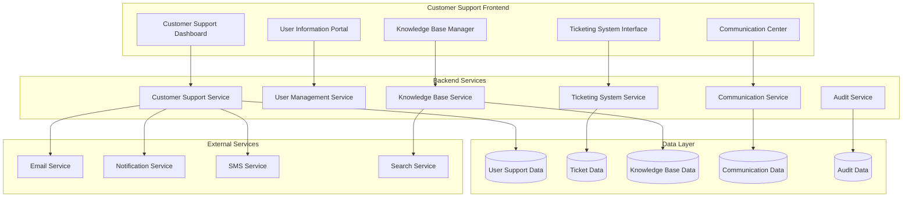

# Customer Support Team System Development Plan

## 🎯 Overview

This comprehensive document outlines the development plan for the Customer Support Team system within the Alphintra platform. The system provides secure, efficient tools for support agents to assist traders and external developers while maintaining strict privacy and security controls.

## 🏗️ System Architecture
x
### High-Level Architecture Overview



## 📋 Technical Stack

### Frontend Technologies
- **Framework**: React 18 with TypeScript
- **State Management**: Redux Toolkit + RTK Query
- **UI Library**: Material-UI (MUI) v5
- **Real-time**: Socket.IO client
- **Charts**: Chart.js / Recharts
- **Forms**: React Hook Form + Zod validation
- **Routing**: React Router v6

### Backend Technologies
- **Framework**: Spring Boot 3.2
- **Language**: Java 17
- **Database**: PostgreSQL 15
- **Search**: Elasticsearch 8
- **Cache**: Redis 7
- **Message Queue**: Apache Kafka
- **Authentication**: Spring Security + JWT
- **Real-time**: WebSocket/STOMP

### Infrastructure
- **Containerization**: Docker
- **Orchestration**: Kubernetes
- **API Gateway**: Spring Cloud Gateway
- **Monitoring**: Prometheus + Grafana
- **Logging**: ELK Stack

## 🔐 Security & Privacy Framework

### Access Control Matrix

| Role | User Data Access | Financial Data | System Logs | Configuration |
|------|-----------------|----------------|-------------|---------------|
| Support Agent L1 | Basic Profile Only | Transaction History | Error Logs | Read-Only |
| Support Agent L2 | Extended Profile | Full Transaction | System Logs | Limited Write |
| Support Supervisor | Full Profile | All Financial | Full Logs | Configuration |
| Support Manager | Admin Access | All Data | Audit Logs | Full Control |

### Privacy Controls
- **Data Masking**: Sensitive fields automatically masked
- **Consent Management**: User consent required for detailed access
- **Audit Logging**: All access logged with user consent
- **Time-based Access**: Session-based access with automatic expiry
- **Role-based Permissions**: Granular permission system

## 📊 A. User Account Information Portal (User Snapshot)

### 1. Frontend Components

#### UserSnapshotDashboard.tsx
```typescript
interface UserSnapshot {
  userId: string;
  basicInfo: {
    accountType: 'TRADER' | 'EXTERNAL_DEVELOPER';
    registrationDate: Date;
    contactInfo: {
      email: string; // masked
      phone?: string; // masked
      preferredName: string;
    };
  };
  accountStatus: {
    status: 'ACTIVE' | 'SUSPENDED' | 'PENDING' | 'CLOSED';
    kycStatus: 'PENDING' | 'VERIFIED' | 'REJECTED' | 'EXPIRED';
    amlStatus: 'CLEAR' | 'FLAGGED' | 'UNDER_REVIEW';
    freeTrialInfo?: {
      isActive: boolean;
      expiryDate: Date;
      featuresUsed: string[];
    };
    computeCredits: {
      balance: number;
      lastPurchase?: Date;
      monthlyUsage: number;
    };
  };
  recentActivity: {
    lastLogin: Date;
    recentEvents: UserActivityEvent[];
  };
  activeResources: {
    tradingBots: ActiveBot[];
    marketplaceModels: MarketplaceModel[];
  };
}

const UserSnapshotDashboard: React.FC<{ userId: string }> = ({ userId }) => {
  const { data: userSnapshot, isLoading } = useGetUserSnapshotQuery(userId);
  const [accessLevel, setAccessLevel] = useState<'BASIC' | 'DETAILED'>('BASIC');
  
  const handleRequestDetailedAccess = async () => {
    // Request user consent for detailed access
    const consent = await requestUserConsent(userId, 'DETAILED_PROFILE_ACCESS');
    if (consent.granted) {
      setAccessLevel('DETAILED');
    }
  };

  if (isLoading) return <SkeletonLoader />;

  return (
    <Grid container spacing={3}>
      <Grid item xs={12}>
        <UserBasicInfoCard userSnapshot={userSnapshot} />
      </Grid>
      
      <Grid item xs={12} md={6}>
        <AccountStatusCard status={userSnapshot.accountStatus} />
      </Grid>
      
      <Grid item xs={12} md={6}>
        <RecentActivityCard 
          activity={userSnapshot.recentActivity}
          accessLevel={accessLevel}
          onRequestAccess={handleRequestDetailedAccess}
        />
      </Grid>
      
      <Grid item xs={12}>
        <ActiveResourcesCard resources={userSnapshot.activeResources} />
      </Grid>
    </Grid>
  );
};
```

#### UserConsentModal.tsx
```typescript
interface ConsentRequest {
  requestId: string;
  userId: string;
  requestType: string;
  reason: string;
  dataAccessed: string[];
  duration: number; // hours
}

const UserConsentModal: React.FC<{
  open: boolean;
  consentRequest: ConsentRequest;
  onApprove: (duration: number) => void;
  onDeny: () => void;
}> = ({ open, consentRequest, onApprove, onDeny }) => {
  const [duration, setDuration] = useState(4); // 4 hours default

  return (
    <Dialog open={open} maxWidth="md" fullWidth>
      <DialogTitle>
        <Alert severity="info" icon={<SecurityIcon />}>
          User Consent Required for Detailed Access
        </Alert>
      </DialogTitle>
      
      <DialogContent>
        <Stack spacing={3}>
          <Typography variant="body1">
            Request detailed access to user data for support purposes:
          </Typography>
          
          <Card variant="outlined">
            <CardContent>
              <Typography variant="h6">Data Access Request</Typography>
              <List dense>
                {consentRequest.dataAccessed.map((item) => (
                  <ListItem key={item}>
                    <ListItemIcon>
                      <DataUsageIcon />
                    </ListItemIcon>
                    <ListItemText primary={item} />
                  </ListItem>
                ))}
              </List>
            </CardContent>
          </Card>
          
          <FormControl fullWidth>
            <InputLabel>Access Duration</InputLabel>
            <Select
              value={duration}
              onChange={(e) => setDuration(e.target.value as number)}
            >
              <MenuItem value={1}>1 Hour</MenuItem>
              <MenuItem value={4}>4 Hours (Recommended)</MenuItem>
              <MenuItem value={8}>8 Hours</MenuItem>
              <MenuItem value={24}>24 Hours</MenuItem>
            </Select>
          </FormControl>
          
          <TextField
            fullWidth
            multiline
            rows={3}
            label="Reason for Access"
            placeholder="Explain why detailed access is needed..."
          />
        </Stack>
      </DialogContent>
      
      <DialogActions>
        <Button onClick={onDeny} color="error">
          Deny Access
        </Button>
        <Button 
          onClick={() => onApprove(duration)} 
          variant="contained"
          startIcon={<SecurityIcon />}
        >
          Request User Consent
        </Button>
      </DialogActions>
    </Dialog>
  );
};
```

### 2. Backend Implementation

#### UserSnapshotController.java
```java
@RestController
@RequestMapping("/api/support/users")
@PreAuthorize("hasRole('SUPPORT_AGENT')")
@Slf4j
public class UserSnapshotController {
    
    @Autowired
    private UserSnapshotService userSnapshotService;
    
    @Autowired
    private ConsentManagementService consentService;
    
    @Autowired
    private AuditService auditService;
    
    @GetMapping("/{userId}/snapshot")
    @PreAuthorize("@supportSecurityService.canAccessUserData(authentication.principal, #userId)")
    public ResponseEntity<UserSnapshotDto> getUserSnapshot(
            @PathVariable UUID userId,
            @RequestParam(defaultValue = "BASIC") AccessLevel accessLevel,
            Authentication authentication) {
        
        SupportAgent agent = (SupportAgent) authentication.getPrincipal();
        
        // Audit the access request
        auditService.logUserDataAccess(
            agent.getAgentId(), 
            userId, 
            accessLevel, 
            "User snapshot request"
        );
        
        if (accessLevel == AccessLevel.DETAILED) {
            // Check if consent is granted
            ConsentRecord consent = consentService.getValidConsent(
                userId, 
                agent.getAgentId(), 
                ConsentType.DETAILED_PROFILE_ACCESS
            );
            
            if (consent == null || consent.isExpired()) {
                return ResponseEntity.status(HttpStatus.FORBIDDEN)
                    .body(null);
            }
        }
        
        UserSnapshotDto snapshot = userSnapshotService.getUserSnapshot(userId, accessLevel);
        return ResponseEntity.ok(snapshot);
    }
    
    @PostMapping("/{userId}/consent-request")
    public ResponseEntity<ConsentRequestDto> requestUserConsent(
            @PathVariable UUID userId,
            @RequestBody ConsentRequestDto request,
            Authentication authentication) {
        
        SupportAgent agent = (SupportAgent) authentication.getPrincipal();
        
        ConsentRequestDto consentRequest = consentService.createConsentRequest(
            userId,
            agent.getAgentId(),
            request.getConsentType(),
            request.getReason(),
            request.getDuration()
        );
        
        // Send notification to user
        notificationService.sendConsentRequest(userId, consentRequest);
        
        return ResponseEntity.ok(consentRequest);
    }
}
```

#### UserSnapshotService.java
```java
@Service
@Transactional(readOnly = true)
public class UserSnapshotService {
    
    @Autowired
    private UserRepository userRepository;
    
    @Autowired
    private ActivityLogRepository activityLogRepository;
    
    @Autowired
    private TradingBotRepository tradingBotRepository;
    
    @Autowired
    private MarketplaceRepository marketplaceRepository;
    
    @Autowired
    private DataMaskingService dataMaskingService;
    
    public UserSnapshotDto getUserSnapshot(UUID userId, AccessLevel accessLevel) {
        User user = userRepository.findById(userId)
            .orElseThrow(() -> new UserNotFoundException("User not found: " + userId));
        
        UserSnapshotDto snapshot = UserSnapshotDto.builder()
            .userId(userId.toString())
            .basicInfo(buildBasicInfo(user, accessLevel))
            .accountStatus(buildAccountStatus(user))
            .recentActivity(buildRecentActivity(userId, accessLevel))
            .activeResources(buildActiveResources(userId))
            .build();
        
        return snapshot;
    }
    
    private BasicInfoDto buildBasicInfo(User user, AccessLevel accessLevel) {
        ContactInfoDto contactInfo = ContactInfoDto.builder()
            .email(dataMaskingService.maskEmail(user.getEmail(), accessLevel))
            .phone(dataMaskingService.maskPhone(user.getPhone(), accessLevel))
            .preferredName(user.getPreferredName())
            .build();
        
        return BasicInfoDto.builder()
            .accountType(user.getAccountType())
            .registrationDate(user.getCreatedAt())
            .contactInfo(contactInfo)
            .build();
    }
    
    private AccountStatusDto buildAccountStatus(User user) {
        FreeTrialInfoDto freeTrialInfo = null;
        if (user.getFreeTrialStatus() != null) {
            freeTrialInfo = FreeTrialInfoDto.builder()
                .isActive(user.getFreeTrialStatus().isActive())
                .expiryDate(user.getFreeTrialStatus().getExpiryDate())
                .featuresUsed(user.getFreeTrialStatus().getFeaturesUsed())
                .build();
        }
        
        ComputeCreditsDto computeCredits = ComputeCreditsDto.builder()
            .balance(user.getComputeCredits().getBalance())
            .lastPurchase(user.getComputeCredits().getLastPurchaseDate())
            .monthlyUsage(user.getComputeCredits().getCurrentMonthUsage())
            .build();
        
        return AccountStatusDto.builder()
            .status(user.getAccountStatus())
            .kycStatus(user.getKycStatus())
            .amlStatus(user.getAmlStatus())
            .freeTrialInfo(freeTrialInfo)
            .computeCredits(computeCredits)
            .build();
    }
    
    private RecentActivityDto buildRecentActivity(UUID userId, AccessLevel accessLevel) {
        List<ActivityLog> recentLogs = activityLogRepository
            .findRecentActivityByUserId(userId, 50);
        
        List<UserActivityEventDto> events = recentLogs.stream()
            .filter(log -> isSafeToShow(log, accessLevel))
            .map(this::convertToActivityEvent)
            .collect(Collectors.toList());
        
        return RecentActivityDto.builder()
            .lastLogin(getLastLoginTime(userId))
            .recentEvents(events)
            .build();
    }
    
    private boolean isSafeToShow(ActivityLog log, AccessLevel accessLevel) {
        // Define what activities are safe to show at different access levels
        Set<String> basicSafeActivities = Set.of(
            "LOGIN", "LOGOUT", "BOT_CREATED", "BOT_STARTED", "BOT_STOPPED",
            "MODEL_PUBLISHED", "STRATEGY_SAVED"
        );
        
        Set<String> detailedSafeActivities = Set.of(
            "API_KEY_GENERATED", "BROKER_CONNECTED", "PAYMENT_PROCESSED",
            "KYC_SUBMITTED", "SETTINGS_UPDATED"
        );
        
        if (accessLevel == AccessLevel.BASIC) {
            return basicSafeActivities.contains(log.getActivityType());
        } else {
            return basicSafeActivities.contains(log.getActivityType()) ||
                   detailedSafeActivities.contains(log.getActivityType());
        }
    }
}
```

## 🎫 B. Support Ticketing System (Issue Hub)

### 1. Frontend Components

#### TicketingDashboard.tsx
```typescript
interface Ticket {
  ticketId: string;
  userId: string;
  title: string;
  description: string;
  category: TicketCategory;
  priority: TicketPriority;
  status: TicketStatus;
  assignedAgent?: string;
  createdAt: Date;
  updatedAt: Date;
  tags: string[];
  escalationLevel: number;
}

const TicketingDashboard: React.FC = () => {
  const [filters, setFilters] = useState<TicketFilters>({
    status: [],
    priority: [],
    category: [],
    assignedToMe: false
  });
  
  const { data: tickets, isLoading } = useGetTicketsQuery(filters);
  const [createTicket] = useCreateTicketMutation();
  
  return (
    <Box sx={{ p: 3 }}>
      <Paper sx={{ p: 2, mb: 3 }}>
        <TicketFilters filters={filters} onFiltersChange={setFilters} />
      </Paper>
      
      <Grid container spacing={3}>
        <Grid item xs={12} md={8}>
          <TicketList 
            tickets={tickets} 
            isLoading={isLoading}
            onTicketSelect={handleTicketSelect}
          />
        </Grid>
        
        <Grid item xs={12} md={4}>
          <TicketSidebar />
        </Grid>
      </Grid>
      
      <Fab
        color="primary"
        aria-label="create ticket"
        sx={{ position: 'fixed', bottom: 16, right: 16 }}
        onClick={() => setCreateDialogOpen(true)}
      >
        <AddIcon />
      </Fab>
    </Box>
  );
};
```

#### TicketDetailView.tsx
```typescript
const TicketDetailView: React.FC<{ ticketId: string }> = ({ ticketId }) => {
  const { data: ticket } = useGetTicketQuery(ticketId);
  const { data: communications } = useGetTicketCommunicationsQuery(ticketId);
  const [addCommunication] = useAddCommunicationMutation();
  const [updateTicket] = useUpdateTicketMutation();
  
  const handleSendMessage = async (message: string, isInternal: boolean) => {
    await addCommunication({
      ticketId,
      message,
      isInternal,
      type: 'MESSAGE'
    });
  };
  
  const handleStatusChange = async (newStatus: TicketStatus) => {
    await updateTicket({
      ticketId,
      updates: { status: newStatus }
    });
  };
  
  return (
    <Box sx={{ height: '100vh', display: 'flex', flexDirection: 'column' }}>
      <TicketHeader 
        ticket={ticket}
        onStatusChange={handleStatusChange}
        onAssign={handleAssignment}
        onEscalate={handleEscalation}
      />
      
      <Box sx={{ flex: 1, overflow: 'hidden' }}>
        <Grid container sx={{ height: '100%' }}>
          <Grid item xs={8} sx={{ borderRight: 1, borderColor: 'divider' }}>
            <CommunicationTimeline 
              communications={communications}
              onReply={handleSendMessage}
            />
          </Grid>
          
          <Grid item xs={4}>
            <TicketSidebar ticket={ticket} />
          </Grid>
        </Grid>
      </Box>
      
      <TicketActionBar
        onSendMessage={handleSendMessage}
        onAddNote={handleAddNote}
        onAttachFile={handleAttachFile}
      />
    </Box>
  );
};
```

### 2. Backend Implementation

#### TicketController.java
```java
@RestController
@RequestMapping("/api/support/tickets")
@PreAuthorize("hasRole('SUPPORT_AGENT')")
public class TicketController {
    
    @Autowired
    private TicketService ticketService;
    
    @Autowired
    private CommunicationService communicationService;
    
    @GetMapping
    public ResponseEntity<Page<TicketDto>> getTickets(
            @RequestParam(defaultValue = "0") int page,
            @RequestParam(defaultValue = "20") int size,
            @RequestParam(required = false) List<TicketStatus> status,
            @RequestParam(required = false) List<TicketPriority> priority,
            @RequestParam(required = false) List<TicketCategory> category,
            @RequestParam(required = false) Boolean assignedToMe,
            Authentication authentication) {
        
        TicketFilter filter = TicketFilter.builder()
            .status(status)
            .priority(priority)
            .category(category)
            .assignedToMe(assignedToMe)
            .agentId(assignedToMe ? getAgentId(authentication) : null)
            .build();
        
        Pageable pageable = PageRequest.of(page, size);
        Page<TicketDto> tickets = ticketService.getTickets(filter, pageable);
        
        return ResponseEntity.ok(tickets);
    }
    
    @PostMapping
    public ResponseEntity<TicketDto> createTicket(
            @RequestBody CreateTicketDto createTicketDto,
            Authentication authentication) {
        
        String agentId = getAgentId(authentication);
        TicketDto ticket = ticketService.createTicket(createTicketDto, agentId);
        
        return ResponseEntity.status(HttpStatus.CREATED).body(ticket);
    }
    
    @GetMapping("/{ticketId}")
    public ResponseEntity<TicketDto> getTicket(@PathVariable String ticketId) {
        TicketDto ticket = ticketService.getTicketById(ticketId);
        return ResponseEntity.ok(ticket);
    }
    
    @PutMapping("/{ticketId}")
    public ResponseEntity<TicketDto> updateTicket(
            @PathVariable String ticketId,
            @RequestBody UpdateTicketDto updateDto,
            Authentication authentication) {
        
        String agentId = getAgentId(authentication);
        TicketDto ticket = ticketService.updateTicket(ticketId, updateDto, agentId);
        
        return ResponseEntity.ok(ticket);
    }
    
    @PostMapping("/{ticketId}/communications")
    public ResponseEntity<CommunicationDto> addCommunication(
            @PathVariable String ticketId,
            @RequestBody CreateCommunicationDto communicationDto,
            Authentication authentication) {
        
        String agentId = getAgentId(authentication);
        CommunicationDto communication = communicationService.addCommunication(
            ticketId, communicationDto, agentId);
        
        return ResponseEntity.status(HttpStatus.CREATED).body(communication);
    }
    
    @PostMapping("/{ticketId}/escalate")
    public ResponseEntity<TicketDto> escalateTicket(
            @PathVariable String ticketId,
            @RequestBody EscalationDto escalationDto,
            Authentication authentication) {
        
        String agentId = getAgentId(authentication);
        TicketDto ticket = ticketService.escalateTicket(ticketId, escalationDto, agentId);
        
        return ResponseEntity.ok(ticket);
    }
}
```

#### TicketService.java
```java
@Service
@Transactional
public class TicketService {
    
    @Autowired
    private TicketRepository ticketRepository;
    
    @Autowired
    private AutoResponseService autoResponseService;
    
    @Autowired
    private NotificationService notificationService;
    
    @Autowired
    private EscalationService escalationService;
    
    public TicketDto createTicket(CreateTicketDto createTicketDto, String agentId) {
        Ticket ticket = Ticket.builder()
            .ticketId(generateTicketId())
            .userId(createTicketDto.getUserId())
            .title(createTicketDto.getTitle())
            .description(createTicketDto.getDescription())
            .category(createTicketDto.getCategory())
            .priority(determinePriority(createTicketDto))
            .status(TicketStatus.NEW)
            .assignedAgent(agentId)
            .createdAt(LocalDateTime.now())
            .updatedAt(LocalDateTime.now())
            .tags(createTicketDto.getTags())
            .escalationLevel(0)
            .build();
        
        ticket = ticketRepository.save(ticket);
        
        // Check for auto-responses
        autoResponseService.checkForAutoResponse(ticket);
        
        // Send notification to user
        notificationService.sendTicketCreatedNotification(ticket);
        
        return convertToDto(ticket);
    }
    
    public TicketDto updateTicket(String ticketId, UpdateTicketDto updateDto, String agentId) {
        Ticket ticket = ticketRepository.findById(ticketId)
            .orElseThrow(() -> new TicketNotFoundException("Ticket not found: " + ticketId));
        
        // Update allowed fields
        if (updateDto.getStatus() != null) {
            ticket.setStatus(updateDto.getStatus());
        }
        if (updateDto.getPriority() != null) {
            ticket.setPriority(updateDto.getPriority());
        }
        if (updateDto.getAssignedAgent() != null) {
            ticket.setAssignedAgent(updateDto.getAssignedAgent());
        }
        if (updateDto.getTags() != null) {
            ticket.setTags(updateDto.getTags());
        }
        
        ticket.setUpdatedAt(LocalDateTime.now());
        ticket.setLastUpdatedBy(agentId);
        
        ticket = ticketRepository.save(ticket);
        
        // Send notifications for status changes
        if (updateDto.getStatus() != null) {
            notificationService.sendTicketStatusUpdate(ticket);
        }
        
        return convertToDto(ticket);
    }
    
    public TicketDto escalateTicket(String ticketId, EscalationDto escalationDto, String agentId) {
        Ticket ticket = ticketRepository.findById(ticketId)
            .orElseThrow(() -> new TicketNotFoundException("Ticket not found: " + ticketId));
        
        EscalationResult result = escalationService.escalateTicket(
            ticket, escalationDto.getTargetTeam(), escalationDto.getReason(), agentId);
        
        ticket.setEscalationLevel(ticket.getEscalationLevel() + 1);
        ticket.setAssignedAgent(result.getNewAssignee());
        ticket.setStatus(TicketStatus.ESCALATED);
        ticket.setUpdatedAt(LocalDateTime.now());
        
        ticket = ticketRepository.save(ticket);
        
        return convertToDto(ticket);
    }
    
    private TicketPriority determinePriority(CreateTicketDto createTicketDto) {
        // AI-based priority determination logic
        if (containsUrgentKeywords(createTicketDto.getDescription())) {
            return TicketPriority.HIGH;
        }
        
        if (createTicketDto.getCategory() == TicketCategory.SECURITY ||
            createTicketDto.getCategory() == TicketCategory.BILLING) {
            return TicketPriority.MEDIUM;
        }
        
        return TicketPriority.LOW;
    }
    
    private boolean containsUrgentKeywords(String description) {
        Set<String> urgentKeywords = Set.of(
            "urgent", "emergency", "critical", "down", "broken", 
            "lost money", "unauthorized", "hacked", "cannot login"
        );
        
        String lowerDescription = description.toLowerCase();
        return urgentKeywords.stream()
            .anyMatch(lowerDescription::contains);
    }
}
```

## 📚 C. Knowledge Base & FAQ Management

### 1. Frontend Components

#### KnowledgeBaseManager.tsx
```typescript
interface KnowledgeBaseArticle {
  articleId: string;
  title: string;
  content: string;
  category: string;
  tags: string[];
  author: string;
  createdAt: Date;
  updatedAt: Date;
  status: 'DRAFT' | 'PUBLISHED' | 'ARCHIVED';
  views: number;
  helpfulness: number;
  relatedArticles: string[];
}

const KnowledgeBaseManager: React.FC = () => {
  const [searchTerm, setSearchTerm] = useState('');
  const [selectedCategory, setSelectedCategory] = useState<string>('');
  const [createDialogOpen, setCreateDialogOpen] = useState(false);
  
  const { data: articles, isLoading } = useSearchArticlesQuery({
    search: searchTerm,
    category: selectedCategory
  });
  
  const { data: categories } = useGetCategoriesQuery();
  
  return (
    <Box sx={{ p: 3 }}>
      <Box sx={{ mb: 3 }}>
        <Typography variant="h4" gutterBottom>
          Knowledge Base Management
        </Typography>
        
        <Grid container spacing={2} alignItems="center">
          <Grid item xs={12} md={6}>
            <TextField
              fullWidth
              placeholder="Search articles..."
              value={searchTerm}
              onChange={(e) => setSearchTerm(e.target.value)}
              InputProps={{
                startAdornment: <SearchIcon />,
                endAdornment: searchTerm && (
                  <IconButton onClick={() => setSearchTerm('')}>
                    <ClearIcon />
                  </IconButton>
                )
              }}
            />
          </Grid>
          
          <Grid item xs={12} md={3}>
            <FormControl fullWidth>
              <InputLabel>Category</InputLabel>
              <Select
                value={selectedCategory}
                onChange={(e) => setSelectedCategory(e.target.value)}
              >
                <MenuItem value="">All Categories</MenuItem>
                {categories?.map((category) => (
                  <MenuItem key={category.id} value={category.id}>
                    {category.name}
                  </MenuItem>
                ))}
              </Select>
            </FormControl>
          </Grid>
          
          <Grid item xs={12} md={3}>
            <Button
              fullWidth
              variant="contained"
              startIcon={<AddIcon />}
              onClick={() => setCreateDialogOpen(true)}
            >
              Create Article
            </Button>
          </Grid>
        </Grid>
      </Box>
      
      <ArticleList articles={articles} isLoading={isLoading} />
      
      <CreateArticleDialog 
        open={createDialogOpen}
        onClose={() => setCreateDialogOpen(false)}
        categories={categories}
      />
    </Box>
  );
};
```

#### ArticleEditor.tsx
```typescript
const ArticleEditor: React.FC<{ articleId?: string }> = ({ articleId }) => {
  const [article, setArticle] = useState<Partial<KnowledgeBaseArticle>>({});
  const [saveAsStatus, setSaveAsStatus] = useState<'DRAFT' | 'PUBLISHED'>('DRAFT');
  
  const { data: existingArticle } = useGetArticleQuery(articleId, {
    skip: !articleId
  });
  
  const [saveArticle] = useSaveArticleMutation();
  const [publishArticle] = usePublishArticleMutation();
  
  useEffect(() => {
    if (existingArticle) {
      setArticle(existingArticle);
    }
  }, [existingArticle]);
  
  const handleSave = async () => {
    try {
      await saveArticle({
        ...article,
        status: saveAsStatus
      });
      
      // Show success notification
      showNotification('Article saved successfully', 'success');
    } catch (error) {
      showNotification('Failed to save article', 'error');
    }
  };
  
  return (
    <Box sx={{ p: 3 }}>
      <Paper sx={{ p: 3 }}>
        <Grid container spacing={3}>
          <Grid item xs={12}>
            <TextField
              fullWidth
              label="Article Title"
              value={article.title || ''}
              onChange={(e) => setArticle({ ...article, title: e.target.value })}
            />
          </Grid>
          
          <Grid item xs={12} md={6}>
            <FormControl fullWidth>
              <InputLabel>Category</InputLabel>
              <Select
                value={article.category || ''}
                onChange={(e) => setArticle({ ...article, category: e.target.value })}
              >
                {categories?.map((category) => (
                  <MenuItem key={category.id} value={category.id}>
                    {category.name}
                  </MenuItem>
                ))}
              </Select>
            </FormControl>
          </Grid>
          
          <Grid item xs={12} md={6}>
            <Autocomplete
              multiple
              freeSolo
              options={suggestedTags}
              value={article.tags || []}
              onChange={(_, newTags) => setArticle({ ...article, tags: newTags })}
              renderInput={(params) => (
                <TextField {...params} label="Tags" placeholder="Add tags..." />
              )}
            />
          </Grid>
          
          <Grid item xs={12}>
            <MarkdownEditor
              value={article.content || ''}
              onChange={(content) => setArticle({ ...article, content })}
              height={500}
            />
          </Grid>
          
          <Grid item xs={12}>
            <Box sx={{ display: 'flex', gap: 2, justifyContent: 'flex-end' }}>
              <Button variant="outlined" onClick={() => setSaveAsStatus('DRAFT')}>
                Save as Draft
              </Button>
              <Button 
                variant="contained" 
                onClick={() => setSaveAsStatus('PUBLISHED')}
                disabled={!article.title || !article.content}
              >
                Publish Article
              </Button>
            </Box>
          </Grid>
        </Grid>
      </Paper>
    </Box>
  );
};
```

### 2. Backend Implementation

#### KnowledgeBaseController.java
```java
@RestController
@RequestMapping("/api/support/knowledge-base")
@PreAuthorize("hasRole('SUPPORT_AGENT')")
public class KnowledgeBaseController {
    
    @Autowired
    private KnowledgeBaseService knowledgeBaseService;
    
    @Autowired
    private SearchService searchService;
    
    @GetMapping("/articles/search")
    public ResponseEntity<Page<ArticleDto>> searchArticles(
            @RequestParam(required = false) String query,
            @RequestParam(required = false) String category,
            @RequestParam(required = false) List<String> tags,
            @RequestParam(defaultValue = "0") int page,
            @RequestParam(defaultValue = "20") int size) {
        
        SearchCriteria criteria = SearchCriteria.builder()
            .query(query)
            .category(category)
            .tags(tags)
            .build();
        
        Pageable pageable = PageRequest.of(page, size);
        Page<ArticleDto> articles = searchService.searchArticles(criteria, pageable);
        
        return ResponseEntity.ok(articles);
    }
    
    @GetMapping("/articles/{articleId}")
    public ResponseEntity<ArticleDto> getArticle(@PathVariable String articleId) {
        ArticleDto article = knowledgeBaseService.getArticleById(articleId);
        
        // Increment view count
        knowledgeBaseService.incrementViewCount(articleId);
        
        return ResponseEntity.ok(article);
    }
    
    @PostMapping("/articles")
    @PreAuthorize("hasAuthority('KB_WRITE')")
    public ResponseEntity<ArticleDto> createArticle(
            @RequestBody CreateArticleDto createArticleDto,
            Authentication authentication) {
        
        String authorId = getAgentId(authentication);
        ArticleDto article = knowledgeBaseService.createArticle(createArticleDto, authorId);
        
        return ResponseEntity.status(HttpStatus.CREATED).body(article);
    }
    
    @PutMapping("/articles/{articleId}")
    @PreAuthorize("hasAuthority('KB_WRITE') or @knowledgeBaseService.isAuthor(#articleId, authentication.principal)")
    public ResponseEntity<ArticleDto> updateArticle(
            @PathVariable String articleId,
            @RequestBody UpdateArticleDto updateArticleDto,
            Authentication authentication) {
        
        String editorId = getAgentId(authentication);
        ArticleDto article = knowledgeBaseService.updateArticle(articleId, updateArticleDto, editorId);
        
        return ResponseEntity.ok(article);
    }
    
    @PostMapping("/articles/{articleId}/feedback")
    public ResponseEntity<Void> submitFeedback(
            @PathVariable String articleId,
            @RequestBody ArticleFeedbackDto feedback) {
        
        knowledgeBaseService.submitFeedback(articleId, feedback);
        return ResponseEntity.ok().build();
    }
    
    @GetMapping("/categories")
    public ResponseEntity<List<CategoryDto>> getCategories() {
        List<CategoryDto> categories = knowledgeBaseService.getAllCategories();
        return ResponseEntity.ok(categories);
    }
    
    @GetMapping("/analytics")
    @PreAuthorize("hasAuthority('KB_ADMIN')")
    public ResponseEntity<KnowledgeBaseAnalyticsDto> getAnalytics(
            @RequestParam @DateTimeFormat(iso = DateTimeFormat.ISO.DATE) LocalDate fromDate,
            @RequestParam @DateTimeFormat(iso = DateTimeFormat.ISO.DATE) LocalDate toDate) {
        
        KnowledgeBaseAnalyticsDto analytics = knowledgeBaseService.getAnalytics(fromDate, toDate);
        return ResponseEntity.ok(analytics);
    }
}
```

#### SearchService.java
```java
@Service
public class SearchService {
    
    @Autowired
    private ElasticsearchTemplate elasticsearchTemplate;
    
    @Autowired
    private ArticleRepository articleRepository;
    
    public Page<ArticleDto> searchArticles(SearchCriteria criteria, Pageable pageable) {
        BoolQueryBuilder boolQuery = QueryBuilders.boolQuery();
        
        // Full-text search
        if (StringUtils.hasText(criteria.getQuery())) {
            MultiMatchQueryBuilder multiMatchQuery = QueryBuilders.multiMatchQuery(
                criteria.getQuery(),
                "title^3", "content^2", "tags"
            ).type(MultiMatchQueryBuilder.Type.BEST_FIELDS);
            
            boolQuery.must(multiMatchQuery);
        }
        
        // Category filter
        if (StringUtils.hasText(criteria.getCategory())) {
            boolQuery.filter(QueryBuilders.termQuery("category", criteria.getCategory()));
        }
        
        // Tags filter
        if (criteria.getTags() != null && !criteria.getTags().isEmpty()) {
            boolQuery.filter(QueryBuilders.termsQuery("tags", criteria.getTags()));
        }
        
        // Only published articles for non-admin users
        boolQuery.filter(QueryBuilders.termQuery("status", "PUBLISHED"));
        
        // Build search request
        SearchRequest searchRequest = new SearchRequest("knowledge_base");
        SearchSourceBuilder sourceBuilder = new SearchSourceBuilder()
            .query(boolQuery)
            .from((int) pageable.getOffset())
            .size(pageable.getPageSize())
            .sort("_score", SortOrder.DESC)
            .sort("updatedAt", SortOrder.DESC);
        
        searchRequest.source(sourceBuilder);
        
        try {
            SearchResponse response = elasticsearchTemplate.search(searchRequest, RequestOptions.DEFAULT);
            
            List<ArticleDto> articles = Arrays.stream(response.getHits().getHits())
                .map(this::convertToArticleDto)
                .collect(Collectors.toList());
            
            long totalHits = response.getHits().getTotalHits().value;
            
            return new PageImpl<>(articles, pageable, totalHits);
            
        } catch (IOException e) {
            throw new SearchException("Failed to search articles", e);
        }
    }
    
    private ArticleDto convertToArticleDto(SearchHit hit) {
        Map<String, Object> source = hit.getSourceAsMap();
        
        return ArticleDto.builder()
            .articleId((String) source.get("articleId"))
            .title((String) source.get("title"))
            .content((String) source.get("content"))
            .category((String) source.get("category"))
            .tags((List<String>) source.get("tags"))
            .author((String) source.get("author"))
            .createdAt(parseDate((String) source.get("createdAt")))
            .updatedAt(parseDate((String) source.get("updatedAt")))
            .views((Integer) source.get("views"))
            .helpfulness((Double) source.get("helpfulness"))
            .build();
    }
}
```

## 💬 D. Communication Channels

### 1. Integrated Messaging System

#### CommunicationCenter.tsx
```typescript
interface Communication {
  communicationId: string;
  ticketId: string;
  senderId: string;
  senderType: 'AGENT' | 'USER' | 'SYSTEM';
  message: string;
  messageType: 'TEXT' | 'FILE' | 'TEMPLATE' | 'AUTO_RESPONSE';
  isInternal: boolean;
  timestamp: Date;
  attachments?: Attachment[];
  templateId?: string;
  readBy: ReadStatus[];
}

const CommunicationCenter: React.FC<{ ticketId: string }> = ({ ticketId }) => {
  const [message, setMessage] = useState('');
  const [isInternal, setIsInternal] = useState(false);
  const [selectedTemplate, setSelectedTemplate] = useState<string>('');
  
  const { data: communications } = useGetCommunicationsQuery(ticketId);
  const { data: templates } = useGetMessageTemplatesQuery();
  const [sendMessage] = useSendMessageMutation();
  
  const handleSendMessage = async () => {
    if (!message.trim()) return;
    
    await sendMessage({
      ticketId,
      message,
      isInternal,
      messageType: selectedTemplate ? 'TEMPLATE' : 'TEXT',
      templateId: selectedTemplate || undefined
    });
    
    setMessage('');
    setSelectedTemplate('');
  };
  
  const handleTemplateSelect = (templateId: string) => {
    const template = templates?.find(t => t.id === templateId);
    if (template) {
      setMessage(template.content);
      setSelectedTemplate(templateId);
    }
  };
  
  return (
    <Box sx={{ height: '100%', display: 'flex', flexDirection: 'column' }}>
      <Box sx={{ flex: 1, overflow: 'auto', p: 2 }}>
        <CommunicationTimeline communications={communications} />
      </Box>
      
      <Divider />
      
      <Box sx={{ p: 2 }}>
        <Grid container spacing={2} alignItems="flex-end">
          <Grid item xs={12}>
            <Box sx={{ display: 'flex', gap: 1, mb: 1 }}>
              <FormControlLabel
                control={
                  <Switch
                    checked={isInternal}
                    onChange={(e) => setIsInternal(e.target.checked)}
                  />
                }
                label="Internal Note"
              />
              
              <FormControl size="small" sx={{ minWidth: 200 }}>
                <InputLabel>Template</InputLabel>
                <Select
                  value={selectedTemplate}
                  onChange={(e) => handleTemplateSelect(e.target.value)}
                >
                  <MenuItem value="">No Template</MenuItem>
                  {templates?.map((template) => (
                    <MenuItem key={template.id} value={template.id}>
                      {template.name}
                    </MenuItem>
                  ))}
                </Select>
              </FormControl>
            </Box>
          </Grid>
          
          <Grid item xs={12}>
            <TextField
              fullWidth
              multiline
              rows={3}
              placeholder={isInternal ? "Add internal note..." : "Type your message..."}
              value={message}
              onChange={(e) => setMessage(e.target.value)}
              onKeyPress={(e) => {
                if (e.key === 'Enter' && e.ctrlKey) {
                  handleSendMessage();
                }
              }}
            />
          </Grid>
          
          <Grid item xs={12}>
            <Box sx={{ display: 'flex', justifyContent: 'space-between', alignItems: 'center' }}>
              <Box>
                <IconButton component="label">
                  <AttachFileIcon />
                  <input type="file" hidden multiple onChange={handleFileAttach} />
                </IconButton>
                <IconButton onClick={handleInsertLink}>
                  <LinkIcon />
                </IconButton>
              </Box>
              
              <Button
                variant="contained"
                onClick={handleSendMessage}
                disabled={!message.trim()}
                endIcon={<SendIcon />}
              >
                {isInternal ? 'Add Note' : 'Send Message'}
              </Button>
            </Box>
          </Grid>
        </Grid>
      </Box>
    </Box>
  );
};
```

### 2. Email Integration

#### EmailIntegrationService.java
```java
@Service
public class EmailIntegrationService {
    
    @Autowired
    private JavaMailSender mailSender;
    
    @Autowired
    private TemplateService templateService;
    
    @Autowired
    private CommunicationService communicationService;
    
    @Value("${support.email.from}")
    private String fromEmail;
    
    @EventListener
    @Async
    public void handleTicketCommunication(CommunicationEvent event) {
        Communication communication = event.getCommunication();
        
        if (!communication.isInternal() && 
            communication.getSenderType() == SenderType.AGENT) {
            
            sendEmailToUser(communication);
        }
    }
    
    public void sendEmailToUser(Communication communication) {
        try {
            Ticket ticket = ticketService.getTicketById(communication.getTicketId());
            User user = userService.getUserById(ticket.getUserId());
            
            MimeMessage message = mailSender.createMimeMessage();
            MimeMessageHelper helper = new MimeMessageHelper(message, true, "UTF-8");
            
            helper.setFrom(fromEmail);
            helper.setTo(user.getEmail());
            helper.setSubject("Re: Support Ticket #" + ticket.getTicketId() + " - " + ticket.getTitle());
            
            // Use email template
            EmailTemplate template = templateService.getEmailTemplate("SUPPORT_RESPONSE");
            String emailContent = templateService.processTemplate(template, Map.of(
                "userName", user.getPreferredName(),
                "ticketId", ticket.getTicketId(),
                "message", communication.getMessage(),
                "agentName", getAgentName(communication.getSenderId())
            ));
            
            helper.setText(emailContent, true);
            
            // Add attachments if any
            if (communication.getAttachments() != null) {
                for (Attachment attachment : communication.getAttachments()) {
                    helper.addAttachment(attachment.getFileName(), attachment.getFile());
                }
            }
            
            mailSender.send(message);
            
            // Log the email communication
            communicationService.logEmailSent(communication.getCommunicationId(), user.getEmail());
            
        } catch (MessagingException e) {
            log.error("Failed to send email for communication: " + communication.getCommunicationId(), e);
        }
    }
    
    @EventListener
    public void handleIncomingEmail(IncomingEmailEvent event) {
        Email email = event.getEmail();
        
        // Extract ticket ID from subject
        String ticketId = extractTicketIdFromSubject(email.getSubject());
        
        if (ticketId != null) {
            // Add as communication to existing ticket
            Communication communication = Communication.builder()
                .ticketId(ticketId)
                .senderId(getUserIdByEmail(email.getFrom()))
                .senderType(SenderType.USER)
                .message(email.getBody())
                .messageType(MessageType.TEXT)
                .isInternal(false)
                .timestamp(email.getReceivedAt())
                .build();
            
            communicationService.addCommunication(communication);
            
            // Update ticket status to WAITING_FOR_AGENT if closed
            ticketService.reopenIfClosed(ticketId);
        } else {
            // Create new ticket from email
            createTicketFromEmail(email);
        }
    }
    
    private String extractTicketIdFromSubject(String subject) {
        Pattern pattern = Pattern.compile(".*#(\\w+-\\w+-\\w+).*");
        Matcher matcher = pattern.matcher(subject);
        
        if (matcher.matches()) {
            return matcher.group(1);
        }
        
        return null;
    }
}
```

## 🔄 E. Issue Escalation Pathways

### 1. Escalation Workflow Engine

#### EscalationWorkflowManager.tsx
```typescript
interface EscalationRule {
  ruleId: string;
  name: string;
  conditions: EscalationCondition[];
  targetTeam: string;
  autoEscalate: boolean;
  escalationDelay?: number; // minutes
  notificationTemplate: string;
}

interface EscalationCondition {
  field: string;
  operator: 'EQUALS' | 'GREATER_THAN' | 'CONTAINS' | 'TIME_SINCE';
  value: any;
  logicalOperator?: 'AND' | 'OR';
}

const EscalationWorkflowManager: React.FC = () => {
  const [rules, setRules] = useState<EscalationRule[]>([]);
  const [selectedRule, setSelectedRule] = useState<EscalationRule | null>(null);
  const [isEditing, setIsEditing] = useState(false);
  
  const { data: escalationRules } = useGetEscalationRulesQuery();
  const { data: teams } = useGetSupportTeamsQuery();
  const [createRule] = useCreateEscalationRuleMutation();
  const [updateRule] = useUpdateEscalationRuleMutation();
  
  return (
    <Box sx={{ p: 3 }}>
      <Typography variant="h4" gutterBottom>
        Escalation Workflow Management
      </Typography>
      
      <Grid container spacing={3}>
        <Grid item xs={12} md={4}>
          <Paper sx={{ p: 2 }}>
            <Box sx={{ display: 'flex', justifyContent: 'space-between', mb: 2 }}>
              <Typography variant="h6">Escalation Rules</Typography>
              <Button
                size="small"
                variant="contained"
                startIcon={<AddIcon />}
                onClick={() => {
                  setSelectedRule(null);
                  setIsEditing(true);
                }}
              >
                Add Rule
              </Button>
            </Box>
            
            <List>
              {escalationRules?.map((rule) => (
                <ListItem
                  key={rule.ruleId}
                  button
                  selected={selectedRule?.ruleId === rule.ruleId}
                  onClick={() => setSelectedRule(rule)}
                >
                  <ListItemText
                    primary={rule.name}
                    secondary={`Target: ${rule.targetTeam}`}
                  />
                  <ListItemSecondaryAction>
                    <IconButton
                      size="small"
                      onClick={() => {
                        setSelectedRule(rule);
                        setIsEditing(true);
                      }}
                    >
                      <EditIcon />
                    </IconButton>
                  </ListItemSecondaryAction>
                </ListItem>
              ))}
            </List>
          </Paper>
        </Grid>
        
        <Grid item xs={12} md={8}>
          {isEditing ? (
            <EscalationRuleEditor
              rule={selectedRule}
              teams={teams}
              onSave={handleSaveRule}
              onCancel={() => setIsEditing(false)}
            />
          ) : selectedRule ? (
            <EscalationRuleViewer rule={selectedRule} />
          ) : (
            <Paper sx={{ p: 3, textAlign: 'center' }}>
              <Typography color="textSecondary">
                Select a rule to view details or create a new one
              </Typography>
            </Paper>
          )}
        </Grid>
      </Grid>
    </Box>
  );
};
```

#### EscalationRuleEditor.tsx
```typescript
const EscalationRuleEditor: React.FC<{
  rule: EscalationRule | null;
  teams: SupportTeam[];
  onSave: (rule: EscalationRule) => void;
  onCancel: () => void;
}> = ({ rule, teams, onSave, onCancel }) => {
  const [formData, setFormData] = useState<Partial<EscalationRule>>(
    rule || {
      name: '',
      conditions: [],
      targetTeam: '',
      autoEscalate: false,
      notificationTemplate: 'DEFAULT_ESCALATION'
    }
  );
  
  const addCondition = () => {
    setFormData({
      ...formData,
      conditions: [
        ...(formData.conditions || []),
        {
          field: '',
          operator: 'EQUALS',
          value: '',
          logicalOperator: 'AND'
        }
      ]
    });
  };
  
  const updateCondition = (index: number, condition: EscalationCondition) => {
    const newConditions = [...(formData.conditions || [])];
    newConditions[index] = condition;
    setFormData({ ...formData, conditions: newConditions });
  };
  
  const removeCondition = (index: number) => {
    const newConditions = formData.conditions?.filter((_, i) => i !== index) || [];
    setFormData({ ...formData, conditions: newConditions });
  };
  
  return (
    <Paper sx={{ p: 3 }}>
      <Typography variant="h6" gutterBottom>
        {rule ? 'Edit Escalation Rule' : 'Create New Escalation Rule'}
      </Typography>
      
      <Grid container spacing={3}>
        <Grid item xs={12}>
          <TextField
            fullWidth
            label="Rule Name"
            value={formData.name}
            onChange={(e) => setFormData({ ...formData, name: e.target.value })}
          />
        </Grid>
        
        <Grid item xs={12} md={6}>
          <FormControl fullWidth>
            <InputLabel>Target Team</InputLabel>
            <Select
              value={formData.targetTeam}
              onChange={(e) => setFormData({ ...formData, targetTeam: e.target.value })}
            >
              {teams.map((team) => (
                <MenuItem key={team.teamId} value={team.teamId}>
                  {team.name}
                </MenuItem>
              ))}
            </Select>
          </FormControl>
        </Grid>
        
        <Grid item xs={12} md={6}>
          <FormControlLabel
            control={
              <Switch
                checked={formData.autoEscalate || false}
                onChange={(e) => setFormData({ ...formData, autoEscalate: e.target.checked })}
              />
            }
            label="Auto Escalate"
          />
        </Grid>
        
        {formData.autoEscalate && (
          <Grid item xs={12} md={6}>
            <TextField
              fullWidth
              type="number"
              label="Escalation Delay (minutes)"
              value={formData.escalationDelay || 0}
              onChange={(e) => setFormData({ 
                ...formData, 
                escalationDelay: parseInt(e.target.value) 
              })}
            />
          </Grid>
        )}
        
        <Grid item xs={12}>
          <Box sx={{ display: 'flex', justifyContent: 'space-between', alignItems: 'center', mb: 2 }}>
            <Typography variant="h6">Escalation Conditions</Typography>
            <Button size="small" startIcon={<AddIcon />} onClick={addCondition}>
              Add Condition
            </Button>
          </Box>
          
          {formData.conditions?.map((condition, index) => (
            <EscalationConditionEditor
              key={index}
              condition={condition}
              index={index}
              onUpdate={updateCondition}
              onRemove={removeCondition}
              showLogicalOperator={index > 0}
            />
          ))}
        </Grid>
        
        <Grid item xs={12}>
          <Box sx={{ display: 'flex', gap: 2, justifyContent: 'flex-end' }}>
            <Button onClick={onCancel}>Cancel</Button>
            <Button
              variant="contained"
              onClick={() => onSave(formData as EscalationRule)}
              disabled={!formData.name || !formData.targetTeam}
            >
              Save Rule
            </Button>
          </Box>
        </Grid>
      </Grid>
    </Paper>
  );
};
```

### 2. Backend Escalation Service

#### EscalationService.java
```java
@Service
@Transactional
public class EscalationService {
    
    @Autowired
    private EscalationRuleRepository escalationRuleRepository;
    
    @Autowired
    private SupportTeamRepository supportTeamRepository;
    
    @Autowired
    private TicketRepository ticketRepository;
    
    @Autowired
    private NotificationService notificationService;
    
    @Autowired
    private AuditService auditService;
    
    @Scheduled(fixedRate = 60000) // Check every minute
    public void processAutomaticEscalations() {
        List<EscalationRule> autoRules = escalationRuleRepository.findByAutoEscalateTrue();
        
        for (EscalationRule rule : autoRules) {
            List<Ticket> candidateTickets = findTicketsMatchingRule(rule);
            
            for (Ticket ticket : candidateTickets) {
                if (shouldEscalateTicket(ticket, rule)) {
                    escalateTicket(ticket, rule, "AUTOMATIC_ESCALATION");
                }
            }
        }
    }
    
    public EscalationResult escalateTicket(Ticket ticket, String targetTeam, String reason, String agentId) {
        SupportTeam team = supportTeamRepository.findById(targetTeam)
            .orElseThrow(() -> new TeamNotFoundException("Team not found: " + targetTeam));
        
        // Find best agent to assign to
        String newAssignee = findBestAgentForEscalation(team, ticket);
        
        // Create escalation record
        Escalation escalation = Escalation.builder()
            .escalationId(UUID.randomUUID().toString())
            .ticketId(ticket.getTicketId())
            .fromTeam(getCurrentTeam(ticket.getAssignedAgent()))
            .toTeam(targetTeam)
            .escalatedBy(agentId)
            .reason(reason)
            .escalatedAt(LocalDateTime.now())
            .transferredData(prepareTransferData(ticket))
            .build();
        
        escalationRepository.save(escalation);
        
        // Update ticket
        ticket.setAssignedAgent(newAssignee);
        ticket.setStatus(TicketStatus.ESCALATED);
        ticket.setEscalationLevel(ticket.getEscalationLevel() + 1);
        ticket.setUpdatedAt(LocalDateTime.now());
        
        ticketRepository.save(ticket);
        
        // Send notifications
        notificationService.sendEscalationNotification(escalation, ticket);
        
        // Audit log
        auditService.logEscalation(escalation, agentId);
        
        return EscalationResult.builder()
            .escalationId(escalation.getEscalationId())
            .newAssignee(newAssignee)
            .targetTeam(targetTeam)
            .success(true)
            .build();
    }
    
    private boolean shouldEscalateTicket(Ticket ticket, EscalationRule rule) {
        // Check if ticket already escalated recently
        Optional<Escalation> recentEscalation = escalationRepository
            .findTopByTicketIdOrderByEscalatedAtDesc(ticket.getTicketId());
        
        if (recentEscalation.isPresent()) {
            Duration timeSinceEscalation = Duration.between(
                recentEscalation.get().getEscalatedAt(),
                LocalDateTime.now()
            );
            
            if (timeSinceEscalation.toMinutes() < (rule.getEscalationDelay() * 2)) {
                return false; // Too soon to escalate again
            }
        }
        
        // Evaluate all conditions
        return evaluateEscalationConditions(ticket, rule.getConditions());
    }
    
    private boolean evaluateEscalationConditions(Ticket ticket, List<EscalationCondition> conditions) {
        if (conditions.isEmpty()) {
            return false;
        }
        
        boolean result = evaluateCondition(ticket, conditions.get(0));
        
        for (int i = 1; i < conditions.size(); i++) {
            EscalationCondition condition = conditions.get(i);
            boolean conditionResult = evaluateCondition(ticket, condition);
            
            if (condition.getLogicalOperator() == LogicalOperator.AND) {
                result = result && conditionResult;
            } else if (condition.getLogicalOperator() == LogicalOperator.OR) {
                result = result || conditionResult;
            }
        }
        
        return result;
    }
    
    private boolean evaluateCondition(Ticket ticket, EscalationCondition condition) {
        Object fieldValue = getFieldValue(ticket, condition.getField());
        
        switch (condition.getOperator()) {
            case EQUALS:
                return Objects.equals(fieldValue, condition.getValue());
                
            case GREATER_THAN:
                if (fieldValue instanceof Number && condition.getValue() instanceof Number) {
                    return ((Number) fieldValue).doubleValue() > 
                           ((Number) condition.getValue()).doubleValue();
                }
                break;
                
            case CONTAINS:
                if (fieldValue instanceof String && condition.getValue() instanceof String) {
                    return ((String) fieldValue).toLowerCase()
                        .contains(((String) condition.getValue()).toLowerCase());
                }
                break;
                
            case TIME_SINCE:
                if ("createdAt".equals(condition.getField()) || "updatedAt".equals(condition.getField())) {
                    LocalDateTime timeField = (LocalDateTime) fieldValue;
                    Duration timeSince = Duration.between(timeField, LocalDateTime.now());
                    int thresholdMinutes = (Integer) condition.getValue();
                    return timeSince.toMinutes() > thresholdMinutes;
                }
                break;
        }
        
        return false;
    }
    
    private TransferDataDto prepareTransferData(Ticket ticket) {
        // Gather all relevant information for the escalation
        List<Communication> communications = communicationRepository
            .findByTicketIdOrderByTimestampAsc(ticket.getTicketId());
        
        UserSnapshotDto userSnapshot = userSnapshotService
            .getUserSnapshot(UUID.fromString(ticket.getUserId()), AccessLevel.DETAILED);
        
        List<ActivityLog> recentActivity = activityLogRepository
            .findRecentActivityByUserId(UUID.fromString(ticket.getUserId()), 20);
        
        return TransferDataDto.builder()
            .ticketSummary(generateTicketSummary(ticket))
            .communications(communications.stream()
                .map(this::convertToCommunicationDto)
                .collect(Collectors.toList()))
            .userContext(userSnapshot)
            .recentUserActivity(recentActivity.stream()
                .map(this::convertToActivityDto)
                .collect(Collectors.toList()))
            .previousEscalations(getEscalationHistory(ticket.getTicketId()))
            .relatedTickets(findRelatedTickets(ticket))
            .build();
    }
}
```

## 🛠️ F. Troubleshooting Tools (With Strict Controls)

### 1. Secure Troubleshooting Dashboard

#### TroubleshootingDashboard.tsx
```typescript
interface TroubleshootingAccess {
  userId: string;
  accessLevel: 'READ_ONLY' | 'DIAGNOSTIC' | 'CONFIGURATION';
  grantedBy: string;
  expiresAt: Date;
  consentRecord?: string;
}

interface DiagnosticData {
  userConfiguration: {
    strategies: StrategyConfig[];
    botStatuses: BotStatus[];
    apiConnections: ApiConnectionStatus[];
  };
  systemLogs: {
    errorLogs: LogEntry[];
    performanceLogs: LogEntry[];
    securityLogs: LogEntry[];
  };
  transactionHistory: {
    computeCredits: Transaction[];
    tradingFees: Transaction[];
    deposits: Transaction[];
    withdrawals: Transaction[];
  };
}

const TroubleshootingDashboard: React.FC<{ userId: string; ticketId?: string }> = ({ 
  userId, 
  ticketId 
}) => {
  const [accessRequest, setAccessRequest] = useState<TroubleshootingAccess | null>(null);
  const [activeTab, setActiveTab] = useState(0);
  const [accessGranted, setAccessGranted] = useState(false);
  
  const { data: diagnosticData, isLoading } = useGetDiagnosticDataQuery(userId, {
    skip: !accessGranted
  });
  
  const [requestAccess] = useRequestTroubleshootingAccessMutation();
  
  const handleRequestAccess = async (accessLevel: string, reason: string) => {
    try {
      const response = await requestAccess({
        userId,
        ticketId,
        accessLevel,
        reason
      });
      
      if (response.data.requiresConsent) {
        // Show user consent flow
        setShowConsentDialog(true);
      } else {
        setAccessGranted(true);
      }
    } catch (error) {
      showErrorNotification('Failed to request access');
    }
  };
  
  if (!accessGranted) {
    return (
      <TroubleshootingAccessRequest
        userId={userId}
        onRequestAccess={handleRequestAccess}
      />
    );
  }
  
  return (
    <Box sx={{ p: 3 }}>
      <Paper sx={{ mb: 3, p: 2 }}>
        <Alert severity="warning" icon={<SecurityIcon />}>
          <AlertTitle>Secure Troubleshooting Access</AlertTitle>
          You have limited diagnostic access. All actions are logged and monitored.
          Access expires at: {accessRequest?.expiresAt.toLocaleString()}
        </Alert>
      </Paper>
      
      <Tabs value={activeTab} onChange={(_, newValue) => setActiveTab(newValue)}>
        <Tab label="Configuration" />
        <Tab label="System Logs" />
        <Tab label="Transactions" />
        <Tab label="API Status" />
      </Tabs>
      
      <TabPanel value={activeTab} index={0}>
        <UserConfigurationPanel data={diagnosticData?.userConfiguration} />
      </TabPanel>
      
      <TabPanel value={activeTab} index={1}>
        <SystemLogsPanel 
          logs={diagnosticData?.systemLogs}
          userId={userId}
        />
      </TabPanel>
      
      <TabPanel value={activeTab} index={2}>
        <TransactionHistoryPanel 
          transactions={diagnosticData?.transactionHistory}
          accessLevel={accessRequest?.accessLevel}
        />
      </TabPanel>
      
      <TabPanel value={activeTab} index={3}>
        <ApiConnectionsPanel 
          connections={diagnosticData?.userConfiguration.apiConnections}
        />
      </TabPanel>
    </Box>
  );
};
```

#### UserConfigurationPanel.tsx
```typescript
const UserConfigurationPanel: React.FC<{ 
  data: DiagnosticData['userConfiguration'] 
}> = ({ data }) => {
  const [expandedStrategy, setExpandedStrategy] = useState<string | null>(null);
  
  return (
    <Grid container spacing={3}>
      <Grid item xs={12} md={6}>
        <Card>
          <CardHeader 
            title="Active Trading Bots"
            action={
              <Chip 
                label={`${data?.botStatuses?.length || 0} bots`}
                color="primary"
                size="small"
              />
            }
          />
          <CardContent>
            <List>
              {data?.botStatuses?.map((bot) => (
                <ListItem key={bot.botId}>
                  <ListItemIcon>
                    <StatusIcon status={bot.status} />
                  </ListItemIcon>
                  <ListItemText
                    primary={bot.name}
                    secondary={`${bot.status} • ${bot.strategy}`}
                  />
                  <ListItemSecondaryAction>
                    <Chip
                      label={bot.performance}
                      color={bot.performance.startsWith('+') ? 'success' : 'error'}
                      size="small"
                    />
                  </ListItemSecondaryAction>
                </ListItem>
              ))}
            </List>
          </CardContent>
        </Card>
      </Grid>
      
      <Grid item xs={12} md={6}>
        <Card>
          <CardHeader title="Strategy Configurations" />
          <CardContent>
            <Accordion>
              {data?.strategies?.map((strategy) => (
                <AccordionSummary
                  key={strategy.strategyId}
                  expandIcon={<ExpandMoreIcon />}
                  onClick={() => setExpandedStrategy(
                    expandedStrategy === strategy.strategyId ? null : strategy.strategyId
                  )}
                >
                  <Typography variant="subtitle1">{strategy.name}</Typography>
                  <Chip 
                    label={strategy.type} 
                    size="small" 
                    sx={{ ml: 1 }}
                  />
                </AccordionSummary>
                <AccordionDetails>
                  <StrategyConfigViewer 
                    config={strategy}
                    readOnly={true}
                    showSensitiveData={false}
                  />
                </AccordionDetails>
              ))}
            </Accordion>
          </CardContent>
        </Card>
      </Grid>
      
      <Grid item xs={12}>
        <Card>
          <CardHeader title="Recent Configuration Changes" />
          <CardContent>
            <ConfigurationChangeTimeline userId={data?.userId} />
          </CardContent>
        </Card>
      </Grid>
    </Grid>
  );
};
```

### 2. Secure Backend Implementation

#### TroubleshootingController.java
```java
@RestController
@RequestMapping("/api/support/troubleshooting")
@PreAuthorize("hasRole('SUPPORT_AGENT')")
public class TroubleshootingController {
    
    @Autowired
    private TroubleshootingService troubleshootingService;
    
    @Autowired
    private ConsentManagementService consentService;
    
    @Autowired
    private AuditService auditService;
    
    @PostMapping("/access-request")
    public ResponseEntity<AccessRequestDto> requestTroubleshootingAccess(
            @RequestBody TroubleshootingAccessRequestDto request,
            Authentication authentication) {
        
        String agentId = getAgentId(authentication);
        
        // Validate request
        validateAccessRequest(request, agentId);
        
        // Check if user consent is required
        boolean requiresConsent = requiresUserConsent(request.getAccessLevel());
        
        if (requiresConsent) {
            ConsentRequestDto consentRequest = consentService.createConsentRequest(
                UUID.fromString(request.getUserId()),
                agentId,
                ConsentType.TROUBLESHOOTING_ACCESS,
                request.getReason(),
                calculateAccessDuration(request.getAccessLevel())
            );
            
            return ResponseEntity.ok(AccessRequestDto.builder()
                .requiresConsent(true)
                .consentRequestId(consentRequest.getRequestId())
                .estimatedApprovalTime("5-15 minutes")
                .build());
        } else {
            // Grant immediate access for basic troubleshooting
            TroubleshootingAccess access = troubleshootingService.grantAccess(request, agentId);
            
            return ResponseEntity.ok(AccessRequestDto.builder()
                .requiresConsent(false)
                .accessGranted(true)
                .accessToken(access.getAccessToken())
                .expiresAt(access.getExpiresAt())
                .build());
        }
    }
    
    @GetMapping("/{userId}/diagnostic-data")
    @PreAuthorize("@troubleshootingService.hasValidAccess(authentication.principal, #userId)")
    public ResponseEntity<DiagnosticDataDto> getDiagnosticData(
            @PathVariable String userId,
            @RequestParam(required = false) String ticketId,
            Authentication authentication) {
        
        String agentId = getAgentId(authentication);
        TroubleshootingAccess access = troubleshootingService.getActiveAccess(agentId, userId);
        
        // Audit the access
        auditService.logTroubleshootingAccess(
            agentId, 
            userId, 
            access.getAccessLevel(), 
            "Diagnostic data retrieval",
            ticketId
        );
        
        DiagnosticDataDto diagnosticData = troubleshootingService.getDiagnosticData(
            userId, 
            access.getAccessLevel()
        );
        
        return ResponseEntity.ok(diagnosticData);
    }
    
    @GetMapping("/{userId}/system-logs")
    @PreAuthorize("@troubleshootingService.hasValidAccess(authentication.principal, #userId)")
    public ResponseEntity<List<LogEntryDto>> getSystemLogs(
            @PathVariable String userId,
            @RequestParam(defaultValue = "ERROR") LogLevel level,
            @RequestParam(defaultValue = "24") int hours,
            Authentication authentication) {
        
        String agentId = getAgentId(authentication);
        
        // Check specific permission for system logs
        if (!troubleshootingService.canAccessSystemLogs(agentId, userId)) {
            return ResponseEntity.status(HttpStatus.FORBIDDEN).build();
        }
        
        List<LogEntryDto> logs = troubleshootingService.getFilteredLogs(
            userId, 
            level, 
            Duration.ofHours(hours)
        );
        
        // Audit log access
        auditService.logSystemLogAccess(agentId, userId, level, hours);
        
        return ResponseEntity.ok(logs);
    }
    
    @GetMapping("/{userId}/api-connections")
    @PreAuthorize("@troubleshootingService.hasValidAccess(authentication.principal, #userId)")
    public ResponseEntity<List<ApiConnectionStatusDto>> getApiConnections(
            @PathVariable String userId,
            Authentication authentication) {
        
        String agentId = getAgentId(authentication);
        
        List<ApiConnectionStatusDto> connections = troubleshootingService
            .getApiConnectionStatuses(userId);
        
        // Mask sensitive connection details
        connections = connections.stream()
            .map(this::maskSensitiveApiData)
            .collect(Collectors.toList());
        
        auditService.logApiConnectionAccess(agentId, userId);
        
        return ResponseEntity.ok(connections);
    }
    
    private void validateAccessRequest(TroubleshootingAccessRequestDto request, String agentId) {
        // Validate agent permissions
        SupportAgent agent = supportAgentService.getAgentById(agentId);
        if (!agent.hasPermission("TROUBLESHOOTING_ACCESS")) {
            throw new InsufficientPermissionsException("Agent lacks troubleshooting permissions");
        }
        
        // Validate access level
        if (request.getAccessLevel() == AccessLevel.CONFIGURATION && 
            !agent.hasPermission("CONFIGURATION_ACCESS")) {
            throw new InsufficientPermissionsException("Agent lacks configuration access");
        }
        
        // Validate reason
        if (StringUtils.isBlank(request.getReason()) || request.getReason().length() < 20) {
            throw new ValidationException("Detailed reason required for troubleshooting access");
        }
    }
    
    private ApiConnectionStatusDto maskSensitiveApiData(ApiConnectionStatusDto connection) {
        return connection.toBuilder()
            .apiKey(maskApiKey(connection.getApiKey()))
            .secretKey("***MASKED***")
            .lastError(sanitizeErrorMessage(connection.getLastError()))
            .build();
    }
}
```

## 📚 G. Onboarding & User Guidance Tools

### 1. User Onboarding Tracker

#### OnboardingProgressTracker.tsx
```typescript
interface OnboardingStage {
  stageId: string;
  name: string;
  description: string;
  isCompleted: boolean;
  completedAt?: Date;
  isCurrentStage: boolean;
  completionRate: number;
  recommendedActions: string[];
  commonIssues: OnboardingIssue[];
}

interface OnboardingIssue {
  issueId: string;
  description: string;
  frequency: number;
  solution: string;
  relatedArticles: string[];
}

const OnboardingProgressTracker: React.FC<{ userId: string }> = ({ userId }) => {
  const { data: onboardingData } = useGetOnboardingProgressQuery(userId);
  const { data: recommendedResources } = useGetRecommendedResourcesQuery(userId);
  const [sendGuidance] = useSendGuidanceMutation();
  
  const handleSendGuidance = async (stageId: string, resourceType: string) => {
    await sendGuidance({
      userId,
      stageId,
      resourceType,
      deliveryMethod: 'EMAIL'
    });
    
    showSuccessNotification('Guidance sent to user');
  };
  
  const getStageStatusColor = (stage: OnboardingStage) => {
    if (stage.isCompleted) return 'success';
    if (stage.isCurrentStage) return 'primary';
    return 'default';
  };
  
  return (
    <Box sx={{ p: 3 }}>
      <Typography variant="h5" gutterBottom>
        User Onboarding Progress
      </Typography>
      
      <Grid container spacing={3}>
        <Grid item xs={12} md={8}>
          <Card>
            <CardHeader title="Onboarding Timeline" />
            <CardContent>
              <Stepper orientation="vertical">
                {onboardingData?.stages.map((stage, index) => (
                  <Step key={stage.stageId} active={stage.isCurrentStage} completed={stage.isCompleted}>
                    <StepLabel
                      StepIconComponent={(props) => (
                        <StepIconWithProgress 
                          {...props} 
                          progress={stage.completionRate}
                          color={getStageStatusColor(stage)}
                        />
                      )}
                    >
                      <Typography variant="subtitle1">{stage.name}</Typography>
                      <Typography variant="body2" color="textSecondary">
                        {stage.description}
                      </Typography>
                    </StepLabel>
                    
                    <StepContent>
                      <Box sx={{ mt: 2 }}>
                        <LinearProgress 
                          variant="determinate" 
                          value={stage.completionRate}
                          sx={{ mb: 2 }}
                        />
                        
                        {stage.recommendedActions.length > 0 && (
                          <Box sx={{ mb: 2 }}>
                            <Typography variant="subtitle2" gutterBottom>
                              Recommended Actions:
                            </Typography>
                            <List dense>
                              {stage.recommendedActions.map((action, idx) => (
                                <ListItem key={idx}>
                                  <ListItemIcon>
                                    <LightbulbIcon color="primary" />
                                  </ListItemIcon>
                                  <ListItemText primary={action} />
                                </ListItem>
                              ))}
                            </List>
                          </Box>
                        )}
                        
                        {stage.commonIssues.length > 0 && (
                          <Box sx={{ mb: 2 }}>
                            <Typography variant="subtitle2" gutterBottom>
                              Common Issues at This Stage:
                            </Typography>
                            {stage.commonIssues.map((issue) => (
                              <Alert key={issue.issueId} severity="info" sx={{ mb: 1 }}>
                                <AlertTitle>{issue.description}</AlertTitle>
                                {issue.solution}
                                <Box sx={{ mt: 1 }}>
                                  <Button
                                    size="small"
                                    onClick={() => handleSendGuidance(stage.stageId, 'SOLUTION_GUIDE')}
                                  >
                                    Send Solution Guide
                                  </Button>
                                </Box>
                              </Alert>
                            ))}
                          </Box>
                        )}
                        
                        <Box sx={{ display: 'flex', gap: 1 }}>
                          <Button
                            size="small"
                            variant="outlined"
                            onClick={() => handleSendGuidance(stage.stageId, 'TUTORIAL')}
                          >
                            Send Tutorial
                          </Button>
                          <Button
                            size="small"
                            variant="outlined"
                            onClick={() => handleSendGuidance(stage.stageId, 'VIDEO_GUIDE')}
                          >
                            Send Video Guide
                          </Button>
                        </Box>
                      </Box>
                    </StepContent>
                  </Step>
                ))}
              </Stepper>
            </CardContent>
          </Card>
        </Grid>
        
        <Grid item xs={12} md={4}>
          <OnboardingSidebar 
            userId={userId}
            currentStage={onboardingData?.currentStage}
            resources={recommendedResources}
          />
        </Grid>
      </Grid>
    </Box>
  );
};
```

#### ProactiveGuidanceSystem.tsx
```typescript
const ProactiveGuidanceSystem: React.FC = () => {
  const [strugglingUsers, setStrugglingUsers] = useState<StrugglingUser[]>([]);
  const [selectedUser, setSelectedUser] = useState<StrugglingUser | null>(null);
  
  const { data: atRiskUsers } = useGetAtRiskUsersQuery();
  const [sendProactiveGuidance] = useSendProactiveGuidanceMutation();
  
  const handleSendProactiveGuidance = async (userId: string, guidanceType: string) => {
    await sendProactiveGuidance({
      userId,
      guidanceType,
      reason: 'PROACTIVE_SUPPORT',
      deliveryMethod: 'EMAIL_AND_IN_APP'
    });
  };
  
  return (
    <Box sx={{ p: 3 }}>
      <Typography variant="h5" gutterBottom>
        Proactive User Guidance
      </Typography>
      
      <Grid container spacing={3}>
        <Grid item xs={12} md={6}>
          <Card>
            <CardHeader title="Users Needing Guidance" />
            <CardContent>
              <List>
                {atRiskUsers?.map((user) => (
                  <ListItem
                    key={user.userId}
                    button
                    onClick={() => setSelectedUser(user)}
                    selected={selectedUser?.userId === user.userId}
                  >
                    <ListItemAvatar>
                      <Avatar>
                        <PersonIcon />
                      </Avatar>
                    </ListItemAvatar>
                    <ListItemText
                      primary={user.name}
                      secondary={
                        <Box>
                          <Typography variant="body2">
                            Stuck on: {user.currentStage}
                          </Typography>
                          <Chip
                            size="small"
                            label={user.riskLevel}
                            color={user.riskLevel === 'HIGH' ? 'error' : 'warning'}
                          />
                        </Box>
                      }
                    />
                  </ListItem>
                ))}
              </List>
            </CardContent>
          </Card>
        </Grid>
        
        <Grid item xs={12} md={6}>
          {selectedUser && (
            <UserGuidancePanel 
              user={selectedUser}
              onSendGuidance={handleSendProactiveGuidance}
            />
          )}
        </Grid>
      </Grid>
    </Box>
  );
};
```

## 🏪 H. Marketplace-Specific Support

### 1. Marketplace Support Dashboard

#### MarketplaceSupportDashboard.tsx
```typescript
interface MarketplaceModel {
  modelId: string;
  name: string;
  author: string;
  description: string;
  category: string;
  performanceMetrics: {
    totalReturn: number;
    sharpeRatio: number;
    maxDrawdown: number;
    winRate: number;
  };
  status: 'ACTIVE' | 'SUSPENDED' | 'UNDER_REVIEW';
  reportCount: number;
  userRating: number;
  lastUpdated: Date;
}

interface MarketplaceIssue {
  issueId: string;
  modelId: string;
  reportedBy: string;
  issueType: 'PERFORMANCE' | 'ACCURACY' | 'CONDUCT' | 'TECHNICAL';
  description: string;
  severity: 'LOW' | 'MEDIUM' | 'HIGH' | 'CRITICAL';
  status: 'OPEN' | 'INVESTIGATING' | 'RESOLVED' | 'ESCALATED';
  createdAt: Date;
}

const MarketplaceSupportDashboard: React.FC = () => {
  const [selectedTab, setSelectedTab] = useState(0);
  const [modelFilter, setModelFilter] = useState('');
  const [issueFilter, setIssueFilter] = useState<Partial<MarketplaceIssue>>({});
  
  const { data: models } = useGetMarketplaceModelsQuery({ search: modelFilter });
  const { data: issues } = useGetMarketplaceIssuesQuery(issueFilter);
  const { data: flaggedContent } = useGetFlaggedContentQuery();
  
  const [flagModel] = useFlagModelMutation();
  const [escalateToAdmin] = useEscalateToAdminMutation();
  
  return (
    <Box sx={{ p: 3 }}>
      <Typography variant="h4" gutterBottom>
        Marketplace Support Dashboard
      </Typography>
      
      <Tabs value={selectedTab} onChange={(_, newValue) => setSelectedTab(newValue)}>
        <Tab label="Model Information" />
        <Tab label="Reported Issues" />
        <Tab label="Developer Conduct" />
        <Tab label="Performance Monitoring" />
      </Tabs>
      
      <TabPanel value={selectedTab} index={0}>
        <MarketplaceModelsPanel 
          models={models}
          onModelFlag={flagModel}
          onEscalate={escalateToAdmin}
        />
      </TabPanel>
      
      <TabPanel value={selectedTab} index={1}>
        <ReportedIssuesPanel 
          issues={issues}
          onIssueResolve={handleIssueResolve}
          onEscalate={escalateToAdmin}
        />
      </TabPanel>
      
      <TabPanel value={selectedTab} index={2}>
        <DeveloperConductPanel 
          flaggedContent={flaggedContent}
          onFlag={handleContentFlag}
          onEscalate={escalateToAdmin}
        />
      </TabPanel>
      
      <TabPanel value={selectedTab} index={3}>
        <PerformanceMonitoringPanel />
      </TabPanel>
    </Box>
  );
};
```

#### MarketplaceModelsPanel.tsx
```typescript
const MarketplaceModelsPanel: React.FC<{
  models: MarketplaceModel[];
  onModelFlag: (modelId: string, reason: string) => void;
  onEscalate: (modelId: string, issue: string) => void;
}> = ({ models, onModelFlag, onEscalate }) => {
  const [selectedModel, setSelectedModel] = useState<MarketplaceModel | null>(null);
  const [flagDialogOpen, setFlagDialogOpen] = useState(false);
  
  return (
    <Grid container spacing={3}>
      <Grid item xs={12} md={8}>
        <Card>
          <CardHeader 
            title="Marketplace Models"
            action={
              <TextField
                size="small"
                placeholder="Search models..."
                InputProps={{
                  startAdornment: <SearchIcon />
                }}
              />
            }
          />
          <CardContent>
            <TableContainer>
              <Table>
                <TableHead>
                  <TableRow>
                    <TableCell>Model Name</TableCell>
                    <TableCell>Author</TableCell>
                    <TableCell>Performance</TableCell>
                    <TableCell>Status</TableCell>
                    <TableCell>Reports</TableCell>
                    <TableCell>Actions</TableCell>
                  </TableRow>
                </TableHead>
                <TableBody>
                  {models?.map((model) => (
                    <TableRow 
                      key={model.modelId}
                      hover
                      onClick={() => setSelectedModel(model)}
                      sx={{ cursor: 'pointer' }}
                    >
                      <TableCell>
                        <Box>
                          <Typography variant="subtitle2">{model.name}</Typography>
                          <Typography variant="caption" color="textSecondary">
                            {model.category}
                          </Typography>
                        </Box>
                      </TableCell>
                      <TableCell>{model.author}</TableCell>
                      <TableCell>
                        <Box>
                          <Typography variant="body2">
                            Return: {model.performanceMetrics.totalReturn.toFixed(2)}%
                          </Typography>
                          <Typography variant="caption" color="textSecondary">
                            Sharpe: {model.performanceMetrics.sharpeRatio.toFixed(2)}
                          </Typography>
                        </Box>
                      </TableCell>
                      <TableCell>
                        <Chip
                          label={model.status}
                          color={getStatusColor(model.status)}
                          size="small"
                        />
                      </TableCell>
                      <TableCell>
                        <Chip
                          label={model.reportCount}
                          color={model.reportCount > 5 ? 'error' : 'default'}
                          size="small"
                        />
                      </TableCell>
                      <TableCell>
                        <IconButton
                          size="small"
                          onClick={(e) => {
                            e.stopPropagation();
                            setSelectedModel(model);
                            setFlagDialogOpen(true);
                          }}
                        >
                          <FlagIcon />
                        </IconButton>
                        <IconButton
                          size="small"
                          onClick={(e) => {
                            e.stopPropagation();
                            onEscalate(model.modelId, 'Model review required');
                          }}
                        >
                          <EscalateIcon />
                        </IconButton>
                      </TableCell>
                    </TableRow>
                  ))}
                </TableBody>
              </Table>
            </TableContainer>
          </CardContent>
        </Card>
      </Grid>
      
      <Grid item xs={12} md={4}>
        {selectedModel && (
          <ModelDetailSidebar 
            model={selectedModel}
            onFlag={onModelFlag}
            onEscalate={onEscalate}
          />
        )}
      </Grid>
      
      <FlagModelDialog
        open={flagDialogOpen}
        model={selectedModel}
        onClose={() => setFlagDialogOpen(false)}
        onFlag={onModelFlag}
      />
    </Grid>
  );
};
```

### 2. Backend Implementation

#### MarketplaceSupportService.java
```java
@Service
@Transactional
public class MarketplaceSupportService {
    
    @Autowired
    private MarketplaceModelRepository modelRepository;
    
    @Autowired
    private MarketplaceIssueRepository issueRepository;
    
    @Autowired
    private NotificationService notificationService;
    
    @Autowired
    private AuditService auditService;
    
    public List<MarketplaceModelDto> getModelsForSupport(ModelSearchCriteria criteria) {
        Specification<MarketplaceModel> spec = buildModelSearchSpec(criteria);
        List<MarketplaceModel> models = modelRepository.findAll(spec);
        
        return models.stream()
            .map(this::convertToSupportDto)
            .collect(Collectors.toList());
    }
    
    public MarketplaceModelDto getModelDetails(String modelId, String agentId) {
        MarketplaceModel model = modelRepository.findById(modelId)
            .orElseThrow(() -> new ModelNotFoundException("Model not found: " + modelId));
        
        // Audit access
        auditService.logMarketplaceModelAccess(agentId, modelId, "SUPPORT_REVIEW");
        
        MarketplaceModelDto dto = convertToSupportDto(model);
        
        // Add support-specific information
        dto.setRecentReports(getRecentReports(modelId));
        dto.setPerformanceHistory(getPerformanceHistory(modelId));
        dto.setUserFeedback(getUserFeedback(modelId));
        
        return dto;
    }
    
    public IssueReportDto flagModel(String modelId, String reason, String agentId) {
        MarketplaceModel model = modelRepository.findById(modelId)
            .orElseThrow(() -> new ModelNotFoundException("Model not found: " + modelId));
        
        IssueReport report = IssueReport.builder()
            .reportId(UUID.randomUUID().toString())
            .modelId(modelId)
            .reportedBy(agentId)
            .reporterType(ReporterType.SUPPORT_AGENT)
            .issueType(IssueType.CONTENT_VIOLATION)
            .description(reason)
            .severity(determineSeverity(reason))
            .status(IssueStatus.OPEN)
            .createdAt(LocalDateTime.now())
            .build();
        
        report = issueRepository.save(report);
        
        // Notify platform administrators
        notificationService.sendMarketplaceFlagNotification(report, model);
        
        // Auto-suspend if critical
        if (report.getSeverity() == Severity.CRITICAL) {
            model.setStatus(ModelStatus.SUSPENDED);
            modelRepository.save(model);
        }
        
        auditService.logModelFlag(agentId, modelId, reason);
        
        return convertToDto(report);
    }
    
    public EscalationResult escalateToAdmins(String modelId, String issue, String agentId) {
        MarketplaceModel model = modelRepository.findById(modelId)
            .orElseThrow(() -> new ModelNotFoundException("Model not found: " + modelId));
        
        Escalation escalation = Escalation.builder()
            .escalationId(UUID.randomUUID().toString())
            .sourceType(EscalationType.MARKETPLACE_ISSUE)
            .sourceId(modelId)
            .escalatedBy(agentId)
            .escalatedTo("PLATFORM_ADMINISTRATORS")
            .reason(issue)
            .escalatedAt(LocalDateTime.now())
            .priority(EscalationPriority.HIGH)
            .context(prepareMarketplaceContext(model))
            .build();
        
        escalationRepository.save(escalation);
        
        // Send immediate notification to admins
        notificationService.sendUrgentEscalationNotification(escalation);
        
        auditService.logMarketplaceEscalation(agentId, modelId, issue);
        
        return EscalationResult.builder()
            .escalationId(escalation.getEscalationId())
            .success(true)
            .assignedTo("PLATFORM_ADMINISTRATORS")
            .estimatedResolutionTime("2-4 hours")
            .build();
    }
    
    public List<IssueReportDto> getMarketplaceIssues(IssueFilter filter) {
        Specification<IssueReport> spec = buildIssueFilterSpec(filter);
        List<IssueReport> issues = issueRepository.findAll(spec);
        
        return issues.stream()
            .map(this::convertToDto)
            .collect(Collectors.toList());
    }
    
    private MarketplaceContext prepareMarketplaceContext(MarketplaceModel model) {
        return MarketplaceContext.builder()
            .modelInfo(ModelInfoDto.builder()
                .name(model.getName())
                .author(model.getAuthor())
                .category(model.getCategory())
                .description(model.getDescription())
                .build())
            .performanceMetrics(model.getPerformanceMetrics())
            .userInteractions(getUserInteractionSummary(model.getModelId()))
            .recentActivity(getRecentModelActivity(model.getModelId()))
            .reportHistory(getReportHistory(model.getModelId()))
            .build();
    }
    
    private Severity determineSeverity(String reason) {
        String lowerReason = reason.toLowerCase();
        
        if (lowerReason.contains("scam") || lowerReason.contains("fraud") || 
            lowerReason.contains("malicious")) {
            return Severity.CRITICAL;
        }
        
        if (lowerReason.contains("misleading") || lowerReason.contains("false claims")) {
            return Severity.HIGH;
        }
        
        if (lowerReason.contains("performance") || lowerReason.contains("bug")) {
            return Severity.MEDIUM;
        }
        
        return Severity.LOW;
    }
}
```

## 🚀 Implementation Timeline & Deployment Strategy

### Phase 1: Foundation (Weeks 1-4)
- [ ] Set up project structure and dependencies
- [ ] Implement authentication and authorization
- [ ] Create basic user snapshot functionality
- [ ] Develop core ticketing system
- [ ] Set up database schema and migrations

### Phase 2: Core Features (Weeks 5-8)
- [ ] Complete ticketing system with automation
- [ ] Implement knowledge base management
- [ ] Develop communication channels
- [ ] Create basic troubleshooting tools
- [ ] Add audit logging and security controls

### Phase 3: Advanced Features (Weeks 9-12)
- [ ] Implement escalation workflows
- [ ] Complete troubleshooting dashboard
- [ ] Add onboarding guidance tools
- [ ] Develop marketplace support features
- [ ] Integrate real-time notifications

### Phase 4: Testing & Optimization (Weeks 13-16)
- [ ] Comprehensive testing (unit, integration, e2e)
- [ ] Performance optimization
- [ ] Security penetration testing
- [ ] User acceptance testing
- [ ] Production deployment

## 📊 Success Metrics

### Customer Support KPIs
- **First Response Time**: < 2 hours (95th percentile)
- **Resolution Time**: < 24 hours for standard issues
- **Customer Satisfaction**: > 4.5/5.0 rating
- **Issue Escalation Rate**: < 10%
- **Knowledge Base Usage**: > 60% self-service rate

### System Performance Metrics
- **Dashboard Load Time**: < 3 seconds
- **Search Response Time**: < 500ms
- **System Uptime**: 99.9%
- **Concurrent Users**: Support for 100+ agents
- **Data Access Latency**: < 100ms

### Security & Compliance Metrics
- **Access Audit Coverage**: 100%
- **Consent Response Time**: < 15 minutes average
- **Security Incidents**: 0 data breaches
- **Compliance Score**: 100% regulatory compliance
- **Privacy Violations**: 0 incidents

This comprehensive Customer Support Team system provides secure, efficient tools for support agents while maintaining strict privacy controls and audit trails. The system balances the need for effective customer support with robust security and privacy protection.