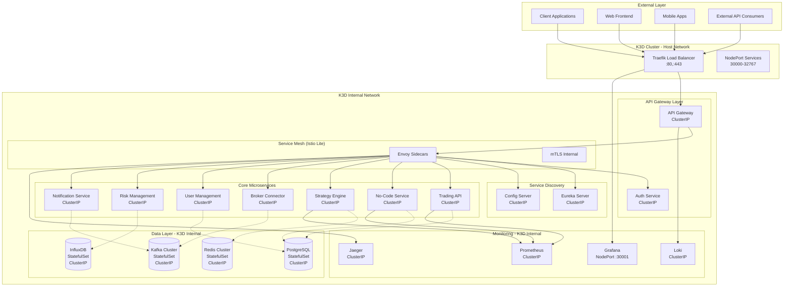

# Secure API Microservices Architecture for Alphintra Financial Platform

## 🎯 Executive Summary

This document outlines the comprehensive architecture for a secure, scalable API microservices infrastructure for the Alphintra financial trading platform. The current monolithic approach with scattered API endpoints and test files mixed with production code presents significant security and scalability risks for a financial application.

## 🚨 Current Architecture Issues

### Critical Problems Identified
1. **Security Vulnerabilities**
   - Test files and GraphQL resolvers mixed with production code
   - No centralized security enforcement
   - Direct service-to-service communication without proper authentication
   - Lack of proper API rate limiting and DDoS protection

2. **Scalability Limitations**
   - Each service implementing its own API layer
   - No service discovery mechanism
   - No load balancing or circuit breaker patterns
   - Inconsistent API contracts across services

3. **Operational Complexity**
   - Multiple entry points with different authentication mechanisms
   - No centralized logging or monitoring
   - Difficult to implement cross-cutting concerns
   - No proper service mesh for secure communication

## 🏗️ Proposed Secure Microservices Architecture for K3D Infrastructure



## 🐳 K3D Infrastructure Setup

### K3D Cluster Configuration

#### Create K3D Cluster with Optimal Settings
```bash
#!/bin/bash
# scripts/setup-k3d-cluster.sh

# Create k3d cluster with specific configuration for Alphintra
k3d cluster create alphintra-cluster \
  --api-port 6550 \
  --port "80:80@loadbalancer" \
  --port "443:443@loadbalancer" \
  --port "30001:30001@loadbalancer" \
  --agents 3 \
  --servers 1 \
  --k3s-arg "--disable=traefik@server:0" \
  --k3s-arg "--disable=metrics-server@server:0" \
  --volume "/tmp/k3d-registry:/var/lib/rancher/k3s/agent/etc/registries.d" \
  --registry-create k3d-registry.localhost:5000

# Wait for cluster to be ready
echo "Waiting for cluster to be ready..."
kubectl wait --for=condition=Ready nodes --all --timeout=300s

# Create namespaces
kubectl create namespace alphintra
kubectl create namespace alphintra-system
kubectl create namespace monitoring
kubectl create namespace istio-system

# Label namespaces for network policies
kubectl label namespace alphintra name=alphintra
kubectl label namespace alphintra-system name=alphintra-system
kubectl label namespace monitoring name=monitoring

echo "K3D cluster 'alphintra-cluster' created successfully!"
```

#### K3D Registry Configuration
```yaml
# k3d/registries.yaml
mirrors:
  "k3d-registry.localhost:5000":
    endpoint:
      - http://k3d-registry.localhost:5000
configs:
  "k3d-registry.localhost:5000":
    auth:
      username: "alphintra"
      password: "secure-registry-password"
    tls:
      insecure_skip_verify: true
```

### Internal Database Connections for K3D

#### PostgreSQL StatefulSet for K3D
```yaml
# k3d/databases/postgresql-cluster.yaml
apiVersion: v1
kind: ConfigMap
metadata:
  name: postgres-config
  namespace: alphintra
data:
  postgresql.conf: |
    # PostgreSQL configuration optimized for K3D
    listen_addresses = '*'
    port = 5432
    max_connections = 200
    shared_buffers = 256MB
    effective_cache_size = 1GB
    maintenance_work_mem = 64MB
    checkpoint_completion_target = 0.7
    wal_buffers = 16MB
    default_statistics_target = 100
    random_page_cost = 1.1
    effective_io_concurrency = 200
    
    # Logging
    log_destination = 'stderr'
    logging_collector = on
    log_directory = 'pg_log'
    log_filename = 'postgresql-%a.log'
    log_truncate_on_rotation = on
    log_rotation_age = 1d
    log_rotation_size = 100MB
    log_line_prefix = '%t [%p]: [%l-1] user=%u,db=%d,app=%a,client=%h '
    log_checkpoints = on
    log_connections = on
    log_disconnections = on
    log_lock_waits = on
    log_temp_files = 0
    
  pg_hba.conf: |
    # PostgreSQL Client Authentication Configuration
    local   all             all                                     trust
    host    all             all             127.0.0.1/32            scram-sha-256
    host    all             all             ::1/128                 scram-sha-256
    host    all             all             10.42.0.0/16            scram-sha-256
    host    all             all             172.20.0.0/16           scram-sha-256
    host    replication     all             10.42.0.0/16            scram-sha-256

---
apiVersion: v1
kind: Secret
metadata:
  name: postgres-credentials
  namespace: alphintra
type: Opaque
data:
  postgres-password: YWxwaGludHJhLXNlY3VyZS1wYXNzd29yZA== # alphintra-secure-password
  postgres-user: YWxwaGludHJh # alphintra
  postgres-db: YWxwaGludHJhX2Ri # alphintra_db

---
apiVersion: apps/v1
kind: StatefulSet
metadata:
  name: postgresql-primary
  namespace: alphintra
  labels:
    app: postgresql
    role: primary
spec:
  serviceName: postgresql-headless
  replicas: 1
  updateStrategy:
    type: RollingUpdate
  selector:
    matchLabels:
      app: postgresql
      role: primary
  template:
    metadata:
      labels:
        app: postgresql
        role: primary
    spec:
      securityContext:
        runAsUser: 999
        runAsGroup: 999
        fsGroup: 999
      containers:
      - name: postgresql
        image: postgres:15-alpine
        imagePullPolicy: IfNotPresent
        env:
        - name: POSTGRES_PASSWORD
          valueFrom:
            secretKeyRef:
              name: postgres-credentials
              key: postgres-password
        - name: POSTGRES_USER
          valueFrom:
            secretKeyRef:
              name: postgres-credentials
              key: postgres-user
        - name: POSTGRES_DB
          valueFrom:
            secretKeyRef:
              name: postgres-credentials
              key: postgres-db
        - name: PGDATA
          value: /var/lib/postgresql/data/pgdata
        ports:
        - name: postgresql
          containerPort: 5432
          protocol: TCP
        livenessProbe:
          exec:
            command:
            - /bin/sh
            - -c
            - pg_isready -U $POSTGRES_USER -d $POSTGRES_DB -h 127.0.0.1 -p 5432
          initialDelaySeconds: 30
          periodSeconds: 10
          timeoutSeconds: 5
          failureThreshold: 6
        readinessProbe:
          exec:
            command:
            - /bin/sh
            - -c
            - pg_isready -U $POSTGRES_USER -d $POSTGRES_DB -h 127.0.0.1 -p 5432
          initialDelaySeconds: 5
          periodSeconds: 10
          timeoutSeconds: 5
          failureThreshold: 6
        resources:
          requests:
            memory: "512Mi"
            cpu: "250m"
          limits:
            memory: "2Gi"
            cpu: "1000m"
        volumeMounts:
        - name: postgresql-data
          mountPath: /var/lib/postgresql/data
        - name: postgresql-config
          mountPath: /etc/postgresql
        - name: postgresql-init
          mountPath: /docker-entrypoint-initdb.d
      volumes:
      - name: postgresql-config
        configMap:
          name: postgres-config
      - name: postgresql-init
        configMap:
          name: postgres-init-scripts
  volumeClaimTemplates:
  - metadata:
      name: postgresql-data
    spec:
      accessModes: ["ReadWriteOnce"]
      storageClassName: local-path
      resources:
        requests:
          storage: 10Gi

---
apiVersion: v1
kind: Service
metadata:
  name: postgresql-primary
  namespace: alphintra
  labels:
    app: postgresql
    role: primary
spec:
  type: ClusterIP
  ports:
  - name: postgresql
    port: 5432
    targetPort: 5432
    protocol: TCP
  selector:
    app: postgresql
    role: primary

---
apiVersion: v1
kind: Service
metadata:
  name: postgresql-headless
  namespace: alphintra
  labels:
    app: postgresql
spec:
  type: ClusterIP
  clusterIP: None
  ports:
  - name: postgresql
    port: 5432
    targetPort: 5432
    protocol: TCP
  selector:
    app: postgresql
```

#### Database Connection Configuration for Microservices
```yaml
# k3d/databases/connection-config.yaml
apiVersion: v1
kind: ConfigMap
metadata:
  name: database-connection-config
  namespace: alphintra
data:
  # Database URLs for internal K3D networking
  postgresql_url: "jdbc:postgresql://postgresql-primary.alphintra.svc.cluster.local:5432/alphintra_db"
  redis_url: "redis://redis-cluster.alphintra.svc.cluster.local:6379"
  kafka_brokers: "kafka-cluster.alphintra.svc.cluster.local:9092"
  influxdb_url: "http://influxdb.alphintra.svc.cluster.local:8086"
  
  # Connection pool settings optimized for K3D
  connection_pool_config: |
    spring.datasource.hikari.maximum-pool-size=20
    spring.datasource.hikari.minimum-idle=5
    spring.datasource.hikari.connection-timeout=30000
    spring.datasource.hikari.idle-timeout=600000
    spring.datasource.hikari.max-lifetime=1800000
    spring.datasource.hikari.leak-detection-threshold=60000
    spring.datasource.hikari.pool-name=AlphintraHikariPool
    
    # Connection validation
    spring.datasource.hikari.validation-timeout=5000
    spring.datasource.hikari.connection-test-query=SELECT 1
    
    # K3D specific optimizations
    spring.datasource.hikari.data-source-properties.cachePrepStmts=true
    spring.datasource.hikari.data-source-properties.prepStmtCacheSize=250
    spring.datasource.hikari.data-source-properties.prepStmtCacheSqlLimit=2048
    spring.datasource.hikari.data-source-properties.useServerPrepStmts=true

---
apiVersion: v1
kind: ConfigMap
metadata:
  name: redis-cluster-config
  namespace: alphintra
data:
  redis.conf: |
    # Redis configuration for K3D cluster
    bind 0.0.0.0
    port 6379
    protected-mode no
    
    # Memory management
    maxmemory 512mb
    maxmemory-policy allkeys-lru
    
    # Persistence
    save 900 1
    save 300 10
    save 60 10000
    
    # Cluster settings
    cluster-enabled yes
    cluster-config-file nodes.conf
    cluster-node-timeout 5000
    cluster-announce-ip ${POD_IP}
    cluster-announce-port 6379
    cluster-announce-bus-port 16379
    
    # Security
    requirepass alphintra-redis-password
    
    # Logging
    loglevel notice
    logfile /var/log/redis/redis.log
```

#### Database Initialization Scripts
```yaml
# k3d/databases/init-scripts.yaml
apiVersion: v1
kind: ConfigMap
metadata:
  name: postgres-init-scripts
  namespace: alphintra
data:
  01-create-databases.sql: |
    -- Create databases for different services
    CREATE DATABASE alphintra_users;
    CREATE DATABASE alphintra_trading;
    CREATE DATABASE alphintra_strategies;
    CREATE DATABASE alphintra_audit;
    
    -- Create service-specific users
    CREATE USER user_service_user WITH PASSWORD 'secure-user-service-password';
    CREATE USER trading_service_user WITH PASSWORD 'secure-trading-service-password';
    CREATE USER strategy_service_user WITH PASSWORD 'secure-strategy-service-password';
    CREATE USER audit_service_user WITH PASSWORD 'secure-audit-service-password';
    
    -- Grant permissions
    GRANT ALL PRIVILEGES ON DATABASE alphintra_users TO user_service_user;
    GRANT ALL PRIVILEGES ON DATABASE alphintra_trading TO trading_service_user;
    GRANT ALL PRIVILEGES ON DATABASE alphintra_strategies TO strategy_service_user;
    GRANT ALL PRIVILEGES ON DATABASE alphintra_audit TO audit_service_user;
    
  02-create-schemas.sql: |
    -- Connect to users database
    \c alphintra_users;
    
    CREATE SCHEMA IF NOT EXISTS users;
    CREATE SCHEMA IF NOT EXISTS auth;
    CREATE SCHEMA IF NOT EXISTS profiles;
    
    -- Connect to trading database
    \c alphintra_trading;
    
    CREATE SCHEMA IF NOT EXISTS orders;
    CREATE SCHEMA IF NOT EXISTS portfolios;
    CREATE SCHEMA IF NOT EXISTS positions;
    CREATE SCHEMA IF NOT EXISTS risk;
    
    -- Connect to strategies database
    \c alphintra_strategies;
    
    CREATE SCHEMA IF NOT EXISTS strategies;
    CREATE SCHEMA IF NOT EXISTS workflows;
    CREATE SCHEMA IF NOT EXISTS backtests;
    CREATE SCHEMA IF NOT EXISTS marketplace;
    
    -- Connect to audit database
    \c alphintra_audit;
    
    CREATE SCHEMA IF NOT EXISTS audit_logs;
    CREATE SCHEMA IF NOT EXISTS compliance;
    CREATE SCHEMA IF NOT EXISTS security_events;
    
  03-create-extensions.sql: |
    -- Enable required PostgreSQL extensions
    \c alphintra_users;
    CREATE EXTENSION IF NOT EXISTS "uuid-ossp";
    CREATE EXTENSION IF NOT EXISTS "pgcrypto";
    CREATE EXTENSION IF NOT EXISTS "btree_gin";
    
    \c alphintra_trading;
    CREATE EXTENSION IF NOT EXISTS "uuid-ossp";
    CREATE EXTENSION IF NOT EXISTS "pgcrypto";
    CREATE EXTENSION IF NOT EXISTS "btree_gin";
    CREATE EXTENSION IF NOT EXISTS "timescaledb" CASCADE;
    
    \c alphintra_strategies;
    CREATE EXTENSION IF NOT EXISTS "uuid-ossp";
    CREATE EXTENSION IF NOT EXISTS "pgcrypto";
    CREATE EXTENSION IF NOT EXISTS "hstore";
    
    \c alphintra_audit;
    CREATE EXTENSION IF NOT EXISTS "uuid-ossp";
    CREATE EXTENSION IF NOT EXISTS "pgcrypto";
    CREATE EXTENSION IF NOT EXISTS "btree_gin";
```

## 📋 Architecture Components

### 1. K3D-Optimized API Gateway Layer

#### Spring Cloud Gateway for K3D
```yaml
# api-gateway/src/main/resources/application-k3d.yml
server:
  port: 8080
  # SSL terminated at Traefik level in K3D
  forward-headers-strategy: framework

spring:
  application:
    name: api-gateway
  profiles:
    active: k3d
  cloud:
    gateway:
      discovery:
        locator:
          enabled: true
          lower-case-service-id: true
      default-filters:
        - name: Retry
          args:
            retries: 3
            methods: GET,POST,PUT,DELETE
            backoff:
              firstBackoff: 100ms
              maxBackoff: 500ms
              factor: 2
        - name: CircuitBreaker
          args:
            name: defaultCircuitBreaker
            fallbackUri: forward:/fallback
            slidingWindowSize: 10
            minimumNumberOfCalls: 5
            failureRateThreshold: 50
        - name: RequestRateLimiter
          args:
            redis-rate-limiter.replenishRate: 100
            redis-rate-limiter.burstCapacity: 200
            redis-rate-limiter.requestedTokens: 1
            key-resolver: "#{@userKeyResolver}"
      routes:
        # Trading API Service
        - id: trading-api
          uri: http://trading-api-service.alphintra.svc.cluster.local:8080
          predicates:
            - Path=/api/trading/**
          filters:
            - name: AuthenticationFilter
            - name: RequestLogging
            - name: ResponseTime
            - StripPrefix=2
        
        # No-Code Service (Cleaned up)
        - id: no-code-service
          uri: http://no-code-service.alphintra.svc.cluster.local:8080
          predicates:
            - Path=/api/no-code/**
          filters:
            - name: AuthenticationFilter
            - name: RequestLogging
            - StripPrefix=2
        
        # Strategy Engine Service
        - id: strategy-engine
          uri: http://strategy-engine-service.alphintra.svc.cluster.local:8080
          predicates:
            - Path=/api/strategy/**
          filters:
            - name: AuthenticationFilter
            - name: RequestLogging
            - StripPrefix=2
        
        # User Management Service
        - id: user-management
          uri: http://user-management-service.alphintra.svc.cluster.local:8080
          predicates:
            - Path=/api/users/**
          filters:
            - name: AuthenticationFilter
            - name: RequestLogging
            - StripPrefix=2
        
        # Authentication Service (Public routes)
        - id: auth-service
          uri: http://auth-service.alphintra.svc.cluster.local:8080
          predicates:
            - Path=/api/auth/**
          filters:
            - name: RequestLogging
            - StripPrefix=2
        
        # GraphQL Federation Endpoint
        - id: graphql-federation
          uri: http://graphql-federation-service.alphintra.svc.cluster.local:8080
          predicates:
            - Path=/graphql/**
          filters:
            - name: AuthenticationFilter
            - name: RequestLogging

# K3D specific configurations
eureka:
  client:
    service-url:
      defaultZone: http://eureka-server.alphintra.svc.cluster.local:8761/eureka/
    fetch-registry: true
    register-with-eureka: true
    healthcheck:
      enabled: true
    lease:
      duration: 30
  instance:
    prefer-ip-address: false
    hostname: ${spring.application.name}
    instance-id: ${spring.application.name}:${server.port}
    health-check-url-path: /actuator/health
    status-page-url-path: /actuator/info

# Redis configuration for K3D cluster
spring:
  redis:
    host: redis-cluster.alphintra.svc.cluster.local
    port: 6379
    password: alphintra-redis-password
    timeout: 2000ms
    database: 0
    lettuce:
      pool:
        max-active: 8
        max-wait: -1ms
        max-idle: 8
        min-idle: 0

management:
  endpoints:
    web:
      exposure:
        include: health,info,metrics,prometheus,gateway
  endpoint:
    health:
      show-details: always
      probes:
        enabled: true
  health:
    livenessstate:
      enabled: true
    readinessstate:
      enabled: true
  metrics:
    export:
      prometheus:
        enabled: true
    tags:
      application: ${spring.application.name}
      cluster: k3d

logging:
  level:
    org.springframework.cloud.gateway: INFO
    com.alphintra: INFO
    io.github.resilience4j: DEBUG
  pattern:
    console: "%d{yyyy-MM-dd HH:mm:ss.SSS} [%thread] %-5level [%X{traceId:-},%X{spanId:-}] %logger{36} - %msg%n"

# K3D specific JVM optimizations
---
spring:
  config:
    activate:
      on-profile: k3d
      
# Reduce memory footprint for K3D
server:
  tomcat:
    threads:
      max: 50
      min-spare: 5
    max-connections: 200
    accept-count: 10

# Circuit breaker configuration for K3D
resilience4j:
  circuitbreaker:
    configs:
      default:
        slidingWindowSize: 10
        minimumNumberOfCalls: 5
        failureRateThreshold: 50
        waitDurationInOpenState: 10s
        permittedNumberOfCallsInHalfOpenState: 3
    instances:
      trading-api:
        baseConfig: default
      no-code-service:
        baseConfig: default
      strategy-engine:
        baseConfig: default
```

#### K3D API Gateway Deployment
```yaml
# k3d/gateway/api-gateway-deployment.yaml
apiVersion: apps/v1
kind: Deployment
metadata:
  name: api-gateway
  namespace: alphintra
  labels:
    app: api-gateway
    version: v1
spec:
  replicas: 2
  selector:
    matchLabels:
      app: api-gateway
      version: v1
  template:
    metadata:
      labels:
        app: api-gateway
        version: v1
      annotations:
        prometheus.io/scrape: "true"
        prometheus.io/port: "8080"
        prometheus.io/path: "/actuator/prometheus"
    spec:
      serviceAccountName: api-gateway-sa
      containers:
      - name: api-gateway
        image: k3d-registry.localhost:5000/alphintra/api-gateway:latest
        imagePullPolicy: Always
        ports:
        - containerPort: 8080
          name: http
        env:
        - name: SPRING_PROFILES_ACTIVE
          value: "k3d"
        - name: SPRING_REDIS_HOST
          value: "redis-cluster.alphintra.svc.cluster.local"
        - name: SPRING_REDIS_PASSWORD
          valueFrom:
            secretKeyRef:
              name: redis-credentials
              key: password
        - name: EUREKA_CLIENT_SERVICE_URL_DEFAULTZONE
          value: "http://eureka-server.alphintra.svc.cluster.local:8761/eureka/"
        - name: JWT_SECRET_KEY
          valueFrom:
            secretKeyRef:
              name: jwt-secrets
              key: secret-key
        - name: JAVA_OPTS
          value: "-Xms256m -Xmx512m -XX:+UseG1GC -XX:MaxGCPauseMillis=200"
        resources:
          requests:
            memory: "384Mi"
            cpu: "200m"
          limits:
            memory: "768Mi"
            cpu: "500m"
        livenessProbe:
          httpGet:
            path: /actuator/health/liveness
            port: 8080
          initialDelaySeconds: 60
          periodSeconds: 30
          timeoutSeconds: 10
          failureThreshold: 3
        readinessProbe:
          httpGet:
            path: /actuator/health/readiness
            port: 8080
          initialDelaySeconds: 30
          periodSeconds: 10
          timeoutSeconds: 5
          failureThreshold: 3
        volumeMounts:
        - name: config-volume
          mountPath: /config
          readOnly: true
      volumes:
      - name: config-volume
        configMap:
          name: api-gateway-config

---
apiVersion: v1
kind: Service
metadata:
  name: api-gateway
  namespace: alphintra
  labels:
    app: api-gateway
spec:
  selector:
    app: api-gateway
  ports:
  - name: http
    port: 8080
    targetPort: 8080
    protocol: TCP
  type: ClusterIP

---
apiVersion: v1
kind: ServiceAccount
metadata:
  name: api-gateway-sa
  namespace: alphintra

---
# Traefik IngressRoute for K3D
apiVersion: traefik.containo.us/v1alpha1
kind: IngressRoute
metadata:
  name: api-gateway-ingress
  namespace: alphintra
spec:
  entryPoints:
    - web
    - websecure
  routes:
  - match: Host(`api.alphintra.local`) || Host(`localhost`)
    kind: Rule
    services:
    - name: api-gateway
      port: 8080
  tls:
    secretName: alphintra-tls
```

#### Gateway Security Configuration
```java
// api-gateway/src/main/java/com/alphintra/gateway/config/SecurityConfig.java
@Configuration
@EnableWebFluxSecurity
@EnableReactiveMethodSecurity
public class SecurityConfig {
    
    @Autowired
    private JwtAuthenticationManager authenticationManager;
    
    @Autowired
    private SecurityContextRepository securityContextRepository;
    
    @Bean
    public SecurityWebFilterChain securityWebFilterChain(ServerHttpSecurity http) {
        return http
            .csrf().disable()
            .formLogin().disable()
            .httpBasic().disable()
            .authenticationManager(authenticationManager)
            .securityContextRepository(securityContextRepository)
            .authorizeExchange(exchanges -> exchanges
                .pathMatchers("/actuator/health", "/actuator/info").permitAll()
                .pathMatchers("/api/auth/login", "/api/auth/register").permitAll()
                .pathMatchers("/api/public/**").permitAll()
                .pathMatchers(HttpMethod.OPTIONS).permitAll()
                .pathMatchers("/api/admin/**").hasRole("ADMIN")
                .pathMatchers("/api/trading/**").hasAnyRole("TRADER", "ADMIN")
                .pathMatchers("/api/no-code/**").hasAnyRole("USER", "TRADER", "ADMIN")
                .anyExchange().authenticated()
            )
            .headers(headers -> headers
                .frameOptions().deny()
                .contentTypeOptions()
                .and()
                .httpStrictTransportSecurity(hsts -> hsts
                    .maxAgeInSeconds(31536000)
                    .includeSubdomains(true)
                )
            )
            .build();
    }
    
    @Bean
    public CorsConfigurationSource corsConfigurationSource() {
        CorsConfiguration configuration = new CorsConfiguration();
        configuration.setAllowedOriginPatterns(Arrays.asList("https://*.alphintra.com"));
        configuration.setAllowedMethods(Arrays.asList("GET", "POST", "PUT", "DELETE", "OPTIONS"));
        configuration.setAllowedHeaders(Arrays.asList("*"));
        configuration.setAllowCredentials(true);
        configuration.setMaxAge(3600L);
        
        UrlBasedCorsConfigurationSource source = new UrlBasedCorsConfigurationSource();
        source.registerCorsConfiguration("/**", configuration);
        return source;
    }
}
```

#### Custom Gateway Filters
```java
// api-gateway/src/main/java/com/alphintra/gateway/filter/AuthenticationFilter.java
@Component
public class AuthenticationFilter implements GlobalFilter, Ordered {
    
    @Autowired
    private JwtUtil jwtUtil;
    
    @Autowired
    private RedisTemplate<String, String> redisTemplate;
    
    @Override
    public Mono<Void> filter(ServerWebExchange exchange, GatewayFilterChain chain) {
        ServerHttpRequest request = exchange.getRequest();
        
        // Skip authentication for public endpoints
        if (isPublicEndpoint(request.getPath().value())) {
            return chain.filter(exchange);
        }
        
        String token = extractToken(request);
        if (token == null) {
            return handleUnauthorized(exchange);
        }
        
        return validateToken(token)
            .flatMap(claims -> {
                // Add user context to headers
                ServerHttpRequest mutatedRequest = request.mutate()
                    .header("X-User-Id", claims.getSubject())
                    .header("X-User-Roles", String.join(",", extractRoles(claims)))
                    .header("X-Correlation-Id", UUID.randomUUID().toString())
                    .build();
                
                return chain.filter(exchange.mutate().request(mutatedRequest).build());
            })
            .onErrorResume(ex -> handleUnauthorized(exchange));
    }
    
    private boolean isPublicEndpoint(String path) {
        List<String> publicPaths = Arrays.asList(
            "/api/auth/login",
            "/api/auth/register",
            "/api/public",
            "/actuator/health"
        );
        
        return publicPaths.stream().anyMatch(path::startsWith);
    }
    
    private String extractToken(ServerHttpRequest request) {
        String authHeader = request.getHeaders().getFirst("Authorization");
        if (authHeader != null && authHeader.startsWith("Bearer ")) {
            return authHeader.substring(7);
        }
        return null;
    }
    
    private Mono<Claims> validateToken(String token) {
        return Mono.fromCallable(() -> {
            // Check if token is blacklisted
            if (isTokenBlacklisted(token)) {
                throw new JwtException("Token is blacklisted");
            }
            
            return jwtUtil.parseToken(token);
        })
        .subscribeOn(Schedulers.boundedElastic());
    }
    
    private boolean isTokenBlacklisted(String token) {
        String tokenHash = DigestUtils.sha256Hex(token);
        return Boolean.TRUE.equals(redisTemplate.hasKey("blacklist:" + tokenHash));
    }
    
    private Mono<Void> handleUnauthorized(ServerWebExchange exchange) {
        ServerHttpResponse response = exchange.getResponse();
        response.setStatusCode(HttpStatus.UNAUTHORIZED);
        response.getHeaders().add("Content-Type", "application/json");
        
        String body = "{\"error\":\"Unauthorized\",\"message\":\"Invalid or missing authentication token\"}";
        DataBuffer buffer = response.bufferFactory().wrap(body.getBytes());
        return response.writeWith(Mono.just(buffer));
    }
    
    @Override
    public int getOrder() {
        return -100; // Execute before other filters
    }
}
```

### 2. Service Discovery with Eureka

#### Eureka Server Configuration
```java
// eureka-server/src/main/java/com/alphintra/eureka/EurekaServerApplication.java
@SpringBootApplication
@EnableEurekaServer
public class EurekaServerApplication {
    public static void main(String[] args) {
        SpringApplication.run(EurekaServerApplication.class, args);
    }
}
```

```yaml
# eureka-server/src/main/resources/application.yml
server:
  port: 8761

spring:
  application:
    name: eureka-server
  profiles:
    active: production

eureka:
  instance:
    hostname: eureka-server
    prefer-ip-address: true
    instance-id: ${spring.application.name}:${vcap.application.instance_id:${spring.application.instance_id:${random.value}}}
  client:
    register-with-eureka: false
    fetch-registry: false
    service-url:
      defaultZone: http://${eureka.instance.hostname}:${server.port}/eureka/
  server:
    enable-self-preservation: true
    eviction-interval-timer-in-ms: 10000
    renewal-percent-threshold: 0.85

management:
  endpoints:
    web:
      exposure:
        include: health,info,metrics,prometheus
  endpoint:
    health:
      show-details: always

logging:
  level:
    com.netflix.eureka: OFF
    com.netflix.discovery: OFF
```

#### Service Registration Configuration
```yaml
# Common service configuration for all microservices
eureka:
  client:
    service-url:
      defaultZone: http://eureka-server-1:8761/eureka/,http://eureka-server-2:8762/eureka/
    fetch-registry: true
    register-with-eureka: true
    registry-fetch-interval-seconds: 10
  instance:
    prefer-ip-address: true
    lease-renewal-interval-in-seconds: 10
    lease-expiration-duration-in-seconds: 30
    instance-id: ${spring.application.name}:${vcap.application.instance_id:${spring.application.instance_id:${random.value}}}
    metadata-map:
      version: ${project.version:1.0.0}
      git-commit: ${git.commit.id.abbrev:unknown}
      build-time: ${maven.build.timestamp:unknown}

spring:
  cloud:
    loadbalancer:
      retry:
        enabled: true
      health-check:
        initial-delay: 1000ms
        interval: 5000ms
```

### 3. Istio Service Mesh Configuration

#### Istio Installation and Setup
```bash
#!/bin/bash
# scripts/install-istio.sh

# Download and install Istio
curl -L https://istio.io/downloadIstio | sh -
cd istio-*
export PATH=$PWD/bin:$PATH

# Install Istio with custom configuration for financial security
istioctl install --set values.pilot.traceSampling=100.0 --set values.global.meshConfig.defaultConfig.proxyStatsMatcher.inclusionRegexps=".*outlier_detection.*,.*circuit_breaker.*,.*upstream_rq_retry.*,.*_cx_.*" -y

# Enable automatic sidecar injection for alphintra namespace
kubectl label namespace alphintra istio-injection=enabled

# Apply strict mTLS policy
kubectl apply -f - <<EOF
apiVersion: security.istio.io/v1beta1
kind: PeerAuthentication
metadata:
  name: default
  namespace: alphintra
spec:
  mtls:
    mode: STRICT
EOF
```

#### Service Mesh Security Policies
```yaml
# k8s/istio/security-policies.yaml
apiVersion: security.istio.io/v1beta1
kind: AuthorizationPolicy
metadata:
  name: alphintra-authz
  namespace: alphintra
spec:
  selector:
    matchLabels:
      app: trading-api
  rules:
  - from:
    - source:
        principals: ["cluster.local/ns/alphintra/sa/api-gateway"]
    to:
    - operation:
        methods: ["GET", "POST", "PUT", "DELETE"]
    when:
    - key: request.headers[x-user-id]
      values: ["*"]

---
apiVersion: security.istio.io/v1beta1
kind: AuthorizationPolicy
metadata:
  name: deny-all-default
  namespace: alphintra
spec:
  {} # This denies all traffic by default

---
apiVersion: networking.istio.io/v1beta1
kind: DestinationRule
metadata:
  name: trading-api-circuit-breaker
  namespace: alphintra
spec:
  host: trading-api-service
  trafficPolicy:
    outlierDetection:
      consecutiveErrors: 3
      interval: 30s
      baseEjectionTime: 30s
      maxEjectionPercent: 50
    connectionPool:
      tcp:
        maxConnections: 100
      http:
        http1MaxPendingRequests: 50
        maxRequestsPerConnection: 10
        consecutiveGatewayErrors: 3
        interval: 30s
        baseEjectionTime: 30s

---
apiVersion: networking.istio.io/v1beta1
kind: VirtualService
metadata:
  name: trading-api-vs
  namespace: alphintra
spec:
  hosts:
  - trading-api-service
  http:
  - match:
    - headers:
        x-user-id:
          regex: ".*"
    route:
    - destination:
        host: trading-api-service
        subset: v1
    timeout: 30s
    retries:
      attempts: 3
      perTryTimeout: 10s
      retryOn: 5xx,reset,connect-failure,refused-stream
  - fault:
      abort:
        percentage:
          value: 0.1
        httpStatus: 503
```

#### Network Policies for Zero Trust
```yaml
# k8s/network-policies/deny-all.yaml
apiVersion: networking.k8s.io/v1
kind: NetworkPolicy
metadata:
  name: deny-all-ingress
  namespace: alphintra
spec:
  podSelector: {}
  policyTypes:
  - Ingress
  - Egress

---
apiVersion: networking.k8s.io/v1
kind: NetworkPolicy
metadata:
  name: allow-api-gateway-to-services
  namespace: alphintra
spec:
  podSelector:
    matchLabels:
      tier: backend
  policyTypes:
  - Ingress
  ingress:
  - from:
    - podSelector:
        matchLabels:
          app: api-gateway
    ports:
    - protocol: TCP
      port: 8080

---
apiVersion: networking.k8s.io/v1
kind: NetworkPolicy
metadata:
  name: allow-database-access
  namespace: alphintra
spec:
  podSelector:
    matchLabels:
      app: postgresql
  policyTypes:
  - Ingress
  ingress:
  - from:
    - podSelector:
        matchLabels:
          database-client: "true"
    ports:
    - protocol: TCP
      port: 5432
```

### 4. Unified API Specification

#### GraphQL Federation Setup
```java
// graphql-federation/src/main/java/com/alphintra/graphql/GraphQLFederationConfig.java
@Configuration
public class GraphQLFederationConfig {
    
    @Bean
    public GraphQL graphQL() {
        return GraphQL.newGraphQL(buildFederatedSchema())
            .fieldVisibility(NoIntrospectionGraphqlFieldVisibility.NO_INTROSPECTION_FIELD_VISIBILITY)
            .build();
    }
    
    private GraphQLSchema buildFederatedSchema() {
        TypeDefinitionRegistry registry = new TypeDefinitionRegistry();
        
        // Load schemas from all services
        registry.merge(loadSchemaFromService("trading-api"));
        registry.merge(loadSchemaFromService("no-code-service"));
        registry.merge(loadSchemaFromService("user-service"));
        
        RuntimeWiring wiring = RuntimeWiring.newRuntimeWiring()
            .type("Query", builder -> builder
                .dataFetcher("user", userDataFetcher())
                .dataFetcher("trading", tradingDataFetcher())
                .dataFetcher("strategies", strategiesDataFetcher())
            )
            .type("Mutation", builder -> builder
                .dataFetcher("createStrategy", createStrategyDataFetcher())
                .dataFetcher("executeTrade", executeTradeDataFetcher())
            )
            .build();
        
        return new SchemaGenerator().makeExecutableSchema(registry, wiring);
    }
    
    @Bean
    public DataFetcher<User> userDataFetcher() {
        return environment -> {
            String userId = environment.getArgument("id");
            return userServiceClient.getUser(userId);
        };
    }
}
```

#### Unified API Schema
```graphql
# api-schema/schema.graphql
scalar DateTime
scalar BigDecimal
scalar JSON

directive @auth(requires: [Role!]!) on FIELD_DEFINITION
directive @rateLimit(limit: Int!, window: Int!) on FIELD_DEFINITION

enum Role {
  USER
  TRADER
  ADMIN
  DEVELOPER
}

type Query {
  # User Management
  user(id: ID!): User @auth(requires: [USER])
  users(filter: UserFilter): [User!]! @auth(requires: [ADMIN])
  
  # Trading Operations
  portfolio(userId: ID!): Portfolio @auth(requires: [TRADER])
  positions(userId: ID!): [Position!]! @auth(requires: [TRADER])
  orders(userId: ID!, filter: OrderFilter): [Order!]! @auth(requires: [TRADER])
  
  # Strategy Management
  strategies(userId: ID!): [Strategy!]! @auth(requires: [USER])
  strategy(id: ID!): Strategy @auth(requires: [USER])
  marketplaceStrategies(filter: StrategyFilter): [MarketplaceStrategy!]!
  
  # Market Data
  quote(symbol: String!): Quote @rateLimit(limit: 100, window: 60)
  historicalData(symbol: String!, timeframe: String!, limit: Int): [OHLCV!]!
}

type Mutation {
  # Authentication
  login(input: LoginInput!): AuthPayload!
  register(input: RegisterInput!): AuthPayload!
  refreshToken(token: String!): AuthPayload!
  logout: Boolean! @auth(requires: [USER])
  
  # Trading Operations
  placeOrder(input: OrderInput!): OrderResult! @auth(requires: [TRADER])
  cancelOrder(orderId: ID!): Boolean! @auth(requires: [TRADER])
  modifyOrder(orderId: ID!, input: OrderModificationInput!): OrderResult! @auth(requires: [TRADER])
  
  # Strategy Management
  createStrategy(input: StrategyInput!): Strategy! @auth(requires: [USER])
  updateStrategy(id: ID!, input: StrategyUpdateInput!): Strategy! @auth(requires: [USER])
  deleteStrategy(id: ID!): Boolean! @auth(requires: [USER])
  publishStrategy(id: ID!): MarketplaceStrategy! @auth(requires: [USER])
  
  # No-Code Builder
  saveWorkflow(input: WorkflowInput!): Workflow! @auth(requires: [USER])
  compileWorkflow(id: ID!): CompilationResult! @auth(requires: [USER])
  deployWorkflow(id: ID!): DeploymentResult! @auth(requires: [USER])
}

type Subscription {
  orderUpdates(userId: ID!): OrderUpdate! @auth(requires: [TRADER])
  portfolioUpdates(userId: ID!): PortfolioUpdate! @auth(requires: [TRADER])
  marketData(symbols: [String!]!): MarketDataUpdate!
  strategyPerformance(strategyId: ID!): PerformanceUpdate! @auth(requires: [USER])
}

# Core Types
type User {
  id: ID!
  email: String!
  username: String!
  profile: UserProfile!
  roles: [Role!]!
  createdAt: DateTime!
  lastLoginAt: DateTime
  isVerified: Boolean!
  kycStatus: KYCStatus!
}

type Portfolio {
  id: ID!
  userId: ID!
  totalValue: BigDecimal!
  availableBalance: BigDecimal!
  positions: [Position!]!
  performance: PerformanceMetrics!
  updatedAt: DateTime!
}

type Strategy {
  id: ID!
  name: String!
  description: String
  userId: ID!
  type: StrategyType!
  configuration: JSON!
  status: StrategyStatus!
  performance: PerformanceMetrics
  createdAt: DateTime!
  updatedAt: DateTime!
}

type Order {
  id: ID!
  userId: ID!
  symbol: String!
  side: OrderSide!
  type: OrderType!
  quantity: BigDecimal!
  price: BigDecimal
  status: OrderStatus!
  filledQuantity: BigDecimal!
  averagePrice: BigDecimal
  createdAt: DateTime!
  updatedAt: DateTime!
}

# Input Types
input LoginInput {
  email: String!
  password: String!
  rememberMe: Boolean = false
}

input OrderInput {
  symbol: String!
  side: OrderSide!
  type: OrderType!
  quantity: BigDecimal!
  price: BigDecimal
  stopPrice: BigDecimal
  timeInForce: TimeInForce = GTC
}

input StrategyInput {
  name: String!
  description: String
  type: StrategyType!
  configuration: JSON!
}

input WorkflowInput {
  name: String!
  description: String
  nodes: [WorkflowNodeInput!]!
  connections: [WorkflowConnectionInput!]!
}

# Enums
enum StrategyType {
  ALGORITHMIC
  NO_CODE
  SIGNAL_BASED
  COPY_TRADING
}

enum OrderSide {
  BUY
  SELL
}

enum OrderType {
  MARKET
  LIMIT
  STOP
  STOP_LIMIT
}

enum OrderStatus {
  PENDING
  OPEN
  FILLED
  CANCELLED
  REJECTED
}

enum KYCStatus {
  PENDING
  VERIFIED
  REJECTED
  EXPIRED
}
```

### 5. Security Implementation

#### JWT Security Service
```java
// shared-security/src/main/java/com/alphintra/security/JwtSecurityService.java
@Service
public class JwtSecurityService {
    
    private final RSAKey rsaKey;
    private final JWKSet jwkSet;
    private final RedisTemplate<String, String> redisTemplate;
    
    public JwtSecurityService() throws Exception {
        // Generate RSA key pair for JWT signing
        KeyPairGenerator keyPairGenerator = KeyPairGenerator.getInstance("RSA");
        keyPairGenerator.initialize(2048);
        KeyPair keyPair = keyPairGenerator.generateKeyPair();
        
        this.rsaKey = new RSAKey.Builder((RSAPublicKey) keyPair.getPublic())
            .privateKey((RSAPrivateKey) keyPair.getPrivate())
            .keyID(UUID.randomUUID().toString())
            .keyUse(KeyUse.SIGNATURE)
            .algorithm(JWSAlgorithm.RS256)
            .build();
        
        this.jwkSet = new JWKSet(rsaKey);
    }
    
    public String generateAccessToken(User user) {
        Instant now = Instant.now();
        
        JWTClaimsSet claims = new JWTClaimsSet.Builder()
            .subject(user.getId().toString())
            .issuer("https://api.alphintra.com")
            .audience("alphintra-services")
            .issueTime(Date.from(now))
            .expirationTime(Date.from(now.plus(15, ChronoUnit.MINUTES)))
            .claim("username", user.getUsername())
            .claim("email", user.getEmail())
            .claim("roles", user.getRoles().stream()
                .map(Role::name)
                .collect(Collectors.toList()))
            .claim("permissions", extractPermissions(user))
            .claim("session_id", UUID.randomUUID().toString())
            .build();
        
        try {
            SignedJWT signedJWT = new SignedJWT(
                new JWSHeader.Builder(JWSAlgorithm.RS256)
                    .keyID(rsaKey.getKeyID())
                    .build(),
                claims
            );
            
            signedJWT.sign(new RSASSASigner(rsaKey));
            return signedJWT.serialize();
            
        } catch (JOSEException e) {
            throw new SecurityException("Failed to generate JWT token", e);
        }
    }
    
    public String generateRefreshToken(User user) {
        String refreshToken = UUID.randomUUID().toString();
        String key = "refresh_token:" + user.getId();
        
        // Store refresh token in Redis with 30-day expiration
        redisTemplate.opsForValue().set(key, refreshToken, Duration.ofDays(30));
        
        return refreshToken;
    }
    
    public Claims validateToken(String token) {
        try {
            SignedJWT signedJWT = SignedJWT.parse(token);
            
            // Verify signature
            RSASSAVerifier verifier = new RSASSAVerifier(rsaKey);
            if (!signedJWT.verify(verifier)) {
                throw new SecurityException("Invalid JWT signature");
            }
            
            JWTClaimsSet claims = signedJWT.getJWTClaimsSet();
            
            // Check expiration
            if (claims.getExpirationTime().before(new Date())) {
                throw new SecurityException("JWT token has expired");
            }
            
            // Check if token is blacklisted
            String tokenHash = DigestUtils.sha256Hex(token);
            if (Boolean.TRUE.equals(redisTemplate.hasKey("blacklist:" + tokenHash))) {
                throw new SecurityException("JWT token is blacklisted");
            }
            
            return convertToClaims(claims);
            
        } catch (Exception e) {
            throw new SecurityException("Failed to validate JWT token", e);
        }
    }
    
    public void blacklistToken(String token) {
        try {
            SignedJWT signedJWT = SignedJWT.parse(token);
            JWTClaimsSet claims = signedJWT.getJWTClaimsSet();
            
            String tokenHash = DigestUtils.sha256Hex(token);
            Duration ttl = Duration.between(
                Instant.now(),
                claims.getExpirationTime().toInstant()
            );
            
            if (ttl.isPositive()) {
                redisTemplate.opsForValue().set("blacklist:" + tokenHash, "true", ttl);
            }
            
        } catch (Exception e) {
            log.error("Failed to blacklist token", e);
        }
    }
    
    public JWKSet getJwkSet() {
        return jwkSet;
    }
    
    private List<String> extractPermissions(User user) {
        return user.getRoles().stream()
            .flatMap(role -> getPermissionsForRole(role).stream())
            .distinct()
            .collect(Collectors.toList());
    }
    
    private List<String> getPermissionsForRole(Role role) {
        Map<Role, List<String>> rolePermissions = Map.of(
            Role.USER, List.of("READ_PROFILE", "CREATE_STRATEGY", "VIEW_MARKETPLACE"),
            Role.TRADER, List.of("READ_PROFILE", "CREATE_STRATEGY", "VIEW_MARKETPLACE", 
                               "PLACE_ORDER", "VIEW_PORTFOLIO", "MANAGE_POSITIONS"),
            Role.ADMIN, List.of("*") // All permissions
        );
        
        return rolePermissions.getOrDefault(role, List.of());
    }
}
```

#### Rate Limiting Implementation
```java
// shared-security/src/main/java/com/alphintra/security/RateLimitingService.java
@Service
public class RateLimitingService {
    
    private final RedisTemplate<String, String> redisTemplate;
    private final RedisScript<List<Long>> rateLimitScript;
    
    public RateLimitingService(RedisTemplate<String, String> redisTemplate) {
        this.redisTemplate = redisTemplate;
        this.rateLimitScript = loadRateLimitScript();
    }
    
    public boolean isAllowed(String key, int limit, Duration window) {
        List<String> keys = Collections.singletonList(key);
        List<String> args = Arrays.asList(
            String.valueOf(limit),
            String.valueOf(window.getSeconds()),
            String.valueOf(Instant.now().getEpochSecond())
        );
        
        List<Long> result = redisTemplate.execute(rateLimitScript, keys, args.toArray());
        
        if (result == null || result.isEmpty()) {
            return false;
        }
        
        return result.get(0) == 1L;
    }
    
    public RateLimitInfo getRateLimitInfo(String key, int limit, Duration window) {
        String countKey = key + ":count";
        String windowKey = key + ":window";
        
        String countStr = redisTemplate.opsForValue().get(countKey);
        String windowStr = redisTemplate.opsForValue().get(windowKey);
        
        int currentCount = countStr != null ? Integer.parseInt(countStr) : 0;
        long windowStart = windowStr != null ? Long.parseLong(windowStr) : 0;
        
        long currentTime = Instant.now().getEpochSecond();
        long windowEnd = windowStart + window.getSeconds();
        long resetTime = Math.max(0, windowEnd - currentTime);
        
        return RateLimitInfo.builder()
            .limit(limit)
            .remaining(Math.max(0, limit - currentCount))
            .resetTime(resetTime)
            .retryAfter(currentCount >= limit ? resetTime : 0)
            .build();
    }
    
    private RedisScript<List<Long>> loadRateLimitScript() {
        String script = """
            local key = KEYS[1]
            local limit = tonumber(ARGV[1])
            local window = tonumber(ARGV[2])
            local current_time = tonumber(ARGV[3])
            
            local count_key = key .. ':count'
            local window_key = key .. ':window'
            
            local window_start = redis.call('GET', window_key)
            if not window_start then
                window_start = current_time
                redis.call('SET', window_key, window_start)
                redis.call('EXPIRE', window_key, window)
            else
                window_start = tonumber(window_start)
            end
            
            if current_time >= window_start + window then
                redis.call('SET', window_key, current_time)
                redis.call('SET', count_key, 0)
                redis.call('EXPIRE', window_key, window)
                redis.call('EXPIRE', count_key, window)
                window_start = current_time
            end
            
            local current_count = redis.call('GET', count_key)
            if not current_count then
                current_count = 0
            else
                current_count = tonumber(current_count)
            end
            
            if current_count < limit then
                redis.call('INCR', count_key)
                redis.call('EXPIRE', count_key, window)
                return {1, current_count + 1}
            else
                return {0, current_count}
            end
            """;
        
        DefaultRedisScript<List<Long>> redisScript = new DefaultRedisScript<>();
        redisScript.setScriptText(script);
        redisScript.setResultType(List.class);
        return redisScript;
    }
}
```

### 6. Microservices Refactoring for K3D

#### Service Decomposition Strategy with Database Separation
```markdown
## Current Monolithic Structure Issues:
1. No-code-service contains test files and mixed responsibilities
2. All services sharing single database connection
3. No service boundaries or proper data isolation
4. Test files like test_*.py mixed with production code

## Proposed K3D Microservices Structure:

### Core Services with Dedicated Database Schemas:
1. **User Management Service** - alphintra_users DB
   - Authentication, authorization, user profiles
   - KYC/AML compliance data
   - User preferences and settings

2. **Trading Engine Service** - alphintra_trading DB  
   - Order management, execution
   - Portfolio tracking, positions
   - Risk assessments

3. **Strategy Engine Service** - alphintra_strategies DB
   - Strategy execution, backtesting
   - Performance analytics
   - Strategy marketplace

4. **No-Code Builder Service** - alphintra_strategies DB (workflows schema)
   - Visual workflow builder (CLEANED - no test files)
   - Strategy compilation and deployment
   - Template management

5. **Market Data Service** - InfluxDB time-series
   - Real-time quotes, historical data
   - Technical indicators
   - Data aggregation

6. **Risk Management Service** - alphintra_trading DB (risk schema)
   - Risk assessment, VaR calculations
   - Compliance monitoring
   - Alert management

7. **Notification Service** - alphintra_users DB (notifications schema)
   - Email, SMS, push notifications
   - Alert delivery
   - Communication preferences

8. **Audit Service** - alphintra_audit DB
   - All system activity logging
   - Compliance audit trails
   - Security event tracking

### Supporting Services:
1. **Config Service** - Spring Cloud Config
2. **Discovery Service** - Eureka Server
3. **Gateway Service** - Spring Cloud Gateway
4. **Monitoring Service** - Prometheus + Grafana
```

#### Database Connection Architecture for Each Service
```java
// Example: Trading Engine Service Database Configuration
// trading-engine/src/main/resources/application-k3d.yml
spring:
  application:
    name: trading-engine-service
  profiles:
    active: k3d
  datasource:
    # Dedicated database connection for trading service
    url: jdbc:postgresql://postgresql-primary.alphintra.svc.cluster.local:5432/alphintra_trading
    username: trading_service_user
    password: ${TRADING_DB_PASSWORD}
    driver-class-name: org.postgresql.Driver
    hikari:
      pool-name: TradingServiceHikariPool
      maximum-pool-size: 15
      minimum-idle: 3
      connection-timeout: 30000
      idle-timeout: 300000
      max-lifetime: 900000
      leak-detection-threshold: 60000
      connection-test-query: SELECT 1
      data-source-properties:
        cachePrepStmts: true
        prepStmtCacheSize: 250
        prepStmtCacheSqlLimit: 2048
        useServerPrepStmts: true
        useLocalSessionState: true
        rewriteBatchedStatements: true

  jpa:
    hibernate:
      ddl-auto: validate
      naming:
        physical-strategy: org.springframework.boot.orm.jpa.hibernate.SpringPhysicalNamingStrategy
    show-sql: false
    properties:
      hibernate:
        dialect: org.hibernate.dialect.PostgreSQLDialect
        jdbc:
          batch_size: 20
        order_inserts: true
        order_updates: true
        jdbc.batch_versioned_data: true
        format_sql: false
        default_schema: orders

# Service-specific Redis configuration
  redis:
    host: redis-cluster.alphintra.svc.cluster.local
    port: 6379
    password: ${REDIS_PASSWORD}
    database: 1  # Dedicated database for trading service
    timeout: 2000ms
    lettuce:
      pool:
        max-active: 10
        max-wait: -1ms
        max-idle: 5
        min-idle: 2

# Eureka registration for K3D
eureka:
  client:
    service-url:
      defaultZone: http://eureka-server.alphintra.svc.cluster.local:8761/eureka/
  instance:
    prefer-ip-address: false
    hostname: trading-engine-service
    instance-id: trading-engine-service:${server.port}
    health-check-url-path: /actuator/health

# Service-specific port
server:
  port: 8081
```

#### Cleaned No-Code Service Structure
```bash
#!/bin/bash
# scripts/cleanup-no-code-service.sh

echo "Cleaning up no-code service from test files and production code separation..."

# Create proper service structure
mkdir -p src/backend/services/no-code-builder/src/main/java/com/alphintra/nocode
mkdir -p src/backend/services/no-code-builder/src/test/java/com/alphintra/nocode
mkdir -p src/backend/services/no-code-builder/src/main/resources

# Remove all test files from production directory
echo "Removing test files from production code..."
rm -f src/backend/no-code-service/test_*.py
rm -f src/backend/no-code-service/simple_test_server.py
rm -f src/backend/no-code-service/test_integration.py
rm -f src/backend/no-code-service/test_backend.py
rm -f src/backend/no-code-service/test_db_connection.py
rm -f src/backend/no-code-service/test_server.py
rm -f src/backend/no-code-service/test_strategy.py

# Move production code to proper service structure
echo "Moving production code to proper microservice structure..."
mv src/backend/no-code-service/workflow_compiler.py src/backend/services/no-code-builder/src/main/python/
mv src/backend/no-code-service/graphql_*.py src/backend/services/no-code-builder/src/main/python/
mv src/backend/no-code-service/models.py src/backend/services/no-code-builder/src/main/python/
mv src/backend/no-code-service/schemas.py src/backend/services/no-code-builder/src/main/python/

# Create proper Spring Boot structure for no-code service
cat > src/backend/services/no-code-builder/pom.xml << 'EOF'
<?xml version="1.0" encoding="UTF-8"?>
<project xmlns="http://maven.apache.org/POM/4.0.0">
    <modelVersion>4.0.0</modelVersion>
    
    <parent>
        <groupId>org.springframework.boot</groupId>
        <artifactId>spring-boot-starter-parent</artifactId>
        <version>3.2.0</version>
        <relativePath/>
    </parent>
    
    <groupId>com.alphintra</groupId>
    <artifactId>no-code-builder</artifactId>
    <version>1.0.0</version>
    <packaging>jar</packaging>
    
    <name>No-Code Builder Service</name>
    <description>Visual workflow builder and strategy compilation service</description>
    
    <dependencies>
        <dependency>
            <groupId>org.springframework.boot</groupId>
            <artifactId>spring-boot-starter-web</artifactId>
        </dependency>
        <dependency>
            <groupId>org.springframework.boot</groupId>
            <artifactId>spring-boot-starter-data-jpa</artifactId>
        </dependency>
        <dependency>
            <groupId>org.springframework.cloud</groupId>
            <artifactId>spring-cloud-starter-netflix-eureka-client</artifactId>
        </dependency>
        <dependency>
            <groupId>org.postgresql</groupId>
            <artifactId>postgresql</artifactId>
        </dependency>
        <dependency>
            <groupId>org.springframework.boot</groupId>
            <artifactId>spring-boot-starter-actuator</artifactId>
        </dependency>
        <dependency>
            <groupId>io.micrometer</groupId>
            <artifactId>micrometer-registry-prometheus</artifactId>
        </dependency>
    </dependencies>
</project>
EOF

echo "No-code service cleanup completed!"
```

#### Service-Specific Database Connection Examples
```yaml
# k3d/services/database-connections.yaml
---
# User Management Service Configuration
apiVersion: v1
kind: ConfigMap
metadata:
  name: user-management-db-config
  namespace: alphintra
data:
  application.yml: |
    spring:
      datasource:
        url: jdbc:postgresql://postgresql-primary.alphintra.svc.cluster.local:5432/alphintra_users
        username: user_service_user
        password: ${USER_DB_PASSWORD}
        hikari:
          pool-name: UserServicePool
          maximum-pool-size: 10
          default-schema: users
      redis:
        database: 0  # User sessions and cache

---
# Strategy Engine Service Configuration  
apiVersion: v1
kind: ConfigMap
metadata:
  name: strategy-engine-db-config
  namespace: alphintra
data:
  application.yml: |
    spring:
      datasource:
        url: jdbc:postgresql://postgresql-primary.alphintra.svc.cluster.local:5432/alphintra_strategies
        username: strategy_service_user
        password: ${STRATEGY_DB_PASSWORD}
        hikari:
          pool-name: StrategyServicePool
          maximum-pool-size: 12
          default-schema: strategies
      redis:
        database: 2  # Strategy cache and backtests

---
# No-Code Builder Service Configuration (CLEANED)
apiVersion: v1
kind: ConfigMap
metadata:
  name: no-code-builder-db-config
  namespace: alphintra
data:
  application.yml: |
    spring:
      datasource:
        url: jdbc:postgresql://postgresql-primary.alphintra.svc.cluster.local:5432/alphintra_strategies
        username: strategy_service_user
        password: ${STRATEGY_DB_PASSWORD}
        hikari:
          pool-name: NoCodeBuilderPool
          maximum-pool-size: 8
          default-schema: workflows
      redis:
        database: 3  # Workflow compilation cache

---
# Audit Service Configuration
apiVersion: v1
kind: ConfigMap
metadata:
  name: audit-service-db-config
  namespace: alphintra
data:
  application.yml: |
    spring:
      datasource:
        url: jdbc:postgresql://postgresql-primary.alphintra.svc.cluster.local:5432/alphintra_audit
        username: audit_service_user
        password: ${AUDIT_DB_PASSWORD}
        hikari:
          pool-name: AuditServicePool
          maximum-pool-size: 5
          default-schema: audit_logs
      redis:
        database: 4  # Audit event buffering
```

#### Migration Script for Service Separation
```bash
#!/bin/bash
# scripts/migrate-to-microservices.sh

echo "Starting microservices migration..."

# Create new service directories
mkdir -p src/backend/services/{user-management,trading-engine,strategy-engine,no-code-builder,market-data,risk-management,notification,audit}
mkdir -p src/backend/infrastructure/{config-server,eureka-server,api-gateway,monitoring}
mkdir -p src/backend/shared/{security,common,dto}

# Move and reorganize existing code
echo "Reorganizing existing services..."

# Extract user management from existing services
extract_user_service() {
    mkdir -p src/backend/services/user-management/src/main/java/com/alphintra/user
    # Move user-related code here
}

# Extract trading functionality
extract_trading_service() {
    mkdir -p src/backend/services/trading-engine/src/main/java/com/alphintra/trading
    # Move trading-related code here
}

# Clean up no-code service
cleanup_no_code_service() {
    # Remove test files from production
    rm -f src/backend/no-code-service/test_*.py
    rm -f src/backend/no-code-service/simple_test_server.py
    
    # Move to proper service structure
    mkdir -p src/backend/services/no-code-builder/src/main/python/com/alphintra/nocode
    mv src/backend/no-code-service/workflow_compiler.py src/backend/services/no-code-builder/src/main/python/com/alphintra/nocode/
    mv src/backend/no-code-service/graphql_*.py src/backend/services/no-code-builder/src/main/python/com/alphintra/nocode/
}

# Create shared libraries
create_shared_libraries() {
    mkdir -p src/backend/shared/security/src/main/java/com/alphintra/security
    mkdir -p src/backend/shared/common/src/main/java/com/alphintra/common
    mkdir -p src/backend/shared/dto/src/main/java/com/alphintra/dto
}

# Execute migration steps
extract_user_service
extract_trading_service
cleanup_no_code_service
create_shared_libraries

echo "Microservices migration completed."
```

### 7. Deployment and Infrastructure

#### Kubernetes Deployment Configuration
```yaml
# k8s/services/api-gateway-deployment.yaml
apiVersion: apps/v1
kind: Deployment
metadata:
  name: api-gateway
  namespace: alphintra
  labels:
    app: api-gateway
    version: v1
spec:
  replicas: 3
  selector:
    matchLabels:
      app: api-gateway
      version: v1
  template:
    metadata:
      labels:
        app: api-gateway
        version: v1
      annotations:
        sidecar.istio.io/inject: "true"
        prometheus.io/scrape: "true"
        prometheus.io/port: "8080"
        prometheus.io/path: "/actuator/prometheus"
    spec:
      serviceAccountName: api-gateway
      securityContext:
        runAsNonRoot: true
        runAsUser: 1000
        fsGroup: 1000
      containers:
      - name: api-gateway
        image: alphintra/api-gateway:${VERSION}
        imagePullPolicy: Always
        ports:
        - containerPort: 8080
          name: http
        env:
        - name: SPRING_PROFILES_ACTIVE
          value: "kubernetes"
        - name: EUREKA_CLIENT_SERVICE_URL_DEFAULTZONE
          value: "http://eureka-server:8761/eureka/"
        - name: SPRING_REDIS_HOST
          value: "redis-cluster"
        - name: JWT_SIGNING_KEY
          valueFrom:
            secretKeyRef:
              name: jwt-secrets
              key: signing-key
        resources:
          requests:
            memory: "512Mi"
            cpu: "250m"
          limits:
            memory: "1Gi"
            cpu: "500m"
        livenessProbe:
          httpGet:
            path: /actuator/health/liveness
            port: 8080
          initialDelaySeconds: 60
          periodSeconds: 30
          timeoutSeconds: 10
          failureThreshold: 3
        readinessProbe:
          httpGet:
            path: /actuator/health/readiness
            port: 8080
          initialDelaySeconds: 30
          periodSeconds: 10
          timeoutSeconds: 5
          failureThreshold: 3
        securityContext:
          allowPrivilegeEscalation: false
          capabilities:
            drop:
            - ALL
          readOnlyRootFilesystem: true

---
apiVersion: v1
kind: Service
metadata:
  name: api-gateway
  namespace: alphintra
  labels:
    app: api-gateway
spec:
  selector:
    app: api-gateway
  ports:
  - name: http
    port: 80
    targetPort: 8080
    protocol: TCP
  type: ClusterIP

---
apiVersion: autoscaling/v2
kind: HorizontalPodAutoscaler
metadata:
  name: api-gateway-hpa
  namespace: alphintra
spec:
  scaleTargetRef:
    apiVersion: apps/v1
    kind: Deployment
    name: api-gateway
  minReplicas: 3
  maxReplicas: 10
  metrics:
  - type: Resource
    resource:
      name: cpu
      target:
        type: Utilization
        averageUtilization: 70
  - type: Resource
    resource:
      name: memory
      target:
        type: Utilization
        averageUtilization: 80
```

#### Helm Chart Structure
```yaml
# helm/alphintra-platform/Chart.yaml
apiVersion: v2
name: alphintra-platform
description: Secure Financial Trading Platform
type: application
version: 1.0.0
appVersion: "1.0.0"
dependencies:
  - name: postgresql
    version: 12.1.9
    repository: https://charts.bitnami.com/bitnami
  - name: redis
    version: 17.4.3
    repository: https://charts.bitnami.com/bitnami
  - name: kafka
    version: 20.0.6
    repository: https://charts.bitnami.com/bitnami
  - name: istio-base
    version: 1.17.2
    repository: https://istio-release.storage.googleapis.com/charts
  - name: istiod
    version: 1.17.2
    repository: https://istio-release.storage.googleapis.com/charts

# helm/alphintra-platform/values.yaml
global:
  imageRegistry: "alphintra"
  storageClass: "fast-ssd"
  
api-gateway:
  image:
    repository: alphintra/api-gateway
    tag: "1.0.0"
    pullPolicy: Always
  replicaCount: 3
  resources:
    requests:
      memory: "512Mi"
      cpu: "250m"
    limits:
      memory: "1Gi"
      cpu: "500m"
  
eureka-server:
  image:
    repository: alphintra/eureka-server
    tag: "1.0.0"
  replicaCount: 2
  
trading-engine:
  image:
    repository: alphintra/trading-engine
    tag: "1.0.0"
  replicaCount: 3
  
postgresql:
  auth:
    postgresPassword: "secure-postgres-password"
    database: "alphintra"
  primary:
    persistence:
      size: 20Gi
      storageClass: "fast-ssd"
  metrics:
    enabled: true
    
redis:
  auth:
    password: "secure-redis-password"
  cluster:
    enabled: true
    nodes: 6
  persistence:
    size: 8Gi
    storageClass: "fast-ssd"
    
kafka:
  auth:
    clientProtocol: "SASL_SSL"
  persistence:
    size: 10Gi
    storageClass: "fast-ssd"
  zookeeper:
    persistence:
      size: 8Gi
      storageClass: "fast-ssd"

istio:
  pilot:
    traceSampling: 100.0
  global:
    meshConfig:
      defaultConfig:
        holdApplicationUntilProxyStarts: true
        proxyStatsMatcher:
          inclusionRegexps:
          - ".*outlier_detection.*"
          - ".*circuit_breaker.*"
          - ".*upstream_rq_retry.*"
```

### 8. Monitoring and Observability

#### Prometheus Configuration
```yaml
# monitoring/prometheus-config.yaml
global:
  scrape_interval: 15s
  evaluation_interval: 15s

rule_files:
  - "/etc/prometheus/rules/*.yml"

alerting:
  alertmanagers:
    - static_configs:
        - targets:
          - alertmanager:9093

scrape_configs:
  - job_name: 'api-gateway'
    kubernetes_sd_configs:
      - role: endpoints
        namespaces:
          names:
            - alphintra
    relabel_configs:
      - source_labels: [__meta_kubernetes_service_name]
        action: keep
        regex: api-gateway
      - source_labels: [__meta_kubernetes_endpoint_port_name]
        action: keep
        regex: http
    metrics_path: /actuator/prometheus
    
  - job_name: 'trading-engine'
    kubernetes_sd_configs:
      - role: endpoints
        namespaces:
          names:
            - alphintra
    relabel_configs:
      - source_labels: [__meta_kubernetes_service_name]
        action: keep
        regex: trading-engine
    metrics_path: /actuator/prometheus
    
  - job_name: 'istio-mesh'
    kubernetes_sd_configs:
      - role: endpoints
        namespaces:
          names:
            - istio-system
            - alphintra
    relabel_configs:
      - source_labels: [__meta_kubernetes_service_name, __meta_kubernetes_endpoint_port_name]
        action: keep
        regex: istio-proxy;http-monitoring
```

#### Custom Alerts for Financial Systems
```yaml
# monitoring/alerts.yml
groups:
  - name: financial-trading-alerts
    rules:
    - alert: HighErrorRate
      expr: rate(http_requests_total{status=~"5.."}[5m]) > 0.01
      for: 2m
      labels:
        severity: critical
      annotations:
        summary: "High error rate detected"
        description: "Error rate is {{ $value }} for {{ $labels.instance }}"
        
    - alert: TradingLatencyHigh
      expr: histogram_quantile(0.95, rate(http_request_duration_seconds_bucket{job="trading-engine"}[5m])) > 0.5
      for: 1m
      labels:
        severity: warning
      annotations:
        summary: "Trading API latency is high"
        description: "95th percentile latency is {{ $value }}s"
        
    - alert: JWTTokenValidationFailure
      expr: increase(jwt_validation_failures_total[5m]) > 10
      for: 1m
      labels:
        severity: critical
      annotations:
        summary: "High JWT validation failures"
        description: "{{ $value }} JWT validation failures in the last 5 minutes"
        
    - alert: UnauthorizedAccessAttempts
      expr: increase(http_requests_total{status="401"}[5m]) > 50
      for: 2m
      labels:
        severity: warning
      annotations:
        summary: "High number of unauthorized access attempts"
        description: "{{ $value }} unauthorized attempts in the last 5 minutes"
        
    - alert: DatabaseConnectionPoolExhaustion
      expr: hikari_connections_active / hikari_connections_max > 0.9
      for: 2m
      labels:
        severity: critical
      annotations:
        summary: "Database connection pool near exhaustion"
        description: "Connection pool utilization is {{ $value }}"
```

## 🚀 Implementation Timeline

### Phase 1: Infrastructure Setup (Weeks 1-3)
- [ ] Set up Kubernetes cluster with Istio service mesh
- [ ] Deploy Eureka service discovery
- [ ] Implement API Gateway with Spring Cloud Gateway
- [ ] Set up monitoring stack (Prometheus, Grafana, Jaeger)

### Phase 2: Security Implementation (Weeks 4-6)
- [ ] Implement JWT security service with RSA signing
- [ ] Set up mTLS between services via Istio
- [ ] Implement rate limiting and DDoS protection
- [ ] Create comprehensive authorization policies

### Phase 3: Service Refactoring (Weeks 7-10)
- [ ] Extract microservices from existing monolith
- [ ] Clean up test files from production code
- [ ] Implement service-to-service communication patterns
- [ ] Create shared libraries for common functionality

### Phase 4: API Unification (Weeks 11-13)
- [ ] Implement GraphQL federation
- [ ] Create unified API schema
- [ ] Implement API versioning strategy
- [ ] Add comprehensive API documentation

### Phase 5: Testing & Deployment (Weeks 14-16)
- [ ] End-to-end testing of complete system
- [ ] Performance testing and optimization
- [ ] Security penetration testing
- [ ] Production deployment and monitoring setup

## 📊 Success Metrics

### Security Metrics
- **Zero security incidents** during and after migration
- **100% mTLS coverage** for service-to-service communication
- **Sub-100ms JWT validation** performance
- **99.9% uptime** for authentication services

### Performance Metrics
- **Sub-50ms API Gateway latency** (95th percentile)
- **Support for 10,000+ concurrent users**
- **Auto-scaling response time** under 30 seconds
- **Circuit breaker activation** under 1% of requests

### Operational Metrics
- **Zero test files in production** deployments
- **Centralized logging** for all services
- **Complete distributed tracing** coverage
- **Automated failover** within 30 seconds

This comprehensive architecture provides a secure, scalable foundation for the Alphintra financial platform, addressing all the critical issues with the current implementation while establishing best practices for financial-grade microservices.