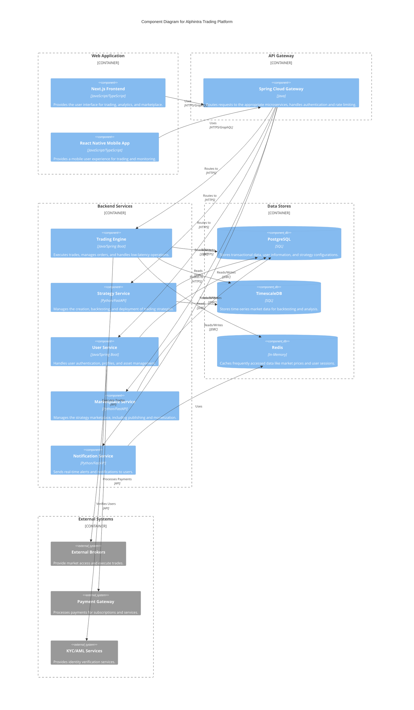

```mermaid
C4Component
    title Component Diagram for Alphintra Trading Platform

    Container_Boundary(web_app, "Web Application") {
        Component(next_js, "Next.js Frontend", "JavaScript/TypeScript", "Provides the user interface for trading, analytics, and marketplace.")
        Component(react_native, "React Native Mobile App", "JavaScript/TypeScript", "Provides a mobile user experience for trading and monitoring.")
    }

    Container_Boundary(api_gateway, "API Gateway") {
        Component(spring_gateway, "Spring Cloud Gateway", "Java", "Routes requests to the appropriate microservices, handles authentication and rate limiting.")
    }

    Container_Boundary(backend, "Backend Services") {
        Component(trading_engine, "Trading Engine", "Java/Spring Boot", "Executes trades, manages orders, and handles low-latency operations.")
        Component(strategy_service, "Strategy Service", "Python/FastAPI", "Manages the creation, backtesting, and deployment of trading strategies.")
        Component(user_service, "User Service", "Java/Spring Boot", "Handles user authentication, profiles, and asset management.")
        Component(marketplace_service, "Marketplace Service", "Python/FastAPI", "Manages the strategy marketplace, including publishing and monetization.")
        Component(notification_service, "Notification Service", "Python/FastAPI", "Sends real-time alerts and notifications to users.")
    }

    Container_Boundary(data_stores, "Data Stores") {
        ComponentDb(postgres, "PostgreSQL", "SQL", "Stores transactional data, user information, and strategy configurations.")
        ComponentDb(timescaledb, "TimescaleDB", "SQL", "Stores time-series market data for backtesting and analysis.")
        ComponentDb(redis, "Redis", "In-Memory", "Caches frequently accessed data like market prices and user sessions.")
    }

    Container_Boundary(external_systems, "External Systems") {
        System_Ext(brokers, "External Brokers", "Provide market access and execute trades.")
        System_Ext(payment_gateway, "Payment Gateway", "Processes payments for subscriptions and services.")
        System_Ext(kyc_aml, "KYC/AML Services", "Provides identity verification services.")
    }

    Rel(next_js, spring_gateway, "Uses", "HTTPS/GraphQL")
    Rel(react_native, spring_gateway, "Uses", "HTTPS/GraphQL")

    Rel(spring_gateway, trading_engine, "Routes to", "HTTPS")
    Rel(spring_gateway, strategy_service, "Routes to", "HTTPS")
    Rel(spring_gateway, user_service, "Routes to", "HTTPS")
    Rel(spring_gateway, marketplace_service, "Routes to", "HTTPS")
    Rel(spring_gateway, notification_service, "Routes to", "HTTPS")

    Rel(trading_engine, postgres, "Reads/Writes", "JDBC")
    Rel(trading_engine, timescaledb, "Reads", "JDBC")
    Rel(trading_engine, redis, "Reads/Writes", "")
    Rel(trading_engine, brokers, "Executes Trades", "API")

    Rel(strategy_service, postgres, "Reads/Writes", "JDBC")
    Rel(strategy_service, timescaledb, "Reads", "JDBC")

    Rel(user_service, postgres, "Reads/Writes", "JDBC")
    Rel(user_service, payment_gateway, "Processes Payments", "API")
    Rel(user_service, kyc_aml, "Verifies Users", "API")

    Rel(marketplace_service, postgres, "Reads/Writes", "JDBC")

    Rel(notification_service, redis, "Uses", "")
```
