# Alphintra Database Architecture Plan

## 1. Introduction

This document outlines the comprehensive database architecture for the Alphintra trading platform, leveraging Google Cloud Platform's managed database services. The architecture is designed to support high-performance trading operations, real-time data processing, machine learning workloads, and compliance requirements while ensuring scalability, security, and reliability.

## 2. Database Technology Stack

### 2.1 Primary Databases
- **Google Cloud SQL PostgreSQL 15**: Primary transactional database for business logic
- **TimescaleDB on Google Cloud**: Time-series database for market data and analytics
- **Redis (Cloud Memorystore)**: In-memory caching and session storage
- **Google Cloud Storage**: Object storage for files, ML models, and backups

### 2.2 Supporting Technologies
- **Elasticsearch on Google Cloud**: Full-text search for marketplace
- **Google Cloud Bigtable**: High-performance NoSQL for real-time analytics (future)
- **Google Cloud Firestore**: Real-time notifications and presence (optional)

## 3. Database Architecture Overview

### 3.1 Multi-Database Strategy

```
┌─────────────────┐    ┌─────────────────┐    ┌─────────────────┐
│   PostgreSQL    │    │   TimescaleDB   │    │      Redis      │
│  (Transactional)│    │  (Time-Series)  │    │   (Caching)     │
├─────────────────┤    ├─────────────────┤    ├─────────────────┤
│ • User Data     │    │ • Market Data   │    │ • Sessions      │
│ • Orders        │    │ • Price History │    │ • Rate Limits   │
│ • Strategies    │    │ • Trade Metrics │    │ • Real-time     │
│ • Compliance    │    │ • System Logs   │    │   Cache         │
│ • Marketplace   │    │ • Analytics     │    │ • Queue Data    │
└─────────────────┘    └─────────────────┘    └─────────────────┘
          │                       │                       │
          └───────────────────────┼───────────────────────┘
                                  │
                    ┌─────────────────┐
                    │ Cloud Storage   │
                    │   (Objects)     │
                    ├─────────────────┤
                    │ • ML Models     │
                    │ • Datasets      │
                    │ • Documents     │
                    │ • Backups       │
                    │ • Logs Archive  │
                    └─────────────────┘
```

## 4. PostgreSQL Database Design

### 4.1 Database Instances

**Primary Database**: `alphintra-main-db`
- **Engine**: PostgreSQL 15
- **Configuration**: High Availability (HA) with regional persistent disks
- **Storage**: 1TB SSD (auto-scaling enabled)
- **Machine Type**: db-custom-4-16384 (4 vCPU, 16GB RAM)
- **Backup**: Automated daily backups with 30-day retention

**Read Replicas**: `alphintra-read-replica-{region}`
- **Purpose**: Read-only queries, reporting, analytics
- **Configuration**: Cross-region replicas for disaster recovery

### 4.2 Core Database Schema

```sql
-- ==============================================
-- USERS & AUTHENTICATION SCHEMA
-- ==============================================

-- Users table (central user management)
CREATE TABLE users (
    id UUID PRIMARY KEY DEFAULT gen_random_uuid(),
    email VARCHAR(255) UNIQUE NOT NULL,
    password_hash VARCHAR(255) NOT NULL,
    first_name VARCHAR(100),
    last_name VARCHAR(100),
    phone_number VARCHAR(20),
    country_code VARCHAR(3),
    timezone VARCHAR(50) DEFAULT 'UTC',
    language VARCHAR(10) DEFAULT 'en',
    kyc_status VARCHAR(20) DEFAULT 'PENDING' CHECK (kyc_status IN ('PENDING', 'IN_PROGRESS', 'APPROVED', 'REJECTED')),
    kyc_level INTEGER DEFAULT 0,
    two_fa_enabled BOOLEAN DEFAULT FALSE,
    two_fa_secret VARCHAR(255),
    email_verified BOOLEAN DEFAULT FALSE,
    phone_verified BOOLEAN DEFAULT FALSE,
    last_login TIMESTAMP,
    login_attempts INTEGER DEFAULT 0,
    locked_until TIMESTAMP,
    created_at TIMESTAMP DEFAULT NOW(),
    updated_at TIMESTAMP DEFAULT NOW()
);

-- User roles and permissions
CREATE TABLE roles (
    id SERIAL PRIMARY KEY,
    name VARCHAR(50) UNIQUE NOT NULL,
    description TEXT,
    created_at TIMESTAMP DEFAULT NOW()
);

CREATE TABLE permissions (
    id SERIAL PRIMARY KEY,
    name VARCHAR(100) UNIQUE NOT NULL,
    resource VARCHAR(50) NOT NULL,
    action VARCHAR(50) NOT NULL,
    description TEXT
);

CREATE TABLE role_permissions (
    role_id INTEGER REFERENCES roles(id) ON DELETE CASCADE,
    permission_id INTEGER REFERENCES permissions(id) ON DELETE CASCADE,
    PRIMARY KEY (role_id, permission_id)
);

CREATE TABLE user_roles (
    user_id UUID REFERENCES users(id) ON DELETE CASCADE,
    role_id INTEGER REFERENCES roles(id) ON DELETE CASCADE,
    assigned_at TIMESTAMP DEFAULT NOW(),
    assigned_by UUID REFERENCES users(id),
    PRIMARY KEY (user_id, role_id)
);

-- ==============================================
-- TRADING SCHEMA
-- ==============================================

-- Orders table
CREATE TABLE orders (
    id BIGSERIAL PRIMARY KEY,
    user_id UUID REFERENCES users(id) NOT NULL,
    strategy_id UUID,
    broker_id VARCHAR(50),
    external_order_id VARCHAR(100),
    symbol VARCHAR(20) NOT NULL,
    order_type VARCHAR(20) NOT NULL CHECK (order_type IN ('MARKET', 'LIMIT', 'STOP', 'STOP_LIMIT')),
    side VARCHAR(4) NOT NULL CHECK (side IN ('BUY', 'SELL')),
    quantity DECIMAL(20,8) NOT NULL,
    price DECIMAL(20,8),
    stop_price DECIMAL(20,8),
    filled_quantity DECIMAL(20,8) DEFAULT 0,
    average_fill_price DECIMAL(20,8),
    status VARCHAR(20) DEFAULT 'PENDING' CHECK (status IN ('PENDING', 'PARTIAL', 'FILLED', 'CANCELLED', 'REJECTED', 'EXPIRED')),
    time_in_force VARCHAR(10) DEFAULT 'GTC' CHECK (time_in_force IN ('GTC', 'IOC', 'FOK', 'DAY')),
    source VARCHAR(20) DEFAULT 'MANUAL' CHECK (source IN ('MANUAL', 'STRATEGY', 'API')),
    fees DECIMAL(20,8) DEFAULT 0,
    commission DECIMAL(20,8) DEFAULT 0,
    created_at TIMESTAMP DEFAULT NOW(),
    updated_at TIMESTAMP DEFAULT NOW(),
    expires_at TIMESTAMP,
    
    INDEX idx_orders_user_id (user_id),
    INDEX idx_orders_symbol (symbol),
    INDEX idx_orders_status (status),
    INDEX idx_orders_created_at (created_at)
);

-- Trades table
CREATE TABLE trades (
    id BIGSERIAL PRIMARY KEY,
    order_id BIGINT REFERENCES orders(id) NOT NULL,
    user_id UUID REFERENCES users(id) NOT NULL,
    external_trade_id VARCHAR(100),
    symbol VARCHAR(20) NOT NULL,
    side VARCHAR(4) NOT NULL,
    quantity DECIMAL(20,8) NOT NULL,
    price DECIMAL(20,8) NOT NULL,
    commission DECIMAL(20,8) DEFAULT 0,
    fees DECIMAL(20,8) DEFAULT 0,
    fee_currency VARCHAR(10),
    trade_type VARCHAR(20) DEFAULT 'REGULAR' CHECK (trade_type IN ('REGULAR', 'PAPER', 'BACKTEST')),
    executed_at TIMESTAMP DEFAULT NOW(),
    
    INDEX idx_trades_user_id (user_id),
    INDEX idx_trades_symbol (symbol),
    INDEX idx_trades_executed_at (executed_at)
);

-- Positions table
CREATE TABLE positions (
    id BIGSERIAL PRIMARY KEY,
    user_id UUID REFERENCES users(id) NOT NULL,
    symbol VARCHAR(20) NOT NULL,
    side VARCHAR(4) CHECK (side IN ('LONG', 'SHORT')),
    quantity DECIMAL(20,8) NOT NULL,
    average_price DECIMAL(20,8) NOT NULL,
    market_value DECIMAL(20,8),
    unrealized_pnl DECIMAL(20,8) DEFAULT 0,
    realized_pnl DECIMAL(20,8) DEFAULT 0,
    total_fees DECIMAL(20,8) DEFAULT 0,
    position_type VARCHAR(20) DEFAULT 'LIVE' CHECK (position_type IN ('LIVE', 'PAPER')),
    opened_at TIMESTAMP DEFAULT NOW(),
    updated_at TIMESTAMP DEFAULT NOW(),
    
    UNIQUE(user_id, symbol, position_type),
    INDEX idx_positions_user_id (user_id),
    INDEX idx_positions_symbol (symbol)
);

-- ==============================================
-- ASSET MANAGEMENT SCHEMA
-- ==============================================

-- User wallets/balances
CREATE TABLE wallets (
    id UUID PRIMARY KEY DEFAULT gen_random_uuid(),
    user_id UUID REFERENCES users(id) NOT NULL,
    currency VARCHAR(10) NOT NULL,
    balance DECIMAL(20,8) DEFAULT 0,
    available_balance DECIMAL(20,8) DEFAULT 0,
    locked_balance DECIMAL(20,8) DEFAULT 0,
    wallet_type VARCHAR(20) DEFAULT 'TRADING' CHECK (wallet_type IN ('TRADING', 'PAPER', 'SAVINGS')),
    created_at TIMESTAMP DEFAULT NOW(),
    updated_at TIMESTAMP DEFAULT NOW(),
    
    UNIQUE(user_id, currency, wallet_type),
    INDEX idx_wallets_user_id (user_id)
);

-- Transactions (deposits, withdrawals, transfers)
CREATE TABLE transactions (
    id UUID PRIMARY KEY DEFAULT gen_random_uuid(),
    user_id UUID REFERENCES users(id) NOT NULL,
    wallet_id UUID REFERENCES wallets(id),
    type VARCHAR(20) NOT NULL CHECK (type IN ('DEPOSIT', 'WITHDRAWAL', 'TRANSFER', 'TRADE', 'FEE', 'COMMISSION')),
    currency VARCHAR(10) NOT NULL,
    amount DECIMAL(20,8) NOT NULL,
    fee DECIMAL(20,8) DEFAULT 0,
    status VARCHAR(20) DEFAULT 'PENDING' CHECK (status IN ('PENDING', 'PROCESSING', 'COMPLETED', 'FAILED', 'CANCELLED')),
    external_id VARCHAR(255),
    reference_id VARCHAR(255),
    description TEXT,
    metadata JSONB,
    created_at TIMESTAMP DEFAULT NOW(),
    updated_at TIMESTAMP DEFAULT NOW(),
    
    INDEX idx_transactions_user_id (user_id),
    INDEX idx_transactions_type (type),
    INDEX idx_transactions_status (status),
    INDEX idx_transactions_created_at (created_at)
);

-- ==============================================
-- STRATEGY & AI/ML SCHEMA
-- ==============================================

-- Strategies table
CREATE TABLE strategies (
    id UUID PRIMARY KEY DEFAULT gen_random_uuid(),
    user_id UUID REFERENCES users(id) NOT NULL,
    name VARCHAR(255) NOT NULL,
    description TEXT,
    type VARCHAR(20) NOT NULL CHECK (type IN ('CODE_BASED', 'NO_CODE', 'TEMPLATE')),
    category VARCHAR(50),
    version VARCHAR(20) DEFAULT '1.0.0',
    code TEXT, -- Python code for code-based strategies
    blocks JSONB, -- Visual blocks for no-code strategies
    parameters JSONB, -- Strategy parameters
    risk_settings JSONB, -- Risk management settings
    status VARCHAR(20) DEFAULT 'DRAFT' CHECK (status IN ('DRAFT', 'TESTING', 'ACTIVE', 'PAUSED', 'ARCHIVED')),
    is_public BOOLEAN DEFAULT FALSE,
    is_template BOOLEAN DEFAULT FALSE,
    template_id UUID REFERENCES strategies(id),
    created_at TIMESTAMP DEFAULT NOW(),
    updated_at TIMESTAMP DEFAULT NOW(),
    
    INDEX idx_strategies_user_id (user_id),
    INDEX idx_strategies_type (type),
    INDEX idx_strategies_status (status),
    INDEX idx_strategies_public (is_public)
);

-- Strategy instances (deployed bots)
CREATE TABLE strategy_instances (
    id UUID PRIMARY KEY DEFAULT gen_random_uuid(),
    strategy_id UUID REFERENCES strategies(id) NOT NULL,
    user_id UUID REFERENCES users(id) NOT NULL,
    name VARCHAR(255) NOT NULL,
    allocated_capital DECIMAL(20,8),
    current_capital DECIMAL(20,8),
    max_positions INTEGER DEFAULT 5,
    risk_limit_percent DECIMAL(5,2) DEFAULT 5.00,
    status VARCHAR(20) DEFAULT 'STOPPED' CHECK (status IN ('RUNNING', 'STOPPED', 'PAUSED', 'ERROR')),
    instance_type VARCHAR(20) DEFAULT 'LIVE' CHECK (instance_type IN ('LIVE', 'PAPER')),
    started_at TIMESTAMP,
    stopped_at TIMESTAMP,
    created_at TIMESTAMP DEFAULT NOW(),
    updated_at TIMESTAMP DEFAULT NOW(),
    
    INDEX idx_strategy_instances_user_id (user_id),
    INDEX idx_strategy_instances_strategy_id (strategy_id),
    INDEX idx_strategy_instances_status (status)
);

-- Backtest results
CREATE TABLE backtest_results (
    id UUID PRIMARY KEY DEFAULT gen_random_uuid(),
    strategy_id UUID REFERENCES strategies(id) NOT NULL,
    user_id UUID REFERENCES users(id) NOT NULL,
    dataset_id VARCHAR(100) NOT NULL,
    start_date DATE NOT NULL,
    end_date DATE NOT NULL,
    initial_capital DECIMAL(20,8) NOT NULL,
    final_capital DECIMAL(20,8) NOT NULL,
    total_trades INTEGER DEFAULT 0,
    winning_trades INTEGER DEFAULT 0,
    losing_trades INTEGER DEFAULT 0,
    win_rate DECIMAL(5,4),
    profit_factor DECIMAL(10,6),
    sharpe_ratio DECIMAL(10,6),
    sortino_ratio DECIMAL(10,6),
    max_drawdown DECIMAL(5,4),
    max_drawdown_duration INTEGER, -- in days
    total_return DECIMAL(10,6),
    annual_return DECIMAL(10,6),
    volatility DECIMAL(10,6),
    beta DECIMAL(10,6),
    alpha DECIMAL(10,6),
    avg_trade_duration INTEGER, -- in minutes
    largest_win DECIMAL(20,8),
    largest_loss DECIMAL(20,8),
    metrics JSONB, -- Additional metrics
    parameters JSONB, -- Strategy parameters used
    created_at TIMESTAMP DEFAULT NOW(),
    
    INDEX idx_backtest_results_strategy_id (strategy_id),
    INDEX idx_backtest_results_user_id (user_id),
    INDEX idx_backtest_results_created_at (created_at)
);

-- ML Training jobs
CREATE TABLE training_jobs (
    id UUID PRIMARY KEY DEFAULT gen_random_uuid(),
    strategy_id UUID REFERENCES strategies(id) NOT NULL,
    user_id UUID REFERENCES users(id) NOT NULL,
    job_name VARCHAR(255) NOT NULL,
    job_type VARCHAR(50) NOT NULL,
    dataset_id VARCHAR(100),
    parameters JSONB,
    compute_config JSONB,
    status VARCHAR(20) DEFAULT 'PENDING' CHECK (status IN ('PENDING', 'RUNNING', 'COMPLETED', 'FAILED', 'CANCELLED')),
    progress INTEGER DEFAULT 0,
    logs_url TEXT,
    model_artifacts JSONB,
    metrics JSONB,
    credits_consumed DECIMAL(10,2) DEFAULT 0,
    started_at TIMESTAMP,
    completed_at TIMESTAMP,
    created_at TIMESTAMP DEFAULT NOW(),
    
    INDEX idx_training_jobs_user_id (user_id),
    INDEX idx_training_jobs_strategy_id (strategy_id),
    INDEX idx_training_jobs_status (status)
);

-- ==============================================
-- MARKETPLACE SCHEMA
-- ==============================================

-- Marketplace listings
CREATE TABLE marketplace_strategies (
    id UUID PRIMARY KEY DEFAULT gen_random_uuid(),
    strategy_id UUID REFERENCES strategies(id) NOT NULL,
    developer_id UUID REFERENCES users(id) NOT NULL,
    title VARCHAR(255) NOT NULL,
    short_description VARCHAR(500),
    long_description TEXT,
    category VARCHAR(100),
    tags TEXT[], -- Array of tags
    price_model VARCHAR(20) DEFAULT 'FREE' CHECK (price_model IN ('FREE', 'REVENUE_SHARE', 'FIXED')),
    price DECIMAL(10,2),
    revenue_share_percent DECIMAL(5,2),
    performance_metrics JSONB,
    minimum_capital DECIMAL(20,8),
    risk_level VARCHAR(20) CHECK (risk_level IN ('LOW', 'MEDIUM', 'HIGH', 'VERY_HIGH')),
    supported_markets TEXT[], -- Array of supported markets
    supported_timeframes TEXT[], -- Array of supported timeframes
    version VARCHAR(20) DEFAULT '1.0.0',
    status VARCHAR(20) DEFAULT 'DRAFT' CHECK (status IN ('DRAFT', 'PENDING_REVIEW', 'APPROVED', 'REJECTED', 'SUSPENDED')),
    downloads_count INTEGER DEFAULT 0,
    average_rating DECIMAL(3,2) DEFAULT 0,
    reviews_count INTEGER DEFAULT 0,
    published_at TIMESTAMP,
    created_at TIMESTAMP DEFAULT NOW(),
    updated_at TIMESTAMP DEFAULT NOW(),
    
    INDEX idx_marketplace_strategies_developer_id (developer_id),
    INDEX idx_marketplace_strategies_category (category),
    INDEX idx_marketplace_strategies_status (status),
    INDEX idx_marketplace_strategies_rating (average_rating)
);

-- Strategy reviews and ratings
CREATE TABLE strategy_reviews (
    id UUID PRIMARY KEY DEFAULT gen_random_uuid(),
    marketplace_strategy_id UUID REFERENCES marketplace_strategies(id) NOT NULL,
    user_id UUID REFERENCES users(id) NOT NULL,
    rating INTEGER NOT NULL CHECK (rating >= 1 AND rating <= 5),
    title VARCHAR(255),
    content TEXT,
    is_verified_purchase BOOLEAN DEFAULT FALSE,
    helpful_votes INTEGER DEFAULT 0,
    created_at TIMESTAMP DEFAULT NOW(),
    updated_at TIMESTAMP DEFAULT NOW(),
    
    UNIQUE(marketplace_strategy_id, user_id),
    INDEX idx_strategy_reviews_marketplace_strategy_id (marketplace_strategy_id),
    INDEX idx_strategy_reviews_rating (rating)
);

-- Developer profiles
CREATE TABLE developer_profiles (
    user_id UUID PRIMARY KEY REFERENCES users(id),
    display_name VARCHAR(100),
    bio TEXT,
    website_url VARCHAR(255),
    github_url VARCHAR(255),
    linkedin_url VARCHAR(255),
    total_strategies INTEGER DEFAULT 0,
    total_downloads INTEGER DEFAULT 0,
    average_rating DECIMAL(3,2) DEFAULT 0,
    total_revenue DECIMAL(20,8) DEFAULT 0,
    verified BOOLEAN DEFAULT FALSE,
    created_at TIMESTAMP DEFAULT NOW(),
    updated_at TIMESTAMP DEFAULT NOW()
);

-- Usage tracking for revenue sharing
CREATE TABLE strategy_usage_metrics (
    id UUID PRIMARY KEY DEFAULT gen_random_uuid(),
    marketplace_strategy_id UUID REFERENCES marketplace_strategies(id) NOT NULL,
    user_id UUID REFERENCES users(id) NOT NULL,
    strategy_instance_id UUID REFERENCES strategy_instances(id),
    period_start DATE NOT NULL,
    period_end DATE NOT NULL,
    trades_count INTEGER DEFAULT 0,
    volume_traded DECIMAL(20,8) DEFAULT 0,
    fees_generated DECIMAL(20,8) DEFAULT 0,
    revenue_share DECIMAL(20,8) DEFAULT 0,
    created_at TIMESTAMP DEFAULT NOW(),
    
    INDEX idx_strategy_usage_metrics_strategy_id (marketplace_strategy_id),
    INDEX idx_strategy_usage_metrics_user_id (user_id),
    INDEX idx_strategy_usage_metrics_period (period_start, period_end)
);

-- ==============================================
-- COMPLIANCE & SECURITY SCHEMA
-- ==============================================

-- KYC records
CREATE TABLE kyc_records (
    id UUID PRIMARY KEY DEFAULT gen_random_uuid(),
    user_id UUID REFERENCES users(id) NOT NULL,
    kyc_level INTEGER NOT NULL,
    document_type VARCHAR(50) NOT NULL,
    document_number VARCHAR(100),
    document_country VARCHAR(3),
    first_name VARCHAR(100),
    last_name VARCHAR(100),
    date_of_birth DATE,
    address_line1 VARCHAR(255),
    address_line2 VARCHAR(255),
    city VARCHAR(100),
    state VARCHAR(100),
    postal_code VARCHAR(20),
    country VARCHAR(3),
    verification_status VARCHAR(20) DEFAULT 'PENDING' CHECK (verification_status IN ('PENDING', 'IN_PROGRESS', 'APPROVED', 'REJECTED', 'EXPIRED')),
    verification_method VARCHAR(50),
    verified_at TIMESTAMP,
    expires_at TIMESTAMP,
    notes TEXT,
    metadata JSONB,
    created_at TIMESTAMP DEFAULT NOW(),
    updated_at TIMESTAMP DEFAULT NOW(),
    
    INDEX idx_kyc_records_user_id (user_id),
    INDEX idx_kyc_records_status (verification_status)
);

-- AML monitoring
CREATE TABLE aml_alerts (
    id UUID PRIMARY KEY DEFAULT gen_random_uuid(),
    user_id UUID REFERENCES users(id) NOT NULL,
    alert_type VARCHAR(50) NOT NULL,
    severity VARCHAR(20) DEFAULT 'MEDIUM' CHECK (severity IN ('LOW', 'MEDIUM', 'HIGH', 'CRITICAL')),
    description TEXT,
    triggered_by JSONB, -- Details about what triggered the alert
    status VARCHAR(20) DEFAULT 'OPEN' CHECK (status IN ('OPEN', 'INVESTIGATING', 'RESOLVED', 'FALSE_POSITIVE')),
    assigned_to UUID REFERENCES users(id),
    resolution_notes TEXT,
    created_at TIMESTAMP DEFAULT NOW(),
    updated_at TIMESTAMP DEFAULT NOW(),
    resolved_at TIMESTAMP,
    
    INDEX idx_aml_alerts_user_id (user_id),
    INDEX idx_aml_alerts_status (status),
    INDEX idx_aml_alerts_severity (severity)
);

-- ==============================================
-- SUPPORT & ADMIN SCHEMA
-- ==============================================

-- Support tickets
CREATE TABLE support_tickets (
    id UUID PRIMARY KEY DEFAULT gen_random_uuid(),
    user_id UUID REFERENCES users(id),
    subject VARCHAR(255) NOT NULL,
    description TEXT,
    category VARCHAR(50),
    priority VARCHAR(20) DEFAULT 'MEDIUM' CHECK (priority IN ('LOW', 'MEDIUM', 'HIGH', 'URGENT')),
    status VARCHAR(20) DEFAULT 'OPEN' CHECK (status IN ('OPEN', 'IN_PROGRESS', 'PENDING_USER', 'RESOLVED', 'CLOSED')),
    assigned_to UUID REFERENCES users(id),
    created_by UUID REFERENCES users(id),
    resolved_at TIMESTAMP,
    created_at TIMESTAMP DEFAULT NOW(),
    updated_at TIMESTAMP DEFAULT NOW(),
    
    INDEX idx_support_tickets_user_id (user_id),
    INDEX idx_support_tickets_status (status),
    INDEX idx_support_tickets_priority (priority)
);

-- Support ticket messages
CREATE TABLE support_ticket_messages (
    id UUID PRIMARY KEY DEFAULT gen_random_uuid(),
    ticket_id UUID REFERENCES support_tickets(id) NOT NULL,
    author_id UUID REFERENCES users(id) NOT NULL,
    message TEXT NOT NULL,
    is_internal BOOLEAN DEFAULT FALSE,
    attachments JSONB,
    created_at TIMESTAMP DEFAULT NOW(),
    
    INDEX idx_support_ticket_messages_ticket_id (ticket_id),
    INDEX idx_support_ticket_messages_created_at (created_at)
);

-- ==============================================
-- BROKER INTEGRATION SCHEMA
-- ==============================================

-- Broker connections
CREATE TABLE broker_connections (
    id UUID PRIMARY KEY DEFAULT gen_random_uuid(),
    user_id UUID REFERENCES users(id) NOT NULL,
    broker_name VARCHAR(100) NOT NULL,
    api_key_encrypted TEXT NOT NULL,
    api_secret_encrypted TEXT,
    additional_credentials JSONB, -- For other broker-specific credentials
    status VARCHAR(20) DEFAULT 'ACTIVE' CHECK (status IN ('ACTIVE', 'INACTIVE', 'ERROR', 'SUSPENDED')),
    last_sync TIMESTAMP,
    error_message TEXT,
    permissions JSONB, -- What operations are allowed
    created_at TIMESTAMP DEFAULT NOW(),
    updated_at TIMESTAMP DEFAULT NOW(),
    
    INDEX idx_broker_connections_user_id (user_id),
    INDEX idx_broker_connections_broker (broker_name)
);

-- ==============================================
-- NOTIFICATIONS SCHEMA
-- ==============================================

-- Notification templates
CREATE TABLE notification_templates (
    id UUID PRIMARY KEY DEFAULT gen_random_uuid(),
    name VARCHAR(100) UNIQUE NOT NULL,
    type VARCHAR(50) NOT NULL, -- EMAIL, SMS, PUSH, IN_APP
    subject_template TEXT,
    content_template TEXT NOT NULL,
    variables JSONB, -- Available template variables
    created_at TIMESTAMP DEFAULT NOW(),
    updated_at TIMESTAMP DEFAULT NOW()
);

-- User notifications
CREATE TABLE notifications (
    id UUID PRIMARY KEY DEFAULT gen_random_uuid(),
    user_id UUID REFERENCES users(id) NOT NULL,
    template_id UUID REFERENCES notification_templates(id),
    type VARCHAR(50) NOT NULL,
    title VARCHAR(255),
    content TEXT NOT NULL,
    data JSONB, -- Additional notification data
    status VARCHAR(20) DEFAULT 'PENDING' CHECK (status IN ('PENDING', 'SENT', 'DELIVERED', 'READ', 'FAILED')),
    read_at TIMESTAMP,
    sent_at TIMESTAMP,
    created_at TIMESTAMP DEFAULT NOW(),
    
    INDEX idx_notifications_user_id (user_id),
    INDEX idx_notifications_status (status),
    INDEX idx_notifications_created_at (created_at)
);

-- ==============================================
-- AUDIT & LOGGING SCHEMA
-- ==============================================

-- Audit log for sensitive operations
CREATE TABLE audit_logs (
    id UUID PRIMARY KEY DEFAULT gen_random_uuid(),
    user_id UUID REFERENCES users(id),
    action VARCHAR(100) NOT NULL,
    resource_type VARCHAR(50) NOT NULL,
    resource_id VARCHAR(255),
    old_values JSONB,
    new_values JSONB,
    ip_address INET,
    user_agent TEXT,
    session_id VARCHAR(255),
    success BOOLEAN DEFAULT TRUE,
    error_message TEXT,
    created_at TIMESTAMP DEFAULT NOW(),
    
    INDEX idx_audit_logs_user_id (user_id),
    INDEX idx_audit_logs_action (action),
    INDEX idx_audit_logs_resource (resource_type, resource_id),
    INDEX idx_audit_logs_created_at (created_at)
);
```

### 4.3 Database Indexes and Performance

```sql
-- ==============================================
-- PERFORMANCE INDEXES
-- ==============================================

-- Composite indexes for common queries
CREATE INDEX idx_orders_user_symbol_status ON orders(user_id, symbol, status);
CREATE INDEX idx_trades_user_symbol_date ON trades(user_id, symbol, executed_at);
CREATE INDEX idx_positions_user_type ON positions(user_id, position_type);
CREATE INDEX idx_transactions_user_type_date ON transactions(user_id, type, created_at);
CREATE INDEX idx_strategies_user_status_type ON strategies(user_id, status, type);
CREATE INDEX idx_backtest_results_strategy_date ON backtest_results(strategy_id, created_at);

-- Full-text search indexes
CREATE INDEX idx_strategies_search ON strategies USING gin(to_tsvector('english', name || ' ' || COALESCE(description, '')));
CREATE INDEX idx_marketplace_strategies_search ON marketplace_strategies USING gin(to_tsvector('english', title || ' ' || COALESCE(short_description, '') || ' ' || COALESCE(long_description, '')));

-- Partial indexes for active records
CREATE INDEX idx_orders_active ON orders(user_id, created_at) WHERE status IN ('PENDING', 'PARTIAL');
CREATE INDEX idx_strategy_instances_running ON strategy_instances(user_id) WHERE status = 'RUNNING';
CREATE INDEX idx_marketplace_strategies_active ON marketplace_strategies(category, average_rating) WHERE status = 'APPROVED';
```

### 4.4 Database Partitioning Strategy

```sql
-- ==============================================
-- TABLE PARTITIONING
-- ==============================================

-- Partition trades table by month
CREATE TABLE trades_y2024m01 PARTITION OF trades
FOR VALUES FROM ('2024-01-01') TO ('2024-02-01');

CREATE TABLE trades_y2024m02 PARTITION OF trades
FOR VALUES FROM ('2024-02-01') TO ('2024-03-01');

-- Partition audit_logs by quarter
CREATE TABLE audit_logs_y2024q1 PARTITION OF audit_logs
FOR VALUES FROM ('2024-01-01') TO ('2024-04-01');

-- Partition notifications by month (for automatic cleanup)
CREATE TABLE notifications_y2024m01 PARTITION OF notifications
FOR VALUES FROM ('2024-01-01') TO ('2024-02-01');
```

## 5. TimescaleDB Design

### 5.1 Instance Configuration

**TimescaleDB Instance**: `alphintra-timeseries-db`
- **Engine**: TimescaleDB 2.11+ (PostgreSQL 15 extension)
- **Configuration**: Multi-node setup for high availability
- **Storage**: 5TB SSD with auto-scaling
- **Machine Type**: db-custom-8-32768 (8 vCPU, 32GB RAM)
- **Compression**: Enabled with 7-day compression policy

### 5.2 Time-Series Schema

```sql
-- ==============================================
-- MARKET DATA SCHEMA
-- ==============================================

-- Market data hypertable
CREATE TABLE market_data (
    time TIMESTAMPTZ NOT NULL,
    symbol VARCHAR(20) NOT NULL,
    exchange VARCHAR(50) NOT NULL,
    open_price DECIMAL(20,8),
    high_price DECIMAL(20,8),
    low_price DECIMAL(20,8),
    close_price DECIMAL(20,8),
    volume DECIMAL(20,8),
    vwap DECIMAL(20,8), -- Volume Weighted Average Price
    trades_count INTEGER,
    timeframe VARCHAR(10) NOT NULL, -- 1m, 5m, 15m, 1h, 4h, 1d
    source VARCHAR(50),
    quality_score DECIMAL(3,2) DEFAULT 1.0,
    PRIMARY KEY (time, symbol, exchange, timeframe)
);

-- Convert to hypertable
SELECT create_hypertable('market_data', 'time', chunk_time_interval => INTERVAL '1 day');

-- Create indexes for efficient queries
CREATE INDEX idx_market_data_symbol_time ON market_data (symbol, time DESC);
CREATE INDEX idx_market_data_exchange_time ON market_data (exchange, time DESC);
CREATE INDEX idx_market_data_timeframe_time ON market_data (timeframe, time DESC);

-- Real-time tick data
CREATE TABLE tick_data (
    time TIMESTAMPTZ NOT NULL,
    symbol VARCHAR(20) NOT NULL,
    exchange VARCHAR(50) NOT NULL,
    price DECIMAL(20,8) NOT NULL,
    size DECIMAL(20,8) NOT NULL,
    side VARCHAR(4), -- BUY, SELL
    trade_id VARCHAR(100),
    source VARCHAR(50)
);

SELECT create_hypertable('tick_data', 'time', chunk_time_interval => INTERVAL '1 hour');
CREATE INDEX idx_tick_data_symbol_time ON tick_data (symbol, time DESC);

-- ==============================================
-- TRADING METRICS SCHEMA
-- ==============================================

-- Real-time P&L tracking
CREATE TABLE portfolio_snapshots (
    time TIMESTAMPTZ NOT NULL,
    user_id UUID NOT NULL,
    portfolio_type VARCHAR(20) NOT NULL, -- LIVE, PAPER
    total_value DECIMAL(20,8),
    cash_balance DECIMAL(20,8),
    positions_value DECIMAL(20,8),
    unrealized_pnl DECIMAL(20,8),
    realized_pnl DECIMAL(20,8),
    daily_pnl DECIMAL(20,8),
    total_return DECIMAL(10,6),
    PRIMARY KEY (time, user_id, portfolio_type)
);

SELECT create_hypertable('portfolio_snapshots', 'time', chunk_time_interval => INTERVAL '1 day');
CREATE INDEX idx_portfolio_snapshots_user_time ON portfolio_snapshots (user_id, time DESC);

-- Strategy performance metrics
CREATE TABLE strategy_metrics (
    time TIMESTAMPTZ NOT NULL,
    strategy_instance_id UUID NOT NULL,
    trades_count INTEGER DEFAULT 0,
    win_rate DECIMAL(5,4),
    profit_factor DECIMAL(10,6),
    sharpe_ratio DECIMAL(10,6),
    max_drawdown DECIMAL(5,4),
    total_return DECIMAL(10,6),
    volatility DECIMAL(10,6),
    current_positions INTEGER DEFAULT 0,
    allocated_capital DECIMAL(20,8),
    used_capital DECIMAL(20,8),
    unrealized_pnl DECIMAL(20,8),
    realized_pnl DECIMAL(20,8),
    PRIMARY KEY (time, strategy_instance_id)
);

SELECT create_hypertable('strategy_metrics', 'time', chunk_time_interval => INTERVAL '1 day');

-- ==============================================
-- SYSTEM METRICS SCHEMA
-- ==============================================

-- Application performance metrics
CREATE TABLE system_metrics (
    time TIMESTAMPTZ NOT NULL,
    service_name VARCHAR(50) NOT NULL,
    metric_name VARCHAR(100) NOT NULL,
    metric_value DECIMAL(20,8),
    metric_type VARCHAR(20), -- COUNTER, GAUGE, HISTOGRAM
    tags JSONB,
    PRIMARY KEY (time, service_name, metric_name)
);

SELECT create_hypertable('system_metrics', 'time', chunk_time_interval => INTERVAL '1 hour');
CREATE INDEX idx_system_metrics_service_time ON system_metrics (service_name, time DESC);

-- Trading latency tracking
CREATE TABLE latency_metrics (
    time TIMESTAMPTZ NOT NULL,
    operation VARCHAR(50) NOT NULL,
    latency_ms INTEGER NOT NULL,
    success BOOLEAN DEFAULT TRUE,
    user_id UUID,
    source VARCHAR(50)
);

SELECT create_hypertable('latency_metrics', 'time', chunk_time_interval => INTERVAL '1 hour');
```

### 5.3 Data Retention and Compression Policies

```sql
-- ==============================================
-- RETENTION POLICIES
-- ==============================================

-- Retain tick data for 30 days, then drop
SELECT add_retention_policy('tick_data', INTERVAL '30 days');

-- Retain market data for 10 years
SELECT add_retention_policy('market_data', INTERVAL '10 years');

-- Retain portfolio snapshots for 5 years
SELECT add_retention_policy('portfolio_snapshots', INTERVAL '5 years');

-- Retain system metrics for 1 year
SELECT add_retention_policy('system_metrics', INTERVAL '1 year');

-- ==============================================
-- COMPRESSION POLICIES
-- ==============================================

-- Compress market data after 7 days
SELECT add_compression_policy('market_data', INTERVAL '7 days');

-- Compress tick data after 1 day
SELECT add_compression_policy('tick_data', INTERVAL '1 day');

-- Compress portfolio snapshots after 30 days
SELECT add_compression_policy('portfolio_snapshots', INTERVAL '30 days');

-- Compress system metrics after 3 days
SELECT add_compression_policy('system_metrics', INTERVAL '3 days');
```

## 6. Redis Architecture

### 6.1 Redis Instances

**Primary Redis Cluster**: `alphintra-redis-cluster`
- **Configuration**: Redis 7.0 with cluster mode enabled
- **Nodes**: 6 nodes (3 masters, 3 replicas)
- **Memory**: 16GB per node
- **Network**: VPC with high-speed interconnect

**Session Redis**: `alphintra-redis-sessions`
- **Configuration**: Redis 7.0 standalone with replica
- **Memory**: 4GB
- **Persistence**: RDB + AOF for session persistence

### 6.2 Redis Data Organization

```redis
# ==============================================
# SESSION MANAGEMENT
# ==============================================

# User sessions (expire in 24 hours)
session:${session_id} -> {
    user_id: "uuid",
    email: "user@example.com",
    roles: ["trader", "developer"],
    last_activity: timestamp,
    ip_address: "192.168.1.1",
    user_agent: "browser_info"
}

# JWT blacklist (for logout)
jwt_blacklist:${token_hash} -> "1" [TTL: token_expiry]

# ==============================================
# REAL-TIME CACHING
# ==============================================

# Market data cache (1 minute TTL)
market:${symbol}:${timeframe} -> {
    open: 50000.00,
    high: 51000.00,
    low: 49500.00,
    close: 50500.00,
    volume: 1234.56,
    timestamp: "2024-01-01T10:00:00Z"
}

# User portfolio cache (5 minutes TTL)
portfolio:${user_id}:${type} -> {
    total_value: 100000.00,
    unrealized_pnl: 1500.00,
    realized_pnl: 2300.00,
    positions_count: 5,
    active_orders: 3
}

# Position cache (30 seconds TTL)
positions:${user_id} -> [
    {
        symbol: "BTCUSD",
        quantity: 0.5,
        avg_price: 50000.00,
        unrealized_pnl: 500.00
    }
]

# ==============================================
# RATE LIMITING
# ==============================================

# API rate limits (sliding window)
rate_limit:api:${user_id}:${endpoint} -> {
    count: 45,
    window_start: timestamp
}

# Trade execution rate limits
rate_limit:trades:${user_id} -> {
    count: 50,
    window_start: timestamp
}

# ==============================================
# REAL-TIME FEATURES
# ==============================================

# Active users tracking
active_users -> Set[user_id1, user_id2, ...]

# Real-time notifications queue
notifications:${user_id} -> Queue[
    {
        id: "notification_id",
        type: "trade_executed",
        data: {...},
        timestamp: timestamp
    }
]

# WebSocket connection tracking
websocket:connections:${user_id} -> Set[connection_id1, connection_id2]

# ==============================================
# STRATEGY & TRADING CACHE
# ==============================================

# Strategy execution state
strategy:state:${instance_id} -> {
    last_signal: timestamp,
    positions: {...},
    variables: {...},
    error_count: 0
}

# Order book cache (very short TTL)
orderbook:${symbol}:${exchange} -> {
    bids: [[price, size], ...],
    asks: [[price, size], ...],
    timestamp: timestamp
}

# ==============================================
# ML MODEL CACHE
# ==============================================

# Model predictions cache
ml:predictions:${model_id}:${symbol} -> {
    prediction: 0.75,
    confidence: 0.85,
    timestamp: timestamp,
    features: {...}
}

# Training job status
ml:training:${job_id} -> {
    status: "running",
    progress: 75,
    eta: timestamp,
    logs_url: "gs://bucket/logs"
}
```

### 6.3 Redis Configuration

```redis
# Memory optimization
maxmemory-policy allkeys-lru
maxmemory 15gb

# Persistence configuration
save 900 1
save 300 10
save 60 10000

# Cluster configuration
cluster-enabled yes
cluster-config-file nodes.conf
cluster-node-timeout 15000

# Security
requirepass ${REDIS_PASSWORD}
rename-command CONFIG ""
rename-command DEBUG ""
```

## 7. Cloud Storage Architecture

### 7.1 Storage Buckets Organization

```
alphintra-ml-models/
├── production/
│   ├── strategy-models/
│   │   ├── ${strategy_id}/
│   │   │   ├── v1.0.0/
│   │   │   │   ├── model.pkl
│   │   │   │   ├── metadata.json
│   │   │   │   └── requirements.txt
│   │   │   └── v1.1.0/
│   │   └── ...
│   └── shared-models/
├── staging/
└── development/

alphintra-datasets/
├── market-data/
│   ├── crypto/
│   │   ├── binance/
│   │   ├── coinbase/
│   │   └── kraken/
│   ├── stocks/
│   │   ├── nyse/
│   │   ├── nasdaq/
│   │   └── lse/
│   └── forex/
├── user-datasets/
│   ├── ${user_id}/
│   │   ├── ${dataset_id}.csv
│   │   └── metadata.json
└── processed/

alphintra-documents/
├── kyc-documents/
│   ├── ${user_id}/
│   │   ├── identity/
│   │   │   ├── passport.pdf
│   │   │   └── drivers_license.pdf
│   │   ├── address/
│   │   └── metadata.json
├── legal/
│   ├── terms-of-service/
│   ├── privacy-policy/
│   └── compliance-reports/
└── templates/

alphintra-backups/
├── database/
│   ├── postgresql/
│   │   ├── daily/
│   │   ├── weekly/
│   │   └── monthly/
│   └── timescaledb/
├── redis/
└── configurations/

alphintra-logs/
├── application/
│   ├── ${service_name}/
│   │   ├── ${date}/
│   │   │   ├── error.log
│   │   │   ├── access.log
│   │   │   └── debug.log
├── audit/
├── security/
└── trading/

alphintra-static-assets/
├── public/
│   ├── images/
│   ├── icons/
│   └── documents/
├── cdn/
└── uploads/
```

### 7.2 Storage Access Patterns

```yaml
# Bucket configurations
ml-models:
  location: us-central1
  storage_class: STANDARD
  versioning: enabled
  lifecycle:
    - action: DELETE
      condition:
        age: 1095  # 3 years
        numNewerVersions: 5

datasets:
  location: us-central1
  storage_class: NEARLINE
  versioning: enabled
  lifecycle:
    - action: NEARLINE
      condition:
        age: 30
    - action: COLDLINE
      condition:
        age: 365

documents:
  location: us-central1
  storage_class: STANDARD
  versioning: enabled
  encryption: CUSTOMER_MANAGED
  retention_policy: 2555  # 7 years

backups:
  location: us-east1  # Different region for DR
  storage_class: COLDLINE
  versioning: enabled
  lifecycle:
    - action: DELETE
      condition:
        age: 2555  # 7 years

logs:
  location: us-central1
  storage_class: STANDARD
  lifecycle:
    - action: NEARLINE
      condition:
        age: 30
    - action: COLDLINE
      condition:
        age: 90
    - action: DELETE
      condition:
        age: 365
```

## 8. Elasticsearch Configuration

### 8.1 Elasticsearch Cluster

**Cluster**: `alphintra-search-cluster`
- **Version**: Elasticsearch 8.8+
- **Nodes**: 3 data nodes, 3 master nodes
- **Storage**: 1TB SSD per data node
- **Memory**: 16GB per node

### 8.2 Index Templates

```json
{
  "index_patterns": ["marketplace-strategies-*"],
  "template": {
    "settings": {
      "number_of_shards": 2,
      "number_of_replicas": 1,
      "analysis": {
        "analyzer": {
          "strategy_analyzer": {
            "type": "custom",
            "tokenizer": "standard",
            "filter": ["lowercase", "stop", "snowball"]
          }
        }
      }
    },
    "mappings": {
      "properties": {
        "title": {
          "type": "text",
          "analyzer": "strategy_analyzer",
          "fields": {
            "keyword": {
              "type": "keyword"
            }
          }
        },
        "description": {
          "type": "text",
          "analyzer": "strategy_analyzer"
        },
        "category": {
          "type": "keyword"
        },
        "tags": {
          "type": "keyword"
        },
        "average_rating": {
          "type": "float"
        },
        "downloads_count": {
          "type": "integer"
        },
        "risk_level": {
          "type": "keyword"
        },
        "supported_markets": {
          "type": "keyword"
        },
        "performance_metrics": {
          "type": "object",
          "properties": {
            "sharpe_ratio": {"type": "float"},
            "max_drawdown": {"type": "float"},
            "total_return": {"type": "float"}
          }
        },
        "created_at": {
          "type": "date"
        },
        "updated_at": {
          "type": "date"
        }
      }
    }
  }
}
```

## 9. Data Security and Encryption

### 9.1 Encryption Strategy

**Database Encryption**:
- PostgreSQL: Transparent Data Encryption (TDE) enabled
- TimescaleDB: Data encrypted at rest and in transit
- Redis: TLS encryption for data in transit
- Elasticsearch: X-Pack security with field-level encryption

**Field-Level Encryption**:
```sql
-- Sensitive fields encrypted using application-level encryption
CREATE TABLE users (
    -- ... other fields
    phone_number_encrypted TEXT, -- Encrypted with AES-256-GCM
    ssn_encrypted TEXT,          -- Encrypted with AES-256-GCM
    encryption_key_id VARCHAR(50) -- Reference to key in GCP KMS
);

CREATE TABLE broker_connections (
    -- ... other fields
    api_key_encrypted TEXT,      -- Encrypted with AES-256-GCM
    api_secret_encrypted TEXT,   -- Encrypted with AES-256-GCM
    encryption_key_id VARCHAR(50)
);
```

### 9.2 Access Control

**Database Access**:
- Service accounts with minimal privileges
- Connection pooling with PgBouncer
- VPC firewall rules restricting access
- Cloud SQL Proxy for secure connections

**Row-Level Security**:
```sql
-- Enable RLS on sensitive tables
ALTER TABLE users ENABLE ROW LEVEL SECURITY;
ALTER TABLE kyc_records ENABLE ROW LEVEL SECURITY;
ALTER TABLE transactions ENABLE ROW LEVEL SECURITY;

-- Create policies for user data access
CREATE POLICY user_data_policy ON users
FOR ALL TO application_role
USING (id = current_setting('app.current_user_id')::UUID);

CREATE POLICY kyc_access_policy ON kyc_records
FOR ALL TO application_role
USING (user_id = current_setting('app.current_user_id')::UUID);
```

## 10. Backup and Disaster Recovery

### 10.1 Backup Strategy

**PostgreSQL Backups**:
- Automated daily backups with 30-day retention
- Point-in-time recovery enabled
- Cross-region backup replication
- Weekly backup verification tests

**TimescaleDB Backups**:
- Continuous WAL archiving
- Daily logical backups
- Compressed backups stored in Cloud Storage
- Automated restore testing

**Redis Backups**:
- RDB snapshots every 6 hours
- AOF persistence enabled
- Backup replication to secondary region

### 10.2 Disaster Recovery Plan

**RTO/RPO Targets**:
- PostgreSQL: RTO < 4 hours, RPO < 15 minutes
- TimescaleDB: RTO < 6 hours, RPO < 1 hour
- Redis: RTO < 30 minutes, RPO < 5 minutes

**Multi-Region Setup**:
```yaml
primary_region: us-central1
secondary_region: us-east1

postgresql:
  primary: us-central1-a
  replica: us-east1-b
  failover_mode: automatic

timescaledb:
  primary: us-central1-a
  replica: us-east1-b
  failover_mode: manual

redis:
  primary_cluster: us-central1
  backup_cluster: us-east1
  replication: async
```

## 11. Monitoring and Alerting

### 11.1 Database Monitoring

**PostgreSQL Monitoring**:
- Connection count and pool utilization
- Query performance and slow query detection
- Lock contention monitoring
- Replication lag monitoring

**TimescaleDB Monitoring**:
- Chunk compression status
- Hypertable size and growth rates
- Query execution time trends
- Retention policy execution

**Redis Monitoring**:
- Memory usage and fragmentation
- Key eviction rates
- Cluster health and failover status
- Connection count and latency

### 11.2 Alert Configuration

```yaml
alerts:
  database_connection_high:
    condition: postgresql_connections > 80%
    severity: warning
    notification: slack, email

  query_latency_high:
    condition: avg_query_time > 1000ms
    severity: critical
    notification: pagerduty, slack

  redis_memory_high:
    condition: redis_memory_usage > 90%
    severity: warning
    notification: slack

  replication_lag_high:
    condition: replication_lag > 60s
    severity: critical
    notification: pagerduty

  backup_failure:
    condition: backup_status == "failed"
    severity: critical
    notification: pagerduty, email
```

## 12. Performance Optimization

### 12.1 Database Optimization

**Connection Pooling**:
```yaml
pgbouncer_config:
  pool_mode: transaction
  max_client_conn: 1000
  default_pool_size: 25
  server_idle_timeout: 600
  server_lifetime: 3600
```

**Query Optimization**:
- Regular EXPLAIN ANALYZE on slow queries
- Automated index recommendations
- Partition pruning for time-series data
- Query result caching in Redis

### 12.2 Caching Strategy

**Multi-Level Caching**:
1. Application-level caching (Redis)
2. Database query result caching
3. CDN caching for static assets
4. Browser caching for client-side data

**Cache Warming**:
```python
# Example cache warming strategy
cache_warming_schedule = {
    'market_data': '*/1 * * * *',      # Every minute
    'portfolio_data': '*/5 * * * *',   # Every 5 minutes
    'strategy_metrics': '*/15 * * * *', # Every 15 minutes
    'marketplace_data': '0 */1 * * *'   # Every hour
}
```

## 13. Compliance and Auditing

### 13.1 Data Retention Policies

```sql
-- Automated data retention policies
CREATE OR REPLACE FUNCTION cleanup_old_data()
RETURNS void AS $$
BEGIN
    -- Delete old notifications (90 days)
    DELETE FROM notifications 
    WHERE created_at < NOW() - INTERVAL '90 days';
    
    -- Archive old audit logs (2 years)
    INSERT INTO audit_logs_archive 
    SELECT * FROM audit_logs 
    WHERE created_at < NOW() - INTERVAL '2 years';
    
    DELETE FROM audit_logs 
    WHERE created_at < NOW() - INTERVAL '2 years';
    
    -- Delete old training job logs (1 year)
    DELETE FROM training_jobs 
    WHERE created_at < NOW() - INTERVAL '1 year' 
    AND status IN ('COMPLETED', 'FAILED');
END;
$$ LANGUAGE plpgsql;

-- Schedule cleanup job
SELECT cron.schedule('cleanup-old-data', '0 2 * * 0', 'SELECT cleanup_old_data();');
```

### 13.2 Audit Trail

**Comprehensive Auditing**:
- All user actions logged to audit_logs table
- Database-level triggers for sensitive table changes
- API access logging with correlation IDs
- File access logging in Cloud Storage

**Compliance Reporting**:
```sql
-- Generate compliance report for user data access
CREATE VIEW user_data_access_report AS
SELECT 
    al.user_id,
    u.email,
    al.action,
    al.resource_type,
    al.ip_address,
    al.created_at
FROM audit_logs al
JOIN users u ON al.user_id = u.id
WHERE al.resource_type IN ('user_profile', 'kyc_data', 'financial_data')
AND al.created_at >= CURRENT_DATE - INTERVAL '30 days';
```

## 14. Development and Deployment

### 14.1 Environment Strategy

**Database Environments**:
- **Development**: Smaller instances, sample data, no encryption
- **Staging**: Production-like setup, anonymized data, full encryption
- **Production**: Full setup with all security measures

### 14.2 Migration Strategy

**Database Migrations**:
```sql
-- Example migration script structure
-- Migration: 001_create_initial_schema.sql
BEGIN;

-- Create tables
CREATE TABLE IF NOT EXISTS users (...);
CREATE TABLE IF NOT EXISTS orders (...);

-- Create indexes
CREATE INDEX CONCURRENTLY IF NOT EXISTS idx_users_email ON users(email);

-- Insert default data
INSERT INTO roles (name, description) VALUES
('trader', 'Regular trader user'),
('developer', 'Strategy developer'),
('admin', 'Platform administrator');

-- Update schema version
INSERT INTO schema_migrations (version, applied_at) 
VALUES ('001', NOW());

COMMIT;
```

**Deployment Pipeline**:
```yaml
database_deployment:
  steps:
    - validate_migration_scripts
    - backup_production_db
    - apply_migrations_staging
    - run_integration_tests
    - apply_migrations_production
    - verify_deployment
    - update_monitoring_dashboards
```

## 15. Entity Relationship Diagram

### 15.1 Core Database Schema ER Diagram

```mermaid
erDiagram
    %% Users and Authentication
    users {
        uuid id PK
        varchar email UK
        varchar password_hash
        varchar first_name
        varchar last_name
        varchar phone_number
        varchar country_code
        varchar timezone
        varchar language
        varchar kyc_status
        integer kyc_level
        boolean two_fa_enabled
        varchar two_fa_secret
        boolean email_verified
        boolean phone_verified
        timestamp last_login
        integer login_attempts
        timestamp locked_until
        timestamp created_at
        timestamp updated_at
    }

    roles {
        serial id PK
        varchar name UK
        text description
        timestamp created_at
    }

    permissions {
        serial id PK
        varchar name UK
        varchar resource
        varchar action
        text description
    }

    user_roles {
        uuid user_id PK,FK
        integer role_id PK,FK
        timestamp assigned_at
        uuid assigned_by FK
    }

    role_permissions {
        integer role_id PK,FK
        integer permission_id PK,FK
    }

    %% Trading Core
    orders {
        bigserial id PK
        uuid user_id FK
        uuid strategy_id FK
        varchar broker_id
        varchar external_order_id
        varchar symbol
        varchar order_type
        varchar side
        decimal quantity
        decimal price
        decimal stop_price
        decimal filled_quantity
        decimal average_fill_price
        varchar status
        varchar time_in_force
        varchar source
        decimal fees
        decimal commission
        timestamp created_at
        timestamp updated_at
        timestamp expires_at
    }

    trades {
        bigserial id PK
        bigint order_id FK
        uuid user_id FK
        varchar external_trade_id
        varchar symbol
        varchar side
        decimal quantity
        decimal price
        decimal commission
        decimal fees
        varchar fee_currency
        varchar trade_type
        timestamp executed_at
    }

    positions {
        bigserial id PK
        uuid user_id FK
        varchar symbol
        varchar side
        decimal quantity
        decimal average_price
        decimal market_value
        decimal unrealized_pnl
        decimal realized_pnl
        decimal total_fees
        varchar position_type
        timestamp opened_at
        timestamp updated_at
    }

    %% Asset Management
    wallets {
        uuid id PK
        uuid user_id FK
        varchar currency
        decimal balance
        decimal available_balance
        decimal locked_balance
        varchar wallet_type
        timestamp created_at
        timestamp updated_at
    }

    transactions {
        uuid id PK
        uuid user_id FK
        uuid wallet_id FK
        varchar type
        varchar currency
        decimal amount
        decimal fee
        varchar status
        varchar external_id
        varchar reference_id
        text description
        jsonb metadata
        timestamp created_at
        timestamp updated_at
    }

    %% Strategies and AI/ML
    strategies {
        uuid id PK
        uuid user_id FK
        varchar name
        text description
        varchar type
        varchar category
        varchar version
        text code
        jsonb blocks
        jsonb parameters
        jsonb risk_settings
        varchar status
        boolean is_public
        boolean is_template
        uuid template_id FK
        timestamp created_at
        timestamp updated_at
    }

    strategy_instances {
        uuid id PK
        uuid strategy_id FK
        uuid user_id FK
        varchar name
        decimal allocated_capital
        decimal current_capital
        integer max_positions
        decimal risk_limit_percent
        varchar status
        varchar instance_type
        timestamp started_at
        timestamp stopped_at
        timestamp created_at
        timestamp updated_at
    }

    backtest_results {
        uuid id PK
        uuid strategy_id FK
        uuid user_id FK
        varchar dataset_id
        date start_date
        date end_date
        decimal initial_capital
        decimal final_capital
        integer total_trades
        integer winning_trades
        integer losing_trades
        decimal win_rate
        decimal profit_factor
        decimal sharpe_ratio
        decimal sortino_ratio
        decimal max_drawdown
        integer max_drawdown_duration
        decimal total_return
        decimal annual_return
        decimal volatility
        decimal beta
        decimal alpha
        integer avg_trade_duration
        decimal largest_win
        decimal largest_loss
        jsonb metrics
        jsonb parameters
        timestamp created_at
    }

    training_jobs {
        uuid id PK
        uuid strategy_id FK
        uuid user_id FK
        varchar job_name
        varchar job_type
        varchar dataset_id
        jsonb parameters
        jsonb compute_config
        varchar status
        integer progress
        text logs_url
        jsonb model_artifacts
        jsonb metrics
        decimal credits_consumed
        timestamp started_at
        timestamp completed_at
        timestamp created_at
    }

    %% Marketplace
    marketplace_strategies {
        uuid id PK
        uuid strategy_id FK
        uuid developer_id FK
        varchar title
        varchar short_description
        text long_description
        varchar category
        text[] tags
        varchar price_model
        decimal price
        decimal revenue_share_percent
        jsonb performance_metrics
        decimal minimum_capital
        varchar risk_level
        text[] supported_markets
        text[] supported_timeframes
        varchar version
        varchar status
        integer downloads_count
        decimal average_rating
        integer reviews_count
        timestamp published_at
        timestamp created_at
        timestamp updated_at
    }

    strategy_reviews {
        uuid id PK
        uuid marketplace_strategy_id FK
        uuid user_id FK
        integer rating
        varchar title
        text content
        boolean is_verified_purchase
        integer helpful_votes
        timestamp created_at
        timestamp updated_at
    }

    developer_profiles {
        uuid user_id PK,FK
        varchar display_name
        text bio
        varchar website_url
        varchar github_url
        varchar linkedin_url
        integer total_strategies
        integer total_downloads
        decimal average_rating
        decimal total_revenue
        boolean verified
        timestamp created_at
        timestamp updated_at
    }

    strategy_usage_metrics {
        uuid id PK
        uuid marketplace_strategy_id FK
        uuid user_id FK
        uuid strategy_instance_id FK
        date period_start
        date period_end
        integer trades_count
        decimal volume_traded
        decimal fees_generated
        decimal revenue_share
        timestamp created_at
    }

    %% Compliance
    kyc_records {
        uuid id PK
        uuid user_id FK
        integer kyc_level
        varchar document_type
        varchar document_number
        varchar document_country
        varchar first_name
        varchar last_name
        date date_of_birth
        varchar address_line1
        varchar address_line2
        varchar city
        varchar state
        varchar postal_code
        varchar country
        varchar verification_status
        varchar verification_method
        timestamp verified_at
        timestamp expires_at
        text notes
        jsonb metadata
        timestamp created_at
        timestamp updated_at
    }

    aml_alerts {
        uuid id PK
        uuid user_id FK
        varchar alert_type
        varchar severity
        text description
        jsonb triggered_by
        varchar status
        uuid assigned_to FK
        text resolution_notes
        timestamp created_at
        timestamp updated_at
        timestamp resolved_at
    }

    %% Support
    support_tickets {
        uuid id PK
        uuid user_id FK
        varchar subject
        text description
        varchar category
        varchar priority
        varchar status
        uuid assigned_to FK
        uuid created_by FK
        timestamp resolved_at
        timestamp created_at
        timestamp updated_at
    }

    support_ticket_messages {
        uuid id PK
        uuid ticket_id FK
        uuid author_id FK
        text message
        boolean is_internal
        jsonb attachments
        timestamp created_at
    }

    %% Broker Integration
    broker_connections {
        uuid id PK
        uuid user_id FK
        varchar broker_name
        text api_key_encrypted
        text api_secret_encrypted
        jsonb additional_credentials
        varchar status
        timestamp last_sync
        text error_message
        jsonb permissions
        timestamp created_at
        timestamp updated_at
    }

    %% Notifications
    notification_templates {
        uuid id PK
        varchar name UK
        varchar type
        text subject_template
        text content_template
        jsonb variables
        timestamp created_at
        timestamp updated_at
    }

    notifications {
        uuid id PK
        uuid user_id FK
        uuid template_id FK
        varchar type
        varchar title
        text content
        jsonb data
        varchar status
        timestamp read_at
        timestamp sent_at
        timestamp created_at
    }

    %% Audit
    audit_logs {
        uuid id PK
        uuid user_id FK
        varchar action
        varchar resource_type
        varchar resource_id
        jsonb old_values
        jsonb new_values
        inet ip_address
        text user_agent
        varchar session_id
        boolean success
        text error_message
        timestamp created_at
    }

    %% Relationships - Users & Auth
    users ||--o{ user_roles : "has"
    roles ||--o{ user_roles : "assigned_to"
    roles ||--o{ role_permissions : "has"
    permissions ||--o{ role_permissions : "granted_by"
    users ||--o{ user_roles : "assigned_by"

    %% Relationships - Trading
    users ||--o{ orders : "places"
    users ||--o{ trades : "executes"
    users ||--o{ positions : "holds"
    orders ||--o{ trades : "generates"
    strategies ||--o{ orders : "creates"

    %% Relationships - Assets
    users ||--o{ wallets : "owns"
    users ||--o{ transactions : "performs"
    wallets ||--o{ transactions : "involves"

    %% Relationships - Strategies
    users ||--o{ strategies : "creates"
    users ||--o{ strategy_instances : "deploys"
    users ||--o{ backtest_results : "runs"
    users ||--o{ training_jobs : "initiates"
    strategies ||--o{ strategy_instances : "instantiated_as"
    strategies ||--o{ backtest_results : "tested_by"
    strategies ||--o{ training_jobs : "trains"
    strategies ||--o{ strategies : "templates"

    %% Relationships - Marketplace
    strategies ||--o{ marketplace_strategies : "listed_as"
    users ||--o{ marketplace_strategies : "develops"
    users ||--o{ strategy_reviews : "writes"
    users ||--o{ developer_profiles : "has"
    marketplace_strategies ||--o{ strategy_reviews : "receives"
    marketplace_strategies ||--o{ strategy_usage_metrics : "tracked_by"
    strategy_instances ||--o{ strategy_usage_metrics : "generates"

    %% Relationships - Compliance
    users ||--o{ kyc_records : "verified_by"
    users ||--o{ aml_alerts : "triggers"
    users ||--o{ aml_alerts : "assigned_to"

    %% Relationships - Support
    users ||--o{ support_tickets : "creates"
    users ||--o{ support_tickets : "assigned_to"
    users ||--o{ support_tickets : "created_by"
    support_tickets ||--o{ support_ticket_messages : "contains"
    users ||--o{ support_ticket_messages : "authors"

    %% Relationships - Broker
    users ||--o{ broker_connections : "configures"

    %% Relationships - Notifications
    users ||--o{ notifications : "receives"
    notification_templates ||--o{ notifications : "used_by"

    %% Relationships - Audit
    users ||--o{ audit_logs : "logged_by"
```



### 15.2 TimescaleDB Time-Series Schema ER Diagram


### 15.3 Redis Data Structure Diagram


### 15.4 Cloud Storage Structure Diagram


### 15.5 Database Architecture Overview


This comprehensive database plan provides a robust, scalable, and secure foundation for the Alphintra trading platform, supporting all the functional requirements outlined in your backend and frontend plans while leveraging Google Cloud's managed database services for optimal performance and reliability.

The ER diagrams show:
1. **Core Database Schema**: Complete relational model with all entities and relationships
2. **TimescaleDB Schema**: Time-series data structures for market data and metrics
3. **Redis Structure**: Organized caching and real-time data patterns
4. **Cloud Storage**: File organization and bucket structure
5. **Architecture Overview**: Complete system topology showing all database components and their relationships