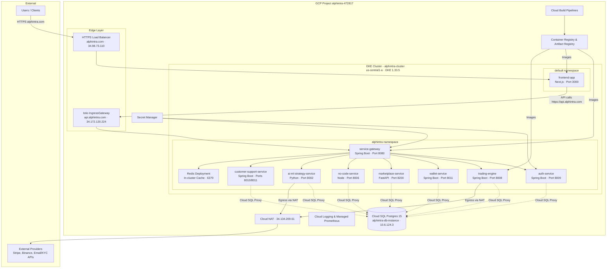
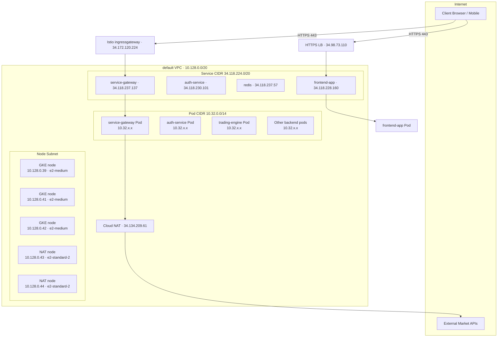
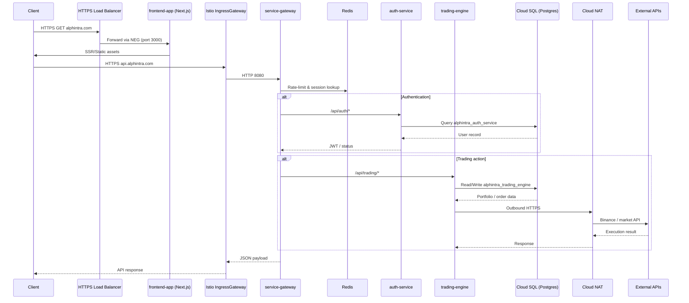
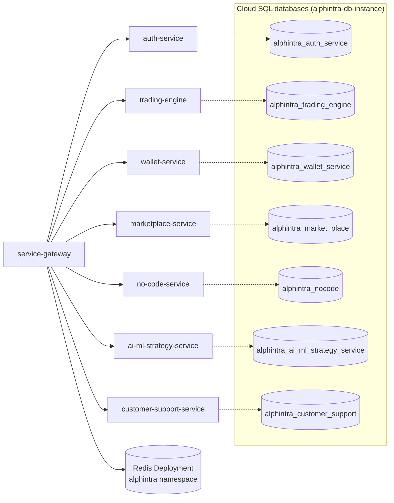
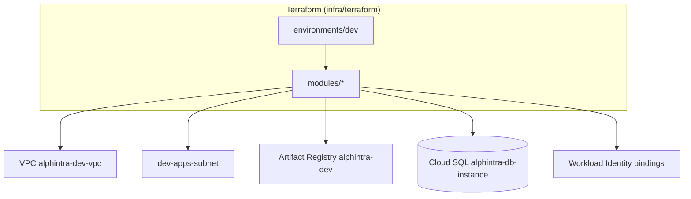

# Alphintra Platform - Cloud Architecture Diagram

This document captures the deployed architecture of the Alphintra platform on Google Cloud Platform. The topology was cross-checked against the source tree under `infra/` and the active GCP project `alphintra-472817` via `gcloud`/`kubectl` on 2025-11-05.

---

## 1. High-Level System Architecture



- Production workloads run in the `alphintra` namespace; only the UI lives in `default`.
- Every backend pod (except `service-gateway`) embeds a Cloud SQL proxy sidecar for private-IP connectivity to the shared PostgreSQL instance.
- Container images are published to both `gcr.io/alphintra-472817/*` (legacy) and `us-central1-docker.pkg.dev/alphintra-472817/alphintra/*`.

---

## 2. Network & Access Topology



- The running cluster is attached to the Google-managed `default` VPC; the Terraform-created `alphintra-dev-vpc` is not in use.
- Istio components are installed for the ingress gateway, but namespaces are not labeled for sidecar injection, so in-cluster service traffic is plain HTTP.
- Outbound Internet access flows through Cloud NAT; the reserved static IPs `binance-proxy-eu` and `trading-egress-eu` are not currently bound to resources.

---

## 3. End-to-End Request Flow



- Service-to-service calls are HTTP within the cluster; request authentication is enforced at the gateway rather than through Istio AuthorizationPolicies.
- Each workload reaches Cloud SQL through a sidecar proxy bound to `127.0.0.1:5432`, using private IP connectivity.

---

## 4. Backend Service Relationships



- `service-gateway` fronts all public endpoints and reaches downstream services via the cluster DNS entries configured in `service-gateway-config`.
- Redis runs as an in-cluster Deployment with an `emptyDir` volume; there is no managed Memorystore instance yet.
- Workload Identity is enabled for selected service accounts (`auth-service`, `no-code-service`, etc.); others still depend on secrets for GCP access.

---

## 5. Observability & Operations

```mermaid
graph TB
    subgraph "In-cluster telemetry"
        GatewayLogs[service-gateway logs]
        TradingMetrics[Prometheus annotations\n(trading-engine, ai-ml, etc.)]
        CloudSQLProxyLogs[Cloud SQL proxy logs]
    end

    subgraph "Google Managed Services"
        Logging[Cloud Logging]
        GMP[Google Managed Prometheus\n(gmp-system collectors)]
        Monitoring[Cloud Monitoring]
    end

    subgraph "Alerting"
        Email[Email / PagerDuty (planned)]
    end

    GatewayLogs --> Logging
    CloudSQLProxyLogs --> Logging
    TradingMetrics --> GMP --> Monitoring
    Logging --> Monitoring
    Monitoring --> Email
```

- Google Managed Prometheus collectors (`gmp-system`) are active; no self-hosted Prometheus/Grafana stack is deployed despite manifests for one.
- The `observability` namespace, OpenTelemetry collector, and Grafana dashboards in the repository are not applied to the cluster.
- Cert-manager is issuing TLS for `api.alphintra.com`; the NGINX ingress described in manifests is absent, leaving only the GCE/NEG ingress path.

---

## 6. CI/CD Pipeline

```mermaid
graph LR
    Dev[Developer Commit / PR]
    GitHub[GitHub Repository\nalphintra/platform]
    Actions[GitHub Actions\n(cd-dev-*.yml)]
    CloudBuild[Cloud Build\nservice cloudbuild.yaml]
    Registry[gcr.io & Artifact Registry]
    Kustomize[kubectl apply -k infra/kubernetes/environments/dev]
    GKE[alphintra-cluster (GKE)]
    Namespace[alphintra namespace]

    Dev --> GitHub --> Actions --> CloudBuild
    CloudBuild --> Registry
    CloudBuild --> Kustomize --> GKE --> Namespace
```

- Dev/staging deployments rely on GitHub Actions invoking Cloud Build, which builds and pushes images before applying manifests with Kustomize.
- The blue/green deployment logic and ArgoCD GitOps flow described in earlier docs are not implemented in the current workflows.
- Production releases are triggered manually through `workflow_dispatch`; there is no automated canary or traffic-shifting stage.

---

## 7. Infrastructure as Code Coverage



- Terraform provisions the supporting VPC, Artifact Registry, Cloud SQL database, and Workload Identity bindings but does **not** manage the running GKE cluster.
- The live workloads remain on the `default` VPC; applying Terraform changes will not touch current cluster networking until the cluster is re-homed.

---

## 8. Known Gaps & Follow-ups

- Istio sidecar injection is not enabled for `alphintra`, so mTLS and AuthorizationPolicies defined under `infra/kubernetes/istio` are currently ineffective.
- No NetworkPolicies are deployed; intra-cluster traffic is fully open.
- The `alphintra-dev` namespace contains only a dormant `wallet-service` Service with no backing pods—verify whether it is still required.
- Observability manifests (Prometheus/Grafana/Alertmanager, OpenTelemetry collector) are present in the repo but not applied to the cluster.
- Reserved IPs `binance-proxy-eu` and `trading-egress-eu` have no forwarding rules or instances attached yet.
- Redis runs as a single-pod Deployment with a hard-coded password and `emptyDir` volume; consider migrating to Memorystore for production reliability.
