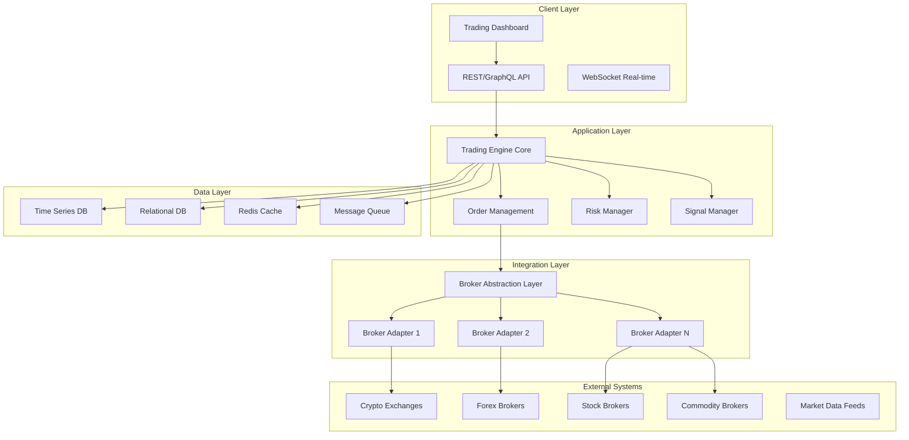
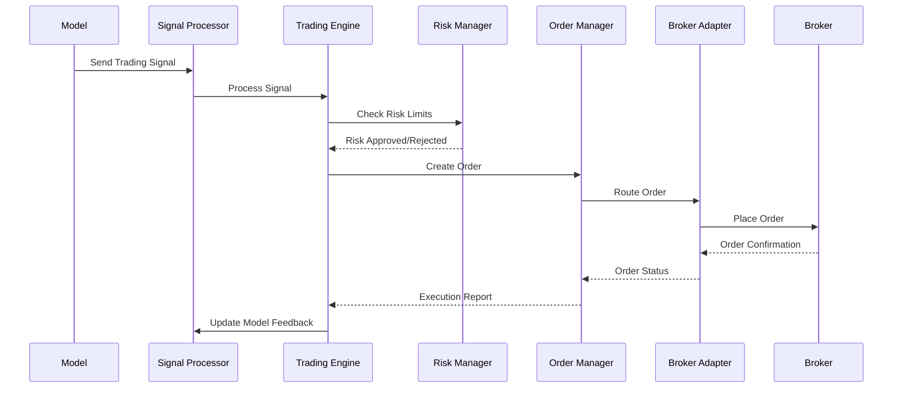

# Trading Engine Microservice - Comprehensive Development Plan

## 📋 Table of Contents
1. [Executive Summary](#executive-summary)
2. [System Architecture](#system-architecture)
3. [Core Components](#core-components)
4. [Broker Integration Framework](#broker-integration-framework)
5. [Asset Class Support](#asset-class-support)
6. [Trading Execution Engine](#trading-execution-engine)
7. [Risk Management System](#risk-management-system)
8. [Data Management](#data-management)
9. [Security & Compliance](#security--compliance)
10. [Implementation Phases](#implementation-phases)
11. [Technical Stack](#technical-stack)
12. [Database Schema](#database-schema)
13. [API Design](#api-design)
14. [Testing Strategy](#testing-strategy)
15. [Deployment & DevOps](#deployment--devops)
16. [Monitoring & Observability](#monitoring--observability)
17. [Cost Estimation](#cost-estimation)
18. [Timeline](#timeline)

---

## Executive Summary

The Alphintra Trading Engine is a sophisticated, multi-broker, multi-asset trading microservice designed to execute trades based on algorithmic model outputs. It supports all major asset classes (crypto, forex, stocks, commodities, indices) across multiple brokers with API access, providing a unified trading interface for the Alphintra platform.

### Key Features
- **Universal Broker Support**: Integrate with 50+ brokers across all asset classes
- **Multi-Asset Trading**: Support for crypto, forex, stocks, ETFs, commodities, indices
- **Real-time Execution**: Sub-second trade execution with advanced order management
- **Risk Management**: Comprehensive risk controls and position management
- **Model Integration**: Seamless integration with ML model outputs and signals
- **Compliance Ready**: Built-in regulatory compliance and audit trails
- **High Availability**: 99.9% uptime with fault-tolerant architecture

---

## System Architecture

### 🏗️ High-Level Architecture



### 🔧 Microservices Architecture

```
trading-engine/
├── core-engine/          # Main trading logic
├── order-management/     # Order lifecycle management
├── risk-management/      # Risk controls and limits
├── broker-gateway/       # Broker communication hub
├── signal-processor/     # Model signal processing
├── market-data/          # Real-time market data
├── portfolio-manager/    # Position and PnL tracking
├── compliance/           # Regulatory compliance
├── notification/         # Alerts and notifications
└── analytics/            # Trading analytics and reporting
```

---

## Core Components

### 1. 🎯 Trading Engine Core

**Purpose**: Central orchestrator for all trading activities

**Responsibilities**:
- Process incoming trading signals from ML models
- Coordinate order execution across multiple brokers
- Manage trading sessions and state
- Handle error recovery and failover

**Key Classes**:
```java
@Service
public class TradingEngineCore {
    - SignalProcessor signalProcessor
    - OrderManager orderManager
    - RiskManager riskManager
    - BrokerGateway brokerGateway
    
    + executeSignal(TradingSignal signal)
    + processOrderUpdates()
    + handleMarketEvents()
    + managePositions()
}
```

### 2. 📊 Order Management System

**Purpose**: Handle complete order lifecycle from creation to settlement

**Features**:
- Order routing and execution
- Order book management
- Fill tracking and reconciliation
- Order state management
- Parent-child order relationships

**Order Types Supported**:
- Market Orders
- Limit Orders
- Stop Loss Orders
- Take Profit Orders
- Trailing Stop Orders
- Iceberg Orders
- TWAP/VWAP Orders
- Bracket Orders

### 3. ⚡ Signal Processor

**Purpose**: Convert ML model outputs into actionable trading signals

**Signal Types**:
- Entry Signals (BUY/SELL)
- Exit Signals (CLOSE_LONG/CLOSE_SHORT)
- Position Sizing Signals
- Risk Adjustment Signals
- Portfolio Rebalancing Signals

**Signal Format**:
```json
{
  "signalId": "uuid",
  "modelId": "model-123",
  "timestamp": "2024-01-01T10:00:00Z",
  "symbol": "BTCUSDT",
  "action": "BUY",
  "confidence": 0.85,
  "quantity": 1000,
  "priceTarget": 45000,
  "stopLoss": 43000,
  "takeProfit": 47000,
  "metadata": {
    "strategy": "momentum",
    "timeframe": "1H"
  }
}
```

### 4. 🛡️ Risk Management System

**Risk Controls**:
- Position size limits
- Daily loss limits
- Drawdown controls
- Concentration limits
- Correlation limits
- Volatility adjustments
- Market impact controls

**Risk Metrics**:
- Value at Risk (VaR)
- Expected Shortfall
- Sharpe Ratio
- Maximum Drawdown
- Beta exposure
- Sector concentration

---

## Broker Integration Framework

### 🔌 Broker Abstraction Layer

**Design Pattern**: Strategy Pattern + Adapter Pattern

```java
public interface BrokerAdapter {
    // Authentication
    ConnectionResult connect(BrokerCredentials credentials);
    void disconnect();
    
    // Account Management
    AccountInfo getAccountInfo();
    List<Position> getPositions();
    List<Order> getOrders();
    
    // Trading Operations
    OrderResult placeOrder(OrderRequest order);
    OrderResult modifyOrder(String orderId, OrderModification modification);
    OrderResult cancelOrder(String orderId);
    
    // Market Data
    Quote getQuote(String symbol);
    List<Candle> getHistoricalData(String symbol, TimeFrame timeFrame, int count);
    
    // Real-time Data
    void subscribeMarketData(String symbol, MarketDataCallback callback);
    void subscribeOrderUpdates(OrderUpdateCallback callback);
}
```

### 🏦 Supported Brokers by Asset Class

#### Cryptocurrency Exchanges
| Broker | Spot Trading | Futures | Options | Margin | API Quality |
|--------|-------------|---------|---------|--------|-------------|
| Binance | ✅ | ✅ | ✅ | ✅ | ⭐⭐⭐⭐⭐ |
| Coinbase Pro | ✅ | ❌ | ❌ | ✅ | ⭐⭐⭐⭐ |
| Kraken | ✅ | ✅ | ❌ | ✅ | ⭐⭐⭐⭐ |
| KuCoin | ✅ | ✅ | ❌ | ✅ | ⭐⭐⭐ |
| Bybit | ✅ | ✅ | ✅ | ✅ | ⭐⭐⭐⭐ |
| OKX | ✅ | ✅ | ✅ | ✅ | ⭐⭐⭐⭐ |
| Gate.io | ✅ | ✅ | ❌ | ✅ | ⭐⭐⭐ |
| Huobi | ✅ | ✅ | ❌ | ✅ | ⭐⭐⭐ |

#### Forex Brokers
| Broker | Spot FX | CFDs | Commodities | API Access | Regulation |
|--------|---------|------|-------------|------------|------------|
| OANDA | ✅ | ✅ | ✅ | REST/Streaming | CFTC/FCA |
| Interactive Brokers | ✅ | ✅ | ✅ | TWS API | SEC/FINRA |
| FXCM | ✅ | ✅ | ❌ | REST API | FCA |
| Dukascopy | ✅ | ✅ | ✅ | JForex API | FINMA |
| Pepperstone | ✅ | ✅ | ✅ | cTrader API | FCA/ASIC |
| IC Markets | ✅ | ✅ | ✅ | MetaTrader | ASIC |

#### Stock Brokers
| Broker | US Stocks | International | Options | API Type | Commission |
|--------|-----------|---------------|---------|----------|------------|
| Alpaca | ✅ | ❌ | ❌ | REST API | $0 |
| TD Ameritrade | ✅ | ❌ | ✅ | REST API | $0 |
| E*TRADE | ✅ | ❌ | ✅ | REST API | $0 |
| Charles Schwab | ✅ | ✅ | ✅ | REST API | $0 |
| Interactive Brokers | ✅ | ✅ | ✅ | TWS API | $0.005/share |
| Robinhood | ✅ | ❌ | ✅ | Unofficial API | $0 |

### 🔧 Broker Adapter Implementation

#### Generic Broker Adapter
```java
@Component
public abstract class AbstractBrokerAdapter implements BrokerAdapter {
    protected RestTemplate restTemplate;
    protected WebSocketClient wsClient;
    protected BrokerConfig config;
    protected RateLimiter rateLimiter;
    
    // Common functionality
    protected void handleRateLimit() { /* ... */ }
    protected void validateOrder(OrderRequest order) { /* ... */ }
    protected OrderResult handleErrorResponse(Exception e) { /* ... */ }
}
```

#### Binance Adapter Example
```java
@Component("binanceAdapter")
public class BinanceAdapter extends AbstractBrokerAdapter {
    private static final String BASE_URL = "https://api.binance.com";
    
    @Override
    public OrderResult placeOrder(OrderRequest order) {
        // Binance-specific implementation
        BinanceOrderRequest binanceOrder = convertToBinanceOrder(order);
        
        String signature = generateSignature(binanceOrder);
        HttpHeaders headers = createAuthHeaders(signature);
        
        ResponseEntity<BinanceOrderResponse> response = restTemplate.postForEntity(
            BASE_URL + "/api/v3/order", 
            binanceOrder, 
            BinanceOrderResponse.class
        );
        
        return convertToOrderResult(response.getBody());
    }
}
```

---

## Asset Class Support

### 💰 Cryptocurrency
**Supported Assets**: 500+ cryptocurrencies
- **Major Pairs**: BTC, ETH, ADA, DOT, SOL, AVAX
- **Stablecoins**: USDT, USDC, BUSD, DAI
- **DeFi Tokens**: UNI, AAVE, COMP, SUSHI
- **Layer 1s**: BNB, MATIC, FTM, NEAR

**Trading Features**:
- Spot trading
- Futures trading (perpetual and quarterly)
- Options trading
- Margin trading
- Staking integration

### 🌍 Forex (Foreign Exchange)
**Supported Pairs**: 50+ major, minor, and exotic pairs
- **Major Pairs**: EUR/USD, GBP/USD, USD/JPY, USD/CHF
- **Minor Pairs**: EUR/GBP, AUD/JPY, GBP/CHF
- **Exotic Pairs**: USD/TRY, EUR/ZAR, USD/MXN

**Trading Features**:
- Spot FX trading
- Forward contracts
- CFD trading
- Carry trade strategies

### 📈 Stocks & Equities
**Supported Markets**: 20+ global exchanges
- **US Markets**: NYSE, NASDAQ
- **European Markets**: LSE, Euronext, DAX
- **Asian Markets**: TSE, HKEX, SSE
- **Emerging Markets**: BSE, JSE

**Asset Types**:
- Individual stocks
- ETFs
- REITs
- ADRs

### 🥇 Commodities
**Supported Commodities**:
- **Precious Metals**: Gold, Silver, Platinum, Palladium
- **Energy**: Crude Oil, Natural Gas, Gasoline
- **Agricultural**: Wheat, Corn, Soybeans, Coffee
- **Industrial Metals**: Copper, Aluminum, Zinc

### 📊 Indices
**Supported Indices**:
- **US Indices**: S&P 500, NASDAQ 100, Dow Jones
- **European Indices**: FTSE 100, DAX, CAC 40
- **Asian Indices**: Nikkei 225, Hang Seng, Shanghai Composite
- **Volatility Indices**: VIX, VVIX

---

## Trading Execution Engine

### ⚡ Order Execution Flow



### 🎯 Execution Algorithms

#### 1. Smart Order Routing (SOR)
```java
@Service
public class SmartOrderRouter {
    
    public ExecutionPlan routeOrder(OrderRequest order) {
        List<BrokerQuote> quotes = getBestQuotes(order.getSymbol());
        
        return ExecutionPlan.builder()
            .totalQuantity(order.getQuantity())
            .childOrders(optimizeExecution(order, quotes))
            .estimatedCost(calculateTotalCost())
            .estimatedTime(estimateExecutionTime())
            .build();
    }
    
    private List<ChildOrder> optimizeExecution(OrderRequest order, List<BrokerQuote> quotes) {
        // Multi-objective optimization:
        // 1. Minimize cost (spread + commission)
        // 2. Minimize market impact
        // 3. Minimize execution time
        // 4. Maximize fill probability
        
        return geneticAlgorithmOptimizer.optimize(order, quotes);
    }
}
```

#### 2. Time-Weighted Average Price (TWAP)
```java
@Component
public class TWAPExecutor {
    
    public void executeTWAP(TWAPOrder twapOrder) {
        int totalSlices = calculateOptimalSlices(twapOrder);
        Duration interval = twapOrder.getDuration().dividedBy(totalSlices);
        
        for (int i = 0; i < totalSlices; i++) {
            ChildOrder slice = createSlice(twapOrder, i, totalSlices);
            
            scheduleExecution(slice, interval.multipliedBy(i));
        }
    }
}
```

#### 3. Volume-Weighted Average Price (VWAP)
```java
@Component
public class VWAPExecutor {
    
    public void executeVWAP(VWAPOrder vwapOrder) {
        List<VolumeProfile> historicalVolume = getHistoricalVolume(
            vwapOrder.getSymbol(), 
            vwapOrder.getTimeFrame()
        );
        
        List<ChildOrder> slices = distributeByVolume(vwapOrder, historicalVolume);
        
        for (ChildOrder slice : slices) {
            scheduleExecution(slice, slice.getScheduledTime());
        }
    }
}
```

### 📊 Execution Quality Metrics

```java
@Entity
public class ExecutionMetrics {
    private String orderId;
    private BigDecimal requestedPrice;
    private BigDecimal executedPrice;
    private BigDecimal slippage;
    private Duration executionTime;
    private BigDecimal marketImpact;
    private BigDecimal implementation_shortfall;
    
    // Getters, setters, and calculated metrics
    public BigDecimal getImplementationShortfall() {
        return requestedPrice.subtract(executedPrice)
                .multiply(BigDecimal.valueOf(quantity));
    }
}
```

---

## Risk Management System

### 🛡️ Risk Framework Architecture

```java
@Service
public class RiskManager {
    
    @Autowired
    private PositionRiskCalculator positionRiskCalculator;
    
    @Autowired
    private PortfolioRiskCalculator portfolioRiskCalculator;
    
    @Autowired
    private MarketRiskCalculator marketRiskCalculator;
    
    public RiskAssessment assessOrderRisk(OrderRequest order) {
        // Pre-trade risk checks
        RiskAssessment assessment = new RiskAssessment();
        
        // 1. Position size limits
        assessment.addCheck(checkPositionSizeLimits(order));
        
        // 2. Portfolio concentration
        assessment.addCheck(checkConcentrationLimits(order));
        
        // 3. Daily loss limits
        assessment.addCheck(checkDailyLossLimits(order));
        
        // 4. Market volatility
        assessment.addCheck(checkVolatilityLimits(order));
        
        // 5. Correlation limits
        assessment.addCheck(checkCorrelationLimits(order));
        
        return assessment;
    }
}
```

### 📊 Risk Metrics

#### Value at Risk (VaR) Calculation
```java
@Component
public class VaRCalculator {
    
    public BigDecimal calculatePortfolioVaR(Portfolio portfolio, double confidence, int days) {
        // Historical simulation method
        List<BigDecimal> portfolioReturns = calculateHistoricalReturns(portfolio, 252);
        
        // Sort returns in ascending order
        Collections.sort(portfolioReturns);
        
        // Find the percentile
        int index = (int) Math.floor((1 - confidence) * portfolioReturns.size());
        BigDecimal varReturn = portfolioReturns.get(index);
        
        // Scale for holding period
        return varReturn.multiply(BigDecimal.valueOf(Math.sqrt(days)))
                       .multiply(portfolio.getTotalValue());
    }
}
```

#### Dynamic Position Sizing
```java
@Component
public class KellyPositionSizer {
    
    public BigDecimal calculateOptimalSize(TradingSignal signal, Portfolio portfolio) {
        // Kelly Criterion: f* = (bp - q) / b
        // where:
        // f* = fraction of capital to wager
        // b = odds received on the wager (reward/risk ratio)
        // p = probability of winning
        // q = probability of losing (1 - p)
        
        BigDecimal winProbability = BigDecimal.valueOf(signal.getConfidence());
        BigDecimal lossProbability = BigDecimal.ONE.subtract(winProbability);
        
        BigDecimal rewardRiskRatio = signal.getTakeProfit()
                                          .subtract(signal.getEntryPrice())
                                          .divide(signal.getEntryPrice()
                                          .subtract(signal.getStopLoss()), ROUND_HALF_UP);
        
        BigDecimal kellyCriterion = winProbability.multiply(rewardRiskRatio)
                                                 .subtract(lossProbability)
                                                 .divide(rewardRiskRatio, ROUND_HALF_UP);
        
        // Apply fractional Kelly to reduce risk
        BigDecimal fractionalKelly = kellyCriterion.multiply(BigDecimal.valueOf(0.25));
        
        return portfolio.getTotalValue().multiply(fractionalKelly);
    }
}
```

### 🚨 Risk Controls

#### Circuit Breakers
```java
@Component
public class CircuitBreaker {
    
    @EventListener
    public void handleMarketVolatility(VolatilityEvent event) {
        if (event.getVolatility().compareTo(VOLATILITY_THRESHOLD) > 0) {
            // Halt all new orders
            tradingEngine.haltTrading("High volatility detected");
            
            // Reduce position sizes
            portfolioManager.reduceAllPositions(0.5);
            
            // Tighten stop losses
            orderManager.tightenStopLosses(0.8);
        }
    }
}
```

#### Drawdown Controls
```java
@Component
public class DrawdownMonitor {
    
    @Scheduled(fixedRate = 5000) // Check every 5 seconds
    public void monitorDrawdown() {
        BigDecimal currentDrawdown = portfolioManager.getCurrentDrawdown();
        
        if (currentDrawdown.compareTo(MAX_DAILY_DRAWDOWN) > 0) {
            // Emergency stop
            tradingEngine.emergencyStop("Maximum drawdown exceeded");
            
            // Close risky positions
            positionManager.closeRiskyPositions();
            
            // Send alerts
            notificationService.sendDrawdownAlert(currentDrawdown);
        }
    }
}
```

---

## Data Management

### 🗄️ Database Schema Design

#### Core Trading Tables
```sql
-- Trading signals from models
CREATE TABLE trading_signals (
    signal_id UUID PRIMARY KEY,
    model_id VARCHAR(100) NOT NULL,
    user_id UUID NOT NULL,
    symbol VARCHAR(20) NOT NULL,
    signal_type VARCHAR(20) NOT NULL, -- BUY, SELL, CLOSE_LONG, CLOSE_SHORT
    confidence DECIMAL(5,4) NOT NULL,
    quantity DECIMAL(20,8),
    entry_price DECIMAL(20,8),
    stop_loss DECIMAL(20,8),
    take_profit DECIMAL(20,8),
    signal_time TIMESTAMP NOT NULL,
    processed_time TIMESTAMP,
    status VARCHAR(20) DEFAULT 'PENDING',
    metadata JSONB,
    created_at TIMESTAMP DEFAULT NOW(),
    INDEX idx_signal_model (model_id),
    INDEX idx_signal_user (user_id),
    INDEX idx_signal_symbol (symbol),
    INDEX idx_signal_time (signal_time)
);

-- Orders management
CREATE TABLE orders (
    order_id UUID PRIMARY KEY,
    signal_id UUID REFERENCES trading_signals(signal_id),
    user_id UUID NOT NULL,
    broker_id VARCHAR(50) NOT NULL,
    broker_order_id VARCHAR(100),
    symbol VARCHAR(20) NOT NULL,
    side VARCHAR(10) NOT NULL, -- BUY, SELL
    order_type VARCHAR(20) NOT NULL, -- MARKET, LIMIT, STOP, etc.
    quantity DECIMAL(20,8) NOT NULL,
    price DECIMAL(20,8),
    stop_price DECIMAL(20,8),
    time_in_force VARCHAR(10) DEFAULT 'GTC',
    status VARCHAR(20) DEFAULT 'NEW',
    filled_quantity DECIMAL(20,8) DEFAULT 0,
    average_price DECIMAL(20,8),
    commission DECIMAL(20,8),
    order_time TIMESTAMP NOT NULL,
    fill_time TIMESTAMP,
    created_at TIMESTAMP DEFAULT NOW(),
    updated_at TIMESTAMP DEFAULT NOW(),
    INDEX idx_order_user (user_id),
    INDEX idx_order_broker (broker_id),
    INDEX idx_order_symbol (symbol),
    INDEX idx_order_status (status),
    INDEX idx_order_time (order_time)
);

-- Position tracking
CREATE TABLE positions (
    position_id UUID PRIMARY KEY,
    user_id UUID NOT NULL,
    broker_id VARCHAR(50) NOT NULL,
    symbol VARCHAR(20) NOT NULL,
    side VARCHAR(10) NOT NULL, -- LONG, SHORT
    quantity DECIMAL(20,8) NOT NULL,
    average_price DECIMAL(20,8) NOT NULL,
    market_value DECIMAL(20,8),
    unrealized_pnl DECIMAL(20,8),
    realized_pnl DECIMAL(20,8) DEFAULT 0,
    opened_at TIMESTAMP NOT NULL,
    updated_at TIMESTAMP DEFAULT NOW(),
    UNIQUE KEY uk_position (user_id, broker_id, symbol, side),
    INDEX idx_position_user (user_id),
    INDEX idx_position_symbol (symbol)
);

-- Trade executions
CREATE TABLE trades (
    trade_id UUID PRIMARY KEY,
    order_id UUID REFERENCES orders(order_id),
    user_id UUID NOT NULL,
    broker_id VARCHAR(50) NOT NULL,
    broker_trade_id VARCHAR(100),
    symbol VARCHAR(20) NOT NULL,
    side VARCHAR(10) NOT NULL,
    quantity DECIMAL(20,8) NOT NULL,
    price DECIMAL(20,8) NOT NULL,
    commission DECIMAL(20,8),
    trade_time TIMESTAMP NOT NULL,
    created_at TIMESTAMP DEFAULT NOW(),
    INDEX idx_trade_order (order_id),
    INDEX idx_trade_user (user_id),
    INDEX idx_trade_symbol (symbol),
    INDEX idx_trade_time (trade_time)
);

-- Portfolio snapshots
CREATE TABLE portfolio_snapshots (
    snapshot_id UUID PRIMARY KEY,
    user_id UUID NOT NULL,
    total_value DECIMAL(20,8) NOT NULL,
    cash_balance DECIMAL(20,8) NOT NULL,
    positions_value DECIMAL(20,8) NOT NULL,
    unrealized_pnl DECIMAL(20,8) NOT NULL,
    realized_pnl DECIMAL(20,8) NOT NULL,
    daily_pnl DECIMAL(20,8) NOT NULL,
    total_return DECIMAL(10,6) NOT NULL,
    sharpe_ratio DECIMAL(10,6),
    max_drawdown DECIMAL(10,6),
    snapshot_time TIMESTAMP NOT NULL,
    created_at TIMESTAMP DEFAULT NOW(),
    INDEX idx_snapshot_user (user_id),
    INDEX idx_snapshot_time (snapshot_time)
);
```

#### Market Data Tables
```sql
-- Real-time quotes
CREATE TABLE quotes (
    quote_id BIGINT AUTO_INCREMENT PRIMARY KEY,
    symbol VARCHAR(20) NOT NULL,
    bid_price DECIMAL(20,8),
    ask_price DECIMAL(20,8),
    last_price DECIMAL(20,8),
    volume DECIMAL(20,8),
    quote_time TIMESTAMP NOT NULL,
    created_at TIMESTAMP DEFAULT NOW(),
    INDEX idx_quote_symbol_time (symbol, quote_time)
);

-- OHLCV data for different timeframes
CREATE TABLE ohlcv_data (
    id BIGINT AUTO_INCREMENT PRIMARY KEY,
    symbol VARCHAR(20) NOT NULL,
    timeframe VARCHAR(10) NOT NULL, -- 1m, 5m, 15m, 1h, 4h, 1d
    open_price DECIMAL(20,8) NOT NULL,
    high_price DECIMAL(20,8) NOT NULL,
    low_price DECIMAL(20,8) NOT NULL,
    close_price DECIMAL(20,8) NOT NULL,
    volume DECIMAL(20,8) NOT NULL,
    timestamp TIMESTAMP NOT NULL,
    created_at TIMESTAMP DEFAULT NOW(),
    UNIQUE KEY uk_ohlcv (symbol, timeframe, timestamp),
    INDEX idx_ohlcv_symbol_time (symbol, timeframe, timestamp)
);
```

### 📊 Time Series Database (InfluxDB)

```sql
-- High-frequency market data
CREATE MEASUREMENT market_data (
    time TIMESTAMP,
    symbol STRING,
    price FLOAT,
    volume FLOAT,
    bid FLOAT,
    ask FLOAT,
    spread FLOAT
) WITH SHARD DURATION 1d;

-- Trading performance metrics
CREATE MEASUREMENT trading_metrics (
    time TIMESTAMP,
    user_id STRING,
    strategy_id STRING,
    pnl FLOAT,
    drawdown FLOAT,
    sharpe_ratio FLOAT,
    win_rate FLOAT,
    avg_win FLOAT,
    avg_loss FLOAT
) WITH SHARD DURATION 7d;

-- Order execution metrics
CREATE MEASUREMENT execution_metrics (
    time TIMESTAMP,
    order_id STRING,
    symbol STRING,
    slippage FLOAT,
    execution_time FLOAT,
    market_impact FLOAT,
    implementation_shortfall FLOAT
) WITH SHARD DURATION 30d;
```

---

## Security & Compliance

### 🔐 Security Framework

#### API Key Management
```java
@Entity
public class BrokerCredentials {
    @Id
    private UUID credentialId;
    
    @Column(nullable = false)
    private UUID userId;
    
    @Column(nullable = false)
    private String brokerId;
    
    @Encrypted
    @Column(nullable = false)
    private String apiKey;
    
    @Encrypted
    @Column(nullable = false)
    private String secretKey;
    
    @Encrypted
    private String passphrase; // For some exchanges
    
    @Column(nullable = false)
    private Boolean isTestnet = false;
    
    @Column(nullable = false)
    private Boolean isActive = true;
    
    private LocalDateTime expiresAt;
    private LocalDateTime lastUsed;
    
    // Audit fields
    private LocalDateTime createdAt;
    private LocalDateTime updatedAt;
}

@Service
public class CredentialManager {
    
    @Autowired
    private EncryptionService encryptionService;
    
    public void storeCredentials(UUID userId, String brokerId, BrokerApiKeys keys) {
        // Encrypt sensitive data
        String encryptedApiKey = encryptionService.encrypt(keys.getApiKey());
        String encryptedSecret = encryptionService.encrypt(keys.getSecretKey());
        
        // Store with audit trail
        BrokerCredentials credentials = BrokerCredentials.builder()
            .userId(userId)
            .brokerId(brokerId)
            .apiKey(encryptedApiKey)
            .secretKey(encryptedSecret)
            .build();
            
        credentialsRepository.save(credentials);
        
        // Log security event
        securityLogger.logCredentialStorage(userId, brokerId);
    }
}
```

#### Audit Trail System
```java
@Entity
public class AuditLog {
    @Id
    private UUID auditId;
    
    private UUID userId;
    private String action; // ORDER_PLACED, ORDER_CANCELLED, POSITION_OPENED, etc.
    private String entityType; // ORDER, POSITION, TRADE
    private String entityId;
    private String oldValues;
    private String newValues;
    private String ipAddress;
    private String userAgent;
    private LocalDateTime timestamp;
    
    // Compliance fields
    private String regulatoryReference;
    private String complianceNotes;
}

@Component
public class AuditLogger {
    
    @EventListener
    @Async
    public void logTradingEvent(TradingEvent event) {
        AuditLog log = AuditLog.builder()
            .userId(event.getUserId())
            .action(event.getAction())
            .entityType(event.getEntityType())
            .entityId(event.getEntityId())
            .oldValues(jsonMapper.writeValueAsString(event.getOldState()))
            .newValues(jsonMapper.writeValueAsString(event.getNewState()))
            .timestamp(LocalDateTime.now())
            .build();
            
        auditRepository.save(log);
    }
}
```

### 📋 Regulatory Compliance

#### Trade Reporting (MiFID II, Dodd-Frank)
```java
@Service
public class TradeReportingService {
    
    public void reportTrade(Trade trade) {
        // Determine applicable regulations
        List<Regulation> applicableRegs = determineApplicableRegulations(trade);
        
        for (Regulation regulation : applicableRegs) {
            switch (regulation) {
                case MIFID_II:
                    reportToMiFIDII(trade);
                    break;
                case DODD_FRANK:
                    reportToDoddFrank(trade);
                    break;
                case EMIR:
                    reportToEMIR(trade);
                    break;
            }
        }
    }
    
    private void reportToMiFIDII(Trade trade) {
        MiFIDIIReport report = MiFIDIIReport.builder()
            .transactionReferenceNumber(trade.getTradeId().toString())
            .tradingVenue(trade.getBrokerId())
            .instrumentIdentification(trade.getSymbol())
            .buyerIdentification(trade.getUserId().toString())
            .sellerIdentification("ALPHINTRA")
            .transmissionOfOrder(false)
            .price(trade.getPrice())
            .quantity(trade.getQuantity())
            .tradingDateTime(trade.getTradeTime())
            .build();
            
        mifidReportingClient.submitReport(report);
    }
}
```

#### Best Execution Reporting
```java
@Service
public class BestExecutionService {
    
    @Scheduled(cron = "0 0 1 * * ?") // Daily at 1 AM
    public void generateBestExecutionReport() {
        LocalDate yesterday = LocalDate.now().minusDays(1);
        
        List<ExecutionQualityMetrics> metrics = executionRepository
            .findExecutionMetrics(yesterday);
            
        BestExecutionReport report = BestExecutionReport.builder()
            .reportDate(yesterday)
            .totalOrders(metrics.size())
            .averageSlippage(calculateAverageSlippage(metrics))
            .averageExecutionTime(calculateAverageExecutionTime(metrics))
            .priceImprovementRate(calculatePriceImprovementRate(metrics))
            .venueBreakdown(calculateVenueBreakdown(metrics))
            .build();
            
        reportingService.publishReport(report);
    }
}
```

---

## Implementation Phases

### 🚀 Phase 1: Foundation (Months 1-2)
**Deliverables**:
- [ ] Core Spring Boot microservice architecture
- [ ] Database schema and data models
- [ ] Basic REST API framework
- [ ] Authentication and authorization
- [ ] Configuration management
- [ ] Basic logging and monitoring

**Tech Stack Setup**:
- Spring Boot 3.2
- Spring Security 6
- Spring Data JPA
- PostgreSQL 15
- Redis 7
- Docker containerization

### 🔌 Phase 2: Broker Integration Framework (Months 2-3)
**Deliverables**:
- [ ] Broker abstraction layer
- [ ] Generic broker adapter interface
- [ ] Rate limiting framework
- [ ] Error handling and retry logic
- [ ] WebSocket connection management
- [ ] First 3 broker adapters (Binance, Alpaca, OANDA)

**Integration Pattern**:
```java
@BrokerAdapter("binance")
public class BinanceAdapter extends AbstractBrokerAdapter {
    // Binance-specific implementation
}
```

### 📊 Phase 3: Core Trading Engine (Months 3-4)
**Deliverables**:
- [ ] Signal processing engine
- [ ] Order management system
- [ ] Basic order routing
- [ ] Position tracking
- [ ] Portfolio management
- [ ] Real-time market data integration

### 🛡️ Phase 4: Risk Management (Months 4-5)
**Deliverables**:
- [ ] Pre-trade risk checks
- [ ] Position sizing algorithms
- [ ] Portfolio risk calculations
- [ ] Real-time risk monitoring
- [ ] Circuit breakers
- [ ] Drawdown controls

### ⚡ Phase 5: Advanced Execution (Months 5-6)
**Deliverables**:
- [ ] Smart order routing
- [ ] TWAP/VWAP algorithms
- [ ] Multi-venue execution
- [ ] Execution quality analytics
- [ ] Slippage optimization
- [ ] Market impact models

### 🔗 Phase 6: Extended Broker Support (Months 6-8)
**Deliverables**:
- [ ] 15+ additional broker adapters
- [ ] Multi-asset class support
- [ ] Cross-broker arbitrage
- [ ] Broker failover mechanisms
- [ ] Performance optimization
- [ ] Load balancing

### 📋 Phase 7: Compliance & Reporting (Months 8-9)
**Deliverables**:
- [ ] Audit trail system
- [ ] Regulatory reporting
- [ ] Best execution reporting
- [ ] Transaction cost analysis
- [ ] Risk reporting
- [ ] Performance attribution

### 🎯 Phase 8: Production Readiness (Months 9-10)
**Deliverables**:
- [ ] High availability setup
- [ ] Disaster recovery
- [ ] Performance testing
- [ ] Security penetration testing
- [ ] Load testing
- [ ] Production deployment

---

## Technical Stack

### 🏗️ Backend Technologies

#### Core Framework
```xml
<!-- Spring Boot Parent -->
<parent>
    <groupId>org.springframework.boot</groupId>
    <artifactId>spring-boot-starter-parent</artifactId>
    <version>3.2.0</version>
</parent>

<!-- Core Dependencies -->
<dependencies>
    <!-- Web & API -->
    <dependency>
        <groupId>org.springframework.boot</groupId>
        <artifactId>spring-boot-starter-web</artifactId>
    </dependency>
    
    <!-- WebSocket for real-time data -->
    <dependency>
        <groupId>org.springframework.boot</groupId>
        <artifactId>spring-boot-starter-websocket</artifactId>
    </dependency>
    
    <!-- Data Access -->
    <dependency>
        <groupId>org.springframework.boot</groupId>
        <artifactId>spring-boot-starter-data-jpa</artifactId>
    </dependency>
    
    <!-- Security -->
    <dependency>
        <groupId>org.springframework.boot</groupId>
        <artifactId>spring-boot-starter-security</artifactId>
    </dependency>
    
    <!-- Caching -->
    <dependency>
        <groupId>org.springframework.boot</groupId>
        <artifactId>spring-boot-starter-data-redis</artifactId>
    </dependency>
    
    <!-- Messaging -->
    <dependency>
        <groupId>org.springframework.kafka</groupId>
        <artifactId>spring-kafka</artifactId>
    </dependency>
    
    <!-- Monitoring -->
    <dependency>
        <groupId>org.springframework.boot</groupId>
        <artifactId>spring-boot-starter-actuator</artifactId>
    </dependency>
    
    <!-- Metrics -->
    <dependency>
        <groupId>io.micrometer</groupId>
        <artifactId>micrometer-registry-prometheus</artifactId>
    </dependency>
</dependencies>
```

#### Database Stack
- **Primary Database**: PostgreSQL 15
- **Time Series**: InfluxDB 2.7
- **Cache**: Redis 7.2
- **Message Queue**: Apache Kafka 3.5
- **Search**: Elasticsearch 8.x

#### External Services
- **Market Data**: Alpha Vantage, IEX Cloud, Polygon.io
- **News Data**: NewsAPI, Alpha Vantage News
- **Economic Data**: FRED API, Trading Economics
- **Crypto Data**: CoinGecko, CoinMarketCap

### 🔧 Development Tools

#### Code Quality
```xml
<!-- Code Quality Plugins -->
<plugin>
    <groupId>org.sonarsource.scanner.maven</groupId>
    <artifactId>sonar-maven-plugin</artifactId>
    <version>3.9.1.2184</version>
</plugin>

<plugin>
    <groupId>com.github.spotbugs</groupId>
    <artifactId>spotbugs-maven-plugin</artifactId>
    <version>4.7.3.0</version>
</plugin>

<plugin>
    <groupId>org.jacoco</groupId>
    <artifactId>jacoco-maven-plugin</artifactId>
    <version>0.8.8</version>
</plugin>
```

#### Testing Framework
```xml
<!-- Testing Dependencies -->
<dependency>
    <groupId>org.springframework.boot</groupId>
    <artifactId>spring-boot-starter-test</artifactId>
    <scope>test</scope>
</dependency>

<dependency>
    <groupId>org.testcontainers</groupId>
    <artifactId>junit-jupiter</artifactId>
    <scope>test</scope>
</dependency>

<dependency>
    <groupId>org.testcontainers</groupId>
    <artifactId>postgresql</artifactId>
    <scope>test</scope>
</dependency>

<dependency>
    <groupId>org.mockito</groupId>
    <artifactId>mockito-core</artifactId>
    <scope>test</scope>
</dependency>
```

---

## API Design

### 🚀 REST API Endpoints

#### Trading Operations
```yaml
# OpenAPI 3.0 Specification
openapi: 3.0.3
info:
  title: Alphintra Trading Engine API
  version: 1.0.0
  description: Comprehensive trading engine for multi-broker, multi-asset trading

paths:
  /api/v1/signals:
    post:
      summary: Submit trading signal
      requestBody:
        required: true
        content:
          application/json:
            schema:
              $ref: '#/components/schemas/TradingSignal'
      responses:
        '200':
          description: Signal accepted
          content:
            application/json:
              schema:
                $ref: '#/components/schemas/SignalResponse'

  /api/v1/orders:
    post:
      summary: Place order
      requestBody:
        required: true
        content:
          application/json:
            schema:
              $ref: '#/components/schemas/OrderRequest'
      responses:
        '200':
          description: Order placed
          content:
            application/json:
              schema:
                $ref: '#/components/schemas/OrderResponse'
    
    get:
      summary: Get orders
      parameters:
        - name: status
          in: query
          schema:
            type: string
            enum: [NEW, PARTIALLY_FILLED, FILLED, CANCELLED]
        - name: symbol
          in: query
          schema:
            type: string
        - name: fromTime
          in: query
          schema:
            type: string
            format: date-time
      responses:
        '200':
          description: Orders retrieved
          content:
            application/json:
              schema:
                type: array
                items:
                  $ref: '#/components/schemas/Order'

  /api/v1/positions:
    get:
      summary: Get current positions
      responses:
        '200':
          description: Positions retrieved
          content:
            application/json:
              schema:
                type: array
                items:
                  $ref: '#/components/schemas/Position'

  /api/v1/portfolio:
    get:
      summary: Get portfolio summary
      responses:
        '200':
          description: Portfolio data
          content:
            application/json:
              schema:
                $ref: '#/components/schemas/Portfolio'

components:
  schemas:
    TradingSignal:
      type: object
      required:
        - signalId
        - modelId
        - symbol
        - action
        - confidence
      properties:
        signalId:
          type: string
          format: uuid
        modelId:
          type: string
        symbol:
          type: string
          example: "BTCUSDT"
        action:
          type: string
          enum: [BUY, SELL, CLOSE_LONG, CLOSE_SHORT]
        confidence:
          type: number
          minimum: 0
          maximum: 1
        quantity:
          type: number
        entryPrice:
          type: number
        stopLoss:
          type: number
        takeProfit:
          type: number
        metadata:
          type: object
```

### 🔄 GraphQL Schema

```graphql
type Query {
  # Portfolio queries
  portfolio(userId: ID!): Portfolio
  positions(userId: ID!, symbols: [String]): [Position]
  
  # Order queries
  orders(
    userId: ID!
    status: OrderStatus
    symbol: String
    fromTime: DateTime
    toTime: DateTime
  ): [Order]
  
  # Market data queries
  quote(symbol: String!): Quote
  historicalData(
    symbol: String!
    timeframe: Timeframe!
    count: Int = 100
  ): [OHLCV]
  
  # Analytics queries
  tradingMetrics(
    userId: ID!
    fromDate: Date!
    toDate: Date!
  ): TradingMetrics
}

type Mutation {
  # Trading operations
  submitSignal(input: TradingSignalInput!): SignalResponse
  placeOrder(input: OrderInput!): OrderResponse
  cancelOrder(orderId: ID!): CancelResponse
  modifyOrder(orderId: ID!, modification: OrderModification!): OrderResponse
  
  # Risk management
  setRiskLimits(userId: ID!, limits: RiskLimitsInput!): RiskLimits
  emergencyStop(userId: ID!, reason: String!): EmergencyStopResponse
}

type Subscription {
  # Real-time data streams
  orderUpdates(userId: ID!): OrderUpdate
  positionUpdates(userId: ID!): PositionUpdate
  portfolioUpdates(userId: ID!): PortfolioUpdate
  marketData(symbols: [String!]!): MarketDataUpdate
  tradingSignals(userId: ID!): TradingSignal
}

# Type definitions
type Portfolio {
  userId: ID!
  totalValue: Float!
  cashBalance: Float!
  positionsValue: Float!
  unrealizedPnL: Float!
  realizedPnL: Float!
  dailyPnL: Float!
  totalReturn: Float!
  sharpeRatio: Float
  maxDrawdown: Float
  lastUpdated: DateTime!
}

type Position {
  positionId: ID!
  symbol: String!
  side: PositionSide!
  quantity: Float!
  averagePrice: Float!
  marketValue: Float!
  unrealizedPnL: Float!
  realizedPnL: Float!
  openedAt: DateTime!
}

type Order {
  orderId: ID!
  symbol: String!
  side: OrderSide!
  type: OrderType!
  quantity: Float!
  price: Float
  stopPrice: Float
  status: OrderStatus!
  filledQuantity: Float!
  averagePrice: Float
  commission: Float
  orderTime: DateTime!
  fillTime: DateTime
}

enum OrderStatus {
  NEW
  PARTIALLY_FILLED
  FILLED
  CANCELLED
  REJECTED
  EXPIRED
}

enum OrderSide {
  BUY
  SELL
}

enum OrderType {
  MARKET
  LIMIT
  STOP
  STOP_LIMIT
  TRAILING_STOP
}
```

### 🔌 WebSocket API

```javascript
// WebSocket Connection
const ws = new WebSocket('wss://api.alphintra.com/trading/ws');

// Authentication
ws.send(JSON.stringify({
  action: 'authenticate',
  token: 'jwt-token'
}));

// Subscribe to order updates
ws.send(JSON.stringify({
  action: 'subscribe',
  channel: 'orders',
  userId: 'user-123'
}));

// Subscribe to market data
ws.send(JSON.stringify({
  action: 'subscribe',
  channel: 'market_data',
  symbols: ['BTCUSDT', 'ETHUSDT', 'AAPL']
}));

// Handle incoming messages
ws.onmessage = (event) => {
  const data = JSON.parse(event.data);
  
  switch (data.channel) {
    case 'orders':
      handleOrderUpdate(data.payload);
      break;
    case 'market_data':
      handleMarketDataUpdate(data.payload);
      break;
    case 'portfolio':
      handlePortfolioUpdate(data.payload);
      break;
  }
};
```

---

## Testing Strategy

### 🧪 Testing Pyramid

#### Unit Tests (70%)
```java
@ExtendWith(MockitoExtension.class)
class TradingEngineTest {
    
    @Mock
    private SignalProcessor signalProcessor;
    
    @Mock
    private OrderManager orderManager;
    
    @Mock
    private RiskManager riskManager;
    
    @InjectMocks
    private TradingEngine tradingEngine;
    
    @Test
    void shouldProcessValidSignal() {
        // Given
        TradingSignal signal = createValidSignal();
        when(riskManager.assessRisk(signal)).thenReturn(RiskAssessment.approved());
        when(orderManager.createOrder(any())).thenReturn(createOrder());
        
        // When
        SignalResponse response = tradingEngine.processSignal(signal);
        
        // Then
        assertThat(response.getStatus()).isEqualTo(SignalStatus.ACCEPTED);
        verify(orderManager).createOrder(any(OrderRequest.class));
    }
    
    @Test
    void shouldRejectHighRiskSignal() {
        // Given
        TradingSignal signal = createHighRiskSignal();
        when(riskManager.assessRisk(signal)).thenReturn(RiskAssessment.rejected("High risk"));
        
        // When
        SignalResponse response = tradingEngine.processSignal(signal);
        
        // Then
        assertThat(response.getStatus()).isEqualTo(SignalStatus.REJECTED);
        verify(orderManager, never()).createOrder(any());
    }
}
```

#### Integration Tests (20%)
```java
@SpringBootTest(webEnvironment = SpringBootTest.WebEnvironment.RANDOM_PORT)
@Testcontainers
class TradingEngineIntegrationTest {
    
    @Container
    static PostgreSQLContainer<?> postgres = new PostgreSQLContainer<>("postgres:15")
            .withDatabaseName("trading_test")
            .withUsername("test")
            .withPassword("test");
    
    @Container
    static GenericContainer<?> redis = new GenericContainer<>("redis:7-alpine")
            .withExposedPorts(6379);
    
    @Autowired
    private TestRestTemplate restTemplate;
    
    @Autowired
    private TradingSignalRepository signalRepository;
    
    @Test
    void shouldProcessSignalEndToEnd() {
        // Given
        TradingSignalRequest request = createSignalRequest();
        
        // When
        ResponseEntity<SignalResponse> response = restTemplate.postForEntity(
            "/api/v1/signals", 
            request, 
            SignalResponse.class
        );
        
        // Then
        assertThat(response.getStatusCode()).isEqualTo(HttpStatus.OK);
        assertThat(response.getBody().getStatus()).isEqualTo(SignalStatus.ACCEPTED);
        
        // Verify database state
        TradingSignal savedSignal = signalRepository.findBySignalId(request.getSignalId());
        assertThat(savedSignal).isNotNull();
        assertThat(savedSignal.getStatus()).isEqualTo(SignalStatus.PROCESSED);
    }
}
```

#### E2E Tests (10%)
```java
@SpringBootTest(webEnvironment = SpringBootTest.WebEnvironment.DEFINED_PORT)
class TradingEngineE2ETest {
    
    @Test
    void shouldExecuteCompleteTradeWorkflow() {
        // 1. Submit trading signal
        TradingSignal signal = submitTradingSignal();
        
        // 2. Verify signal processing
        waitForSignalProcessing(signal.getSignalId());
        
        // 3. Check order creation
        List<Order> orders = getOrdersForSignal(signal.getSignalId());
        assertThat(orders).hasSize(1);
        
        // 4. Simulate order fill
        simulateOrderFill(orders.get(0));
        
        // 5. Verify position creation
        List<Position> positions = getPositionsForUser(signal.getUserId());
        assertThat(positions).hasSize(1);
        
        // 6. Verify portfolio update
        Portfolio portfolio = getPortfolio(signal.getUserId());
        assertThat(portfolio.getPositionsValue()).isGreaterThan(BigDecimal.ZERO);
    }
}
```

### 🔄 Load Testing

```yaml
# JMeter Test Plan
TestPlan:
  name: "Trading Engine Load Test"
  scenarios:
    - name: "Signal Processing"
      users: 1000
      ramp_up: 60s
      duration: 300s
      requests:
        - endpoint: "/api/v1/signals"
          method: POST
          think_time: 1s
          
    - name: "Order Management"
      users: 500
      ramp_up: 30s
      duration: 300s
      requests:
        - endpoint: "/api/v1/orders"
          method: POST
          think_time: 2s
          
    - name: "Market Data Subscription"
      users: 2000
      protocol: WebSocket
      endpoint: "wss://api.alphintra.com/trading/ws"
      
  assertions:
    - response_time_95th_percentile: < 500ms
    - error_rate: < 0.1%
    - throughput: > 10000 TPS
```

---

## Deployment & DevOps

### 🐳 Containerization

#### Dockerfile
```dockerfile
# Multi-stage Dockerfile for Trading Engine
FROM maven:3.9-openjdk-17-slim AS builder

WORKDIR /app
COPY pom.xml .
RUN mvn dependency:go-offline -B

COPY src ./src
RUN mvn clean package -DskipTests -B

FROM openjdk:17-jre-slim

# Install required tools
RUN apt-get update && \
    apt-get install -y curl netcat-openbsd && \
    rm -rf /var/lib/apt/lists/*

# Create application user
RUN groupadd -r trading && useradd -r -g trading trading

WORKDIR /app

# Copy application
COPY --from=builder /app/target/*.jar app.jar
COPY docker/entrypoint.sh entrypoint.sh

RUN chmod +x entrypoint.sh && \
    chown -R trading:trading /app

USER trading

EXPOSE 8080
HEALTHCHECK --interval=30s --timeout=10s --start-period=60s --retries=3 \
    CMD curl -f http://localhost:8080/actuator/health || exit 1

ENTRYPOINT ["./entrypoint.sh"]
```

#### Docker Compose
```yaml
version: '3.8'
services:
  trading-engine:
    build: .
    ports:
      - "8080:8080"
    environment:
      - SPRING_PROFILES_ACTIVE=docker
      - DB_HOST=postgres
      - REDIS_HOST=redis
      - KAFKA_BROKERS=kafka:9092
    depends_on:
      - postgres
      - redis
      - kafka
    healthcheck:
      test: ["CMD", "curl", "-f", "http://localhost:8080/actuator/health"]
      interval: 30s
      timeout: 10s
      retries: 3
    restart: unless-stopped
    
  postgres:
    image: postgres:15
    environment:
      POSTGRES_DB: trading_engine
      POSTGRES_USER: trading
      POSTGRES_PASSWORD: ${DB_PASSWORD}
    volumes:
      - postgres_data:/var/lib/postgresql/data
      - ./init.sql:/docker-entrypoint-initdb.d/init.sql
    ports:
      - "5432:5432"
      
  redis:
    image: redis:7-alpine
    ports:
      - "6379:6379"
    volumes:
      - redis_data:/data
      
  kafka:
    image: confluentinc/cp-kafka:latest
    environment:
      KAFKA_BROKER_ID: 1
      KAFKA_ZOOKEEPER_CONNECT: zookeeper:2181
      KAFKA_ADVERTISED_LISTENERS: PLAINTEXT://kafka:9092
      KAFKA_OFFSETS_TOPIC_REPLICATION_FACTOR: 1
    depends_on:
      - zookeeper
      
  zookeeper:
    image: confluentinc/cp-zookeeper:latest
    environment:
      ZOOKEEPER_CLIENT_PORT: 2181
      ZOOKEEPER_TICK_TIME: 2000

volumes:
  postgres_data:
  redis_data:
```

### ☸️ Kubernetes Deployment

```yaml
# trading-engine-deployment.yaml
apiVersion: apps/v1
kind: Deployment
metadata:
  name: trading-engine
  labels:
    app: trading-engine
spec:
  replicas: 3
  selector:
    matchLabels:
      app: trading-engine
  template:
    metadata:
      labels:
        app: trading-engine
    spec:
      containers:
      - name: trading-engine
        image: alphintra/trading-engine:1.0.0
        ports:
        - containerPort: 8080
        env:
        - name: SPRING_PROFILES_ACTIVE
          value: "kubernetes"
        - name: DB_HOST
          value: "postgres-service"
        - name: REDIS_HOST
          value: "redis-service"
        resources:
          requests:
            memory: "1Gi"
            cpu: "500m"
          limits:
            memory: "2Gi"
            cpu: "1000m"
        livenessProbe:
          httpGet:
            path: /actuator/health/liveness
            port: 8080
          initialDelaySeconds: 60
          periodSeconds: 30
        readinessProbe:
          httpGet:
            path: /actuator/health/readiness
            port: 8080
          initialDelaySeconds: 30
          periodSeconds: 10

---
apiVersion: v1
kind: Service
metadata:
  name: trading-engine-service
spec:
  selector:
    app: trading-engine
  ports:
  - port: 80
    targetPort: 8080
  type: LoadBalancer

---
apiVersion: autoscaling/v2
kind: HorizontalPodAutoscaler
metadata:
  name: trading-engine-hpa
spec:
  scaleTargetRef:
    apiVersion: apps/v1
    kind: Deployment
    name: trading-engine
  minReplicas: 3
  maxReplicas: 10
  metrics:
  - type: Resource
    resource:
      name: cpu
      target:
        type: Utilization
        averageUtilization: 70
  - type: Resource
    resource:
      name: memory
      target:
        type: Utilization
        averageUtilization: 80
```

### 🚀 CI/CD Pipeline

```yaml
# .github/workflows/deploy.yml
name: Deploy Trading Engine

on:
  push:
    branches: [main]
  pull_request:
    branches: [main]

jobs:
  test:
    runs-on: ubuntu-latest
    services:
      postgres:
        image: postgres:15
        env:
          POSTGRES_PASSWORD: test
        options: >-
          --health-cmd pg_isready
          --health-interval 10s
          --health-timeout 5s
          --health-retries 5
    
    steps:
    - uses: actions/checkout@v3
    
    - name: Set up JDK 17
      uses: actions/setup-java@v3
      with:
        java-version: '17'
        distribution: 'temurin'
        
    - name: Cache Maven packages
      uses: actions/cache@v3
      with:
        path: ~/.m2
        key: ${{ runner.os }}-m2-${{ hashFiles('**/pom.xml') }}
        
    - name: Run tests
      run: mvn clean verify
      
    - name: Generate test report
      uses: dorny/test-reporter@v1
      if: success() || failure()
      with:
        name: Maven Tests
        path: target/surefire-reports/*.xml
        reporter: java-junit
        
    - name: SonarCloud Scan
      uses: SonarSource/sonarcloud-github-action@master
      env:
        GITHUB_TOKEN: ${{ secrets.GITHUB_TOKEN }}
        SONAR_TOKEN: ${{ secrets.SONAR_TOKEN }}

  build:
    needs: test
    runs-on: ubuntu-latest
    if: github.ref == 'refs/heads/main'
    
    steps:
    - uses: actions/checkout@v3
    
    - name: Build Docker image
      run: docker build -t alphintra/trading-engine:${{ github.sha }} .
      
    - name: Log in to Docker Hub
      uses: docker/login-action@v2
      with:
        username: ${{ secrets.DOCKER_USERNAME }}
        password: ${{ secrets.DOCKER_PASSWORD }}
        
    - name: Push to Docker Hub
      run: |
        docker push alphintra/trading-engine:${{ github.sha }}
        docker tag alphintra/trading-engine:${{ github.sha }} alphintra/trading-engine:latest
        docker push alphintra/trading-engine:latest

  deploy:
    needs: build
    runs-on: ubuntu-latest
    if: github.ref == 'refs/heads/main'
    
    steps:
    - name: Deploy to Kubernetes
      uses: azure/k8s-deploy@v1
      with:
        manifests: |
          k8s/trading-engine-deployment.yaml
          k8s/trading-engine-service.yaml
        images: alphintra/trading-engine:${{ github.sha }}
        kubectl-version: 'latest'
```

---

## Monitoring & Observability

### 📊 Metrics Collection

#### Application Metrics
```java
@Component
public class TradingMetrics {
    
    private final MeterRegistry meterRegistry;
    private final Counter signalsProcessed;
    private final Counter ordersPlaced;
    private final Timer orderExecutionTime;
    private final Gauge activePositions;
    
    public TradingMetrics(MeterRegistry meterRegistry) {
        this.meterRegistry = meterRegistry;
        this.signalsProcessed = Counter.builder("trading.signals.processed")
            .description("Number of trading signals processed")
            .tag("type", "signal")
            .register(meterRegistry);
            
        this.ordersPlaced = Counter.builder("trading.orders.placed")
            .description("Number of orders placed")
            .register(meterRegistry);
            
        this.orderExecutionTime = Timer.builder("trading.order.execution.time")
            .description("Time taken to execute orders")
            .register(meterRegistry);
            
        this.activePositions = Gauge.builder("trading.positions.active")
            .description("Number of active positions")
            .register(meterRegistry, this, TradingMetrics::getActivePositionCount);
    }
    
    public void recordSignalProcessed(String signalType) {
        signalsProcessed.increment(Tags.of("signal_type", signalType));
    }
    
    public void recordOrderPlaced(String broker, String symbol) {
        ordersPlaced.increment(Tags.of("broker", broker, "symbol", symbol));
    }
    
    public Timer.Sample startOrderTimer() {
        return Timer.start(meterRegistry);
    }
    
    private double getActivePositionCount() {
        // Implementation to get current active position count
        return positionRepository.countActivePositions();
    }
}
```

#### Custom Metrics
```java
@EventListener
public void handleOrderEvent(OrderEvent event) {
    switch (event.getType()) {
        case ORDER_PLACED:
            tradingMetrics.recordOrderPlaced(event.getBroker(), event.getSymbol());
            break;
        case ORDER_FILLED:
            recordExecutionMetrics(event);
            break;
        case ORDER_REJECTED:
            recordRejectionMetrics(event);
            break;
    }
}

private void recordExecutionMetrics(OrderEvent event) {
    // Record slippage
    double slippage = calculateSlippage(event.getRequestedPrice(), event.getExecutedPrice());
    Metrics.gauge("trading.execution.slippage", Tags.of("symbol", event.getSymbol()), slippage);
    
    // Record market impact
    double marketImpact = calculateMarketImpact(event);
    Metrics.gauge("trading.execution.market_impact", Tags.of("symbol", event.getSymbol()), marketImpact);
}
```

### 📈 Grafana Dashboards

#### Trading Engine Overview Dashboard
```json
{
  "dashboard": {
    "title": "Trading Engine Overview",
    "panels": [
      {
        "title": "Signals Processed",
        "type": "stat",
        "targets": [
          {
            "expr": "rate(trading_signals_processed_total[5m])",
            "legendFormat": "Signals/sec"
          }
        ]
      },
      {
        "title": "Order Execution Time",
        "type": "graph",
        "targets": [
          {
            "expr": "histogram_quantile(0.95, trading_order_execution_time_seconds_bucket)",
            "legendFormat": "95th percentile"
          },
          {
            "expr": "histogram_quantile(0.50, trading_order_execution_time_seconds_bucket)",
            "legendFormat": "50th percentile"
          }
        ]
      },
      {
        "title": "Active Positions by Broker",
        "type": "piechart",
        "targets": [
          {
            "expr": "trading_positions_active by (broker)",
            "legendFormat": "{{broker}}"
          }
        ]
      },
      {
        "title": "PnL by Strategy",
        "type": "graph",
        "targets": [
          {
            "expr": "trading_pnl_total by (strategy_id)",
            "legendFormat": "{{strategy_id}}"
          }
        ]
      }
    ]
  }
}
```

### 🔍 Logging Strategy

#### Structured Logging
```java
@Component
public class TradingLogger {
    
    private final Logger logger = LoggerFactory.getLogger(TradingLogger.class);
    private final ObjectMapper objectMapper;
    
    public void logSignalReceived(TradingSignal signal) {
        logger.info("Signal received: {}",
            createLogEntry("SIGNAL_RECEIVED")
                .put("signalId", signal.getSignalId())
                .put("modelId", signal.getModelId())
                .put("symbol", signal.getSymbol())
                .put("action", signal.getAction())
                .put("confidence", signal.getConfidence())
                .toString()
        );
    }
    
    public void logOrderPlaced(Order order) {
        logger.info("Order placed: {}",
            createLogEntry("ORDER_PLACED")
                .put("orderId", order.getOrderId())
                .put("symbol", order.getSymbol())
                .put("side", order.getSide())
                .put("quantity", order.getQuantity())
                .put("price", order.getPrice())
                .put("broker", order.getBrokerId())
                .toString()
        );
    }
    
    public void logOrderFilled(Trade trade) {
        logger.info("Order filled: {}",
            createLogEntry("ORDER_FILLED")
                .put("tradeId", trade.getTradeId())
                .put("orderId", trade.getOrderId())
                .put("symbol", trade.getSymbol())
                .put("quantity", trade.getQuantity())
                .put("price", trade.getPrice())
                .put("commission", trade.getCommission())
                .put("executionTime", trade.getTradeTime())
                .toString()
        );
    }
    
    private ObjectNode createLogEntry(String eventType) {
        ObjectNode entry = objectMapper.createObjectNode();
        entry.put("timestamp", Instant.now().toString());
        entry.put("eventType", eventType);
        entry.put("service", "trading-engine");
        return entry;
    }
}
```

### 🚨 Alerting Rules

#### Prometheus Alerts
```yaml
groups:
- name: trading-engine
  rules:
  - alert: HighOrderRejectionRate
    expr: rate(trading_orders_rejected_total[5m]) / rate(trading_orders_placed_total[5m]) > 0.05
    for: 2m
    labels:
      severity: warning
    annotations:
      summary: "High order rejection rate detected"
      description: "Order rejection rate is {{ $value | humanizePercentage }} over the last 5 minutes"
      
  - alert: TradingEngineDown
    expr: up{job="trading-engine"} == 0
    for: 30s
    labels:
      severity: critical
    annotations:
      summary: "Trading Engine is down"
      description: "Trading Engine has been down for more than 30 seconds"
      
  - alert: HighExecutionLatency
    expr: histogram_quantile(0.95, trading_order_execution_time_seconds_bucket) > 1
    for: 5m
    labels:
      severity: warning
    annotations:
      summary: "High order execution latency"
      description: "95th percentile execution time is {{ $value }}s"
      
  - alert: DatabaseConnectionLoss
    expr: trading_database_connections_active == 0
    for: 1m
    labels:
      severity: critical
    annotations:
      summary: "Database connection lost"
      description: "No active database connections"
```

---

## Cost Estimation

### 💰 Infrastructure Costs (Monthly)

#### Cloud Infrastructure (AWS)
| Component | Instance Type | Count | Monthly Cost |
|-----------|---------------|-------|--------------|
| Application Servers | t3.large | 3 | $189 |
| Database (RDS) | db.r5.xlarge | 1 | $438 |
| Cache (ElastiCache) | cache.r5.large | 2 | $285 |
| Load Balancer | ALB | 1 | $25 |
| Message Queue (MSK) | kafka.m5.large | 3 | $342 |
| Time Series DB | t3.medium | 1 | $67 |
| **Total Infrastructure** | | | **$1,346** |

#### External Services
| Service | Purpose | Monthly Cost |
|---------|---------|--------------|
| Market Data Feeds | Real-time quotes | $500 |
| News Data API | Sentiment analysis | $200 |
| Monitoring (DataDog) | Observability | $180 |
| Security Scanning | Code analysis | $100 |
| **Total External Services** | | **$980** |

#### Development & Operations
| Resource | Monthly Cost |
|----------|--------------|
| Development Team (5 engineers) | $50,000 |
| DevOps Engineer | $12,000 |
| QA Engineer | $8,000 |
| Project Manager | $10,000 |
| **Total Personnel** | **$80,000** |

### 📊 Total Cost Breakdown
- **Infrastructure**: $1,346/month
- **External Services**: $980/month
- **Personnel**: $80,000/month
- **Miscellaneous**: $1,000/month
- **Total Monthly Cost**: $83,326
- **Annual Cost**: ~$1,000,000

---

## Timeline

### 📅 Detailed Implementation Schedule

#### Phase 1: Foundation (Months 1-2)
**Month 1**
- Week 1-2: Project setup, architecture design
- Week 3-4: Core Spring Boot application, database setup

**Month 2**
- Week 1-2: Authentication, basic API framework
- Week 3-4: Configuration management, logging, monitoring

#### Phase 2: Broker Integration (Months 2-3)
**Month 2 (continued)**
- Week 3-4: Broker abstraction layer design

**Month 3**
- Week 1-2: Generic broker adapter implementation
- Week 3-4: First 3 broker adapters (Binance, Alpaca, OANDA)

#### Phase 3: Core Trading Engine (Months 3-4)
**Month 3 (continued)**
- Week 3-4: Signal processing engine

**Month 4**
- Week 1-2: Order management system
- Week 3-4: Position tracking, portfolio management

#### Phase 4: Risk Management (Months 4-5)
**Month 4 (continued)**
- Week 3-4: Basic risk checks

**Month 5**
- Week 1-2: Advanced risk calculations (VaR, position sizing)
- Week 3-4: Real-time risk monitoring, circuit breakers

#### Phase 5: Advanced Execution (Months 5-6)
**Month 5 (continued)**
- Week 3-4: Smart order routing

**Month 6**
- Week 1-2: TWAP/VWAP algorithms
- Week 3-4: Execution quality analytics

#### Phase 6: Extended Broker Support (Months 6-8)
**Month 6 (continued)**
- Week 3-4: 5 additional broker adapters

**Month 7**
- Week 1-4: 10 more broker adapters, multi-asset support

**Month 8**
- Week 1-4: Performance optimization, load balancing

#### Phase 7: Compliance & Reporting (Months 8-9)
**Month 8 (continued)**
- Week 3-4: Audit trail system

**Month 9**
- Week 1-2: Regulatory reporting
- Week 3-4: Transaction cost analysis, risk reporting

#### Phase 8: Production Readiness (Months 9-10)
**Month 9 (continued)**
- Week 3-4: High availability setup

**Month 10**
- Week 1-2: Performance testing, security testing
- Week 3-4: Production deployment, go-live

### 🎯 Milestones

| Milestone | Target Date | Deliverables |
|-----------|-------------|--------------|
| M1: Foundation Complete | End Month 2 | Core service, database, basic API |
| M2: First Broker Integration | End Month 3 | 3 broker adapters working |
| M3: Core Trading Live | End Month 4 | Signal processing, order management |
| M4: Risk Management Active | End Month 5 | All risk controls implemented |
| M5: Advanced Execution | End Month 6 | Smart routing, execution algorithms |
| M6: Multi-Broker Support | End Month 8 | 20+ broker integrations |
| M7: Compliance Ready | End Month 9 | Audit trails, reporting |
| M8: Production Launch | End Month 10 | Full production deployment |

---

## Success Metrics

### 📊 Key Performance Indicators (KPIs)

#### Technical Performance
- **Latency**: < 50ms average order execution time
- **Throughput**: > 10,000 trades per second
- **Availability**: 99.9% uptime
- **Error Rate**: < 0.1% failed trades
- **Slippage**: < 0.1% average slippage

#### Business Metrics
- **Broker Coverage**: 50+ integrated brokers
- **Asset Classes**: 5 major asset classes supported
- **User Adoption**: 1,000+ active traders
- **Trade Volume**: $1B+ monthly volume
- **Revenue**: $500K+ monthly revenue

#### Quality Metrics
- **Code Coverage**: > 90% test coverage
- **Security**: Zero critical vulnerabilities
- **Performance**: All load tests passing
- **Documentation**: 100% API documentation
- **Compliance**: All regulatory requirements met

---

This comprehensive plan provides a detailed roadmap for developing the Alphintra Trading Engine microservice. The modular architecture ensures scalability, the extensive broker support maximizes market reach, and the robust risk management protects user capital. The phased implementation approach allows for iterative development and early value delivery.