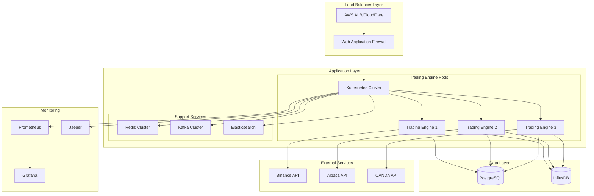

# Trading Engine Deployment Guide

## 🎯 Overview

This guide provides comprehensive instructions for deploying the Alphintra Trading Engine in various environments, from local development to production-scale Kubernetes clusters.

## 🏗️ Deployment Architecture

### Production Architecture Overview


## 🛠️ Prerequisites

### System Requirements

#### Minimum Requirements (Development)
- **CPU**: 4 cores
- **Memory**: 8 GB RAM
- **Storage**: 50 GB SSD
- **Network**: 100 Mbps

#### Recommended Requirements (Production)
- **CPU**: 16+ cores per node
- **Memory**: 32+ GB RAM per node
- **Storage**: 500+ GB NVMe SSD
- **Network**: 1+ Gbps with low latency

### Software Dependencies
- **Java**: OpenJDK 17+
- **Maven**: 3.8+
- **Docker**: 20.10+
- **Kubernetes**: 1.24+ (for K8s deployment)
- **PostgreSQL**: 15+
- **Redis**: 7+
- **Apache Kafka**: 3.5+

## 🐳 Docker Deployment

### 1. Build Docker Images

#### Application Dockerfile
```dockerfile
# Multi-stage build for Trading Engine
FROM maven:3.9-openjdk-17-slim AS builder

WORKDIR /app
COPY pom.xml .
COPY src ./src

# Build application
RUN mvn clean package -DskipTests -B

# Runtime stage
FROM openjdk:17-jre-slim

# Install required tools
RUN apt-get update && \
    apt-get install -y curl netcat-openbsd jq && \
    rm -rf /var/lib/apt/lists/*

# Create application user
RUN groupadd -r trading && useradd -r -g trading trading

WORKDIR /app

# Copy application
COPY --from=builder /app/target/*.jar app.jar
COPY docker/entrypoint.sh entrypoint.sh
COPY docker/healthcheck.sh healthcheck.sh

RUN chmod +x entrypoint.sh healthcheck.sh && \
    chown -R trading:trading /app

USER trading

# JVM optimization for containers
ENV JAVA_OPTS="-XX:+UseG1GC -XX:G1HeapRegionSize=16m -XX:+UseStringDeduplication -XX:+ExitOnOutOfMemoryError"

EXPOSE 8080
HEALTHCHECK --interval=30s --timeout=10s --start-period=60s --retries=3 \
    CMD ./healthcheck.sh

ENTRYPOINT ["./entrypoint.sh"]
```

#### Entrypoint Script
```bash
#!/bin/bash
# docker/entrypoint.sh

set -e

# Default values
JAVA_OPTS=${JAVA_OPTS:-"-Xms1g -Xmx2g"}
SPRING_PROFILES_ACTIVE=${SPRING_PROFILES_ACTIVE:-"docker"}

# Wait for dependencies
echo "Waiting for database..."
while ! nc -z ${DB_HOST:-postgres} ${DB_PORT:-5432}; do
  sleep 1
done

echo "Waiting for Redis..."
while ! nc -z ${REDIS_HOST:-redis} ${REDIS_PORT:-6379}; do
  sleep 1
done

echo "Waiting for Kafka..."
while ! nc -z ${KAFKA_HOST:-kafka} ${KAFKA_PORT:-9092}; do
  sleep 1
done

echo "Starting Trading Engine..."
exec java $JAVA_OPTS \
  -Djava.security.egd=file:/dev/./urandom \
  -Dspring.profiles.active=$SPRING_PROFILES_ACTIVE \
  -jar app.jar
```

#### Health Check Script
```bash
#!/bin/bash
# docker/healthcheck.sh

HEALTH_URL="http://localhost:8080/actuator/health"
RESPONSE=$(curl -s -o /dev/null -w "%{http_code}" $HEALTH_URL)

if [ $RESPONSE -eq 200 ]; then
    exit 0
else
    exit 1
fi
```

### 2. Docker Compose Setup

#### Complete Stack
```yaml
# docker-compose.yml
version: '3.8'

services:
  # Trading Engine
  trading-engine:
    build:
      context: .
      dockerfile: Dockerfile
    ports:
      - "8080:8080"
    environment:
      - SPRING_PROFILES_ACTIVE=docker
      - DB_HOST=postgres
      - DB_PASSWORD=${DB_PASSWORD}
      - REDIS_HOST=redis
      - KAFKA_BROKERS=kafka:9092
      - INFLUXDB_URL=http://influxdb:8086
    depends_on:
      postgres:
        condition: service_healthy
      redis:
        condition: service_healthy
      kafka:
        condition: service_healthy
    healthcheck:
      test: ["CMD", "./healthcheck.sh"]
      interval: 30s
      timeout: 10s
      retries: 3
      start_period: 60s
    restart: unless-stopped
    deploy:
      resources:
        limits:
          memory: 4G
          cpus: '2'
        reservations:
          memory: 2G
          cpus: '1'

  # PostgreSQL Database
  postgres:
    image: postgres:15
    environment:
      POSTGRES_DB: trading_engine
      POSTGRES_USER: trading
      POSTGRES_PASSWORD: ${DB_PASSWORD}
      POSTGRES_INITDB_ARGS: "--auth-host=scram-sha-256"
    volumes:
      - postgres_data:/var/lib/postgresql/data
      - ./sql/init.sql:/docker-entrypoint-initdb.d/01-init.sql
      - ./sql/schema.sql:/docker-entrypoint-initdb.d/02-schema.sql
    ports:
      - "5432:5432"
    healthcheck:
      test: ["CMD-SHELL", "pg_isready -U trading -d trading_engine"]
      interval: 10s
      timeout: 5s
      retries: 5
    command: >
      postgres
      -c max_connections=200
      -c shared_buffers=256MB
      -c effective_cache_size=1GB
      -c maintenance_work_mem=64MB
      -c checkpoint_completion_target=0.9
      -c wal_buffers=16MB
      -c default_statistics_target=100

  # Redis Cache
  redis:
    image: redis:7-alpine
    ports:
      - "6379:6379"
    volumes:
      - redis_data:/data
      - ./redis/redis.conf:/usr/local/etc/redis/redis.conf
    command: redis-server /usr/local/etc/redis/redis.conf
    healthcheck:
      test: ["CMD", "redis-cli", "ping"]
      interval: 10s
      timeout: 3s
      retries: 3
    sysctls:
      - net.core.somaxconn=65535

  # Apache Kafka
  kafka:
    image: confluentinc/cp-kafka:7.4.0
    environment:
      KAFKA_BROKER_ID: 1
      KAFKA_ZOOKEEPER_CONNECT: zookeeper:2181
      KAFKA_ADVERTISED_LISTENERS: PLAINTEXT://kafka:9092,PLAINTEXT_HOST://localhost:29092
      KAFKA_LISTENER_SECURITY_PROTOCOL_MAP: PLAINTEXT:PLAINTEXT,PLAINTEXT_HOST:PLAINTEXT
      KAFKA_INTER_BROKER_LISTENER_NAME: PLAINTEXT
      KAFKA_OFFSETS_TOPIC_REPLICATION_FACTOR: 1
      KAFKA_AUTO_CREATE_TOPICS_ENABLE: 'true'
      KAFKA_LOG_RETENTION_HOURS: 24
      KAFKA_LOG_SEGMENT_BYTES: 1073741824
      KAFKA_NUM_PARTITIONS: 3
    ports:
      - "29092:29092"
    depends_on:
      - zookeeper
    healthcheck:
      test: ["CMD", "kafka-broker-api-versions", "--bootstrap-server", "localhost:9092"]
      interval: 30s
      timeout: 10s
      retries: 3

  zookeeper:
    image: confluentinc/cp-zookeeper:7.4.0
    environment:
      ZOOKEEPER_CLIENT_PORT: 2181
      ZOOKEEPER_TICK_TIME: 2000
    volumes:
      - zk_data:/var/lib/zookeeper/data
      - zk_logs:/var/lib/zookeeper/log

  # InfluxDB (Time Series)
  influxdb:
    image: influxdb:2.7
    environment:
      DOCKER_INFLUXDB_INIT_MODE: setup
      DOCKER_INFLUXDB_INIT_USERNAME: admin
      DOCKER_INFLUXDB_INIT_PASSWORD: ${INFLUXDB_PASSWORD}
      DOCKER_INFLUXDB_INIT_ORG: alphintra
      DOCKER_INFLUXDB_INIT_BUCKET: trading_data
    ports:
      - "8086:8086"
    volumes:
      - influxdb_data:/var/lib/influxdb2

  # Monitoring
  prometheus:
    image: prom/prometheus:v2.45.0
    ports:
      - "9090:9090"
    volumes:
      - ./monitoring/prometheus.yml:/etc/prometheus/prometheus.yml
      - prometheus_data:/prometheus
    command:
      - '--config.file=/etc/prometheus/prometheus.yml'
      - '--storage.tsdb.path=/prometheus'
      - '--web.console.libraries=/etc/prometheus/console_libraries'
      - '--web.console.templates=/etc/prometheus/consoles'
      - '--storage.tsdb.retention.time=30d'
      - '--web.enable-lifecycle'

  grafana:
    image: grafana/grafana:10.0.0
    ports:
      - "3001:3000"
    environment:
      GF_SECURITY_ADMIN_PASSWORD: ${GRAFANA_PASSWORD}
    volumes:
      - grafana_data:/var/lib/grafana
      - ./monitoring/grafana/dashboards:/etc/grafana/provisioning/dashboards
      - ./monitoring/grafana/datasources:/etc/grafana/provisioning/datasources

volumes:
  postgres_data:
  redis_data:
  influxdb_data:
  prometheus_data:
  grafana_data:
  zk_data:
  zk_logs:

networks:
  default:
    driver: bridge
    ipam:
      config:
        - subnet: 172.20.0.0/16
```

### 3. Environment Configuration

#### Production Environment File
```bash
# .env.production
DB_PASSWORD=super_secure_db_password
REDIS_PASSWORD=secure_redis_password
INFLUXDB_PASSWORD=secure_influx_password
GRAFANA_PASSWORD=secure_grafana_password

# Trading Engine Configuration
SPRING_PROFILES_ACTIVE=production
JVM_OPTS=-Xms4g -Xmx8g -XX:+UseG1GC

# External APIs
BINANCE_API_URL=https://api.binance.com
ALPACA_API_URL=https://paper-api.alpaca.markets
OANDA_API_URL=https://api-fxtrade.oanda.com

# Security
JWT_SECRET=your_jwt_secret_here
ENCRYPTION_KEY=your_encryption_key_here

# Monitoring
PROMETHEUS_ENABLED=true
JAEGER_ENABLED=true
```

## ☸️ Kubernetes Deployment

### 1. Namespace and RBAC

```yaml
# k8s/namespace.yaml
apiVersion: v1
kind: Namespace
metadata:
  name: trading-engine
  labels:
    name: trading-engine

---
apiVersion: v1
kind: ServiceAccount
metadata:
  name: trading-engine-sa
  namespace: trading-engine

---
apiVersion: rbac.authorization.k8s.io/v1
kind: ClusterRole
metadata:
  name: trading-engine-role
rules:
- apiGroups: [""]
  resources: ["pods", "services", "endpoints"]
  verbs: ["get", "list", "watch"]
- apiGroups: ["apps"]
  resources: ["deployments", "replicasets"]
  verbs: ["get", "list", "watch"]

---
apiVersion: rbac.authorization.k8s.io/v1
kind: ClusterRoleBinding
metadata:
  name: trading-engine-binding
roleRef:
  apiGroup: rbac.authorization.k8s.io
  kind: ClusterRole
  name: trading-engine-role
subjects:
- kind: ServiceAccount
  name: trading-engine-sa
  namespace: trading-engine
```

### 2. ConfigMaps and Secrets

```yaml
# k8s/configmap.yaml
apiVersion: v1
kind: ConfigMap
metadata:
  name: trading-engine-config
  namespace: trading-engine
data:
  application.yml: |
    spring:
      profiles:
        active: kubernetes
      datasource:
        url: jdbc:postgresql://postgres-service:5432/trading_engine
        username: trading
      data:
        redis:
          host: redis-service
          port: 6379
      kafka:
        bootstrap-servers: kafka-service:9092
    
    management:
      endpoints:
        web:
          exposure:
            include: health,info,metrics,prometheus
      metrics:
        export:
          prometheus:
            enabled: true
    
    trading:
      brokers:
        enabled: true
        rate-limiting: true
      risk:
        enabled: true
        max-daily-loss: 10000
      
    logging:
      level:
        com.alphintra.trading: INFO
        org.springframework.security: WARN

---
apiVersion: v1
kind: Secret
metadata:
  name: trading-engine-secrets
  namespace: trading-engine
type: Opaque
data:
  db-password: <base64-encoded-password>
  redis-password: <base64-encoded-password>
  jwt-secret: <base64-encoded-jwt-secret>
  encryption-key: <base64-encoded-encryption-key>
```

### 3. Database Deployment

```yaml
# k8s/postgres.yaml
apiVersion: apps/v1
kind: StatefulSet
metadata:
  name: postgres
  namespace: trading-engine
spec:
  serviceName: postgres-service
  replicas: 1
  selector:
    matchLabels:
      app: postgres
  template:
    metadata:
      labels:
        app: postgres
    spec:
      containers:
      - name: postgres
        image: postgres:15
        env:
        - name: POSTGRES_DB
          value: trading_engine
        - name: POSTGRES_USER
          value: trading
        - name: POSTGRES_PASSWORD
          valueFrom:
            secretKeyRef:
              name: trading-engine-secrets
              key: db-password
        ports:
        - containerPort: 5432
        volumeMounts:
        - name: postgres-data
          mountPath: /var/lib/postgresql/data
        resources:
          requests:
            memory: "1Gi"
            cpu: "500m"
          limits:
            memory: "4Gi"
            cpu: "2"
        livenessProbe:
          exec:
            command:
            - pg_isready
            - -U
            - trading
            - -d
            - trading_engine
          initialDelaySeconds: 30
          periodSeconds: 10
        readinessProbe:
          exec:
            command:
            - pg_isready
            - -U
            - trading
            - -d
            - trading_engine
          initialDelaySeconds: 5
          periodSeconds: 5
  volumeClaimTemplates:
  - metadata:
      name: postgres-data
    spec:
      accessModes: ["ReadWriteOnce"]
      storageClassName: fast-ssd
      resources:
        requests:
          storage: 100Gi

---
apiVersion: v1
kind: Service
metadata:
  name: postgres-service
  namespace: trading-engine
spec:
  selector:
    app: postgres
  ports:
  - port: 5432
    targetPort: 5432
  clusterIP: None
```

### 4. Trading Engine Deployment

```yaml
# k8s/trading-engine.yaml
apiVersion: apps/v1
kind: Deployment
metadata:
  name: trading-engine
  namespace: trading-engine
  labels:
    app: trading-engine
spec:
  replicas: 3
  strategy:
    type: RollingUpdate
    rollingUpdate:
      maxUnavailable: 1
      maxSurge: 1
  selector:
    matchLabels:
      app: trading-engine
  template:
    metadata:
      labels:
        app: trading-engine
      annotations:
        prometheus.io/scrape: "true"
        prometheus.io/port: "8080"
        prometheus.io/path: "/actuator/prometheus"
    spec:
      serviceAccountName: trading-engine-sa
      containers:
      - name: trading-engine
        image: alphintra/trading-engine:latest
        ports:
        - containerPort: 8080
        env:
        - name: SPRING_PROFILES_ACTIVE
          value: "kubernetes"
        - name: DB_PASSWORD
          valueFrom:
            secretKeyRef:
              name: trading-engine-secrets
              key: db-password
        - name: REDIS_PASSWORD
          valueFrom:
            secretKeyRef:
              name: trading-engine-secrets
              key: redis-password
        - name: JWT_SECRET
          valueFrom:
            secretKeyRef:
              name: trading-engine-secrets
              key: jwt-secret
        - name: JAVA_OPTS
          value: "-Xms2g -Xmx4g -XX:+UseG1GC"
        volumeMounts:
        - name: config
          mountPath: /app/config
        resources:
          requests:
            memory: "2Gi"
            cpu: "1"
          limits:
            memory: "6Gi"
            cpu: "4"
        livenessProbe:
          httpGet:
            path: /actuator/health/liveness
            port: 8080
          initialDelaySeconds: 60
          periodSeconds: 30
          timeoutSeconds: 10
          failureThreshold: 3
        readinessProbe:
          httpGet:
            path: /actuator/health/readiness
            port: 8080
          initialDelaySeconds: 30
          periodSeconds: 10
          timeoutSeconds: 5
          failureThreshold: 3
        lifecycle:
          preStop:
            exec:
              command: ["/bin/sh", "-c", "sleep 15"]
      volumes:
      - name: config
        configMap:
          name: trading-engine-config
      terminationGracePeriodSeconds: 30

---
apiVersion: v1
kind: Service
metadata:
  name: trading-engine-service
  namespace: trading-engine
  labels:
    app: trading-engine
spec:
  selector:
    app: trading-engine
  ports:
  - name: http
    port: 80
    targetPort: 8080
    protocol: TCP
  type: ClusterIP

---
apiVersion: autoscaling/v2
kind: HorizontalPodAutoscaler
metadata:
  name: trading-engine-hpa
  namespace: trading-engine
spec:
  scaleTargetRef:
    apiVersion: apps/v1
    kind: Deployment
    name: trading-engine
  minReplicas: 3
  maxReplicas: 10
  metrics:
  - type: Resource
    resource:
      name: cpu
      target:
        type: Utilization
        averageUtilization: 70
  - type: Resource
    resource:
      name: memory
      target:
        type: Utilization
        averageUtilization: 80
  behavior:
    scaleUp:
      stabilizationWindowSeconds: 300
      policies:
      - type: Percent
        value: 100
        periodSeconds: 15
    scaleDown:
      stabilizationWindowSeconds: 300
      policies:
      - type: Percent
        value: 10
        periodSeconds: 60
```

### 5. Ingress Configuration

```yaml
# k8s/ingress.yaml
apiVersion: networking.k8s.io/v1
kind: Ingress
metadata:
  name: trading-engine-ingress
  namespace: trading-engine
  annotations:
    kubernetes.io/ingress.class: "nginx"
    cert-manager.io/cluster-issuer: "letsencrypt-prod"
    nginx.ingress.kubernetes.io/ssl-redirect: "true"
    nginx.ingress.kubernetes.io/backend-protocol: "HTTP"
    nginx.ingress.kubernetes.io/rate-limit: "100"
    nginx.ingress.kubernetes.io/rate-limit-window: "1m"
    nginx.ingress.kubernetes.io/proxy-body-size: "10m"
    nginx.ingress.kubernetes.io/proxy-connect-timeout: "30"
    nginx.ingress.kubernetes.io/proxy-read-timeout: "60"
    nginx.ingress.kubernetes.io/enable-cors: "true"
    nginx.ingress.kubernetes.io/cors-allow-origin: "https://app.alphintra.com"
spec:
  tls:
  - hosts:
    - api.alphintra.com
    secretName: trading-engine-tls
  rules:
  - host: api.alphintra.com
    http:
      paths:
      - path: /trading
        pathType: Prefix
        backend:
          service:
            name: trading-engine-service
            port:
              number: 80
```

## 🚀 CI/CD Pipeline

### GitHub Actions Workflow

```yaml
# .github/workflows/deploy.yml
name: Deploy Trading Engine

on:
  push:
    branches: [main, develop]
  pull_request:
    branches: [main]

env:
  REGISTRY: ghcr.io
  IMAGE_NAME: alphintra/trading-engine

jobs:
  test:
    runs-on: ubuntu-latest
    
    services:
      postgres:
        image: postgres:15
        env:
          POSTGRES_PASSWORD: test
          POSTGRES_DB: trading_test
        options: >-
          --health-cmd pg_isready
          --health-interval 10s
          --health-timeout 5s
          --health-retries 5
        ports:
          - 5432:5432
      
      redis:
        image: redis:7-alpine
        options: >-
          --health-cmd "redis-cli ping"
          --health-interval 10s
          --health-timeout 5s
          --health-retries 5
        ports:
          - 6379:6379

    steps:
    - name: Checkout code
      uses: actions/checkout@v4

    - name: Set up JDK 17
      uses: actions/setup-java@v3
      with:
        java-version: '17'
        distribution: 'temurin'

    - name: Cache Maven packages
      uses: actions/cache@v3
      with:
        path: ~/.m2
        key: ${{ runner.os }}-m2-${{ hashFiles('**/pom.xml') }}
        restore-keys: ${{ runner.os }}-m2

    - name: Run tests
      run: mvn clean verify
      env:
        SPRING_PROFILES_ACTIVE: test
        DB_URL: jdbc:postgresql://localhost:5432/trading_test
        REDIS_HOST: localhost

    - name: Generate test report
      uses: dorny/test-reporter@v1
      if: success() || failure()
      with:
        name: Maven Tests
        path: target/surefire-reports/*.xml
        reporter: java-junit

    - name: Upload coverage to Codecov
      uses: codecov/codecov-action@v3
      with:
        file: target/site/jacoco/jacoco.xml

  build:
    needs: test
    runs-on: ubuntu-latest
    if: github.ref == 'refs/heads/main' || github.ref == 'refs/heads/develop'
    
    outputs:
      image-tag: ${{ steps.meta.outputs.tags }}
      image-digest: ${{ steps.build.outputs.digest }}

    steps:
    - name: Checkout code
      uses: actions/checkout@v4

    - name: Set up Docker Buildx
      uses: docker/setup-buildx-action@v2

    - name: Log in to Container Registry
      uses: docker/login-action@v2
      with:
        registry: ${{ env.REGISTRY }}
        username: ${{ github.actor }}
        password: ${{ secrets.GITHUB_TOKEN }}

    - name: Extract metadata
      id: meta
      uses: docker/metadata-action@v4
      with:
        images: ${{ env.REGISTRY }}/${{ env.IMAGE_NAME }}
        tags: |
          type=ref,event=branch
          type=sha,prefix={{branch}}-
          type=raw,value=latest,enable={{is_default_branch}}

    - name: Build and push
      id: build
      uses: docker/build-push-action@v4
      with:
        context: .
        push: true
        tags: ${{ steps.meta.outputs.tags }}
        labels: ${{ steps.meta.outputs.labels }}
        cache-from: type=gha
        cache-to: type=gha,mode=max
        platforms: linux/amd64,linux/arm64

  deploy-staging:
    needs: build
    runs-on: ubuntu-latest
    if: github.ref == 'refs/heads/develop'
    environment: staging
    
    steps:
    - name: Checkout code
      uses: actions/checkout@v4

    - name: Configure kubectl
      uses: azure/k8s-set-context@v3
      with:
        method: kubeconfig
        kubeconfig: ${{ secrets.KUBE_CONFIG_STAGING }}

    - name: Deploy to staging
      uses: azure/k8s-deploy@v1
      with:
        manifests: |
          k8s/namespace.yaml
          k8s/configmap.yaml
          k8s/secrets.yaml
          k8s/postgres.yaml
          k8s/redis.yaml
          k8s/trading-engine.yaml
          k8s/ingress.yaml
        images: ${{ needs.build.outputs.image-tag }}
        namespace: trading-engine-staging

  deploy-production:
    needs: build
    runs-on: ubuntu-latest
    if: github.ref == 'refs/heads/main'
    environment: production
    
    steps:
    - name: Checkout code
      uses: actions/checkout@v4

    - name: Configure kubectl
      uses: azure/k8s-set-context@v3
      with:
        method: kubeconfig
        kubeconfig: ${{ secrets.KUBE_CONFIG_PRODUCTION }}

    - name: Deploy to production
      uses: azure/k8s-deploy@v1
      with:
        manifests: |
          k8s/namespace.yaml
          k8s/configmap.yaml
          k8s/secrets.yaml
          k8s/postgres.yaml
          k8s/redis.yaml
          k8s/trading-engine.yaml
          k8s/ingress.yaml
        images: ${{ needs.build.outputs.image-tag }}
        namespace: trading-engine
        strategy: blue-green

    - name: Verify deployment
      run: |
        kubectl rollout status deployment/trading-engine -n trading-engine --timeout=300s
        kubectl get pods -n trading-engine
        
    - name: Run smoke tests
      run: |
        # Wait for service to be ready
        sleep 30
        
        # Basic health check
        curl -f https://api.alphintra.com/trading/actuator/health
        
        # API test
        curl -f -H "Authorization: Bearer ${{ secrets.API_TEST_TOKEN }}" \
             https://api.alphintra.com/trading/api/v1/health
```

## 📊 Monitoring Setup

### Prometheus Configuration

```yaml
# monitoring/prometheus.yml
global:
  scrape_interval: 15s
  evaluation_interval: 15s

rule_files:
  - "trading_engine_rules.yml"

alerting:
  alertmanagers:
    - static_configs:
        - targets:
          - alertmanager:9093

scrape_configs:
  - job_name: 'trading-engine'
    kubernetes_sd_configs:
      - role: pod
        namespaces:
          names:
            - trading-engine
    relabel_configs:
      - source_labels: [__meta_kubernetes_pod_annotation_prometheus_io_scrape]
        action: keep
        regex: true
      - source_labels: [__meta_kubernetes_pod_annotation_prometheus_io_path]
        action: replace
        target_label: __metrics_path__
        regex: (.+)
      - source_labels: [__address__, __meta_kubernetes_pod_annotation_prometheus_io_port]
        action: replace
        regex: ([^:]+)(?::\d+)?;(\d+)
        replacement: $1:$2
        target_label: __address__

  - job_name: 'postgres-exporter'
    static_configs:
      - targets: ['postgres-exporter:9187']

  - job_name: 'redis-exporter'
    static_configs:
      - targets: ['redis-exporter:9121']
```

### Grafana Dashboards

```json
{
  "dashboard": {
    "title": "Trading Engine Production Dashboard",
    "panels": [
      {
        "title": "Request Rate",
        "type": "graph",
        "targets": [
          {
            "expr": "sum(rate(http_requests_total{job=\"trading-engine\"}[5m])) by (method, status)",
            "legendFormat": "{{method}} - {{status}}"
          }
        ]
      },
      {
        "title": "Response Time P95",
        "type": "graph", 
        "targets": [
          {
            "expr": "histogram_quantile(0.95, sum(rate(http_request_duration_seconds_bucket{job=\"trading-engine\"}[5m])) by (le))",
            "legendFormat": "95th percentile"
          }
        ]
      },
      {
        "title": "Orders Per Second",
        "type": "stat",
        "targets": [
          {
            "expr": "sum(rate(trading_orders_total[1m]))",
            "legendFormat": "Orders/sec"
          }
        ]
      },
      {
        "title": "Error Rate",
        "type": "stat",
        "targets": [
          {
            "expr": "sum(rate(http_requests_total{status=~\"5..\"}[5m])) / sum(rate(http_requests_total[5m]))",
            "legendFormat": "Error Rate %"
          }
        ]
      }
    ]
  }
}
```

## 🔧 Operations Runbook

### Deployment Procedures

#### 1. Pre-Deployment Checklist
- [ ] Run all tests locally
- [ ] Review configuration changes
- [ ] Check database migration scripts
- [ ] Verify broker API credentials
- [ ] Confirm monitoring alerts are active
- [ ] Notify stakeholders of deployment window

#### 2. Deployment Steps
```bash
# 1. Backup current state
kubectl create backup trading-engine-backup-$(date +%Y%m%d-%H%M%S)

# 2. Apply configuration changes
kubectl apply -f k8s/configmap.yaml
kubectl apply -f k8s/secrets.yaml

# 3. Update application
kubectl set image deployment/trading-engine \
  trading-engine=alphintra/trading-engine:$NEW_VERSION \
  -n trading-engine

# 4. Monitor rollout
kubectl rollout status deployment/trading-engine -n trading-engine

# 5. Verify health
kubectl get pods -n trading-engine
curl -f https://api.alphintra.com/trading/actuator/health
```

#### 3. Rollback Procedure
```bash
# Quick rollback to previous version
kubectl rollout undo deployment/trading-engine -n trading-engine

# Rollback to specific revision
kubectl rollout undo deployment/trading-engine --to-revision=3 -n trading-engine

# Verify rollback
kubectl rollout status deployment/trading-engine -n trading-engine
```

### Scaling Operations

#### Manual Scaling
```bash
# Scale up for high load
kubectl scale deployment trading-engine --replicas=10 -n trading-engine

# Scale down during low activity
kubectl scale deployment trading-engine --replicas=3 -n trading-engine
```

#### Auto-scaling Configuration
```bash
# Update HPA settings
kubectl patch hpa trading-engine-hpa -n trading-engine -p '{"spec":{"maxReplicas":15}}'
```

### Troubleshooting Guide

#### Common Issues and Solutions

1. **High Memory Usage**
```bash
# Check memory usage
kubectl top pods -n trading-engine

# Adjust JVM settings
kubectl set env deployment/trading-engine JAVA_OPTS="-Xms2g -Xmx6g -XX:+UseG1GC" -n trading-engine
```

2. **Database Connection Issues**
```bash
# Check database connectivity
kubectl exec -it deployment/trading-engine -n trading-engine -- nc -zv postgres-service 5432

# Check database logs
kubectl logs statefulset/postgres -n trading-engine
```

3. **Broker API Failures**
```bash
# Check external connectivity
kubectl exec -it deployment/trading-engine -n trading-engine -- curl -I https://api.binance.com

# Review broker adapter logs
kubectl logs deployment/trading-engine -n trading-engine | grep "BrokerAdapter"
```

This comprehensive deployment guide provides everything needed to successfully deploy and operate the Trading Engine in production environments.