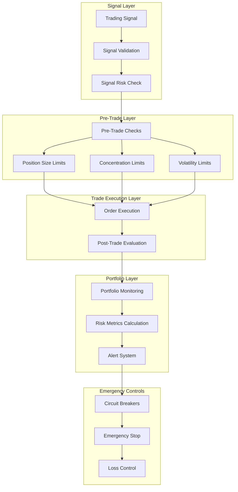

# Risk Management Framework

## 🎯 Overview

The Alphintra Risk Management Framework provides comprehensive risk controls and monitoring for the trading engine, ensuring capital preservation and regulatory compliance across all trading activities.

## 🏗️ Risk Architecture

### Multi-Layer Risk Control System



## 🛡️ Risk Control Types

### 1. Pre-Trade Risk Controls

#### Position Size Controls
```java
@Component
public class PositionSizeController {
    
    @Value("${risk.position.max-single-position-percent:5.0}")
    private double maxSinglePositionPercent;
    
    @Value("${risk.position.max-sector-concentration:20.0}")
    private double maxSectorConcentration;
    
    public RiskCheckResult validatePositionSize(OrderRequest order, Portfolio portfolio) {
        // 1. Check single position limit
        BigDecimal orderValue = order.getQuantity().multiply(order.getPrice());
        BigDecimal portfolioValue = portfolio.getTotalValue();
        double positionPercent = orderValue.divide(portfolioValue, ROUND_HALF_UP)
                                          .multiply(BigDecimal.valueOf(100))
                                          .doubleValue();
        
        if (positionPercent > maxSinglePositionPercent) {
            return RiskCheckResult.rejected("Position size exceeds maximum allowed: " + 
                                          positionPercent + "% > " + maxSinglePositionPercent + "%");
        }
        
        // 2. Check sector concentration
        String sector = getSector(order.getSymbol());
        double currentSectorExposure = portfolio.getSectorExposure(sector);
        double newSectorExposure = currentSectorExposure + positionPercent;
        
        if (newSectorExposure > maxSectorConcentration) {
            return RiskCheckResult.rejected("Sector concentration limit exceeded: " + 
                                          newSectorExposure + "% > " + maxSectorConcentration + "%");
        }
        
        // 3. Dynamic position sizing based on volatility
        BigDecimal adjustedSize = applyVolatilityAdjustment(order, portfolio);
        
        return RiskCheckResult.approved()
                             .withAdjustedQuantity(adjustedSize)
                             .withRiskScore(calculateRiskScore(order, portfolio));
    }
    
    private BigDecimal applyVolatilityAdjustment(OrderRequest order, Portfolio portfolio) {
        // Get historical volatility
        double volatility = marketDataService.getVolatility(order.getSymbol(), 30);
        
        // Base volatility assumption (20% annual)
        double baseVolatility = 0.20;
        
        // Adjustment factor (reduce size for high volatility assets)
        double adjustmentFactor = Math.min(1.0, baseVolatility / volatility);
        
        return order.getQuantity().multiply(BigDecimal.valueOf(adjustmentFactor));
    }
}
```

#### Leverage Controls
```java
@Component
public class LeverageController {
    
    @Value("${risk.leverage.max-portfolio-leverage:3.0}")
    private double maxPortfolioLeverage;
    
    @Value("${risk.leverage.max-asset-leverage}")
    private Map<String, Double> maxAssetLeverage;
    
    public RiskCheckResult validateLeverage(OrderRequest order, Portfolio portfolio) {
        // 1. Check portfolio-level leverage
        BigDecimal currentLeverage = calculatePortfolioLeverage(portfolio);
        BigDecimal orderValue = order.getQuantity().multiply(order.getPrice());
        BigDecimal newLeverage = currentLeverage.add(
            orderValue.divide(portfolio.getTotalValue(), ROUND_HALF_UP)
        );
        
        if (newLeverage.doubleValue() > maxPortfolioLeverage) {
            return RiskCheckResult.rejected("Portfolio leverage limit exceeded: " + 
                                          newLeverage + " > " + maxPortfolioLeverage);
        }
        
        // 2. Check asset-specific leverage limits
        String assetClass = getAssetClass(order.getSymbol());
        Double maxLeverage = maxAssetLeverage.get(assetClass);
        
        if (maxLeverage != null) {
            double assetLeverage = calculateAssetLeverage(order, portfolio, assetClass);
            if (assetLeverage > maxLeverage) {
                return RiskCheckResult.rejected("Asset leverage limit exceeded for " + assetClass + 
                                              ": " + assetLeverage + " > " + maxLeverage);
            }
        }
        
        return RiskCheckResult.approved();
    }
    
    private BigDecimal calculatePortfolioLeverage(Portfolio portfolio) {
        BigDecimal totalExposure = BigDecimal.ZERO;
        
        for (Position position : portfolio.getPositions()) {
            BigDecimal positionValue = position.getQuantity()
                                            .multiply(position.getCurrentPrice())
                                            .abs(); // Use absolute value for long/short
            totalExposure = totalExposure.add(positionValue);
        }
        
        return totalExposure.divide(portfolio.getTotalValue(), ROUND_HALF_UP);
    }
}
```

### 2. Real-Time Risk Monitoring

#### Value at Risk (VaR) Calculator
```java
@Component
public class VaRCalculator {
    
    private static final int VAR_CONFIDENCE_LEVEL = 95; // 95% confidence
    private static final int VAR_TIME_HORIZON = 1; // 1 day
    private static final int HISTORICAL_DAYS = 252; // 1 year of trading days
    
    @Cacheable(value = "varCalculations", key = "#portfolio.portfolioId")
    public VaRResult calculatePortfolioVaR(Portfolio portfolio) {
        // 1. Historical Simulation Method
        VaRResult historicalVaR = calculateHistoricalVaR(portfolio);
        
        // 2. Monte Carlo Simulation
        VaRResult monteCarloVaR = calculateMonteCarloVaR(portfolio);
        
        // 3. Parametric Method (Delta-Normal)
        VaRResult parametricVaR = calculateParametricVaR(portfolio);
        
        // Return the most conservative estimate
        return Stream.of(historicalVaR, monteCarloVaR, parametricVaR)
                    .max(Comparator.comparing(VaRResult::getVaRAmount))
                    .orElse(historicalVaR);
    }
    
    private VaRResult calculateHistoricalVaR(Portfolio portfolio) {
        List<BigDecimal> portfolioReturns = new ArrayList<>();
        
        // Get historical returns for each position
        for (Position position : portfolio.getPositions()) {
            List<BigDecimal> assetReturns = marketDataService.getHistoricalReturns(
                position.getSymbol(), 
                HISTORICAL_DAYS
            );
            
            // Weight by position size
            BigDecimal weight = position.getMarketValue()
                                      .divide(portfolio.getTotalValue(), ROUND_HALF_UP);
            
            for (int i = 0; i < assetReturns.size(); i++) {
                BigDecimal weightedReturn = assetReturns.get(i).multiply(weight);
                
                if (i < portfolioReturns.size()) {
                    portfolioReturns.set(i, portfolioReturns.get(i).add(weightedReturn));
                } else {
                    portfolioReturns.add(weightedReturn);
                }
            }
        }
        
        // Sort returns and find percentile
        Collections.sort(portfolioReturns);
        int percentileIndex = (int) Math.floor((100 - VAR_CONFIDENCE_LEVEL) / 100.0 * portfolioReturns.size());
        BigDecimal varReturn = portfolioReturns.get(percentileIndex);
        
        // Convert to dollar amount
        BigDecimal varAmount = varReturn.multiply(portfolio.getTotalValue()).abs();
        
        return VaRResult.builder()
                       .method("Historical Simulation")
                       .confidenceLevel(VAR_CONFIDENCE_LEVEL)
                       .timeHorizon(VAR_TIME_HORIZON)
                       .varAmount(varAmount)
                       .varPercent(varReturn.abs())
                       .calculatedAt(LocalDateTime.now())
                       .build();
    }
    
    private VaRResult calculateMonteCarloVaR(Portfolio portfolio) {
        int numSimulations = 10000;
        List<BigDecimal> simulatedReturns = new ArrayList<>();
        
        // Get correlation matrix and volatilities
        CorrelationMatrix correlations = calculateCorrelationMatrix(portfolio);
        Map<String, Double> volatilities = calculateVolatilities(portfolio);
        
        Random random = new Random();
        
        for (int sim = 0; sim < numSimulations; sim++) {
            BigDecimal portfolioReturn = BigDecimal.ZERO;
            
            for (Position position : portfolio.getPositions()) {
                // Generate correlated random returns
                double randomReturn = generateCorrelatedReturn(
                    position.getSymbol(), 
                    random, 
                    correlations, 
                    volatilities
                );
                
                BigDecimal weight = position.getMarketValue()
                                          .divide(portfolio.getTotalValue(), ROUND_HALF_UP);
                BigDecimal weightedReturn = BigDecimal.valueOf(randomReturn).multiply(weight);
                
                portfolioReturn = portfolioReturn.add(weightedReturn);
            }
            
            simulatedReturns.add(portfolioReturn);
        }
        
        // Find VaR from simulated returns
        Collections.sort(simulatedReturns);
        int percentileIndex = (int) Math.floor((100 - VAR_CONFIDENCE_LEVEL) / 100.0 * simulatedReturns.size());
        BigDecimal varReturn = simulatedReturns.get(percentileIndex);
        BigDecimal varAmount = varReturn.multiply(portfolio.getTotalValue()).abs();
        
        return VaRResult.builder()
                       .method("Monte Carlo Simulation")
                       .confidenceLevel(VAR_CONFIDENCE_LEVEL)
                       .timeHorizon(VAR_TIME_HORIZON)
                       .varAmount(varAmount)
                       .varPercent(varReturn.abs())
                       .calculatedAt(LocalDateTime.now())
                       .numSimulations(numSimulations)
                       .build();
    }
}
```

#### Drawdown Monitor
```java
@Component
@Slf4j
public class DrawdownMonitor {
    
    @Value("${risk.drawdown.max-daily-drawdown:5.0}")
    private double maxDailyDrawdown;
    
    @Value("${risk.drawdown.max-weekly-drawdown:10.0}")
    private double maxWeeklyDrawdown;
    
    @Value("${risk.drawdown.max-monthly-drawdown:20.0}")
    private double maxMonthlyDrawdown;
    
    @Autowired
    private PortfolioService portfolioService;
    
    @Autowired
    private TradingEngine tradingEngine;
    
    @Autowired
    private NotificationService notificationService;
    
    @Scheduled(fixedRate = 30000) // Check every 30 seconds
    public void monitorDrawdowns() {
        List<Portfolio> portfolios = portfolioService.getAllActivePortfolios();
        
        for (Portfolio portfolio : portfolios) {
            DrawdownMetrics metrics = calculateDrawdownMetrics(portfolio);
            
            // Check daily drawdown
            if (metrics.getDailyDrawdown() > maxDailyDrawdown) {
                handleDrawdownBreach(portfolio, "DAILY", metrics.getDailyDrawdown(), maxDailyDrawdown);
            }
            
            // Check weekly drawdown
            if (metrics.getWeeklyDrawdown() > maxWeeklyDrawdown) {
                handleDrawdownBreach(portfolio, "WEEKLY", metrics.getWeeklyDrawdown(), maxWeeklyDrawdown);
            }
            
            // Check monthly drawdown
            if (metrics.getMonthlyDrawdown() > maxMonthlyDrawdown) {
                handleDrawdownBreach(portfolio, "MONTHLY", metrics.getMonthlyDrawdown(), maxMonthlyDrawdown);
            }
        }
    }
    
    private void handleDrawdownBreach(Portfolio portfolio, String period, double currentDrawdown, double maxDrawdown) {
        log.warn("Drawdown breach detected for portfolio {}: {} drawdown {}% exceeds limit {}%",
                portfolio.getPortfolioId(), period, currentDrawdown, maxDrawdown);
        
        // Determine response based on severity
        double severityRatio = currentDrawdown / maxDrawdown;
        
        if (severityRatio >= 1.5) {
            // Emergency stop - close all positions
            tradingEngine.emergencyStop(portfolio.getUserId(), 
                                       "Critical drawdown: " + currentDrawdown + "%");
        } else if (severityRatio >= 1.2) {
            // Reduce position sizes by 50%
            tradingEngine.reduceAllPositions(portfolio.getUserId(), 0.5);
            
            // Halt new positions
            tradingEngine.haltNewPositions(portfolio.getUserId(), Duration.ofHours(1));
        } else {
            // Tighten stop losses
            tradingEngine.tightenStopLosses(portfolio.getUserId(), 0.8);
            
            // Send warning notification
            notificationService.sendDrawdownWarning(portfolio.getUserId(), currentDrawdown, maxDrawdown);
        }
    }
    
    private DrawdownMetrics calculateDrawdownMetrics(Portfolio portfolio) {
        LocalDateTime now = LocalDateTime.now();
        
        // Get portfolio values for different periods
        BigDecimal currentValue = portfolio.getTotalValue();
        
        BigDecimal dailyHighWaterMark = portfolioService.getHighWaterMark(
            portfolio.getPortfolioId(), 
            now.minusDays(1), 
            now
        );
        
        BigDecimal weeklyHighWaterMark = portfolioService.getHighWaterMark(
            portfolio.getPortfolioId(), 
            now.minusWeeks(1), 
            now
        );
        
        BigDecimal monthlyHighWaterMark = portfolioService.getHighWaterMark(
            portfolio.getPortfolioId(), 
            now.minusMonths(1), 
            now
        );
        
        // Calculate drawdowns
        double dailyDrawdown = calculateDrawdownPercent(currentValue, dailyHighWaterMark);
        double weeklyDrawdown = calculateDrawdownPercent(currentValue, weeklyHighWaterMark);
        double monthlyDrawdown = calculateDrawdownPercent(currentValue, monthlyHighWaterMark);
        
        return DrawdownMetrics.builder()
                             .portfolioId(portfolio.getPortfolioId())
                             .currentValue(currentValue)
                             .dailyDrawdown(dailyDrawdown)
                             .weeklyDrawdown(weeklyDrawdown)
                             .monthlyDrawdown(monthlyDrawdown)
                             .calculatedAt(now)
                             .build();
    }
}
```

### 3. Dynamic Risk Adjustment

#### Volatility-Based Position Sizing
```java
@Component
public class VolatilityPositionSizer {
    
    @Value("${risk.volatility.target-volatility:0.02}")
    private double targetVolatility; // 2% daily volatility target
    
    @Value("${risk.volatility.lookback-days:30}")
    private int lookbackDays;
    
    public BigDecimal calculateOptimalSize(TradingSignal signal, Portfolio portfolio) {
        // 1. Get asset volatility
        double assetVolatility = marketDataService.getVolatility(signal.getSymbol(), lookbackDays);
        
        // 2. Calculate position volatility contribution
        double portfolioVolatility = calculatePortfolioVolatility(portfolio);
        
        // 3. Available risk budget
        double availableVolatility = Math.max(0, targetVolatility - portfolioVolatility);
        
        if (availableVolatility <= 0) {
            return BigDecimal.ZERO; // No risk budget available
        }
        
        // 4. Calculate position size based on volatility budget
        // Position size = (Available Risk Budget / Asset Volatility) * Portfolio Value
        BigDecimal maxPositionValue = BigDecimal.valueOf(availableVolatility / assetVolatility)
                                               .multiply(portfolio.getTotalValue());
        
        // 5. Convert to quantity
        BigDecimal maxQuantity = maxPositionValue.divide(signal.getEntryPrice(), ROUND_HALF_UP);
        
        // 6. Apply Kelly Criterion adjustment
        BigDecimal kellyAdjustedSize = applyKellyCriterion(signal, maxQuantity);
        
        // 7. Apply confidence scaling
        BigDecimal confidenceScaledSize = kellyAdjustedSize.multiply(
            BigDecimal.valueOf(signal.getConfidence())
        );
        
        return confidenceScaledSize;
    }
    
    private BigDecimal applyKellyCriterion(TradingSignal signal, BigDecimal maxQuantity) {
        // Kelly Criterion: f* = (bp - q) / b
        // where:
        // f* = fraction of capital to wager
        // b = odds (reward/risk ratio)
        // p = probability of winning (signal confidence)
        // q = probability of losing (1 - p)
        
        if (signal.getStopLoss() == null || signal.getTakeProfit() == null) {
            return maxQuantity.multiply(BigDecimal.valueOf(0.1)); // Conservative 10%
        }
        
        BigDecimal winAmount = signal.getTakeProfit().subtract(signal.getEntryPrice());
        BigDecimal lossAmount = signal.getEntryPrice().subtract(signal.getStopLoss());
        
        if (lossAmount.compareTo(BigDecimal.ZERO) <= 0) {
            return maxQuantity.multiply(BigDecimal.valueOf(0.1));
        }
        
        BigDecimal rewardRiskRatio = winAmount.divide(lossAmount, ROUND_HALF_UP);
        BigDecimal winProbability = BigDecimal.valueOf(signal.getConfidence());
        BigDecimal lossProbability = BigDecimal.ONE.subtract(winProbability);
        
        BigDecimal kellyCriterion = winProbability.multiply(rewardRiskRatio)
                                                 .subtract(lossProbability)
                                                 .divide(rewardRiskRatio, ROUND_HALF_UP);
        
        // Apply fractional Kelly (typically 25% of full Kelly)
        BigDecimal fractionalKelly = kellyCriterion.multiply(BigDecimal.valueOf(0.25));
        
        // Ensure positive and within max quantity
        fractionalKelly = fractionalKelly.max(BigDecimal.ZERO).min(BigDecimal.ONE);
        
        return maxQuantity.multiply(fractionalKelly);
    }
}
```

### 4. Correlation Risk Management

#### Correlation Monitor
```java
@Component
public class CorrelationRiskManager {
    
    @Value("${risk.correlation.max-correlation:0.7}")
    private double maxCorrelation;
    
    @Value("${risk.correlation.correlation-window:60}")
    private int correlationWindow; // days
    
    public RiskCheckResult validateCorrelationRisk(OrderRequest order, Portfolio portfolio) {
        String newSymbol = order.getSymbol();
        
        // Check correlation with existing positions
        for (Position position : portfolio.getPositions()) {
            if (position.getQuantity().compareTo(BigDecimal.ZERO) == 0) {
                continue; // Skip closed positions
            }
            
            double correlation = calculateCorrelation(newSymbol, position.getSymbol());
            
            if (Math.abs(correlation) > maxCorrelation) {
                // Calculate combined position size
                BigDecimal existingValue = position.getMarketValue();
                BigDecimal newPositionValue = order.getQuantity().multiply(order.getPrice());
                BigDecimal combinedValue = existingValue.add(newPositionValue);
                
                double combinedPercent = combinedValue.divide(portfolio.getTotalValue(), ROUND_HALF_UP)
                                                    .multiply(BigDecimal.valueOf(100))
                                                    .doubleValue();
                
                // Check if combined exposure is acceptable
                if (combinedPercent > 10.0) { // Max 10% for highly correlated positions
                    return RiskCheckResult.rejected(
                        String.format("High correlation risk: %s and %s correlation %.2f, combined exposure %.1f%%",
                                    newSymbol, position.getSymbol(), correlation, combinedPercent)
                    );
                }
                
                // Reduce position size for correlated assets
                BigDecimal adjustedQuantity = order.getQuantity()
                                                  .multiply(BigDecimal.valueOf(1.0 - Math.abs(correlation)));
                
                return RiskCheckResult.approved()
                                    .withAdjustedQuantity(adjustedQuantity)
                                    .withWarning("Position size reduced due to correlation with " + position.getSymbol());
            }
        }
        
        return RiskCheckResult.approved();
    }
    
    private double calculateCorrelation(String symbol1, String symbol2) {
        if (symbol1.equals(symbol2)) {
            return 1.0;
        }
        
        // Get historical returns
        List<BigDecimal> returns1 = marketDataService.getHistoricalReturns(symbol1, correlationWindow);
        List<BigDecimal> returns2 = marketDataService.getHistoricalReturns(symbol2, correlationWindow);
        
        if (returns1.size() != returns2.size() || returns1.size() < 30) {
            return 0.0; // Not enough data
        }
        
        // Calculate Pearson correlation coefficient
        return StatisticsUtils.calculateCorrelation(returns1, returns2);
    }
}
```

### 5. Market Risk Controls

#### Market Volatility Monitor
```java
@Component
public class MarketVolatilityMonitor {
    
    @Value("${risk.market.vix-threshold:30.0}")
    private double vixThreshold;
    
    @Value("${risk.market.volatility-spike-threshold:2.0}")
    private double volatilitySpikeThreshold; // 2x normal volatility
    
    @Autowired
    private TradingEngine tradingEngine;
    
    @EventListener
    public void handleMarketData(MarketDataEvent event) {
        if ("VIX".equals(event.getSymbol())) {
            handleVIXUpdate(event.getPrice());
        }
        
        // Check for volatility spikes in major indices
        if (isMajorIndex(event.getSymbol())) {
            checkVolatilitySpike(event.getSymbol(), event.getPrice());
        }
    }
    
    private void handleVIXUpdate(BigDecimal vixLevel) {
        double vix = vixLevel.doubleValue();
        
        if (vix > vixThreshold) {
            MarketCondition condition = determineMarketCondition(vix);
            
            switch (condition) {
                case HIGH_VOLATILITY:
                    // Reduce position sizes by 25%
                    tradingEngine.adjustGlobalPositionSizing(0.75);
                    // Tighten stop losses
                    tradingEngine.adjustGlobalStopLosses(0.9);
                    break;
                    
                case EXTREME_VOLATILITY:
                    // Reduce position sizes by 50%
                    tradingEngine.adjustGlobalPositionSizing(0.5);
                    // Very tight stop losses
                    tradingEngine.adjustGlobalStopLosses(0.8);
                    // Halt new momentum strategies
                    tradingEngine.haltStrategiesByType("MOMENTUM");
                    break;
                    
                case MARKET_PANIC:
                    // Emergency risk reduction
                    tradingEngine.emergencyRiskReduction();
                    // Only allow mean reversion strategies
                    tradingEngine.allowOnlyStrategiesByType("MEAN_REVERSION");
                    break;
            }
        }
    }
    
    private MarketCondition determineMarketCondition(double vix) {
        if (vix > 50) return MarketCondition.MARKET_PANIC;
        if (vix > 40) return MarketCondition.EXTREME_VOLATILITY;
        if (vix > 30) return MarketCondition.HIGH_VOLATILITY;
        return MarketCondition.NORMAL;
    }
}
```

## 📊 Risk Metrics & Reporting

### Risk Dashboard Metrics
```java
@RestController
@RequestMapping("/api/risk")
public class RiskDashboardController {
    
    @Autowired
    private RiskMetricsService riskMetricsService;
    
    @GetMapping("/portfolio/{portfolioId}/metrics")
    public RiskMetrics getPortfolioRiskMetrics(@PathVariable UUID portfolioId) {
        return riskMetricsService.calculateRiskMetrics(portfolioId);
    }
    
    @GetMapping("/portfolio/{portfolioId}/var")
    public VaRResult getPortfolioVaR(@PathVariable UUID portfolioId,
                                    @RequestParam(defaultValue = "95") int confidence,
                                    @RequestParam(defaultValue = "1") int days) {
        return riskMetricsService.calculateVaR(portfolioId, confidence, days);
    }
    
    @GetMapping("/alerts")
    public List<RiskAlert> getCurrentRiskAlerts(@RequestParam(required = false) UUID userId) {
        return riskMetricsService.getCurrentAlerts(userId);
    }
    
    @PostMapping("/limits")
    public ResponseEntity<Void> updateRiskLimits(@RequestBody RiskLimitsUpdate limits) {
        riskMetricsService.updateRiskLimits(limits);
        return ResponseEntity.ok().build();
    }
}

@Data
@Builder
public class RiskMetrics {
    private UUID portfolioId;
    private BigDecimal totalValue;
    private BigDecimal totalExposure;
    private double leverage;
    private VaRResult var1Day;
    private VaRResult var5Day;
    private double sharpeRatio;
    private double informationRatio;
    private double beta;
    private double treynorRatio;
    private double sortinoRatio;
    private DrawdownMetrics drawdown;
    private List<ConcentrationRisk> concentrationRisks;
    private List<CorrelationRisk> correlationRisks;
    private RiskScore overallRiskScore;
    private LocalDateTime calculatedAt;
}
```

### Real-Time Risk Alerts
```java
@Component
public class RiskAlertManager {
    
    @Autowired
    private NotificationService notificationService;
    
    @EventListener
    @Async
    public void handleRiskAlert(RiskAlertEvent event) {
        RiskAlert alert = event.getAlert();
        
        // Determine alert priority and routing
        AlertPriority priority = determineAlertPriority(alert);
        List<String> recipients = getAlertRecipients(alert.getUserId(), priority);
        
        // Create notification message
        String message = formatAlertMessage(alert);
        
        // Send notifications through multiple channels
        switch (priority) {
            case CRITICAL:
                notificationService.sendSMS(recipients, message);
                notificationService.sendEmail(recipients, alert.getSubject(), message);
                notificationService.sendPushNotification(recipients, message);
                notificationService.sendSlackAlert(message);
                break;
                
            case HIGH:
                notificationService.sendEmail(recipients, alert.getSubject(), message);
                notificationService.sendPushNotification(recipients, message);
                break;
                
            case MEDIUM:
                notificationService.sendEmail(recipients, alert.getSubject(), message);
                break;
                
            case LOW:
                notificationService.sendInAppNotification(recipients, message);
                break;
        }
        
        // Log alert for audit trail
        auditLogger.logRiskAlert(alert);
    }
    
    private String formatAlertMessage(RiskAlert alert) {
        return String.format("""
            🚨 RISK ALERT: %s
            
            Portfolio: %s
            Alert Type: %s
            Severity: %s
            
            Details:
            %s
            
            Current Risk Metrics:
            - Portfolio Value: %s
            - Daily PnL: %s
            - Drawdown: %.2f%%
            - VaR (95%%, 1d): %s
            
            Action Required: %s
            
            Time: %s
            """,
            alert.getTitle(),
            alert.getPortfolioId(),
            alert.getAlertType(),
            alert.getSeverity(),
            alert.getDescription(),
            alert.getPortfolioValue(),
            alert.getDailyPnL(),
            alert.getDrawdownPercent(),
            alert.getVaRAmount(),
            alert.getRecommendedAction(),
            alert.getCreatedAt().format(DateTimeFormatter.ISO_LOCAL_DATE_TIME)
        );
    }
}
```

This comprehensive risk management framework provides multiple layers of protection and real-time monitoring to ensure trading activities remain within acceptable risk parameters while maximizing returns.